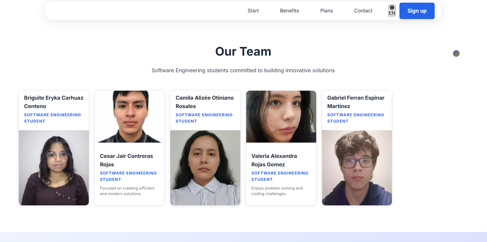
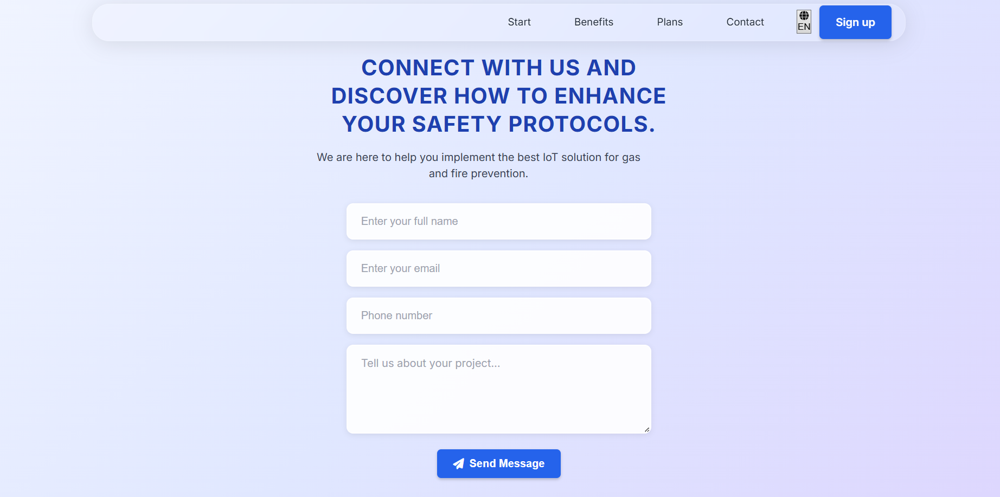
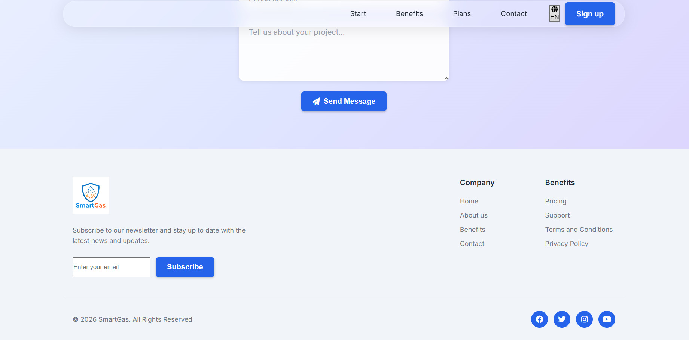
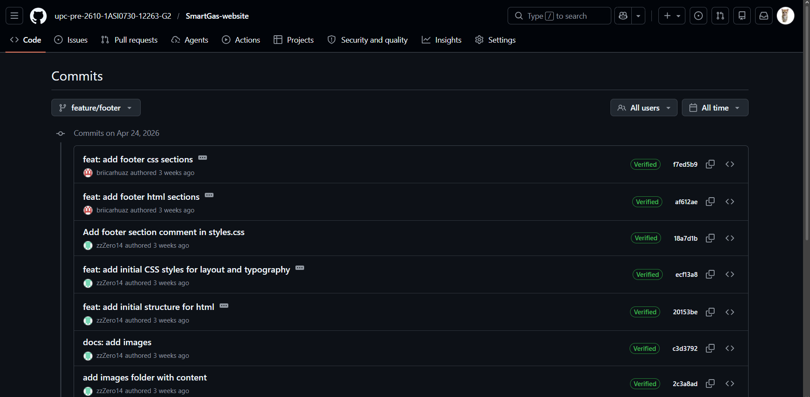
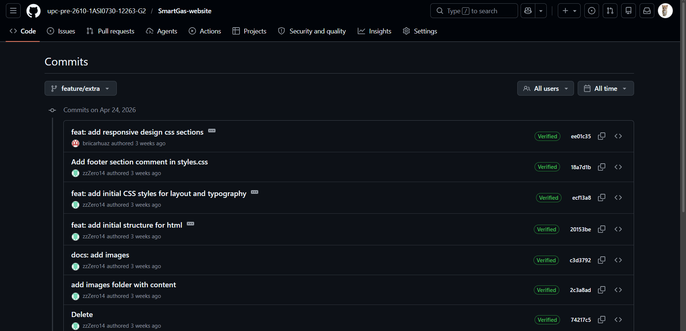
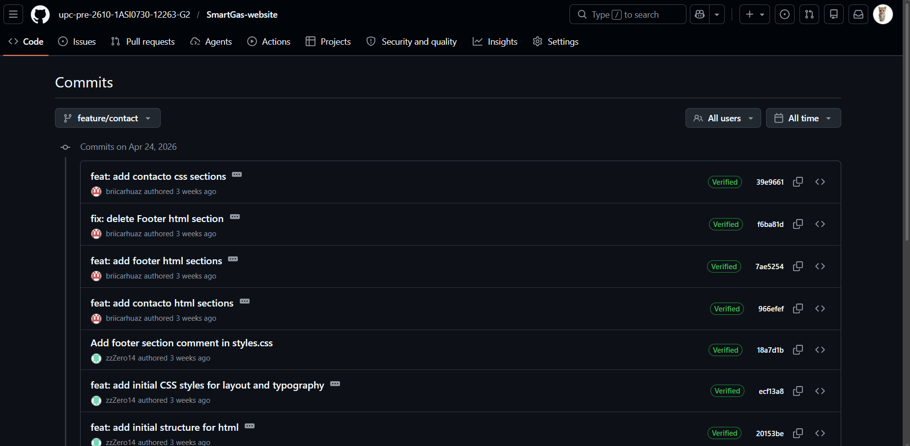
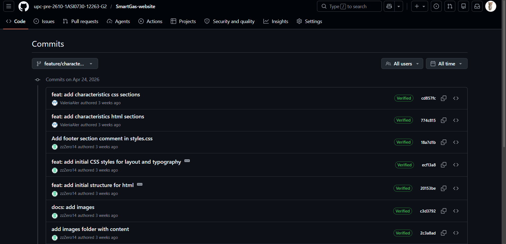
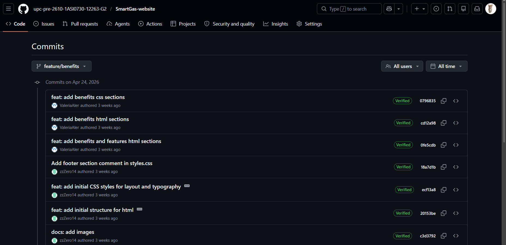
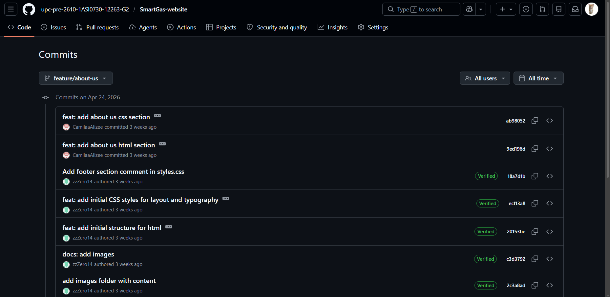

### Universidad Peruana de Ciencias Aplicadas
### Inegeneria de Software
### 2026-1

### NRC: 12263
### Docente: Rafael Oswaldo Castro Veramendi
### Informe de Trabajo Final

###  G2
###  SmartGas

   
|**Code**|**Member**|
|---------------------|--------------------|
|U202310436 |Gabriel Ferran Espinar Martínez|
|U20241D932 |Briguite Eryka Carhuaz Centeno| 
|U20241D995 |Cesar Jair Contreras Rojas| 
|U202419547 |Camila Alizée Otiniano Rosales| 
|U202411373 |Valeria Alexandra Rojas Gomez| 

### Abril 2026

# **Registro de Versiones del Informe**

| Versión | Fecha | Autor | Descripción de modificación |
|AV1|24/04/2025|FireSecure|Primer avance del proyecto|
|-----------|-----------|-----------|-----------|
|-----------|-----------|-----------|-----------|

# **Project Report Collaboration Insights**

**URL del Repositorio**: [https://github.com/1ASI0730-2610-12263-G2/SmartGas-Project-Report](https://github.com/1ASI0730-2610-12263-G2/SmartGas-Project-Report)

# ABET – EAC - Student Outcome 5

**Criterio:** La capacidad de funcionar efectivamente en un equipo cuyos miembros juntos proporcionan liderazgo, crean un entorno de colaboración e inclusivo, establecen objetivos, planifican tareas y cumplen objetivos.

En el siguiente cuadro se describe las acciones realizadas y enunciados de conclusiones por parte del grupo, que permiten sustentar el haber alcanzado el logro del ABET – EAC – Student Outcome 5.

| Criterio específico | Acciones realizadas | Conclusiones |
| :--- | :--- | :--- |
| **Trabaja en equipo para proporcionar liderazgo en forma conjunta** | Participamos activamente en reuniones grupales, escuchamos nuestras ideas mutuamente, propuse soluciones y asumí roles de liderazgo cuando fue necesario para organizar el trabajo. | El trabajo en equipo permitió obtener mejores resultados, ya que se integraron distintas perspectivas y se fortaleció el liderazgo compartido |
| **Crea un entorno colaborativo e inclusivo, establece metas, planifica tareas y cumple objetivos.** | Fomenté la participación de todos los integrantes, establecí metas claras, distribuí tareas de manera equitativa y realicé seguimiento al cumplimiento de los objetivos. | Un entorno colaborativo e inclusivo mejora la comunicación, facilita el logro de metas y asegura el cumplimiento eficiente de los objetivos planteados. |

## Contenido

- [ Informe Trabajo Final ](#-informe-trabajo-final-)
    - [Universidad Peruana de Ciencias Aplicadas ](#universidad-peruana-de-ciencias-aplicadas-)
    - [Registro de versiones del Informe](#registro-de-versiones-del-informe)
    - [Project Report Collaboration Insights](#project-report-collaboration-insights)
    - [Contenido](#contenido)
    - [Student Outcome](#student-outcome)
- [Capítulo I: Introducción](#capítulo-i-introducción)
    - [1.1. Startup Profile](#11-startup-profile)
    - [1.1.1. Descripción de la Startup](#111-descripción-de-la-startup)
    - [1.1.2 Perfiles de integrantes del equipo](#112-perfiles-de-integrantes-del-equipo)
    - [1.2. Solution Profile](#12-solution-profile)
    - [1.2.1 Antecedentes y problemática](#121-antecedentes-y-problemática)
    - [1.2.2 Lean Ux Process](#122-lean-ux-process)
    - [1.2.2.1. Lean UX Problem Statements](#1221-lean-ux-problem-statements)
    - [1.2.2.2. Lean UX Assumptions](#1222-lean-ux-assumptions)
    - [1.2.2.3. Lean UX Hypothesis Statements](#1223-lean-ux-hypothesis-statements)
    - [1.2.2.4. Lean UX Canvas](#1224-lean-ux-canvas)
    - [Segmentos Objetivos](#segmentos-objetivos)
- [Capítulo II: Requeriments Elicitation \& Analysis](#capítulo-ii-requeriments-elicitation--analysis)
    - [2.1. Competidores](#21-competidores)
    - [2.1.1. Análisis competitivo](#211-análisis-competitivo)
    - [2.1.2. Estrategias y tácticas frente a competidores](#212-estrategias-y-tácticas-frente-a-competidores)
    - [2.2. Entrevistas ](#22-entrevistas-)
    - [2.2.1. Diseño de entrevistas](#221-diseño-de-entrevistas)
    - [2.2.2. Registro de entrevistas](#222-registro-de-entrevistas)
    - [2.2.3. Análisis de entrevistas](#223-análisis-de-entrevistas)
    - [2.3. Needfinding](#23-needfinding)
    - [2.3.1. User Personas](#231-user-personas)
    - [2.3.2. User Task Matrix](#232-user-task-matrix)
    - [2.3.3. User Journey Mapping](#233-user-journey-mapping)
    - [2.3.4. Empathy Mapping](#234-empathy-mapping)
    - [2.4. Big Picture EventStorming](#24-big-picture-evenstorming)
    - [2.5. Ubiquitous Language](#25-ubiquitous-language)
- [Capítulo III: Requeriments Specification](#capítulo-iii-requeriments-specification)
    - [3.1. User Stories](#31-user-stories)
    - [3.2. Impact Mapping](#32-impact-mapping)
    - [3.3. Product Backlog](#33-product-backlog)
- [Capítulo IV: Product Desing](#capítulo-iv-product-desing)
    - [4.1. Style Guidelines](#41-style-guidelines)
    - [4.1.1. General Style Guidelines](#411-general-style-guidelines)
    - [4.1.2. Web Style Guidelines](#412-web-style-guidelines)
    - [4.2. Information Architecture](#42-information-architecture)
    - [4.2.1. Organization Systems](#421-organization-systems)
    - [4.2.2. Labeling Systems](#422-labeling-systems)
    - [4.2.3. SEO Tags and Meta Tags](#423-seo-tags-and-meta-tags)
    - [4.2.4. Searching Systems](#424-searching-systems)
    - [4.2.5. Navigation Systems](#425-navigation-systems)
    - [4.3. Landing Page UI Desing](#43-landing-page-ui-desing)
    - [4.3.1. Landing Page Wireframes](#431-landing-page-wireframes)
    - [4.3.2. Landing Page Mock-Up](#432-landing-page-mock-up)
    - [4.4. Web Applications UX/UI Desing](#44-web-applications-uxui-desing)
    - [4.4.1. Web Applications Wireframes](#441-web-applications-wireframes)
    - [4.4.2. Web Applications Wireflow Diagrams](#442-web-applications-wireflow-diagrams)
    -[4.4.3. Web Applications Mock-ups](#443-web-applications-mock-ups-diagrams)
    - [4.4.4. Web Applications User Flow Diagrams](#444-web-applications-user-flow-diagrams)
    - [4.5. Web Applications Prototyping](#45-web-applications-prototyping)
    - [4.6.1. Design-Level EventStorming](#461-design-level-eventstorming)
    - [4.6.2. Software Architecture Context Diagram](#462-software-architecture-context-diagram)
    - [4.6.3. Software Architecture Container Diagram](#463-software-architecture-container-diagram)
    - [4.6.4. Software Architecture Components Diagram](#464-software-architecture-components-diagram)
    - [4.7. Software Object-Oriented Desing](#47-software-object-oriented-desing)
    - [4.7.1. Class Diagram](#471-class-diagram)
    - [4.8. Database Desing](#48-database-desing)
    - [4.8.1. Database Diagrams](#481-database-diagrams)
- [Capítulo V: Product Implementation, Validation \& Deployment](#capítulo-v-product-implementation-validation--deployment)
    - [5.1. Software Configuration Management](#51-software-configuration-management)
    - [5.1.1. Software Development Environment Configuration](#511-software-development-environment-configuration)
    - [5.1.2. Source Code Management](#512-source-code-management)
    - [5.1.3. Source Code Style Guide \& Conventions](#513-source-code-style-guide--conventions)
    - [5.1.4. Software Deployment Configuration](#514-software-deployment-configuration)
    - [5.2. Landing Page, Service \& Applications Implementation](#52-landing-page-service--applications-implementation)
    - [5.2.1. Sprint](#52x-sprint)
    -  [5.2.1.1. Sprint Planning 1](#5211-Sprint-Planning1)
    -  [5.2.1.2. Aspect Leaders and Collaborators](#5212-Aspect-Leaders-and-Collaborators)
    -  [5.2.1.3. Sprint Backlog 1](#5213-Sprint-Backlog-1)
    -  [5.2.1.4. Development Evidence for Sprint Review](#5214-Development-Evidence-for-Sprint-Review)
    -  [5.2.1.5. Execution Evidence for Sprint Review](#5215-Execution-Evidence-for-Sprint-Review)
    -  [5.2.1.6. Services Documentation Evidence for Sprint Review](#5216-Services-Documentation-Evidence-for-Sprint-Review)
    -  [5.2.1.7. Software Deployment Evidence for Sprint Review](#5217-Software-Deployment-Evidence-for-Sprint-Review)
    -  [5.2.1.8. Team Collaboration Insights during Sprint](#5218-Team-Collaboration-Insights-during-Sprint)
    -  [Conclusiones](#Conclusiones)
    -  [Bibliografía](#Bibliografía)
    -  [Anexos](#Anexos)

# Capítulo 1: Introducción

## 1.1. Startup Profile

### 1.1.1. Descripción de la Startup

### 1.1.2. Perfiles de integrantes del equipo

## 1.2. Solution Profile
    
### 1.2.1 Antecedentes y problemática

    
### 1.2.2 Lean UX Process.
    
### 1.2.2.1. Lean UX Problem Statements.

### 1.2.2.2. Lean UX Assumptions.

### 1.2.2.3. Lean UX Hypothesis Statements.
    
### 1.2.2.4. Lean UX Canvas.
    

## 1.3. Segmentos objetivo.
    
# Capítulo II: Requirements Elicitation & Analysis
    
## 2.1. Competidores.
    
### 2.1.1. Análisis competitivo.
    
### 2.1.2. Estrategias y tácticas frente a competidores.
    
## 2.2. Entrevistas.
    
### 2.2.1. Diseño de entrevistas.
    
### 2.2.2. Registro de entrevistas.
    
### 2.2.3. Análisis de entrevistas.
    
## 2.3. Needfinding.
    
### 2.3.1. User Personas.
    
### 2.3.2. User Task Matrix.

### 2.3.3. User Journey Mapping.

### 2.3.4. Empathy Mapping.
    
## 2.4. Big Picture EventStorming.
    
## 2.5. Ubiquitous Language.
    
# Capítulo III: Requirements Specification
  
## 3.1. User Stories.
   
## 3.2. Impact Mapping.
    
## 3.3. Product Backlog.
    
# Capítulo IV: Product Design
   
## 4.1. Style Guidelines.
   
### 4.1.1. General Style Guidelines.
    
### 4.1.2. Web Style Guidelines.
    
## 4.2. Information Architecture.
    
### 4.2.1. Organization Systems.
    
### 4.2.2. Labeling Systems.
    
### 4.2.3. SEO Tags and Meta Tags
    
### 4.2.4. Searching Systems.
    
### 4.2.5. Navigation Systems.
    
## 4.3. Landing Page UI Design.
    
### 4.3.1. Landing Page Wireframe.
    
### 4.3.2. Landing Page Mock-up.
    
## 4.4. Web Applications UX/UI Design.
    
### 4.4.1. Web Applications Wireframes.
    
### 4.4.2. Web Applications Wireflow Diagrams.
    
### 4.4.2. Web Applications Mock-ups.
    
### 4.4.3. Web Applications User Flow Diagrams.
    
## 4.5. Web Applications Prototyping.
   
## 4.6. Domain-Driven Software Architecture.
    
### 4.6.1. Design-Level EventStorming.
    
### 4.6.2. Software Architecture Context Diagram.
    
### 4.6.3. Software Architecture Container Diagrams.
    
### 4.6.4. Software Architecture Components Diagrams.
    
## 4.7. Software Object-Oriented Design.
    
### 4.7.1. Class Diagrams.
    
## 4.8. Database Design.
    
### 4.8.1. Database Diagrams.
    
# Capítulo V: Product Implementation, Validation & Deployment
    
## 5.1. Software Configuration Management.
    
### 5.1.1. Software Development Environment Configuration.

En esta sección, se detallan los productos de software y herramientas utilizadas para el diseño, desarrollo y gestión del proyecto SmartGas.

**Producto UX/UI Design:**
* [Figma](https://www.figma.com/): Herramienta de diseño colaborativo utilizada para la creación de wireframes, maquetas de alta fidelidad y el diseño de la interfaz de usuario del dashboard de SmartGas.

* [UXPressia](https://uxpressia.com/): Herramienta empleada para el diseño estratégico, específicamente para la creación del Impact Mapping, Empathy Mapping y User Journey Mapping.

* [Miro](https://miro.com/): Plataforma de pizarra colaborativa usada para sesiones de lluvia de ideas, diagramación inicial y el desarrollo del EventStorming.

* [Lucidchart](https://lucid.app/): Aplicación de diagramación basada en la web utilizada para la creación de diagramas de flujo, procesos de negocio y mapas conceptuales del sistema.

* [Structurizr](https://structurizr.com/): Herramienta de modelado de software basada en el modelo C4, utilizada para documentar la arquitectura orientada a servicios (SOA) del sistema.

**Software Development:**
* [Visual Studio Code](https://code.visualstudio.com/): Editor de código fuente principal, ligero y extensible, utilizado para la programación del frontend y servicios de la plataforma.

* [PlantUML](https://plantuml.com/): Herramienta que permite crear diagramas de UML (casos de uso, clases, secuencias) a partir de lenguaje de texto plano, facilitando la documentación técnica del código.

* [HTML5](https://html.spec.whatwg.org/multipage/): Lenguaje de marcado utilizado para estructurar el contenido de la aplicación web y la landing page.

* [CSS3](https://developer.mozilla.org/es/docs/Web/CSS): Lenguaje de estilos para definir la identidad visual de SmartGas, asegurando un diseño responsivo y moderno.

* [JavaScript](https://developer.mozilla.org/es/docs/Web/JavaScript): Lenguaje de programación dinámico utilizado para añadir interactividad y gestionar la lógica de usuario en el frontend.

* [Jira](https://www.atlassian.com/es/software/jira): Herramienta líder en gestión de proyectos ágiles utilizada para el seguimiento de User Stories, gestión del backlog y control de los Sprints.

**Software Deployment:**
* [GitHub](https://github.com/): Plataforma de alojamiento de código basada en Git, utilizada para el control de versiones y la colaboración del equipo de desarrollo.
 
* [GitHub Pages](https://pages.github.com/): Servicio utilizado para el despliegue y alojamiento de la landing page del proyecto, permitiendo el acceso público a la propuesta de valor.

### 5.1.2. Source Code Management.

Para la gestión del código fuente de SmartGas, se utiliza GitHub como plataforma central. Se ha estructurado una organización que permite separar las responsabilidades del informe y del desarrollo del software.

* **Organización en GitHub:** https://github.com/upc-pre-2610-1ASI0730-12263-G2

* **Repositorio del informe:** https://github.com/upc-pre-2610-1ASI0730-12263-G2/SmartGas-report

* **Repositorio de la Landing Page:**
https://github.com/upc-pre-2610-1ASI0730-12263-G2/SmartGas-website

**Modelo de ramificación: GitFlow**
Se ha adoptado el modelo GitFlow para garantizar un flujo de trabajo ordenado. 

**Ramas del repositorio del informe:**

* **main:** Rama de producción que contiene la versión final y aprobada de cada entrega.

* **develop:** Rama de integración donde se consolidan los avances de cada capítulo antes de ser revisados.

* **feature/chapter-1:** Rama para el desarrollo del Capítulo I: Introducción.

* **feature/chapter-2:** Rama para el Capítulo II: Requirements Elicitation & Analysis.

* **feature/chapter-3:** Rama para el Capítulo III: Requirements Specification.

* **feature/chapter-4:** Rama para el Capítulo IV: Product Design.

* **feature/chapter-5:** Rama para el Capítulo V: Product Implementation, Validation & Deployment.

**Ramas del repositorio de la Landing Page:**

* **main:** Rama que contiene la versión estable y desplegada en GitHub Pages.

* **feature/portada:** Implementación de la sección principal con el mensaje de valor y botones de acción.
 
* **feature/about-us:** Desarrollo de la sección que detalla la misión de FireSecure.
 
* **feature/benefits:** Implementación de los bloques informativos sobre los beneficios del sistema.
 
* **feature/characteristics:** Desarrollo de las especificaciones técnicas y funcionalidades de los sensores.
 
* **feature/pricing:** Creación de las tarjetas de planes y suscripciones.
 
* **feature/members:** Desarrollo de la sección que presenta al equipo del proyecto.
 
* **feature/navigation:** Implementación de la barra de navegación y menús del sitio.
 
* **feature/contact:** Desarrollo del formulario de contacto para clientes potenciales.
 
* **feature/footer:** Implementación del pie de página con enlaces legales y redes sociales.

**Estilo de commits: Conventional Commits**
Para mantener un historial de cambios legible y estandarizado, el equipo aplica la convención de Conventional Commits. Cada commit debe empezar con un prefijo que describa el tipo de cambio:

* **feat:** Una nueva funcionalidad.
 
* **fix:** Corrección de errores o errores ortográficos en el reporte.
 
* **docs:** Cambios únicamente en la documentación o bibliografía.
 
* **style:** Cambios de formato (espaciado, tipografía, negritas) que no afectan el contenido.
 
* **refactor:** Reorganización de párrafos o secciones para mejorar la claridad sin añadir contenido nuevo.
    
### 5.1.3. Source Code Style Guide & Conventions.

**HTML**

Declarar siempre el tipo de documento en la primera línea.
Cerrar todos los elementos y mantener la correcta indentación.
Usar atributos entre comillas y en minúsculas.
Escribir comentarios cortos en una sola línea.
Incluir atributos alt, width y height en las imágenes para mejorar accesibilidad y disponibilidad del contenido.
Mantener un orden lógico en la estructura del documento (head, body, secciones).

**CSS**

Utilizar sangría de 2 espacios (evitar tabulaciones).
Escribir todo el código en minúsculas.
Eliminar espacios en blanco innecesarios.
Usar comentarios descriptivos para secciones importantes.
Definir nombres de clases significativos y consistentes.
Evitar el uso excesivo de !important.
Fuentes
    
**Fuentes**  
- [W3Schools - HTML5 Syntax](https://www.w3schools.com/html/html5_syntax.asp)  
- [Google HTML/CSS Style Guide](https://google.github.io/styleguide/htmlcssguide.html)  
    
### 5.1.4. Software Deployment Configuration.

El despliegue de la landing page se realiza utilizando GitHub Pages, un servicio que permite alojar sitios web estáticos de manera gratuita y accesible para cualquier usuario con una cuenta en GitHub. Este mecanismo resulta ideal para proyectos académicos y profesionales, ya que no requiere infraestructura adicional ni configuraciones complejas de servidores.  

### Landing page deployment  

Para asegurar que el despliegue se lleve a cabo correctamente, es necesario cumplir con ciertos requisitos iniciales: contar con una cuenta personal en GitHub, disponer de un repositorio en línea donde alojar los documentos y mantener una organización coherente de los archivos del proyecto. Una vez cumplidos estos aspectos, el procedimiento seguido es el siguiente:  

1. **Estructuración de archivos**: se organizan todos los elementos principales en la raíz del repositorio. Se respeta la nomenclatura estándar para facilitar la lectura y compatibilidad:  
   - `index.html` como página inicial.  
   - `styles.css` para la hoja de estilos.  
   - `main.js` como archivo de scripts y funciones básicas.  
   - Carpeta `assets/images` para almacenar imágenes y recursos gráficos.  

2. **Carga en el repositorio**: los archivos preparados se versionan mediante Git. A través de un commit se registran los cambios, y con el comando push se sincronizan con el repositorio remoto en GitHub. Esto garantiza control de versiones y permite rastrear cualquier modificación en el tiempo.  

3. **Configuración del despliegue**: en la sección **Settings → Pages** del repositorio se selecciona la rama principal (`main`) como fuente de publicación y se indica la carpeta raíz (root) como directorio base desde donde se servirán los archivos.  

4. **Procesamiento por GitHub Pages**: al guardar la configuración, GitHub inicia automáticamente la generación del sitio. Este proceso puede tardar algunos minutos y concluye con la creación de un enlace público.  

5. **Verificación del sitio**: se accede a la URL generada para comprobar que la landing page carga correctamente. En esta revisión se valida que los estilos de CSS se apliquen de forma adecuada, que los scripts de JavaScript funcionen sin errores y que todas las imágenes se visualicen desde la carpeta correspondiente.  

6. **Disponibilidad pública**: una vez confirmada la publicación, el sitio queda accesible en internet a través del enlace de GitHub Pages. Esto permite que cualquier usuario con el vínculo pueda consultar la landing page, facilitando su difusión y evaluación.  

De esta manera, el despliegue mediante GitHub Pages asegura que la landing page se encuentre publicada de forma sencilla, eficiente y sin necesidad de servidores adicionales, garantizando que el contenido esté disponible públicamente y pueda ser accedido en cualquier momento.  

## 5.2. Landing Page, Services & Applications Implementation.
    
## 5.2.1. Sprint 1
    
### 5.2.1.1. Sprint Planning 1.
| Sprint # | Sprint 1 |
| :--- | :--- |
| **Sprint Planning Background** | |
| **Date** | 2026-04-10 |
| **Time** | 09:00 AM |
| **Location** | Virtual (Discord) |
| **Prepared By** | Cesar Jair Contreras Rojas |
| **Attendees** | Cesar Jair Contreras Rojas / Gabriel Ferran Espinar Martínez / Briguite Eryka Carhuaz Centeno/ Camila Alizée Otiniano Rosales/ Valeria Alexandra Rojas Gomez|
| **Sprint n – 1 Review Summary** | No aplica por ser el primer sprint. |
| **Sprint n – 1 Retrospective Summary** | No aplica por ser el primer sprint.  |
| **Sprint Goal & User Stories** | |
| **Sprint 1 Goal** | **Our focus is on** developing the Landing Page and defining the backend architecture. **We believe it delivers** an official web presence and a technical roadmap **to** potential customers and the development team. **This will be confirmed when** the Landing Page is deployed and the database schema for sensor monitoring is finalized. |
| **Sprint 1 Velocity** | 25 Story Points |
| **Sum of Story Points** | 25 Story Points |
    
### 5.2.1.2. Aspect Leaders and Collaborators.
Para asegurar una comunicación efectiva y una ejecución organizada durante este primer Sprint, el equipo ha definido una matriz de Liderazgo y Colaboración (LACX). Los aspectos principales considerados en este Sprint se dividen en tres áreas críticas: 

1. **Web Presence (Landing Page):** Desarrollo del código frontend y diseño responsivo.
2. **System Architecture:** Definición de esquemas de base de datos y lógica de telemetría.
3. **Infrastructure:** Configuración de servicios y entornos de despliegue.

Cada aspecto cuenta con un líder responsable de la calidad final y colaboradores que apoyan en la implementación de las tareas.

### Leadership and Collaboration Matrix (LACX)

| Team Member (Last Name, First Name) | GitHub Username | Landing Page Development | Database & API Design | Cloud & DevOps Setup |
| :--- | :--- | :---: | :---: | :---: |
| Gabriel Ferran Espinar Martínez | zzZero14 | **L** | **C** | **L** |
| Cesar Jair Contreras Rojas | CesarJrCR | **C** | **L** | **C** |
| Briguite Eryka Carhuaz Centeno | briicarhuaz | **C** | **C** | **C** |
| Camila Alizée Otiniano Rosales | CamilaaAlizee | **C** | **C** | **C** |
| Valeria Alexandra Rojas Gomez | ValeriaAler | **C** | **C** | **C** |

**Leyenda:** **L**: Leader / **C**: Collaborator
    
### 5.2.1.3. Sprint Backlog 1.
El objetivo de este primer Sprint es doble: por un lado, iniciar la presencia digital de **SmartGas** mediante la codificación y despliegue de la Landing Page; y por otro lado, establecer los cimientos técnicos (base de datos y formatos de telemetría) que permitirán el desarrollo de la aplicación web en los siguientes sprints.

**Board del Sprint 1 (Jira):**

### Tabla de Control de Estado para el Sprint 1

| User Story | | Work-Item / Task | | | | | |
| :--- | :--- | :--- | :--- | :--- | :--- | :--- | :--- |
| **Id** | **Title** | **Id** | **Title** | **Description** | **Estimation (Hours)** | **Assigned To** | **Status (To-do / In-Process / To-Review / Done)** |
| US-21 | Visualizar dashboard principal | T-01 | Landing Page Frontend | Codificación de la estructura HTML y estilos CSS de la Landing Page. | 10 | Todos | Done |
| US-21 | Visualizar dashboard principal | T-02 | Responsive Design | Adaptación de la Landing Page para dispositivos móviles (Media Queries). | 6 | Todos | Done |
| US-29 | Registrarse en el sistema | T-03 | Database Schema | Diseño y creación de las tablas de usuarios y perfiles en la base de datos. | 4 | Cesar | Done |
| TS-02 | API Telemetría | T-04 | JSON Data Structure | Definición del formato de intercambio de datos (JSON) para gas y temperatura. | 6 | Briguite | To-do |
| TS-06 | API Usuarios | T-05 | Auth Logic Design | Diseño de la lógica de autenticación y flujo de tokens para el acceso. | 5 | Camila | To-do |
| CG-01 | Constraint General | T-06 | GitHub/Deployment Setup | Configuración del repositorio de la organización y hosting para la Landing Page. | 3 | Gabriel | Done |
    
    
### 5.2.1.4. Development Evidence for Sprint Review.

| Repository                                      | Branch                                          | Commit Id                                   | Commit Message                                           | Commit Message Body                                                                                                                                                 | Committed on (Day) |
|-------------------------------------------------|-------------------------------------------------|---------------------------------------------|----------------------------------------------------------|--------------------------------------------------------------------------------------------------------------------------------------------------------------------|-------------------|
| **Landing Page Repository**                     |                                                 |                                             |                                                          |                                                                                                                                                                    |                    |
| upc-pre-2610-1ASI0730-12263-G2/SmartGas-website                         | main                                 | ea113926521401c4ecd69030da149fe4a96d7154     | assets: add images to images folder                            | Added the images of the landing page.                                                                                                    | 19/04/2026         |
| upc-pre-2610-1ASI0730-12263-G2/SmartGas-website                         | feature/about-us                                 | 9ed196d3e709461b9da437f5355f134da8aee156     | feat: add about us html section    |    Added the html code for about us                                                                          | 19/04/2026     |
| upc-pre-2610-1ASI0730-12263-G2/SmartGas-website                         | feature/about-us                                | ab98052b6cb5c8984fd4ff11e2f08a7d58d5d5d1     | feat: add about us css section                                |  Added the css code for about us                                                                                                        | 19/04/2026       |
| upc-pre-2610-1ASI0730-12263-G2/SmartGas-website                         | feature/benefits                                | 0fe5cdb31d09b9d77d0ef15ec1cdd2e4efbc466a     | feat: add benefits and features html sections        | Added the html code of benefits and features                                                                                                       | 19/04/2026         |
| upc-pre-2610-1ASI0730-12263-G2/SmartGas-website                        | feature/benefits                                  | cd12a9814fb0de32eafd55bb9e160ac6ce0bc3af     | feat: add benefits html sections          | Added html code for benefits section.                                                                                                        | 19/04/2026         |
| upc-pre-2610-1ASI0730-12263-G2/SmartGas-website                       | feature/benefits                                  | 07968355b87f56a676863b23c60def1a51e196e5     | feat: add benefits css sections                  | Added css code of benefit section.                                                   | 19/04/2026         |
| upc-pre-2610-1ASI0730-12263-G2/SmartGas-website                       | feature/characteristics                                  | 774c815e04b8148477dc3cc1792cc558abaa465c     | feat: add characteristics html sections                   | Added html code for characteristics section                                                                                                | 19/04/2026        |
| upc-pre-2610-1ASI0730-12263-G2/SmartGas-website                        | feature/chareacteristics                              | cd857fc325e4fedb22bdae3dedb47fbe69225738     | feat: add characteristics css sections        | Added css code of characteristics section.                                                                        | 19/04/2026         |
| upc-pre-2610-1ASI0730-12263-G2/SmartGas-website                        | feature/contact                              | 966efefee8bffb3144bfa79b9370060479b85db8     | feat: add contacto html sections  | Added html code of contact section.    | 19/04/2026     |
| upc-pre-2610-1ASI0730-12263-G2/SmartGas-website                        | feature/contact                              | 39e96611d010d1023b07c95bbe13f191ecf6ca0b     | feat: add contacto css sections  | Added contact css code.    | 19/04/2026     |
| upc-pre-2610-1ASI0730-12263-G2/SmartGas-website                        | feature/extra                              | ee01c356d7b0098daf287b5cca1c76e684bf1312     | feat: add responsive design css sections  | Added css code for responsive design.    | 19/04/2026     |
| upc-pre-2610-1ASI0730-12263-G2/SmartGas-website                        | feature/footer                              | af612aedc19bdcb6d2d0ed2bf2d9f5b75bcca516     | feat: add footer html sections  | Added html code of footer section.    | 19/04/2026     |
| upc-pre-2610-1ASI0730-12263-G2/SmartGas-website                        | feature/footer                              | f7ed5b948169a9e63b864cdddc14d56d28ee20df     | feat: add footer css sections  | Added css code of footer section.    | 19/04/2026     |
| upc-pre-2610-1ASI0730-12263-G2/SmartGas-website                        | feature/members                              | f53e1584c85f44b56380b9d66fa8958c5edee814     | feat: add team section with member details  | Added html code of team members section.    | 19/04/2026     |
| upc-pre-2610-1ASI0730-12263-G2/SmartGas-website                        | feature/members                              | 1034ce383a9da41fa92758977e68917b032cfa23     | feat: add styles for team section and cards  | Added css code of team members section.    | 19/04/2026     |
| upc-pre-2610-1ASI0730-12263-G2/SmartGas-website                        | feature/navigation                             | 7899a03e414632153689b727b734410a43f67f8b     | feat: add navigation html sections  | Added html code of navigation section.    | 19/04/2026     |
| upc-pre-2610-1ASI0730-12263-G2/SmartGas-website                        | feature/navigation                            | 1034ce383a9da41fa92758977e68917b032cfa23     | feat: add navigation css sections  | Added the css code of navigation section.    | 19/04/2026     |
| upc-pre-2610-1ASI0730-12263-G2/SmartGas-website                        | feature/portada                              | 1034ce383a9da41fa92758977e68917b032cfa23     | feat: add portada html sections  | Added the html code of portada.    | 19/04/2026     |
| upc-pre-2610-1ASI0730-12263-G2/SmartGas-website                        | feature/portada                              | 036ff20f7d1dd207849066ddb0433e7aecda31b5     | feat: add front page css section  | Added front page css section..    | 19/04/2026     |
    
### 5.2.1.5. Execution Evidence for Sprint Review.

Durante este Sprint, el equipo logró implementar la versión inicial del Landing Page funcional, rápido y estático, incluido el sistema de idiomas.

La sección principal de la Landing page nos presenta el titulo, subtitulo, descripción del producto y llamados a la acción (CTA) los cuales guian al visitante hacia el registro o a la sección de más información.

En está sección el usuario puede ver cuales son nuestros valores como empresa, sobre que trata nuestro producto y con que fin lo estamos desarrollando.

En está sección se muestra de forma detallada que es lo que ofrecemos a los usuarios y las caracteristicas importantes de SmartGas.

En está sección se puede apreciar los planes que ofrecemos y cual es el costo de cada uno de ellos. Los precios son presentados mediante tarjetas visuales que indican las caracteristicas de cada plan.

Está sección nos muestra a todos los integrantes del equipo SmartGuard mediante cards visuales las caules contienen una foto de cada uno de los integrantes acompañada de una pequeña descripción.

En está sección el usuario puede colocar sus datos para contactarse con nosotros.

Es el footer de landing page se puede ver nuestro logo, el copyright y un apartado en donde el usuario puede colocar su correo para registrarlo.

    
### 5.2.1.6. Services Documentation Evidence for Sprint Review.

N/A. Durante el Sprint 1 el esfuerzo de desarrollo se enfocó exclusivamente en la creación del sitio web estático promocional (Landing Page), por lo que aún no se han implementado APIs RESTful ni Endpoints que requieran documentación con Swagger/OpenAPI. Esta documentación se generará a partir del Sprint 3.
    
### 5.2.1.7. Software Deployment Evidence for Sprint Review.

Para el despliegue continuo (CI/CD) de este Sprint, se configuró el entorno de GitHub Pages conectado directamente al repositorio de GitHub del Landing Page estático, permitiendo publicaciones automáticas y ultra-rápidas con cada PR fusionado en la rama main.

|Aspecto       |Detalle         |
|--------------|----------------|
|Plataforma de despliegue|GitHub Pages|
|Repositorio|[SmartGuard-Website](https://github.com/upc-pre-2610-1ASI0730-12263-G2/SmartGas-website)|
|URL Landing Page|https://upc-pre-2610-1asi0730-12263-g2.github.io/SmartGas-website/ |
|Rama de despliegue|main|
|Fecha de despliegue|24/04/2026|
|Estado Actual|	Desplegado y Funcional|
|Tipo de Sitio|Sitio Web Estático (HTML, CSS, JavaScript)|
|HTTPS|Habilitado (Certificado SSL automático)|

Proceso de Despliegue Detallado
El proceso de despliegue se realizó siguiendo los siguientes pasos:

#### Paso 1: Preparación del Repositorio

Se configuró el repositorio del Landing Page en GitHub con la estructura completa de archivos
Se organizaron los archivos HTML, CSS, JavaScript y assets en carpetas apropiadas
Se aseguró que todos los archivos estuvieran en la rama main
#### Paso 2: Configuración de GitHub Pages

Se accedió a la configuración del repositorio en GitHub
Se habilitó GitHub Pages en la sección "Pages" de la configuración
Se seleccionó la rama main como fuente del sitio.
#### Paso 3: Generación de la URL

GitHub Pages generó automáticamente la URL del sitio
La URL sigue el formato: "https://[organizacion].github.io/[nombre-repositorio]/"

#### Paso 4: Verificación del Despliegue

Se verificó que el sitio estuviera accesible en la URL proporcionada
Se comprobó que el certificado SSL estuviera activo (HTTPS)
Se validó que todos los recursos se cargaran correctamente
#### Paso 5: Validación de Funcionalidad Se realizaron pruebas exhaustivas para verificar que todas las funcionalidades del Landing Page funcionaran correctamente:

Navegación entre secciones: Todos los enlaces del menú funcionan correctamente
Diseño responsive: El sitio se adapta correctamente a diferentes tamaños de pantalla (mobile, tablet, desktop)
Carga de imágenes y assets: Todas las imágenes y recursos se cargan sin errores
Funcionalidad de enlaces y botones: Todos los botones y enlaces son funcionales
Estilos CSS aplicados: Los estilos se aplican correctamente en todas las secciones
Rendimiento: El sitio carga rápidamente y sin errores en la consola
Compatibilidad de navegadores: Se probó en Chrome, Firefox, Safari y Edge

### 5.2.1.8. Team Collaboration Insights during Sprint.

## Conclusiones

## Bibliografía

## Anexos
