<div align ="center">


### Universidad Peruana de Ciencias Aplicadas
### Ingeniería de Software
### 2026-1

### NRC: 12263
### Docente: Rafael Oswaldo Castro Veramendi
### Informe de Trabajo Final

###  G2
###  SmartGas


<div align = "center">
   
|**Code**|**Member**|
|---------------------|--------------------|
|U202310436 |Gabriel Ferran Espinar Martínez|
|U20241D932 |Briguite Eryka Carhuaz Centeno| 
|U20241D995 |Cesar Jair Contreras Rojas| 
|U202419547 |Camila Alizée Otiniano Rosales| 
|U202411373 |Valeria Alexandra Rojas Gomez| 

</div>

### Abril 2026

<div style="page-break-after: always;"></div>

<div align = "left">

# **Registro de Versiones del Informe**


# **Project Report Collaboration Insights**

**URL del Repositorio**: [https://github.com/1ASI0730-2610-12263-G2/SmartGas-Project-Report](https://github.com/1ASI0730-2610-12263-G2/SmartGas-Project-Report)

<div align = "left">

# ABET – EAC - Student Outcome 5

**Criterio:** La capacidad de funcionar efectivamente en un equipo cuyos miembros juntos proporcionan liderazgo, crean un entorno de colaboración e inclusivo, establecen objetivos, planifican tareas y cumplen objetivos.

En el siguiente cuadro se describe las acciones realizadas y enunciados de conclusiones por parte del grupo, que permiten sustentar el haber alcanzado el logro del ABET – EAC – Student Outcome 5.

| Criterio específico | Acciones realizadas | Conclusiones |
| :--- | :--- | :--- |
| **Trabaja en equipo para proporcionar liderazgo en forma conjunta** | Participamos activamente en reuniones grupales, escuchamos nuestras ideas mutuamente, propuse soluciones y asumí roles de liderazgo cuando fue necesario para organizar el trabajo. | El trabajo en equipo permitió obtener mejores resultados, ya que se integraron distintas perspectivas y se fortaleció el liderazgo compartido |
| **Crea un entorno colaborativo e inclusivo, establece metas, planifica tareas y cumple objetivos.** | Fomenté la participación de todos los integrantes, establecí metas claras, distribuí tareas de manera equitativa y realicé seguimiento al cumplimiento de los objetivos. | Un entorno colaborativo e inclusivo mejora la comunicación, facilita el logro de metas y asegura el cumplimiento eficiente de los objetivos planteados. |


## Contenido

- [ Informe Trabajo Final ](#-informe-trabajo-final-)
    - [Universidad Peruana de Ciencias Aplicadas ](#universidad-peruana-de-ciencias-aplicadas-)
    - [Registro de versiones del Informe](#registro-de-versiones-del-informe)
    - [Project Report Collaboration Insights](#project-report-collaboration-insights)
    - [Contenido](#contenido)
    - [Student Outcome](#student-outcome)
- [Capítulo I: Introducción](#capítulo-i-introducción)
    - [1.1. Startup Profile](#11-startup-profile)
    - [1.1.1. Descripción de la Startup](#111-descripción-de-la-startup)
    - [1.1.2 Perfiles de integrantes del equipo](#112-perfiles-de-integrantes-del-equipo)
    - [1.2. Solution Profile](#12-solution-profile)
    - [1.2.1 Antecedentes y problemática](#121-antecedentes-y-problemática)
    - [1.2.2 Lean Ux Process](#122-lean-ux-process)
    - [1.2.2.1. Lean UX Problem Statements](#1221-lean-ux-problem-statements)
    - [1.2.2.2. Lean UX Assumptions](#1222-lean-ux-assumptions)
    - [1.2.2.3. Lean UX Hypothesis Statements](#1223-lean-ux-hypothesis-statements)
    - [1.2.2.4. Lean UX Canvas](#1224-lean-ux-canvas)
    - [Segmentos Objetivos](#segmentos-objetivos)
- [Capítulo II: Requeriments Elicitation \& Analysis](#capítulo-ii-requeriments-elicitation--analysis)
    - [2.1. Competidores](#21-competidores)
    - [2.1.1. Análisis competitivo](#211-análisis-competitivo)
    - [2.1.2. Estrategias y tácticas frente a competidores](#212-estrategias-y-tácticas-frente-a-competidores)
    - [2.2. Entrevistas ](#22-entrevistas-)
    - [2.2.1. Diseño de entrevistas](#221-diseño-de-entrevistas)
    - [2.2.2. Registro de entrevistas](#222-registro-de-entrevistas)
    - [2.2.3. Análisis de entrevistas](#223-análisis-de-entrevistas)
    - [2.3. Needfinding](#23-needfinding)
    - [2.3.1. User Personas](#231-user-personas)
    - [2.3.2. User Task Matrix](#232-user-task-matrix)
    - [2.3.3. User Journey Mapping](#233-user-journey-mapping)
    - [2.3.4. Empathy Mapping](#234-empathy-mapping)
    - [2.4. Big Picture EventStorming](#24-big-picture-evenstorming)
    - [2.5. Ubiquitous Language](#25-ubiquitous-language)
- [Capítulo III: Requeriments Specification](#capítulo-iii-requeriments-specification)
    - [3.1. User Stories](#31-user-stories)
    - [3.2. Impact Mapping](#32-impact-mapping)
    - [3.3. Product Backlog](#33-product-backlog)
- [Capítulo IV: Product Desing](#capítulo-iv-product-desing)
    - [4.1. Style Guidelines](#41-style-guidelines)
    - [4.1.1. General Style Guidelines](#411-general-style-guidelines)
    - [4.1.2. Web Style Guidelines](#412-web-style-guidelines)
    - [4.2. Information Architecture](#42-information-architecture)
    - [4.2.1. Organization Systems](#421-organization-systems)
    - [4.2.2. Labeling Systems](#422-labeling-systems)
    - [4.2.3. SEO Tags and Meta Tags](#423-seo-tags-and-meta-tags)
    - [4.2.4. Searching Systems](#424-searching-systems)
    - [4.2.5. Navigation Systems](#425-navigation-systems)
    - [4.3. Landing Page UI Desing](#43-landing-page-ui-desing)
    - [4.3.1. Landing Page Wireframes](#431-landing-page-wireframes)
    - [4.3.2. Landing Page Mock-Up](#432-landing-page-mock-up)
    - [4.4. Web Applications UX/UI Desing](#44-web-applications-uxui-desing)
    - [4.4.1. Web Applications Wireframes](#441-web-applications-wireframes)
    - [4.4.2. Web Applications Wireflow Diagrams](#442-web-applications-wireflow-diagrams)
    -[4.4.3. Web Applications Mock-ups](#443-web-applications-mock-ups-diagrams)
    - [4.4.4. Web Applications User Flow Diagrams](#444-web-applications-user-flow-diagrams)
    - [4.5. Web Applications Prototyping](#45-web-applications-prototyping)
    - [4.6.1. Design-Level EventStorming](#461-design-level-eventstorming)
    - [4.6.2. Software Architecture Context Diagram](#462-software-architecture-context-diagram)
    - [4.6.3. Software Architecture Container Diagram](#463-software-architecture-container-diagram)
    - [4.6.4. Software Architecture Components Diagram](#464-software-architecture-components-diagram)
    - [4.7. Software Object-Oriented Desing](#47-software-object-oriented-desing)
    - [4.7.1. Class Diagram](#471-class-diagram)
    - [4.8. Database Desing](#48-database-desing)
    - [4.8.1. Database Diagrams](#481-database-diagrams)
- [Capítulo V: Product Implementation, Validation \& Deployment](#capítulo-v-product-implementation-validation--deployment)
    - [5.1. Software Configuration Management](#51-software-configuration-management)
    - [5.1.1. Software Development Environment Configuration](#511-software-development-environment-configuration)
    - [5.1.2. Source Code Management](#512-source-code-management)
    - [5.1.3. Source Code Style Guide \& Conventions](#513-source-code-style-guide--conventions)
    - [5.1.4. Software Deployment Configuration](#514-software-deployment-configuration)
    - [5.2. Landing Page, Service \& Applications Implementation](#52-landing-page-service--applications-implementation)
    - [5.2.1. Sprint](#52x-sprint)
    -  [5.2.1.1. Sprint Planning 1](#5211-Sprint-Planning1)
    -  [5.2.1.2. Aspect Leaders and Collaborators](#5212-Aspect-Leaders-and-Collaborators)
    -  [5.2.1.3. Sprint Backlog 1](#5213-Sprint-Backlog-1)
    -  [5.2.1.4. Development Evidence for Sprint Review](#5214-Development-Evidence-for-Sprint-Review)
    -  [5.2.1.5. Execution Evidence for Sprint Review](#5215-Execution-Evidence-for-Sprint-Review)
    -  [5.2.1.6. Services Documentation Evidence for Sprint Review](#5216-Services-Documentation-Evidence-for-Sprint-Review)
    -  [5.2.1.7. Software Deployment Evidence for Sprint Review](#5217-Software-Deployment-Evidence-for-Sprint-Review)
    -  [5.2.1.8. Team Collaboration Insights during Sprint](#5218-Team-Collaboration-Insights-during-Sprint)
    - [5.2.2. Sprint 2](#522-sprint-2)
    -  [5.2.2.1. Sprint Planning 2](#5221-sprint-planning-2)
    -  [5.2.2.2. Aspect Leaders and Collaborators](#5222-aspect-leaders-and-collaborators)
    -  [5.2.2.3. Sprint Backlog 2](#5223-sprint-backlog-2)
    -  [5.2.2.4. Development Evidence for Sprint Review](#5224-development-evidence-for-sprint-review)
    -  [5.2.2.5. Execution Evidence for Sprint Review](#5225-execution-evidence-for-sprint-review)
    -  [5.2.2.6. Services Documentation Evidence for Sprint Review](#5226-services-documentation-evidence-for-sprint-review)
    -  [5.2.2.7. Software Deployment Evidence for Sprint Review](#5227-software-deployment-evidence-for-sprint-review)
    -  [5.2.2.8. Team Collaboration Insights during Sprint](#5228-team-collaboration-insights-during-sprint)
    -  [Conclusiones](#Conclusiones)
    -  [Bibliografía](#Bibliografía)
    -  [Anexos](#Anexos)


# Capítulo 1: Introducción

## 1.1. Startup Profile
### 1.1.1. Descripción de la Startup
Somos **FireSecure**, una startup tecnológica orientada a la ingeniería de software y dedicada a la creación de plataformas web de monitoreo para la seguridad en infraestructuras residenciales y comerciales. Nuestro trabajo se centra en el desarrollo de arquitecturas orientadas a servicios (SOA) que centralizan y procesan datos de dispositivos IoT en la nube.

Nuestra misión es disminuir el riesgo de desastres por fugas de gas e incendios mediante un producto de software accesible, intuitivo y altamente responsivo. Aspiramos a convertirnos en el ecosistema digital líder en gestión de emergencias, brindando tranquilidad a nuestros usuarios al permitirles visualizar el estado de sus entornos y recibir notificaciones críticas desde cualquier dispositivo con acceso web.


### 1.1.2. Perfiles de integrantes del equipo
| Foto | Nombre | Descripción |
| --- | --- | --- |
|  | Gabriel Ferran Espinar Martínez (U202310436)| Estudiante de ingenieria de Software. Soy estudiante de la carrera de Ingeniería de Software, Me considero una persona trabajadora. Me interesa aprender constantemente en especial en áreas relacionadas a la tecnología y cuento con conocimientos en HTML, CSS, Javascript y SQL, lo cual puede servir en el desarrollo del proyecto.. |
|  | Rojas Gómez, Valeria Alexandra (U202411373) | Estudiante de ingenieria de Software. Cuento con conocimientos en lenguajes de programación como c++, python, html, css y assembler. Me considero una persona amable, capaz de trabajar en equipo y establecer una comunicación efectiva con los demás. |
|  | Carhuaz Centeno, Briguite Eryka (U20241D932)  | Estudiante de Ingeniería de Software. Cuento con un sólido dominio de lenguajes como Java y C++, además de experiencia en el diseño de prototipos con Figma. Me caracterizo por ser una persona receptiva a las opiniones de los demás.
|  | Contreras Rojas, Cesar Jair (U20241D995) | Estudiante de ingeniería de Software. He practicado con Phyton, C++, Java entre otros. Me considero alguien responsable, colaborativo, amable y dispuesto a ayudar a mis compañeros, soy alguien que se eferuza por encontrar soluciones a problemas. |
|  | Otiniano Rosales, Camila Alizée (u202419547) | Estudiante de ingeniería de Software. Cuento con habilidades de liderazgo que me permiten fomentar la colaboración y organización en equipo. Me caracterizo por mi responsabilidad, compromiso y creatividad, siempre enfocada en alcanzar los objetivos del grupo.  |


## 1.2. Solution Profile
    
### 1.2.1 Antecedentes y problemática
En los últimos años, los incidentes relacionados con fugas de gas e incendios han representado una de las principales causas de pérdidas en los sectores doméstico y gastronómico. Tradicionalmente, los sistemas de prevención se han limitado a hardware analógico o alarmas locales que exigen la presencia física del usuario para ser efectivas.

La problemática central radica en la **ausencia de un monitoreo preventivo remoto y descentralizado**. Los propietarios de viviendas y administradores de cocinas no cuentan con una herramienta digital que procese en tiempo real el estado de sus instalaciones. Esta limitación impide una respuesta inmediata ante anomalías, incrementando exponencialmente el riesgo de desastres al no poder alertar a tiempo a las personas involucradas o a los servicios de emergencia.

Para solucionar este vacío, es imperativo desarrollar una plataforma web basada en la nube. Un sistema que no solo consolide la telemetría de los entornos protegidos, sino que provea un panel de control interactivo, historial estadístico de incidencias y un sistema automatizado de alertas de alta disponibilidad, operando de forma continua como el núcleo de soporte para la toma de decisiones críticas.

    
### 1.2.2 Lean UX Process.
    
### 1.2.2.1. Lean UX Problem Statements.
**Domain:** El dominio de aplicación de SmartGas se enfoca en el desarrollo de aplicaciones web distribuidas aplicadas a la seguridad y monitoreo en entornos culinarios, específicamente en viviendas y restaurantes. En este contexto, la integración de una plataforma web con servicios en la nube representa una alternativa innovadora para gestionar y visualizar riesgos asociados al gas y temperatura de forma remota.

**Customer Segments:** Los segmentos de clientes identificados son: 
* **Hogares:** Familias que buscan proteger sus viviendas mediante el monitoreo remoto de sus cocinas a través de una aplicación web accesible desde cualquier dispositivo. 
* **Restaurantes y establecimientos de comida:** Administradores y jefes de cocina responsables de garantizar la seguridad operativa y el cumplimiento de normativas en ambientes de alta demanda. 

**Pain Points:** Dificultad para visualizar en tiempo real el estado de seguridad de la cocina cuando el usuario se encuentra fuera del establecimiento o vivienda. 
* Dependencia de sistemas locales que no ofrecen una interfaz web para el registro histórico y análisis de datos de incidencias. 
* Complejidad en la gestión de múltiples sensores o ubicaciones sin una plataforma centralizada que unifique la información en un dashboard interactivo. 
* Riesgo de pérdidas materiales por la incapacidad de recibir notificaciones de alerta inmediatas en dispositivos móviles a través de la red. 

**Gap:** Existe una brecha tecnológica entre los dispositivos de detección aislados y la necesidad de contar con una plataforma web integral basada en una arquitectura orientada a servicios (SOA). Actualmente, el mercado peruano carece de soluciones SaaS masivas que reúnan accesibilidad económica, una aplicación web responsiva y una lógica de servidor capaz de automatizar respuestas preventivas y notificaciones en tiempo real. 

**Visión:** La visión de SmartGas es convertirse en el ecosistema web líder en seguridad inteligente para cocinas, capaz de centralizar la telemetría de sensores en una aplicación web robusta desarrollada en C#. El sistema permitirá monitorear riesgos y gestionar respuestas automáticas (notificaciones y actuadores) mediante una infraestructura en la nube. La estrategia se centra en la innovación de software, utilizando una arquitectura distribuida para demostrar que la prevención inteligente es gestionable desde cualquier navegador web en contextos cotidianos. 

**Initial Segment:** Nuestros dos segmentos objetivos definidos son estratégicos porque presentan una alta exposición a riesgos de gas y temperatura, y actualmente carecen de una plataforma web de gestión centralizada. Validar el sistema en estos entornos permite demostrar la eficacia de nuestra aplicación web y su valor preventivo. Por ello nuestra pregunta clave es: ¿Cómo puede una aplicación web distribuida como SmartGas , que integra una API RESTful en C# con servicios de notificación externos, proporcionar una gestión de seguridad eficiente y accesible para disminuir los riesgos de accidentes en cocinas domésticas y comerciales?

### 1.2.2.2. Lean UX Assumptions.
**Assumptions Worksheet**
* **¿Quiénes creemos que serán nuestros usuarios?** 
    * Propietarios de viviendas que utilizan aplicaciones web para la domótica. 
    * Gerentes y administradores de locales de comida rápida y restaurantes. 
    * Personal técnico encargado del mantenimiento de seguridad en edificios. 
* **¿Qué creemos que necesitan estos usuarios?** 
    * Monitorear el estado de su seguridad desde una aplicación web responsiva. 
    * Reducir la incertidumbre mediante la visualización de datos en tiempo real. 
    * Contar con un sistema basado en la nube que actúe rápido y envíe alertas digitales sin intervención manual constante. 
    * Acceder a un historial de reportes y eventos de seguridad a través de un panel de control interactivo. 
* **¿Qué espera lograr el proyecto?** 
    * Desarrollar una solución web distribuida bajo el modelo SaaS. 
    * Ofrecer un producto innovador basado en tecnologías open-source y lenguaje C#. 
    * Demostrar que la integración de aplicaciones web con IoT puede prevenir pérdidas humanas y materiales. 
    * Diferenciarse en el mercado mediante un dashboard avanzado de gestión de riesgos. 
* **¿Qué esperamos que pase si la propuesta es válida?** 
    * Alta adopción de la plataforma web en el sector gastronómico local. 
    * Validación de la arquitectura SOA como una base sólida para la escalabilidad del negocio. 
    * Satisfacción del usuario al interactuar con una interfaz web intuitiva y de alta disponibilidad. 

**Business Assumptions**
* Posicionar a SmartGas como la plataforma web líder en monitoreo de seguridad preventiva. 
* Generar confianza en el mercado SaaS mediante un sistema de suscripción confiable y seguro. 
* El mantenimiento de la aplicación web y la lógica de servidor no representará un sobrecosto excesivo para el cliente. 
* La lógica de lado servidor en C# actuará con precisión, procesando los datos de los sensores sin generar falsos positivos en la interfaz. 
* Los usuarios verán en la aplicación web SmartGas una herramienta indispensable para la continuidad de su negocio. 

**User Outcome**
* **Cocinas Domésticas (Familias):** 
    * Los usuarios sienten tranquilidad al saber que pueden verificar su hogar desde cualquier navegador web. 
    * No necesitan ser expertos técnicos; la aplicación web ofrece visualizaciones claras y amigables. 
* **Restaurantes (Administradores):** 
    * Un dashboard principal que centraliza múltiples locales, permitiendo una gestión operativa eficiente. 
    * Evitan daños en infraestructura costosa gracias a la rapidez de las notificaciones web y acciones automáticas del backend. 

**Features**
* **Cocinas Domésticas (Familias):** 
    * Interfaz responsiva con estados de seguridad en tiempo real. 
    * Envío de alertas críticas a través de integración con servicios de mensajería (SMS/Push) desde el servidor. 
* **Restaurantes (Administradores):** 
    * Panel de control administrativo con gráficas estadísticas de niveles de gas y temperatura. 
    * Gestión de usuarios y roles para el personal de seguridad y administración. 
    * API RESTful robusta que asegura la comunicación continua entre los dispositivos y la aplicación web.

### 1.2.2.3. Lean UX Hypothesis Statements.
**Business Hypothesis**
Si logramos desarrollar una plataforma web que no solo centralice los datos, sino que además permita gestionar respuestas automáticas y notificaciones remotas a través de una arquitectura SOA en C#, entonces los usuarios percibirán un alto valor preventivo y comercial, lo que se traducirá en una rápida adopción del modelo de suscripción SaaS y una ventaja competitiva frente a sistemas de alarma locales que no ofrecen conectividad web.

**User Hypothesis**
* **Cocinas Domésticas (Familias):** Creemos que las familias necesitan una aplicación web de seguridad intuitiva que les permita monitorear su hogar remotamente, ya que su prioridad es la protección de sus seres queridos sin lidiar con configuraciones técnicas complejas. 
* **Restaurantes (Administradores):** Creemos que los administradores de restaurantes necesitan una plataforma SaaS que automatice la prevención y centralice la información de múltiples zonas, ya que su prioridad es asegurar la continuidad del negocio y proteger sus activos mediante decisiones basadas en datos en tiempo real.
### 1.2.2.4. Lean UX Canvas.
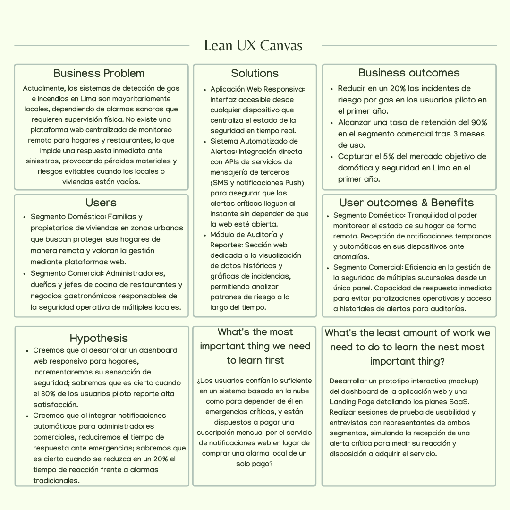

## 1.3. Segmentos objetivo.
**Segmento Doméstico: Familias y Propietarios de Viviendas**
Este segmento está compuesto por familias o individuos que residen en hogares urbanos y buscan proteger sus viviendas de accidentes relacionados con el uso de gas y riesgos eléctricos.

* **Perfil y Comportamiento:** Usuarios familiarizados con el uso de navegadores móviles y aplicaciones web cotidianas, pero que no necesariamente poseen conocimientos técnicos avanzados en redes o infraestructura. 
* **Necesidad Tecnológica:** Requieren una interfaz web intuitiva y responsiva que les permita visualizar el estado de seguridad de sus cocinas en tiempo real. Su prioridad es recibir notificaciones de alerta tempranas (a través de integraciones de mensajería desde el servidor) directamente en sus dispositivos, permitiéndoles tomar acción inmediata sin necesidad de supervisión presencial constante.

**Segmento Comercial: Administradores y Chefs de Restaurantes**
Este segmento abarca a dueños de negocios, administradores y jefes de cocina responsables de garantizar la seguridad operativa en establecimientos de comida, restaurantes y ambientes de alta demanda.

* **Perfil y Comportamiento:** Profesionales enfocados en la continuidad del negocio, la protección de su personal y el cumplimiento de estándares de seguridad. Manejan operaciones críticas y necesitan herramientas de gestión unificadas.
* **Necesidad Tecnológica:** Requieren un panel de control web avanzado soportado por una arquitectura orientada a servicios (SOA). Necesitan visualizar datos históricos de sensores, gestionar múltiples zonas de la cocina y confiar en una lógica de lado servidor robusta que no solo notifique las emergencias, sino que centralice la automatización de acciones preventivas para evitar la paralización de sus operaciones comerciales.
    
# Capítulo II: Requirements Elicitation & Analysis
    
## 2.1. Competidores.
    
### 2.1.1. Análisis competitivo.
| Características | Google Nest Protect | Kidde | Tyco SimplexGrinnell | SmartGas |
| :--- | :--- | :--- | :--- | :--- |
| **Perfil del Competidor** | Ecosistema inteligente cerrado de alta gama. | Líder en alarmas locales de bajo costo. | Sistema industrial corporativo especializado. | **Plataforma SaaS de monitoreo preventivo con arquitectura orientada a servicios (SOA).** |
| **Mercado Objetivo** | Hogares con alta conectividad y presupuesto. | Familias y pequeños comercios locales. | Grandes corporaciones y sector industrial. | Hogares urbanos y restaurantes en Perú. |
| **Ventaja Competitiva** | Integración total con Google Home y smartphones. | Reconocimiento de marca y bajo costo de adquisición. | Alta robustez y certificaciones de seguridad industrial. | **Monitoreo remoto vía Web App y notificaciones en tiempo real.** |
| **Fortalezas** | Ecosistema digital sólido y actualizaciones constantes. | Disponibilidad masiva y sin pagos de suscripción. | Soluciones integrales para entornos de alta complejidad. | **Arquitectura SOA escalable, Backend en C# y alta usabilidad.** |
| **Debilidades** | Dependencia de hardware propietario y costo elevado. | Carece de conectividad remota y gestión de datos. | Instalaciones complejas e interfaces de usuario cerradas. | Marca nueva en el mercado con necesidad de validación inicial. |
    
### 2.1.2. Estrategias y tácticas frente a competidores.

**Fortalezas: Enfoque especializado en monitoreo preventivo y arquitectura SOA**
La startup FireSecure se diferencia de competidores como Google Nest Protect y Tyco al desarrollar SmartGas, una plataforma SaaS que no depende de ecosistemas cerrados. A diferencia de Kidde, que ofrece hardware analógico, SmartGas utiliza una arquitectura orientada a servicios (SOA) en C# que permite el procesamiento de telemetría en la nube, visualización web responsiva y un sistema de alertas proactivo.

**Táctica:** 
Posicionar a SmartGas en el mercado como la solución que democratiza la seguridad inteligente, permitiendo a los usuarios monitorear sus instalaciones desde cualquier navegador sin la complejidad de sistemas industriales ni el costo de hardware de gama alta.

**Debilidades: Startup en etapa temprana con necesidad de validación**
Al ser una empresa nueva, FireSecure no cuenta aún con la trayectoria de marca de Google ni las certificaciones masivas de Tyco. Esto puede generar dudas en el segmento comercial (restaurantes) respecto a la fiabilidad a largo plazo de la plataforma SmartGas.

**Táctica:** 
Ejecutar programas piloto de SmartGas en restaurantes locales de Lima (como en Jesús María) para recolectar métricas de desempeño y testimonios. Estos casos de éxito servirán como validación técnica para demostrar la robustez del backend frente a situaciones reales.

**Oportunidades: Necesidad de digitalización en el sector residencial y culinario peruano**
Existe un vacío en el mercado local donde los sistemas de seguridad son locales o muy costosos. SmartGas tiene la oportunidad de capturar este nicho ofreciendo una solución que se integra con dispositivos IoT accesibles, algo que los competidores internacionales no han adaptado al contexto económico del Perú.

**Táctica:** 
Enfocar los esfuerzos de marketing de FireSecure en la "Prevención Basada en Datos", ofreciendo no solo la alarma, sino el historial de eventos y reportes estadísticos de SmartGas para que los administradores de restaurantes puedan tomar decisiones informadas sobre sus operaciones.

**Amenazas: Competidores con mayores recursos y capacidad de réplica**
Empresas consolidadas podrían intentar lanzar versiones simplificadas de sus productos si perciben el crecimiento de FireSecure. Además, el ingreso de soluciones genéricas de bajo costo podría presionar los precios de suscripción de SmartGas.

**Táctica:**
Mantener una ventaja competitiva a través de la innovación ágil en el software. FireSecure debe aprovechar su arquitectura SOA para integrar rápidamente nuevas funcionalidades en SmartGas basadas en el feedback de los usuarios locales y ofrecer un soporte técnico en español directo y especializado, algo que Google o Kidde no priorizan en la región.

## 2.2. Entrevistas.
    
### 2.2.1. Diseño de entrevistas.

**Segmento Objetivo 1: Familias y Propietarios de Viviendas**

1. ¿Cuál es su nombre, edad y a qué se dedica actualmente?
2. ¿En qué distrito vive y con cuántas personas comparte su hogar?
3. ¿Qué tipo de dispositivos utiliza con mayor frecuencia (celular, laptop, tablet)?
4. ¿Qué aplicaciones o páginas web usa en su día a día?
5. ¿Qué tan familiarizado está con el uso de aplicaciones web o dispositivos inteligentes en el hogar?
6. En su vivienda, ¿qué tipo de cocina utiliza (gas, eléctrica, mixta)?
7. ¿Ha tenido alguna experiencia o conoce casos cercanos de fugas de gas o incendios domésticos?
8. ¿Qué medidas de seguridad tiene actualmente en su hogar para prevenir estos riesgos?
9. ¿Con qué frecuencia revisa el estado de su cocina o instalaciones de gas?
10. ¿Qué tan seguro se siente respecto a posibles fugas de gas cuando no está en casa?
11. Si ocurriera una fuga de gas mientras usted no está presente, ¿cómo se enteraría?
12. ¿Qué dificultades encuentra al depender solo de revisiones manuales o alarmas tradicionales?
13. ¿Le gustaría poder monitorear el estado de su hogar en tiempo real desde su celular o navegador?
14. ¿Qué funcionalidades le parecerían más útiles en una plataforma web de seguridad doméstica (alertas, historial, visualización en tiempo real, etc.)?
15. ¿Estaría dispuesto a usar una aplicación como SmartGas que le envíe alertas automáticas ante riesgos? ¿Por qué?

**Segmento Objetivo 2: Administradores y Chefs de Restaurantes**

1. ¿Cuál es su nombre, edad y cuál es su rol dentro del restaurante o negocio?
2. ¿En qué distrito se encuentra su local y cuánto tiempo lleva operando?
3. ¿Qué dispositivos utiliza para gestionar su negocio (PC, laptop, celular, tablet)?
4. ¿Qué sistemas o herramientas digitales utiliza actualmente en la gestión del restaurante?
5. ¿Qué tan importante considera la tecnología en la seguridad y operación de su negocio?
6. ¿Qué tipo de equipos de cocina utilizan y qué tan dependientes son del gas?
7. ¿Ha experimentado o conoce incidentes relacionados con fugas de gas o incendios en restaurantes?
8. ¿Qué protocolos de seguridad tiene implementados actualmente en su cocina?
9. ¿Cómo supervisa el estado de las instalaciones de gas y temperatura en su local?
10. ¿Qué dificultades enfrenta al monitorear la seguridad en tiempo real, especialmente en horas de alta demanda?
11. ¿Qué consecuencias tendría para su negocio una fuga de gas o un incendio?
12. ¿Qué tan complicado es llevar un registro o historial de incidentes de seguridad actualmente?
13. ¿Le resultaría útil contar con un sistema centralizado que monitoree múltiples áreas o locales en tiempo real?
14. ¿Qué funciones considera indispensables en una plataforma web de monitoreo (alertas automáticas, reportes, control por zonas, etc.)?
15. ¿Estaría dispuesto a implementar una solución como SmartGas para mejorar la seguridad de su negocio? ¿Por qué?
    
    
### 2.2.2. Registro de entrevistas.

##### Segmento objetivo #1 Familias y Propietarios de Viviendas

#### Entrevista 1:


- **Nombres y apellidos:** Saúl Romani
- **Edad:** 48
- **Distrito:** Jesús María
- **Inicio:** 0:18  
- **Duración:** 7:05  
- **URL:**  [entrevista](https://youtu.be/n1bmq2q0aiQ)
- **Resumen:** Saúl, de 48 años, es ingeniero de sistemas de la información y reside en un departamento con servicio de seguridad en el distrito de Jesús María. A pesar de contar con medidas de protección en su vivienda, menciona que uno de sus mayores gastos está relacionado con el mantenimiento, especialmente en aspectos vinculados a la seguridad y el buen funcionamiento del hogar. Sin embargo, señala que aún no confía completamente en los sistemas tradicionales, ya que considera que no siempre previenen incidentes de manera oportuna. Frente a ello, indica que sí usaría una aplicación como Smart Guard, porque le brindaría mayor tranquilidad y control. Para él, las funcionalidades más útiles serían el monitoreo de los niveles de gas mediante sensores y la detección de movimiento, ya que estas permitirían identificar riesgos a tiempo y actuar rápidamente ante posibles emergencias en la cocina.

#### Entrevista 2:


- **Nombres y apellidos:** Sheila Rosales
- **Edad:** 42 
- **Distrito:** Trujillo
- **Inicio:** 0:00  
- **Duración:** 7:11  
- **URL:**  [entrevista](https://youtu.be/VHuMHrjeVto)
- **Resumen:** Sheila, de 42 años, se dedica al hogar y reside en el distrito de Trujillo junto a su familia en una vivienda de tres personas. Aunque utiliza dispositivos tecnológicos como celular y laptop diariamente, no cuenta con sistemas inteligentes en casa, aunque reconoce su utilidad para prevenir accidentes. Utiliza una cocina a gas y, aunque no ha sufrido incidentes personales, manifiesta una gran preocupación por la posibilidad de fugas o incendios cuando no se encuentra presente, dependiendo actualmente solo de la vigilancia visual de los vecinos para enterarse de una emergencia. <br> Menciona que su única medida de seguridad actual es la revisión manual, pero admite que no realiza mantenimientos frecuentes. Frente a esta situación, Sheila muestra un alto interés en utilizar SmartGas, destacando que le brindaría la tranquilidad de monitorear su hogar en tiempo real. Para ella, las funcionalidades más valiosas serían las alertas automáticas y la visualización en tiempo real, ya que le permitirían actuar con rapidez o enviar ayuda antes de que ocurra un accidente grave, transformando su actual incertidumbre en un control preventivo directo desde su celular.

#### Entrevista 3:


- **Nombres y apellidos:** Sonia Rojas
- **Edad:** 57
- **Distrito:** Cercado de Lima
- **Inicio:** 0:00  
- **Duración:** 5:41  
- **URL:**  [entrevista](https://upcedupe-my.sharepoint.com/:v:/g/personal/u20241d995_upc_edu_pe/IQBheKhR4PPTRKlTRUd6PQNKAdXT_fgaZvI961KIImPMP3w?e=k0RXJx&nav=eyJyZWZlcnJhbEluZm8iOnsicmVmZXJyYWxBcHAiOiJTdHJlYW1XZWJBcHAiLCJyZWZlcnJhbFZpZXciOiJTaGFyZURpYWxvZy1MaW5rIiwicmVmZXJyYWxBcHBQbGF0Zm9ybSI6IldlYiIsInJlZmVycmFsTW9kZSI6InZpZXcifX0%3D)
- **Resumen:** Sonia, de 57 años, es una ama de casa del distrito de Cercado de Lima la cual vive en su hogar junto con sus 2 hijos. Si bien ella utiliza dispositivos electronicos tales como su celular, ella no está acostumbrada a usar equipos de escritorio como laptops o computadoras, así como tampoco está familiarizada con el uso de sistemas inteligente en su hogar, pese a ello reconoce que estos sistemas pueden ser de gran utilidad para la detección de incidente en el hogar. Utiliza una cocina a gas, no he sufrido ningun accidente relaciona con gas o fuego sin embargo conocidos suyos si han sufrido de está clase de incidentes. Ella muestra preocupación por el bienestar de su familia en caso uno de estos incidente se pueda sucitar. Sonia muestra interes en la aplicación de SmartGuard, resalta que la funcionalidad de las notificaciones y alertas automáticas le parecen las más importantes pues le permitirian saber cuando es que su familia sufre de algún riesgo.

##### Segmento objetivo #2 Administradores y Chefs de Restaurantes

#### Entrevista 1:


- **Nombres y apellidos:** Raí Beizaga
- **Edad:** 20 
- **Distrito:** Jesús María
- **Inicio:** 0:00  
- **Duración:** 4:46  
- **URL:**  [entrevista](https://upcedupe-my.sharepoint.com/:v:/g/personal/u202310436_upc_edu_pe/IQCEZTjEZ0mgTrHjCdh71j0DAS2Z7AX7h5JkZvyN8dp-oaI?nav=eyJyZWZlcnJhbEluZm8iOnsicmVmZXJyYWxBcHAiOiJPbmVEcml2ZUZvckJ1c2luZXNzIiwicmVmZXJyYWxBcHBQbGF0Zm9ybSI6IldlYiIsInJlZmVycmFsTW9kZSI6InZpZXciLCJyZWZlcnJhbFZpZXciOiJNeUZpbGVzTGlua0NvcHkifX0&e=C5xNxe)
- **Resumen:** Raí, de 20 años, se desempeña como ayudante de cocina el restaurante Terminal Pesquero ubicado en Jesús María, el cual lleva trabajando desde hace 5 meses. Debido a la naturaleza de su trabajo, opera constantemente equipos de alto riesgo como freidoras, hornos y cocinas industriales que dependen totalmente del suministro de gas. Actualmente, la seguridad del local se gestiona de forma manual, realizando inspecciones visuales de válvulas y conexiones antes de iniciar la jornada, lo que resulta insuficiente durante las horas de alta demanda donde el control se pierde. Fabrizio señala que una fuga de gas o un incendio no solo representaría una pérdida económica devastadora, sino un daño irreparable a la reputación del negocio. Como trabajador joven, manifiesta una mayor confianza en la precisión de los sensores tecnológicos que en el olfato humano para detectar peligros. Ante este contexto, considera que SmartGas sería una solución indispensable, destacando funciones como las alertas inmediatas al celular, gráficos de temperatura para evitar sobrecalentamientos y un botón de corte de emergencia para aviso rápido a mantenimiento o bomberos

#### Entrevista 2:


- **Nombres y apellidos:** Kevin Arnold Izquiero Pardave
- **Edad:** 31
- **Distrito:** Jesús María
- **Inicio:** 0:00  
- **Duración:** 4:17  
- **URL:**  [entrevista](https://upcedupe-my.sharepoint.com/:v:/g/personal/u20241d995_upc_edu_pe/IQBTiLZJ_3yESbU6W2h2tA0SATm3CL-mSGMoO3EUsrkm_ak?e=ONsG8Y&nav=eyJyZWZlcnJhbEluZm8iOnsicmVmZXJyYWxBcHAiOiJTdHJlYW1XZWJBcHAiLCJyZWZlcnJhbFZpZXciOiJTaGFyZURpYWxvZy1MaW5rIiwicmVmZXJyYWxBcHBQbGF0Zm9ybSI6IldlYiIsInJlZmVycmFsTW9kZSI6InZpZXcifX0%3D)

- **Resumen:** Resumen: Kevin, 31 años, es el dueño de un restaurante y administrador del restaurante Palmar, ubicado en Comas. Este restaurante lleva existiendo por más de 20 años, y él actualmente está a cargo del local, relevando a su padre. Si bien es el administrador, también ayuda en las labores de cocina cuando es necesario, por lo que está en contacto con dispositivos como estufas, freidoras e incluso hornos, los cuales funcionan, por supuesto, a base de gas.

  En la actualidad, los métodos de prevención que poseen en caso de incendio o fuga de gas son completamente manuales, ya que dependen de inspeccionar visualmente que no haya ninguna fuga. Kevin indica que, si bien no ha experimentado de primera mano un accidente como el descrito, sí ha escuchado de locales en los cuales esto ha ocurrido, y reconoce el peligro que significa que uno de estos incidentes escale, ya que implicaría perder toda su inversión, además de poner en riesgo a su personal.

  Como administrador del local, opina que se sentiría más seguro si hubiera un sistema que lo alerte de estos incidentes de forma temprana, para evitar pérdidas tanto monetarias como humanas. Considera que SmartGas sería una solución eficiente para dichos incidentes, al notificar a su personal y contar con medidas preventivas para evitar que el problema escale.

#### Entrevista 3:


- **Nombres y apellidos:** Ruben Isaias Carhuaz Pomachagua
- **Edad:** 49
- **Distrito:** Lince
- **Inicio:** 0:00  
- **Duración:** 4:12  
- **URL:**  [entrevista](https://upcedupe-my.sharepoint.com/:v:/g/personal/u20241d932_upc_edu_pe/IQAtlT93b6nWS5YXY5ZMGrNaAefLFvGOWZS-ZqiV_Y2y53w?nav=eyJyZWZlcnJhbEluZm8iOnsicmVmZXJyYWxBcHAiOiJPbmVEcml2ZUZvckJ1c2luZXNzIiwicmVmZXJyYWxBcHBQbGF0Zm9ybSI6IldlYiIsInJlZmVycmFsTW9kZSI6InZpZXciLCJyZWZlcnJhbFZpZXciOiJNeUZpbGVzTGlua0NvcHkifX0&e=u8AERl)

- **Resumen:** Resumen: Rubén Carhuaz, de 49 años y gerente de un restaurante con dos años de funcionamiento, reconoce que la tecnología es un recurso indispensable para la seguridad, especialmente porque su operación depende totalmente del gas. Actualmente, sus métodos de prevención son rudimentarios y se limitan a la revisión manual de mangueras, lo que representa un riesgo latente, ya que un incendio o fuga significaría "perderlo todo". Ante este panorama, Rubén se muestra dispuesto a implementar una solución tecnológica que centralice el monitoreo y, sobre todo, emita alertas inmediatas para garantizar la protección de sus trabajadores y clientes.
    
### 2.2.3. Análisis de entrevistas.

**Segmento 1: Familias y Propietarios de Viviendas**

* **Perfil y Residencia:** 100% reside en zonas urbanas en hogares con 3 o más personas.
 
* **Equipamiento del Hogar:** 100% utiliza cocinas a gas y cuenta con dispositivos como celulares y laptops.
 
* **Seguridad Actual:** 100% depende exclusivamente de métodos manuales (revisión visual y olfato) o de la vigilancia de terceros (vecinos).
 
* **Problemas y Preocupaciones:**
 
    * 100% manifiesta preocupación o desconfianza ante posibles fugas de gas cuando no están en casa.
 
    * 50% señala que los sistemas tradicionales no previenen incidentes de forma oportuna.
  
    * 50% admite que no realiza mantenimientos preventivos con frecuencia.
 
* **Funciones Valoradas:** 100% prioriza el monitoreo en tiempo real y las alertas automáticas al celular. El 50% también valora la detección de movimiento.
 
* **Adopción de SmartGas:** 100% está dispuesto a utilizar la aplicación porque les brinda tranquilidad, control y una respuesta rápida ante emergencias.

**Segmento 2: Administradores y Chefs de Restaurantes**

* **Rol y Experiencia:** 100% opera directamente equipos de alto riesgo que dependen del gas.
 
* **Gestión de Seguridad:** 100% gestiona la seguridad de forma manual mediante inspecciones visuales de mangueras y válvulas.
 
* **Riesgos Identificados:**
 
    * 100% afirma que una fuga o incendio significaría "perderlo todo" (inversión y activos).
  
    * 66% señala que el factor humano es insuficiente durante horas de alta demanda o para detectar peligros invisibles al olfato.

    * 33% destaca el riesgo irreparable a la reputación del negocio.

* **Tecnología y Confianza:** 100% considera la tecnología como un recurso indispensable y confía más en la precisión de los sensores que en el control manual.
 
* **Funciones Deseadas en SmartGas:** 100% solicita alertas inmediatas al celular. El 66% valora medidas preventivas automáticas y el 33% requiere gráficos de temperatura.
 
* **Adopción de SmartGas:** 100% considera la solución como una herramienta eficiente e indispensable para centralizar el monitoreo y proteger a sus trabajadores y clientes.
    
## 2.3. Needfinding.
    
### 2.3.1. User Personas.

En esta sección se presentan los User Personas que representan a los principales segmentos objetivo del proyecto. Estos perfiles han sido construidos a partir de las características, necesidades y comportamientos identificados durante el análisis previo.

Cada persona refleja un tipo de usuario real, permitiendo comprender mejor sus objetivos, motivaciones y dificultades en relación con la seguridad en entornos donde se utiliza gas

**Segmento Objetivo 1: Familias y Propietarios de Viviendas**


**Segmento Objetivo 2: Administradores y Chefs de Restaurantes**


### 2.3.2. User Task Matrix.

En esta sección se identifican las principales actividades que realizan los usuarios en su día a día para mantener la seguridad en sus entornos, tanto en el hogar como en espacios de trabajo.

Estas tareas reflejan cómo gestionan actualmente los riesgos asociados al uso de gas, sin el apoyo de una solución digital como SmartGas.


| Tareas / User Persona                                | Helí Rodríguez (Frec.) | Helí Rodríguez (Imp.) | María López (Frec.) | María López (Imp.) |
| ---------------------------------------------------- | ---------------------- | --------------------- | ------------------- | ------------------ |
| Supervisar equipos de cocina                         | Alta                   | Alta                  | Media               | Alta               |
| Revisar instalaciones de gas                         | Media                  | Alta                  | Baja                | Alta               |
| Detectar olores o señales de fuga                    | Media                  | Alta                  | Baja                | Alta               |
| Verificar que todo esté apagado                      | Alta                   | Alta                  | Alta                | Alta               |
| Actuar ante emergencias                              | Baja                   | Alta                  | Baja                | Alta               |
| Realizar mantenimiento preventivo                    | Media                  | Alta                  | Baja                | Media              |
| Depender de revisiones manuales                      | Alta                   | Alta                  | Alta                | Alta               |
| Usar el celular para comunicarse                     | Alta                   | Media                 | Alta                | Media              |
| Preocuparse por la seguridad cuando no está presente | Alta                   | Alta                  | Alta                | Alta               |

Se observa que ambos usuarios dependen en gran medida de revisiones manuales para garantizar la seguridad, lo que puede generar descuidos o respuestas tardías ante un problema.

Helí tiene una carga operativa más alta y necesita control constante en un entorno exigente, mientras que María busca principalmente tranquilidad y prevención en su hogar.

Esto refuerza la necesidad de una solución que permita monitoreo remoto y alertas oportunas, adaptándose tanto a un uso profesional como doméstico.

### 2.3.3. User Journey Mapping.

En esta sección se describe el recorrido que siguen los usuarios en su interacción con una posible solución al problema identificado. A través de distintas etapas, se analiza cómo evolucionan sus objetivos, acciones, percepciones y dificultades desde el momento en que toman conciencia del riesgo hasta que adoptan una herramienta que les permita gestionarlo.

El User Journey permite identificar puntos críticos y oportunidades de mejora, facilitando el diseño de una experiencia que responda de manera efectiva a las necesidades de cada segmento.

**Segmento Objetivo 1: Familias y Propietarios de Viviendas**


**Segmento Objetivo 2: Administradores y Chefs de Restaurantes**


### 2.3.4. Empathy Mapping.
    
En esta sección se analizan los pensamientos, emociones, acciones y percepciones de los usuarios con el objetivo de comprender mejor su comportamiento frente al problema planteado.

El Empathy Map permite profundizar en las necesidades reales de cada segmento, identificando sus preocupaciones, motivaciones y frustraciones. Esto contribuye a diseñar una solución más alineada con el usuario, asegurando que la propuesta de valor sea clara, útil y relevante en su contexto.

**Segmento Objetivo 1: Familias y Propietarios de Viviendas**


**Segmento Objetivo 2: Administradores y Chefs de Restaurantes**


## 2.4. Big Picture EventStorming.

<div align="center">
  
</div>
    
## 2.5. Ubiquitous Language.

En este apartado se definen los términos clave que se utilizarán a lo largo del desarrollo del sistema SmartGas. Este conjunto de conceptos permite que tanto el equipo técnico como los usuarios tengan una misma interpretación de los elementos y procesos del sistema.

El uso de este lenguaje común facilita la comprensión del funcionamiento de la plataforma, reduce confusiones y asegura coherencia en el diseño e implementación de la solución.

A continuación, se presentan los principales términos definidos:
    
* Telemetría de sensores en tiempo real (Real-time sensor telemetry): Datos continuos enviados por sensores de gas y temperatura hacia el sistema para su monitoreo.

* Sensor IoT (IoT Sensor): Dispositivo físico instalado en cocinas o ambientes que mide niveles de gas y temperatura.

* Anomalía de gas o temperatura (Gas or temperature anomaly): Valor detectado fuera de los rangos seguros establecidos que puede representar un riesgo.

* Detección de fuga de gas (Gas leak detection): Identificación automática de niveles peligrosos de gas en el ambiente.

* Alerta de seguridad (Security alert / Safety alert): Notificación generada por el sistema cuando se detecta una anomalía.

* Notificación en tiempo real (Real-time notification): Mensaje enviado al usuario a través de la web o servicios externos de forma inmediata.
 
* Dashboard de monitoreo (Monitoring dashboard): Interfaz web donde el usuario visualiza el estado de sus sensores y niveles de seguridad.

* Historial de incidencias (Incident history / Event log): Registro almacenado de eventos relacionados con anomalías o alertas detectadas.
 
* Monitoreo remoto (Remote monitoring): Capacidad de supervisar el estado del entorno desde cualquier dispositivo con acceso a internet.
 
* Gestión de dispositivos (Device management): Proceso de registrar, configurar y asociar sensores a usuarios o ubicaciones.

    
# Capítulo III: Requirements Specification
  
## 3.1. User Stories.
   
| Epic / Story ID | Título| Descripción| Criterios de Aceptación| Relacionado con (Epic ID) |
| --------------- | -------------------------------- | ------------------------------------------------------------------------------------------------------- | ---------------------------------------------------------------------------------------------------------------------------------------------------------------------- | ------------------------- |
| EP01 | Gestión de sensores| Como usuario, necesito registrar y administrar mis sensores para monitorear mi entorno de forma segura. |   |   |
| US-01 | Registrar sensor | Como usuario, quiero registrar un sensor en el sistema para comenzar a monitorear mi entorno.   | Escenario 01: Given que el usuario accede al módulo de sensores, When ingresa los datos del sensor, Then el sistema valida y registra el sensor correctamente.| EP01  |
| US-02 | Asociar sensor a ubicación| Como usuario, quiero vincular un sensor a mi vivienda o local para identificar su ubicación. | Escenario 01: Given que el usuario tiene sensores registrados, When selecciona una ubicación, Then el sistema asocia el sensor correctamente.| EP01 |
| US-03 | Configurar parámetros del sensor | Como usuario, quiero configurar los límites de mi sensor para adaptarlo a mis necesidades. | Escenario 01: Given que el sensor está registrado, When el usuario modifica los parámetros, Then el sistema guarda los cambios validando los rangos permitidos. | EP01 |
| US-04  | Visualizar sensores registrados  | Como usuario, quiero ver mis sensores registrados para gestionar su estado.| Escenario 01: Given que el usuario accede al módulo de sensores, When ingresa a la vista principal, Then el sistema muestra la lista de sensores con su estado actual. | EP01  |
| EP02 | Monitoreo en tiempo real | Como usuario, necesito visualizar el estado de mis sensores en tiempo real para detectar posibles riesgos de forma inmediata. | | |
| US-05 | Visualizar estado de sensores en tiempo real | Como usuario, quiero ver los niveles de gas y temperatura en tiempo real para conocer el estado de mi entorno. | Escenario 01: Given que el usuario ha iniciado sesión, When accede al dashboard, Then el sistema muestra los valores actualizados de los sensores en tiempo real.   | EP02 |
| US-06 | Actualización automática de datos | Como usuario, quiero que los datos se actualicen automáticamente para no tener que recargar la página. | Escenario 01: Given que el usuario está visualizando el dashboard, When los sensores envían nuevos datos, Then el sistema actualiza la información automáticamente. | EP02 |
| US-07 | Visualizar estado general de seguridad | Como usuario, quiero ver un indicador general de seguridad para entender rápidamente si hay riesgo.| Escenario 01: Given que existen datos de sensores, When el usuario accede al dashboard, Then el sistema muestra un estado general (seguro, alerta, peligro).| EP02 |
| US-08  | Identificar sensor con anomalía | Como usuario, quiero identificar qué sensor presenta un problema para tomar acción rápida. | Escenario 01: Given que existe una anomalía, When el usuario revisa el dashboard, Then el sistema resalta el sensor afectado. | EP02 |
| EP03 | Detección de anomalías | Como sistema, necesito identificar automáticamente valores fuera de lo normal para prevenir riesgos en el entorno. | | |
| US-09 | Detectar niveles peligrosos de gas | Como sistema, quiero identificar niveles de gas fuera del rango seguro para prevenir fugas. | Escenario 01: Given que el sensor envía datos, When el nivel de gas supera el límite establecido, Then el sistema registra una anomalía.| EP03 |
| US-10 | Detectar temperaturas anómalas | Como sistema, quiero identificar temperaturas fuera de lo normal para evitar riesgos de incendio. | Escenario 01: Given que el sensor envía datos, When la temperatura excede el rango permitido, Then el sistema detecta una anomalía. | EP03  |
| US-11 | Validar datos del sensor | Como sistema, quiero validar los datos recibidos para evitar errores en la detección.  | Escenario 01: Given que se reciben datos del sensor, When los valores son inconsistentes, Then el sistema descarta o marca los datos como inválidos. | EP03 |
| US-12 | Generar evento de anomalía | Como sistema, quiero registrar cada anomalía detectada para su posterior gestión.| Escenario 01: Given que se detecta una anomalía, When se confirma el evento, Then el sistema lo registra en el historial. | EP03 | 
| EP04 | Gestión de alertas | Como sistema, necesito generar y gestionar alertas para notificar situaciones de riesgo de manera oportuna. |  |  |
| US-13  | Generar alerta automática   | Como sistema, quiero generar una alerta cuando se detecta una anomalía para iniciar el proceso de notificación. | Escenario 01: Given que se detecta una anomalía, When se supera el umbral establecido, Then el sistema genera automáticamente una alerta. | EP04 |
| US-14 | Clasificar nivel de alerta  | Como sistema, quiero clasificar las alertas según su nivel de riesgo para priorizar la atención. | Escenario 01: Given que se genera una alerta, When se evalúan los valores detectados, Then el sistema asigna un nivel (bajo, medio, alto). | EP04 |
| US-15| Visualizar alertas activas  | Como usuario, quiero ver las alertas activas para conocer los riesgos actuales. | Escenario 01: Given que existen alertas activas, When el usuario accede al sistema, Then el sistema muestra la lista de alertas con su estado y nivel de riesgo. | EP04 |
| US-16 | Marcar alerta como atendida | Como usuario, quiero marcar una alerta como atendida para llevar control de las incidencias. | Escenario 01: Given que el usuario revisa una alerta, When selecciona la opción de atender, Then el sistema cambia su estado a "resuelta". | EP04 |
| EP05 | Notificaciones | Como sistema, necesito enviar notificaciones al usuario para informarle sobre situaciones de riesgo en tiempo real. |  | |
| US-17 | Enviar notificación en tiempo real  | Como sistema, quiero enviar notificaciones inmediatas cuando ocurre una alerta para informar al usuario. | Escenario 01: Given que se genera una alerta, When el sistema procesa la información, Then se envía una notificación en tiempo real al usuario. | EP05 |
| US-18  | Notificar por múltiples canales | Como usuario, quiero recibir notificaciones por diferentes medios para asegurarme de enterarme del riesgo. | Escenario 01: Given que existe una alerta activa, When se envía la notificación, Then el sistema utiliza canales como web, SMS o push. | EP05 |
| US-19  | Visualizar notificaciones recibidas | Como usuario, quiero ver las notificaciones recibidas para revisar los eventos recientes. | Escenario 01: Given que el usuario accede al sistema, When ingresa a la sección de notificaciones, Then el sistema muestra el historial de notificaciones. | EP05 |
| US-20 | Confirmar recepción de alerta | Como usuario, quiero confirmar que recibí una alerta para asegurar el seguimiento del evento. | Escenario 01: Given que el usuario recibe una notificación, When interactúa con ella, Then el sistema registra la confirmación de lectura.| EP05| 
| EP06 | Dashboard y visualización | Como usuario, necesito visualizar la información de seguridad de forma clara para entender rápidamente el estado de mi entorno. |   |  |
| US-21 | Visualizar dashboard principal  | Como usuario, quiero ver un panel principal con el estado general de seguridad para tener una visión rápida. | Escenario 01: Given que el usuario ha iniciado sesión, When accede al sistema, Then el dashboard muestra el estado general (seguro, alerta, peligro). | EP06 |
| US-22 | Visualizar gráficos de sensores | Como usuario, quiero ver gráficos de gas y temperatura para analizar el comportamiento de los datos. | Escenario 01: Given que existen datos históricos, When el usuario accede a la sección de gráficos, Then el sistema muestra visualizaciones claras de los valores. | EP06 |
| US-23 | Filtrar información por sensor  | Como usuario, quiero filtrar los datos por sensor para analizar información específica. | Escenario 01: Given que el usuario visualiza datos, When aplica un filtro por sensor, Then el sistema muestra únicamente la información seleccionada. | EP06 |
| US-24 | Visualizar estado por ubicación | Como usuario, quiero ver el estado de cada área o ubicación para identificar riesgos específicos. | Escenario 01: Given que el usuario tiene múltiples sensores, When accede al dashboard, Then el sistema muestra el estado por cada ubicación.| EP06 |
| EP07 | Historial y reportes  | Como usuario, necesito acceder al historial de eventos para analizar incidentes y tomar mejores decisiones. |  |   |
| US-25 | Registrar historial de incidencias | Como sistema, quiero guardar cada evento detectado para mantener un registro de seguridad. | Escenario 01: Given que ocurre una anomalía o alerta, When el evento es confirmado, Then el sistema lo almacena en el historial con fecha y hora.  | EP07  |
| US-26  | Consultar historial de eventos | Como usuario, quiero revisar eventos pasados para analizar lo ocurrido. | Escenario 01: Given que el usuario accede al módulo de historial, When solicita la información, Then el sistema muestra la lista de eventos registrados.   | EP07  |
| US-27 | Filtrar historial por fecha | Como usuario, quiero filtrar el historial por rango de fechas para facilitar el análisis. | Escenario 01: Given que existen múltiples registros, When el usuario aplica un filtro de fechas, Then el sistema muestra los eventos correspondientes. | EP07 |
| US-28 | Generar reporte de seguridad | Como usuario, quiero generar reportes para evaluar el estado de seguridad de mi entorno. | Escenario 01: Given que el usuario solicita un reporte, When selecciona un rango de fechas, Then el sistema genera un informe con los eventos registrados. | EP07  |
| EP08 | Gestión de usuarios | Como usuario, necesito gestionar mi cuenta para acceder y controlar mi información dentro del sistema. | |  |
| US-29 | Registrarse en el sistema | Como usuario, quiero crear una cuenta para acceder a la plataforma.   | Escenario 01: Given que el usuario ingresa sus datos, When completa el formulario de registro, Then el sistema crea la cuenta correctamente. | EP08  |
| US-30 | Iniciar sesión | Como usuario, quiero iniciar sesión para acceder a mi información.| Escenario 01: Given que el usuario tiene una cuenta registrada, When ingresa sus credenciales, Then el sistema valida y permite el acceso.| EP08|
| US-31  | Gestionar perfil de usuario | Como usuario, quiero editar mi información personal para mantener mis datos actualizados. | Escenario 01: Given que el usuario accede a su perfil, When modifica sus datos, Then el sistema guarda los cambios correctamente. | EP08 |
| US-32 | Cerrar sesión | Como usuario, quiero cerrar sesión para proteger mi cuenta. | Escenario 01: Given que el usuario está autenticado, When selecciona cerrar sesión, Then el sistema finaliza la sesión correctamente.  | EP08 |
| EP09 | Seguridad y configuración | Como usuario, necesito configurar parámetros de seguridad para adaptar el sistema a mis necesidades y prevenir riesgos. | |  |
| US-33 | Configurar límites de seguridad | Como usuario, quiero definir los límites de gas y temperatura para personalizar las alertas.                            | Escenario 01: Given que el usuario accede a la configuración, When establece valores límite, Then el sistema guarda los parámetros y los aplica en la detección de anomalías. | EP09 |
| US-34 | Configurar preferencias de notificación | Como usuario, quiero elegir cómo recibir notificaciones para adaptarlas a mi disponibilidad. | Escenario 01: Given que el usuario accede a configuración, When selecciona los canales de notificación, Then el sistema guarda y aplica las preferencias. | EP09 |
| EP-API | API RESTful  | Como desarrollador, necesito exponer servicios mediante endpoints para integrar sensores, usuarios y alertas con la plataforma. |  |  |
| TS-01  | API para gestión de sensores | Como desarrollador, quiero endpoints CRUD para sensores para registrar y administrar dispositivos IoT. | Escenario 01 (Crear): Given que se envían datos válidos del sensor, When se realiza POST a /api/sensors, Then la API registra el sensor y devuelve código 201.<br>Escenario 02 (Consultar): Given que se solicita la lista de sensores, When se realiza GET, Then la API devuelve los sensores registrados. | EP-API  |
| TS-02  | API para telemetría  | Como desarrollador, quiero enviar datos de sensores para que el sistema procese la información en tiempo real. | Escenario 01 (Registro): Given que el sensor envía datos, When se realiza POST a /api/telemetry, Then la API guarda los datos y los envía al sistema de procesamiento.<br>Escenario 02 (Validación): Given que los datos son inválidos, When se procesan, Then la API responde con error 400.| EP-API  |
| TS-03 | API para detección de anomalías | Como desarrollador, quiero procesar datos para identificar valores fuera de rango. | Escenario 01: Given que se reciben datos del sensor, When se evalúan los límites, Then el sistema detecta anomalías y genera un evento.    | EP-API |
| TS-04 | API para gestión de alertas | Como desarrollador, quiero endpoints para crear y consultar alertas generadas por el sistema. | Escenario 01 (Crear): Given que existe una anomalía, When se procesa, Then la API crea una alerta.<br>Escenario 02 (Consultar): Given que se solicita la lista de alertas, When se realiza GET, Then la API devuelve las alertas registradas. | EP-API |
| TS-05 | API para notificaciones | Como desarrollador, quiero integrar servicios externos para enviar notificaciones al usuario. | Escenario 01: Given que se genera una alerta, When se activa el servicio de notificación, Then la API envía mensajes mediante servicios externos (SMS/Push).   | EP-API |
| TS-06 | API para usuarios | Como desarrollador, quiero gestionar usuarios mediante endpoints para autenticación y control de acceso.  | Escenario 01 (Registro): Given que se envían datos válidos, When se realiza POST a /api/users, Then la API crea el usuario.<br>Escenario 02 (Login): Given que se envían credenciales, When se valida, Then la API permite acceso y devuelve un token. | EP-API |

   

## 3.2. Impact Mapping.
    
**Segmento Objetivo 1: Familias y Propietarios de Viviendas**


**Segmento Objetivo 2: Administradores y Chefs de Restaurantes**


## 3.3. Product Backlog.
    
| #  | User Story ID | Título                                  | Descripción | Story Points |
| -- | ------------- | --------------------------------------- | ----------- | ------------ |
| 1  | US-05         | Visualizar estado en tiempo real        |     Como usuario, quiero ver los niveles de gas y temperatura en tiempo real para conocer el estado de mi entorno.        | 8            |
| 2  | US-06         | Actualización automática de datos       |   Como usuario, quiero que los datos se actualicen automáticamente para no tener que recargar la página.          | 8            |
| 3  | US-09         | Detectar niveles peligrosos de gas      |   Como sistema, quiero identificar niveles de gas fuera del rango seguro para prevenir fugas.          | 8            |
| 4  | US-10         | Detectar temperaturas anómalas          |       Como sistema, quiero identificar temperaturas fuera de lo normal para evitar riesgos de incendio.      | 8            |
| 5  | US-17         | Enviar notificación en tiempo real      |       Como sistema, quiero enviar notificaciones inmediatas cuando ocurre una alerta para informar al usuario.      | 8            |
| 6  | US-18         | Notificar por múltiples canales         |      Como usuario, quiero recibir notificaciones por diferentes medios para asegurarme de enterarme del riesgo.       | 8            |
| 7  | US-22         | Visualizar gráficos de sensores         |       Como usuario, quiero ver gráficos de gas y temperatura para analizar el comportamiento de los datos.      | 8            |
| 8  | US-28         | Generar reporte de seguridad            |       Como usuario, quiero generar reportes para evaluar el estado de seguridad de mi entorno.      | 8            |
| 9  | US-01         | Registrar sensor                        |       Como usuario, quiero registrar un sensor en el sistema para comenzar a monitorear mi entorno.      | 5            |
| 10 | US-03         | Configurar parámetros del sensor        |     Como usuario, quiero configurar los límites de mi sensor para adaptarlo a mis necesidades.        | 5            |
| 11 | US-08         | Identificar sensor con anomalía         |      Como usuario, quiero identificar qué sensor presenta un problema para tomar acción rápida.       | 5            |
| 12 | US-11         | Validar datos del sensor                |      Como sistema, quiero validar los datos recibidos para evitar errores en la detección.       | 5            |
| 13 | US-12         | Generar evento de anomalía              |       Como sistema, quiero registrar cada anomalía detectada para su posterior gestión.      | 5            |
| 14 | US-13         | Generar alerta automática               |       Como sistema, quiero generar una alerta cuando se detecta una anomalía para iniciar el proceso de notificación.      | 5            |
| 15 | US-21         | Visualizar dashboard principal          |       Como usuario, quiero ver un panel principal con el estado general de seguridad para tener una visión rápida.      | 5            |
| 16 | US-23         | Filtrar información por sensor          |       Como usuario, quiero filtrar los datos por sensor para analizar información específica.      | 5            |
| 17 | US-24         | Visualizar estado por ubicación         |      Como usuario, quiero ver el estado de cada área o ubicación para identificar riesgos específicos.       | 5            |
| 18 | US-25         | Registrar historial de incidencias      |       Como sistema, quiero guardar cada evento detectado para mantener un registro de seguridad.      | 5            |
| 19 | US-29         | Registrarse en el sistema               |      Como usuario, quiero crear una cuenta para acceder a la plataforma.       | 5            |
| 20 | US-30         | Iniciar sesión                          |       Como usuario, quiero iniciar sesión para acceder a mi información.      | 5            |
| 21 | US-33         | Configurar límites de seguridad         |      Como usuario, necesito configurar parámetros de seguridad para adaptar el sistema a mis necesidades y prevenir riesgos.       | 5            |
| 22 | US-02         | Asociar sensor a ubicación              |       Como usuario, quiero vincular un sensor a mi vivienda o local para identificar su ubicación.      | 3            |
| 23 | US-04         | Visualizar sensores registrados         |     Como usuario, quiero ver mis sensores registrados para gestionar su estado.        | 3            |
| 24 | US-07         | Visualizar estado general de seguridad  |       Como usuario, quiero ver un indicador general de seguridad para entender rápidamente si hay riesgo.      | 3            |
| 25 | US-14         | Clasificar nivel de alerta              |        Como sistema, quiero clasificar las alertas según su nivel de riesgo para priorizar la atención.     | 3            |
| 26 | US-15         | Visualizar alertas activas              |       Como usuario, quiero ver las alertas activas para conocer los riesgos actuales.      | 3            |
| 27 | US-19         | Visualizar notificaciones               |       Como usuario, quiero ver las notificaciones recibidas para revisar los eventos recientes.      | 3            |
| 28 | US-26         | Consultar historial de eventos          |      Como usuario, quiero revisar eventos pasados para analizar lo ocurrido.       | 3            |
| 29 | US-27         | Filtrar historial por fecha             |       Como usuario, quiero filtrar el historial por rango de fechas para facilitar el análisis.      | 3            |
| 30 | US-31         | Gestionar perfil de usuario             |        Como usuario, quiero editar mi información personal para mantener mis datos actualizados.     | 3            |
| 31 | US-34         | Configurar preferencias de notificación |      Como usuario, quiero elegir cómo recibir notificaciones para adaptarlas a mi disponibilidad.       | 3            |
| 32 | US-16         | Marcar alerta como atendida             |      Como usuario, quiero marcar una alerta como atendida para llevar control de las incidencias.       | 2            |
| 33 | US-20         | Confirmar recepción de alerta           |       Como usuario, quiero confirmar que recibí una alerta para asegurar el seguimiento del evento.      | 2            |
| 34 | US-32         | Cerrar sesión                           |       Como usuario, quiero cerrar sesión para proteger mi cuenta.      | 1          |
| 1 | TS-01         | API gestión de sensores    |       Como desarrollador, quiero endpoints CRUD para sensores para registrar y administrar dispositivos IoT.      | 8            |
| 2 | TS-02         | API telemetría             |      Como desarrollador, quiero enviar datos de sensores para que el sistema procese la información en tiempo real.       | 8            |
| 3 | TS-03         | API detección de anomalías |      Como desarrollador, quiero procesar datos para identificar valores fuera de rango.       | 8            |
| 4 | TS-05         | API notificaciones         |    Como desarrollador, quiero integrar servicios externos para enviar notificaciones al usuario.         | 8            |
| 5 | TS-04         | API gestión de alertas     |    Como desarrollador, quiero endpoints para crear y consultar alertas generadas por el sistema.         | 5            |
| 6 | TS-06         | API usuarios               |  Como desarrollador, quiero gestionar usuarios mediante endpoints para autenticación y control de acceso.           | 5            |


# Capítulo IV: Product Design
   
## 4.1. Style Guidelines.
   
### 4.1.1. General Style Guidelines.

**Branding** 

El nombre **SmartGas** surge de la combinación de “Smart” (inteligencia aplicada al IoT y la automatización) y “Gas” (el recurso crítico que buscamos asegurar), una fusión que refleja nuestra misión de integrar la seguridad preventiva con la tecnología en la nube mediante una plataforma SaaS robusta

El diseño del logotipo refuerza esta identidad: una red de nodos y líneas que dibujan la silueta de una llama, simbolizando la telemetría y los datos en tiempo real. El degradado, que transiciona de un naranja cálido a un azul tecnológico, representa la transformación del peligro latente en un entorno controlado y seguro mediante el software. Elegir una identidad con este significado refuerza nuestra propuesta de valor y nos diferencia de las alarmas locales, permitiendo que el usuario identifique a SmartGas como el núcleo inteligente para la protección de sus entornos.  

<div align="center">
  
</div>

**Tipografía**

Para **SmartGas** se eligió la tipografía **Koulen** por su estilo moderno, audaz y con gran presencia visual, lo que refuerza la identidad innovadora y tecnológica de la plataforma de seguridad. Su diseño de formas anchas y fuertes transmite solidez y robustez, valores fundamentales al tratar con sistemas de prevención de riesgos y monitoreo de infraestructuras críticas.

A pesar de su estilo distintivo, esta fuente mantiene una excelente legibilidad en titulares y paneles de control, facilitando la jerarquización de alertas y datos de telemetría en la interfaz web. Esta elección tipográfica genera un impacto visual inmediato que diferencia a **SmartGas** de las soluciones de seguridad tradicionales, asegurando una estética coherente y profesional en entornos digitales basados en arquitecturas en la nube.

<div align="center">
  
</div>

**Colores**  

Colores Se usará una paleta que refuerce la identidad de SmartGas, transmitiendo tecnología, prevención y seguridad. El azul **(#066CBB)** actúa como el tono principal, representando profesionalismo, confianza y la estabilidad de una arquitectura orientada a servicios. El naranja **(#E6501F)** se integra como un color de acento estratégico, simbolizando la energía, el calor bajo control y la inmediatez de las alertas críticas que procesa el sistema. Como tono de transición, se incorpora un color canela cobrizo **(#C38967)**, el cual actúa como el punto intermedio en el degradado de la marca; este color suaviza la composición y refuerza visualmente la idea de una telemetría fluida y un monitoreo constante de la temperatura. En conjunto, esta paleta construye una experiencia visual coherente y moderna, proyectando a SmartGas como una plataforma innovadora, segura y enfocada en la protección inteligente de entornos culinarios.

<div align="center">

</div>

**Spacing**  

En la **Landing Page** y en la aplicación de **SmartGas** se utiliza un espaciado limpio y equilibrado que mejora la legibilidad, evita la sobrecarga visual y facilita la navegación. El uso estratégico de los espacios en blanco organiza el contenido, proporciona descanso visual y guía la atención del usuario hacia la información más relevante, logrando una experiencia clara, ordenada y agradable.  

<div align="center">

</div>

**Tono de Comunicación y Lenguaje Aplicado**

El color primario de **SmartGas (#066CBB)** representa la identidad visual de la seguridad digital y la arquitectura en la nube, transmitiendo confianza, estabilidad y profesionalismo; al interactuar con la plataforma, el usuario percibirá este tono como un respaldo sólido y confiable, reflejando el soporte técnico de un sistema que opera continuamente. El color secundario **(#E6501F)** despierta una sensación de alerta y respuesta inmediata, inspirando energía, prevención y un compromiso absoluto con la seguridad, lo que refuerza la visión de la marca como una solución que utiliza la tecnología para anticiparse a riesgos críticos. El tono intermedio de transición **(#C38967)** refleja el flujo de datos y la precisión de la telemetría, aportando equilibrio visual y una estética moderna que conecta la calidez del entorno culinario con la frialdad del procesamiento de datos. 

En cuanto al lenguaje, **SmartGas** adopta un tono profesional, técnico y directo, acompañado de un enfoque preventivo y resolutivo; los mensajes, alertas y reportes históricos dentro de la plataforma buscan empoderar al usuario para tomar decisiones críticas basadas en datos, reforzando la confiabilidad del ecosistema SaaS y la seguridad operativa tanto en hogares como en restaurantes.

### 4.1.2. Web Style Guidelines.


Para **SmartGas**, desarrollaremos una aplicación web distribuida bajo un enfoque *mobile-first* y adaptable a cualquier dispositivo tecnológico, garantizando que el dashboard de monitoreo y las alertas en tiempo real mantengan su integridad visual y funcional sin distorsiones. Para lograrlo, se considerarán las particularidades de hardware de diversos dispositivos, desde smartphones hasta terminales de escritorio en cocinas industriales, asegurando que la telemetría de gas y temperatura esté siempre estructurada de manera jerárquica. Esto ofrece una experiencia consistente, accesible y optimizada, permitiendo que tanto familias como administradores de restaurantes tomen decisiones críticas desde cualquier navegador con una latencia visual mínima.

<div align="center">

</div>

**Patrón Z**

El diseño de la aplicación web y la landing page de **SmartGas** seguirá el **Patrón Z**, un esquema de lectura optimizado para interfaces con poca densidad de texto inicial que guía la vista del usuario de forma intuitiva. El recorrido inicia en la esquina superior izquierda con el logotipo para reforzar la identidad de marca, se desplaza horizontalmente hacia las opciones de estado de conexión, desciende en diagonal hacia los indicadores visuales de los sensores (la "llama digital") y finaliza en la base con los botones de acción inmediata o historial de incidencias. 

Este enfoque asegura que el usuario identifique primero el estado de seguridad global y luego sea conducido naturalmente hacia los controles de automatización, facilitando una navegación eficiente en situaciones de emergencia y mejorando la tasa de respuesta ante alertas preventivas.

<div align="center">

</div>
    
## 4.2. Information Architecture.
    
### 4.2.1. Organization Systems.


La organización del contenido en **SmartGas** se basa en la aplicación de distintos sistemas de organización según el perfil del usuario (familias y administradores de restaurantes). El objetivo es que la información sea crítica, accionable y responda a la prevención de desastres en tiempo real.

* **Landing Page (Usuarios visitantes / potenciales clientes):**
    * **Organización jerárquica (visual hierarchy):** Estructura en bloques descendentes: Propuesta de valor (prevención inteligente) → Sensores de gas/fuego → Funcionamiento de la nube → Planes SaaS → Contacto.
    * **Categorización por tópicos:** Se agrupan los contenidos según el entorno de protección (Hogar seguro vs. Restaurante protegido).

* **Web App (Administradores de Restaurantes / Jefes de Cocina):**
    * **Organización jerárquica:** Dashboard principal que prioriza **Alertas Activas** y niveles de telemetría en tiempo real (Gas y Temperatura) por sobre los datos estáticos.
    * **Organización por ubicación (Geográfica/Espacial):** Segmentación de dispositivos por zonas críticas (Cocina, Almacén, Área de Comensales) para identificar el origen exacto de una fuga.
    * **Categorización cronológica:** Historial de incidencias y registros de sensores (Logs) ordenados por fecha y hora para auditorías de seguridad y cumplimiento de normativas.
    * **Categorización por audiencia:** Diferenciación entre vistas para personal operativo (monitoreo de sensores) y dueños de negocio (gestión de suscripción y reportes de eficiencia).

* **App Móvil (Familias / Usuarios Domésticos):**
    * **Organización secuencial (Flujo de Incidente):** Basado en los pasos del sistema: Notificación de fuga/fuego → Visualización de nivel de sensor → Ejecución de comandos (Cerrar válvula/Encender ventilas) → Confirmación de fin de incidente.
    * **Organización jerárquica:** Menú de acceso rápido con estados críticos en primer nivel (Estado del Hogar, Comandos de Emergencia, Gestión de Usuarios).
    * **Categorización cronológica:** Listado de eventos de seguridad y notificaciones de Twilio ordenados por estado (Alerta resuelta, Falsa alarma, Incidente en curso).

**Principios aplicados:**
* **Jerárquico para prevención:** Priorizando los datos de sensores que superan los umbrales de peligro en los paneles de control centrales.
* **Secuencial para protocolos de emergencia:** Guiando al usuario paso a paso desde que se detecta un evento de dominio (fuga/fuego) hasta que se notifican los servicios y se estabiliza el entorno.
* **Cronológico para históricos:** Permitiendo analizar patrones de temperatura o pequeñas fluctuaciones de gas recurrentes a través del tiempo.
* **Por audiencia:** Separando la experiencia técnica de un administrador de restaurante (múltiples dispositivos y actuadores) de la experiencia simplificada y directa de un usuario doméstico.
    
### 4.2.2. Labeling Systems.

El sistema de etiquetado de **SmartGas** se diseña con un enfoque en **claridad y simplicidad**, fundamental para una plataforma de seguridad donde la rapidez de comprensión es vital. Las etiquetas se adaptan a la Landing Page, la Web App y la App Móvil , asegurando una navegación intuitiva y una asociación directa con los protocolos de emergencia.

- **Landing Page:** - **Start:** Acceso a la propuesta de valor y visión general.  
  - **Service:** Detalle del funcionamiento de los sensores y la arquitectura en la nube.  
  - **Benefits:** Ventajas competitivas en seguridad y prevención.  
  - **Characteristics:** Especificaciones técnicas de los dispositivos de detección.  
  - **Pricing Plan:** Opciones de suscripción SaaS por equipo.  
  - **Sign up:** Acceso al registro mediante Google Auth.  

- **Web App (Administradores de Restaurantes / Jefes de Cocina):** - **Dashboard:** Resumen del estado global de seguridad y sensores activos.  
  - **Zonas de Monitoreo:** Visualización de telemetría de gas y temperatura por áreas específicas.  
  - **Actuadores:** Control remoto de válvulas de gas y sistemas de ventilación.  
  - **Historial de Incidentes:** Registro cronológico de alertas resueltas y reportes de seguridad.  
  - **Configuración de Alertas:** Gestión de umbrales críticos y números de contacto para notificaciones Twilio.  

- **App Móvil (Familias / Usuarios Domésticos):** - **Estado del Hogar:** Indicador visual inmediato del nivel de riesgo.  
  - **Notificaciones:** Registro de alertas push y mensajes enviados.  
  - **Comandos de Emergencia:** Botones directos para "Cerrar Válvula" o "Apagar Alarma".  
  - **Perfil:** Configuración de cuenta y gestión de permisos de usuario.  

**Principios aplicados:** - **Uso de palabras de acción:** Etiquetas como "Cerrar" o "Activar" para comandos críticos que requieren ejecución inmediata.  
- **Consistencia semántica:** El término "Incidente" se vincula estrictamente a detecciones de fuga o fuego, mientras que "Telemetría" se refiere a la lectura constante de datos.  

- **Diferenciación por contexto:** En la Landing Page, las etiquetas son de exploración (Learn More); en la App son de reacción operativa (Comandos Rápidos).
    
### 4.2.3. SEO Tags and Meta Tags

Para mejorar la visibilidad en buscadores y garantizar un correcto posicionamiento de la experiencia digital, se definen los siguientes metadatos principales:

* **Landing Page:**
    * **Title:** "SmartGas – Prevención Inteligente de Fugas de Gas e Incendios"
    * **Meta Description:** "Protege tu hogar o negocio con SmartGas. Sistema de monitoreo remoto en tiempo real, detección de incendios y control automático de válvulas mediante tecnología IoT."
    * **Keywords:** seguridad gas, prevención incendios, sensor de gas inteligente, monitoreo IoT, domótica seguridad, control de fugas de gas
    * **Author:** Equipo SmartGas

* **Web App (Administradores / Restaurantes):**
    * **Title:** "SmartGas Web – Gestión de Seguridad y Telemetría"
    * **Description:** "Panel de control para administradores: monitoreo centralizado de sensores de temperatura y gas, gestión de incidentes y protocolos de actuación automática."
    * **Keywords:** gestión de seguridad, telemetría industrial, reporte de incidentes, control de sensores remoto, seguridad restaurantes
    * **Author:** Equipo SmartGas

* **App Móvil (Usuarios Finales):**
    * **Title:** "SmartGas Móvil – Control de Seguridad en tu Mano"
    * **Description:** "Recibe alertas críticas de seguridad en tiempo real. Controla tus válvulas de gas y monitorea el estado de tu hogar desde cualquier lugar con notificaciones inmediatas."
    * **Keywords:** app seguridad hogar, alertas de gas, monitoreo remoto, prevención de accidentes, notificaciones de emergencia
    * **Author:** Equipo SmartGas
    
### 4.2.4. Searching Systems.

El sistema de búsqueda en **SmartGas** ha sido diseñado para que los usuarios localicen de forma inmediata dispositivos, registros de telemetría e incidentes críticos, garantizando una respuesta eficiente ante situaciones de riesgo. La búsqueda se implementa con capacidades de filtrado dinámico adaptadas tanto para la gestión administrativa como para el monitoreo doméstico.

**Landing Page**
* **Barra de búsqueda en la sección de Soporte/FAQ:** Permite a los visitantes resolver dudas sobre la instalación de sensores, compatibilidad de válvulas y configuración de la cuenta.
* **Sugerencias inteligentes:** A medida que se escribe, el sistema muestra coincidencias con artículos o secciones de la página.

* **Resultados directos:** Enlaces rápidos a guías técnicas o secciones específicas de la página para agilizar la conversión del cliente.

**Web Application (Administradores / Restaurantes)**
* **Barra de búsqueda global:** Ubicada en el header del dashboard para encontrar rápidamente sensores específicos por nombre (ej. "Sensor Cocina Norte"), ID de dispositivo o ubicación.
* **Filtros avanzados de telemetría:**
    * **Por Estado del Dispositivo:** (En línea, Fuera de línea, En Alarma, Batería Baja).
    * **Por Tipo de Sensor:** (Gas LP, Monóxido de Carbono, Temperatura).
    * **Por Zona:** (Almacén, Cocina principal, Salón de comensales).
    * **Por Gravedad de Incidente:** (Alerta preventiva, Emergencia crítica).

**Mobile Application (Usuarios Finales / Familias)**
* **Filtros rápidos de dispositivos:**
    * **Por Estado:** (Activos/Inactivos).
    * **Por Acción:** (Válvulas cerradas vs. Válvulas abiertas).
* **Resultados en tarjetas:** Listados con iconos representativos del sensor, la hora exacta de la lectura y el estado de la notificación enviada.

**En conclusión**, los sistemas de búsqueda de **SmartGas** priorizan la **visibilidad de datos críticos**, combinando filtros de estado y tiempo para asegurar que el usuario mantenga el control total sobre la seguridad de su entorno sin fricciones.
    
### 4.2.5. Navigation Systems.

El sistema de navegación de **SmartGas** se ha diseñado con el objetivo de guiar de manera intuitiva a los distintos perfiles de usuario —visitantes en la Landing Page, administradores en la Web App y familias en la App Móvil— asegurando que la respuesta ante incidentes sea inmediata y sin fricciones.

**Landing Page** * **Menú principal fijo (Header):** Incluye accesos directos a *Start, Service, Benefits, Characteristics, Pricing Plan* y *Contact Us*. Al ser persistente, permite que el usuario navegue por la propuesta de valor sin perder de vista el botón de conversión "Sign Up".
* **Navegación secuencial (Scrolling):** El diseño utiliza bloques verticales que conducen al visitante desde la concientización del riesgo (Hero Section) hasta la solución técnica y comercial, facilitando una comprensión progresiva del ecosistema SaaS.
* **Botones de acción (CTA):** Estratégicamente ubicados como "Learn More" y "Sign Up", utilizando el color primario para destacar las rutas de registro y soporte.
* **Footer con accesos rápidos:** Repite la estructura del menú y añade enlaces a términos de servicio, redes sociales y contacto técnico, optimizando el cierre de la experiencia de navegación.

**Web Application (Administradores / Restaurantes)** * **Menú lateral persistente (Sidebar):** Proporciona acceso constante a las secciones de *Dashboard, Zonas de Monitoreo, Actuadores, Historial y Configuración*, manteniendo la jerarquía operativa siempre visible.
* **Dashboard de estado crítico:** Incluye *widgets* con accesos rápidos a sensores que reportan niveles inusuales de gas o temperatura, funcionando como atajos de navegación hacia zonas en riesgo.
* **Breadcrumbs:** Cruciales para la gestión de múltiples locales, permitiendo al administrador saber exactamente en qué sucursal y zona se encuentra al revisar reportes detallados.
* **Alertas visuales dinámicas:** En caso de fuga, el sistema utiliza capas de navegación prioritarias (Modals) que bloquean otras funciones para obligar al usuario a interactuar con el protocolo de emergencia.

**Mobile Application (Usuarios Finales / Familias)** * **Bottom Navigation:** Barra inferior optimizada para el pulgar con accesos a *Inicio (Estado), Alarmas, Dispositivos y Perfil*, facilitando el uso en situaciones de movilidad o estrés.
* **Flujo secuencial de emergencia:** Basado en el flujo lógico del sistema: *Recibir Alerta → Ver Telemetría → Ejecutar Comando (Cerrar Válvula) → Confirmar Seguridad*.
* **Botones de acción de gran formato:** Diseñados con alto contraste y tamaño para evitar errores táctiles al ejecutar acciones críticas como "Silenciar Alarma" o "Activar Ventilación".
* **Notificaciones inteligentes:** Funcionan como puntos de entrada profundos que llevan al usuario directamente a la pantalla del sensor que disparó la alerta, ahorrando segundos vitales.

**En resumen**, las técnicas de navegación en **SmartGas** combinan menús persistentes para la gestión diaria y flujos secuenciales estrictos para situaciones de emergencia, garantizando que cada usuario mantenga el control total del sistema de forma eficiente y segura.
    
## 4.3. Landing Page UI Design.
    
### 4.3.1. Landing Page Wireframe.


 1.  Portada  
**Wireframe:** Muestra una imagen principal de fondo, un título grande en la parte superior, un subtítulo explicativo debajo y dos botones de acción colocados en la parte baja de la sección.  

<p align="center">
  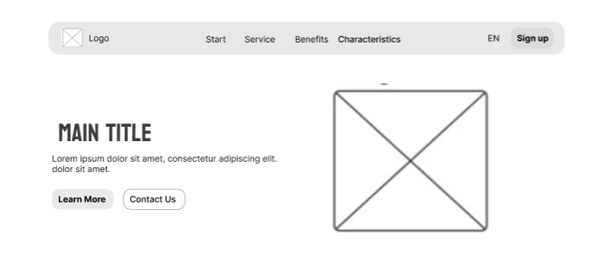
</p>


2. Sobre nosotros (About Us)  
**Wireframe:** Presenta un bloque con un título en la parte superior, un párrafo descriptivo al lado izquierdo y una ilustración colocada al lado derecho.  

<p align="center">
  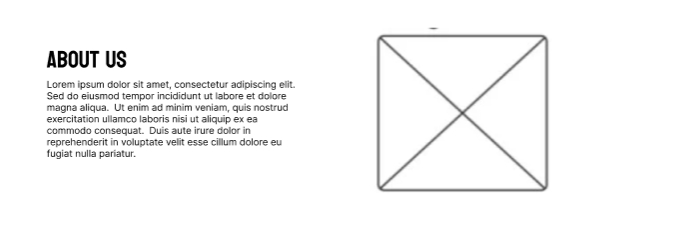
</p>

 3. Beneficios  
**Wireframe:** Se organiza en tres columnas, cada una con un icono en la parte superior, un título en el medio y una breve explicación en la parte inferior.  

<p align="center">
  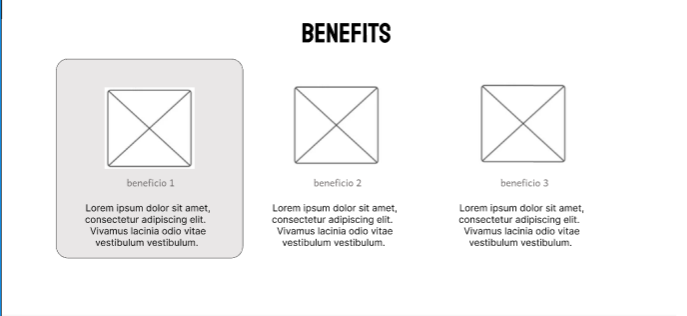
</p>

 4. Características  
**Wireframe:** Contiene tres bloques horizontales alineados, cada uno con un icono en la parte superior, seguido de un título y una descripción corta debajo.  

<p align="center">
  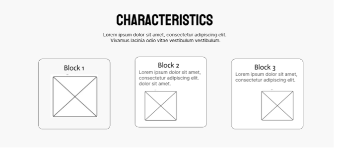
</p>


 5. Planes / Pricing  
**Wireframe:** Muestra tres tarjetas verticales organizadas en columnas, cada tarjeta incluye el nombre del plan, el precio en la parte superior, una lista breve de beneficios y un botón de selección al final.  

<p align="center">
  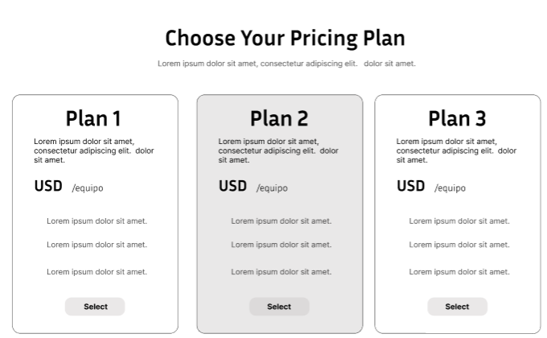
</p> 


 6. Equipo  
**Wireframe:** Se presenta en una cuadrícula de fotografías, debajo de cada foto se incluye el nombre y el rol de cada integrante del equipo.  

<p align="center">
  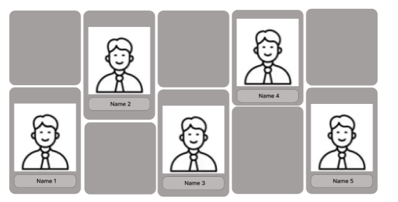
</p>


7. Formulario de contacto  
**Wireframe:** Incluye un bloque con un texto llamativo en la parte superior, un campo para ingresar el correo electrónico en el centro y un botón de envío al lado o debajo.  

<p align="center">
  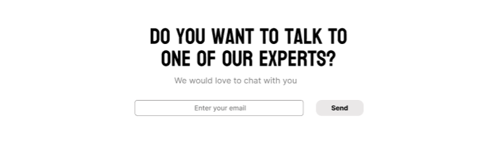
</p>


8. Footer  
**Wireframe:** Está dividido en tres partes: el logo de la marca, una lista de enlaces rápidos y los íconos de redes sociales.  

<p align="center">
  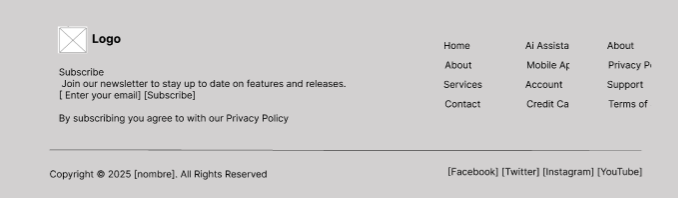
</p>

    
### 4.3.2. Landing Page Mock-up.

 1. Portada  
**Mockup:** Utiliza una foto de un técnico especializado inspeccionando tuberías de gas industriales con una tablet. El texto principal dice “Your safety under control, always in real time” y debajo el subheader: "An innovative platform that detects, monitors, and automates emergency responses to gas leaks and fire risks". Incluye dos botones: Demo y Contact us. 

<p align="center">
  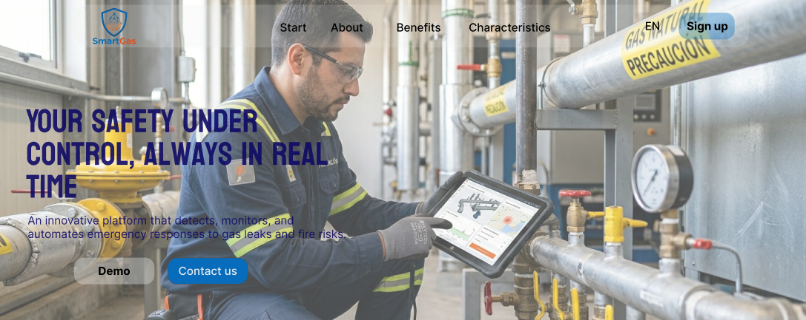
</p>  


 2. Sobre nosotros (About Us)  
**Mockup:** Presenta un párrafo que explica la misión de la empresa acompañado de una ilustración de personas trabajando frente a gráficos en el lado derecho.  

<p align="center">
  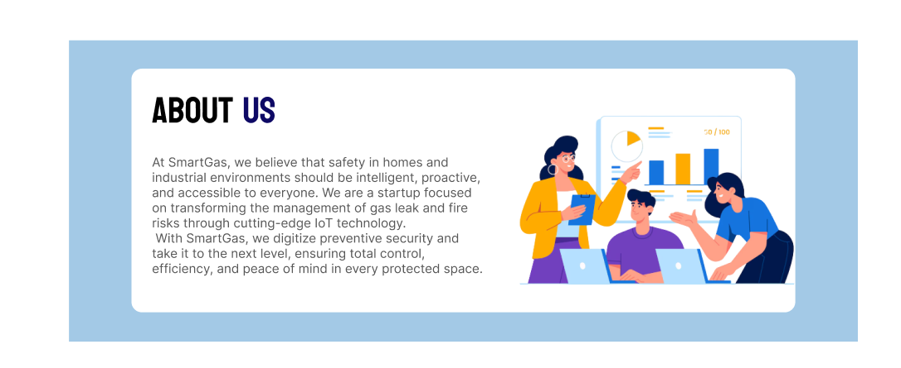
</p>  


3. Beneficios  
**Mockup:** Se destacan tres bloques con iconos tecnológicos y los textos: Automated Prevention, Real-time Monitoring e Instant Notifications. Cada bloque explica cómo la plataforma reduce el riesgo humano mediante el uso de IoT y alertas.

<p align="center">
  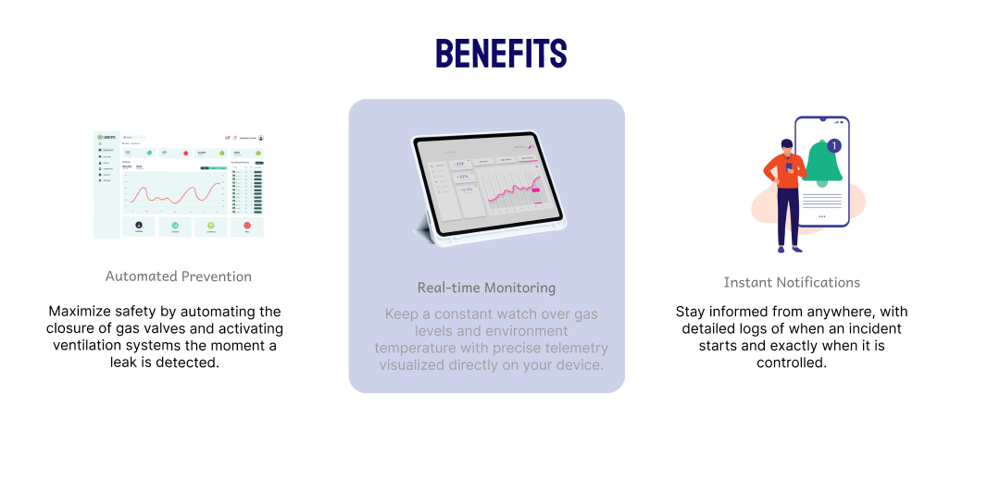
</p>  


 4. Características  
**Mockup:** Presenta tres bloques con los títulos: Smart Gas Detection (sensores de precisión), Automatic Shut-off (actuadores de válvulas) y Cloud Telemetry (sincronización en la nube). Cada uno con iconos descriptivos (sensores, engranajes/candados y nubes de datos).

<p align="center">
  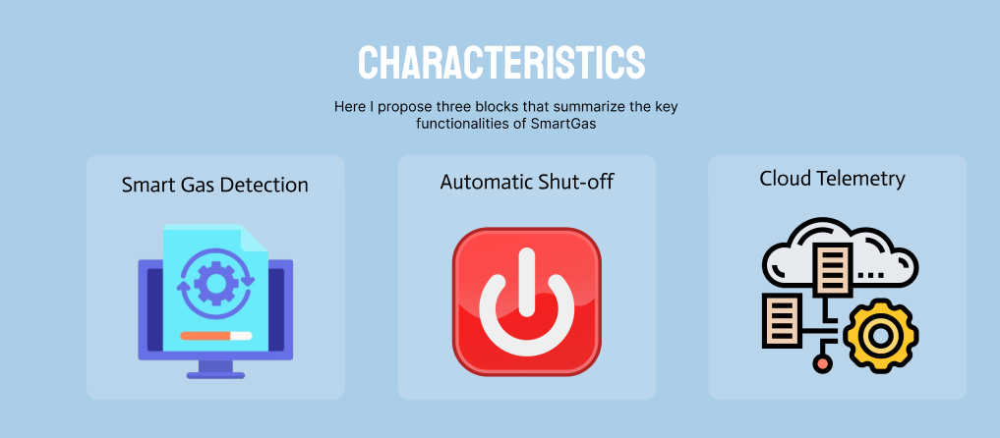
</p>  


5. Pricing  
**Mockup:** Se muestran tres tarjetas con diseño diferenciado. Los planes son *Basic (PEN 30)*, *Professional (PEN 70)* y *Corporate (PEN 100)*. Cada tarjeta incluye beneficios y un botón *Select*.  

<p align="center">
  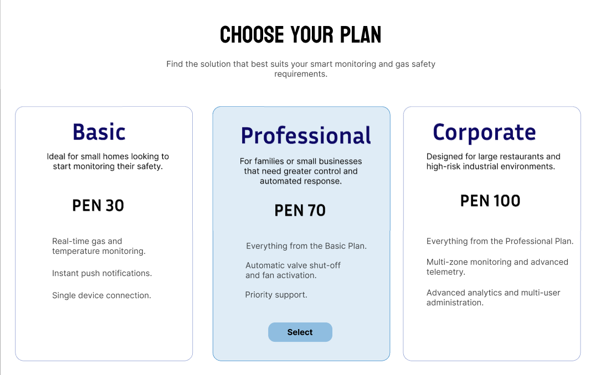
</p>  


 6. Equipo  
**Mockup:** Presenta cinco fotos de personas con sus nombres y roles: Desarrollador, Programador, Encargado, Analista y Diseñador.  

<p align="center">
  
</p>  


7. Formulario de contacto  
**Mockup:** Utiliza un fondo suave con el texto “CONNECT WITH US AND DISCOVER HOW TO ENHANCE YOUR SAFETY PROTOCOLS.”. Incluye un campo para ingresar el correo electrónico y un botón *Send*.  

<p align="center">
  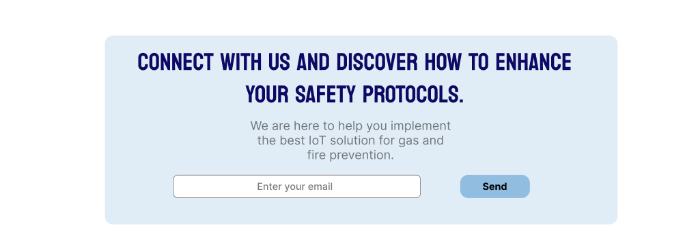
</p>  


 8. Footer  
**Mockup:** Muestra el logo oficial de SmartGas, enlaces como *Prices, Support, Terms and Conditions, Privacy Policy*, íconos de redes sociales (Facebook, Twitter, Instagram, YouTube) y la leyenda de copyright 2026.  

<p align="center">
  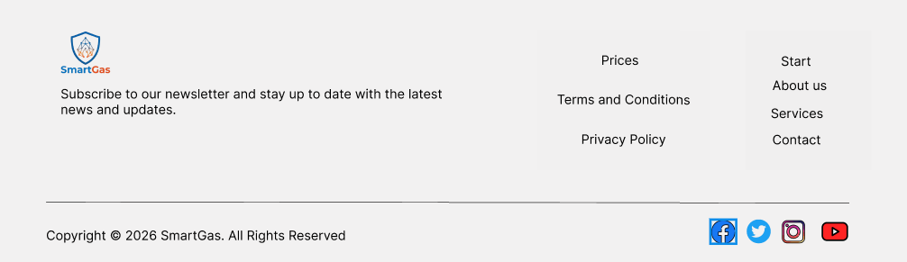
</p>  

    
## 4.4. Web Applications UX/UI Design.
    
### 4.4.1. Web Applications Wireframes.

Para la aplicación web de **SmartGas** se desarrollaron wireframes en versión **desktop** y **responsive móvil**, con el objetivo de representar la estructura base de cada pantalla, la jerarquía de la información y la adaptación del sistema a distintos tamaños de dispositivo. Estas propuestas evidencian la aplicación de principios de diseño como **jerarquía visual, alineación, proximidad, consistencia y visibilidad del estado del sistema**, así como criterios de **diseño inclusivo**, mediante textos claros, botones reconocibles, distribución ordenada de los elementos y navegación simplificada en pantallas pequeñas.

Asimismo, los wireframes mantienen coherencia con la **arquitectura de información** definida previamente. En las pantallas de monitoreo se prioriza una organización **jerárquica** para destacar alertas y estados críticos; en la vista de zonas se aplica una organización **espacial**, al agrupar la información por ambientes o sectores; en reportes se utiliza una estructura **cronológica** para el historial de incidencias; y en miembros se presenta una organización orientada a la **audiencia y gestión de usuarios**, facilitando el reconocimiento de roles y zonas asignadas.

#### 1. Inicio

**Wireframe Desktop:** Presenta una barra de navegación superior con accesos directos a los módulos principales de la plataforma, junto con el logo, selector de idioma y botón de registro. En la sección principal se ubican el título, una breve descripción, dos botones de acción y una imagen referencial. Esta distribución responde a una **jerarquía visual clara** y permite que el usuario identifique rápidamente la propuesta principal del sistema y sus rutas de navegación.

**Wireframe Mobile:** Reorganiza el contenido en una sola columna para facilitar la lectura vertical, reemplazando el menú horizontal por un ícono de hamburguesa. Los botones de acción se mantienen en tamaño visible y táctil, favoreciendo la interacción en dispositivos móviles. Esta adaptación demuestra un enfoque **responsive** y mejora la accesibilidad al reducir la sobrecarga visual y simplificar la navegación.

<p align="center">
  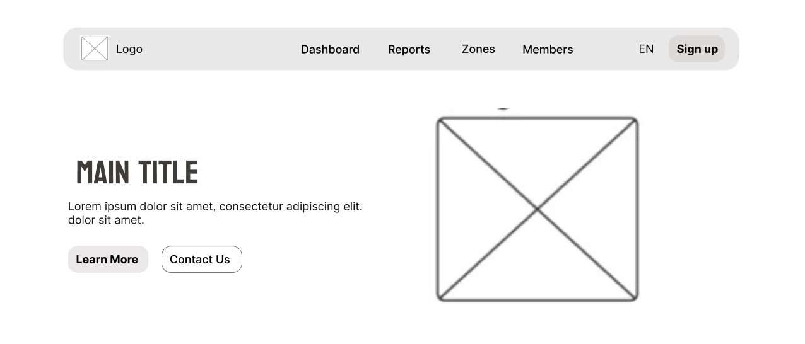
</p>

<p align="center">
  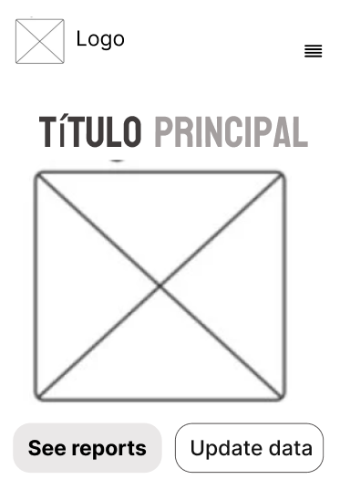
</p>

#### 2. Dashboard

**Wireframe Desktop:** El dashboard organiza la información crítica en tarjetas superiores que resumen el estado general del sistema, el nivel de gas, la temperatura y las alertas activas. Debajo, se incorpora una gráfica principal que permite visualizar el comportamiento de los sensores y sus límites de referencia. Esta pantalla aplica una organización **jerárquica**, ya que muestra primero los indicadores más importantes y luego amplía el detalle mediante visualizaciones.

**Wireframe Mobile:** Conserva la misma lógica informativa, pero apila las tarjetas en una sola columna para asegurar legibilidad y continuidad en la lectura. Esta solución refuerza el diseño inclusivo, ya que facilita la comprensión de los estados del sistema en pantallas pequeñas y permite identificar alertas sin depender únicamente de gráficos complejos o elementos decorativos.

<p align="center">
  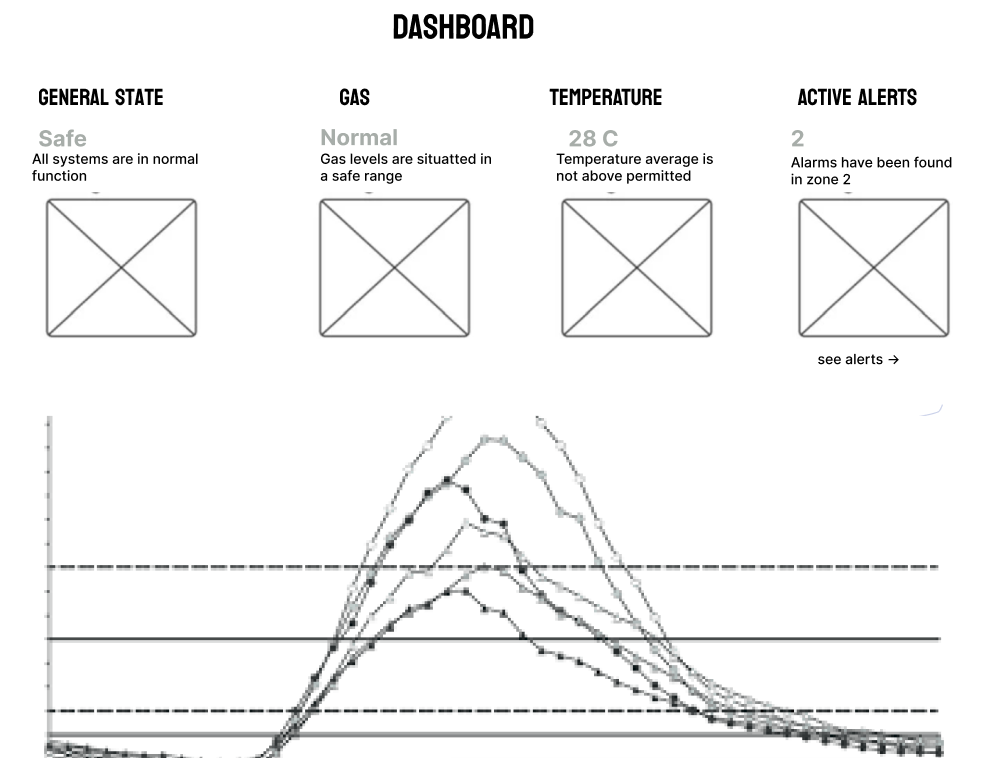
</p>

<p align="center">
  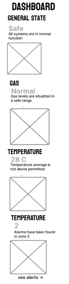
</p>

#### 3. Zones

**Wireframe Desktop:** La pantalla de zonas presenta primero un resumen general del número total de zonas, zonas seguras y sensores conectados, seguido de una representación visual del espacio monitoreado y tarjetas individuales para cada zona. En cada tarjeta se muestra el estado, la temperatura, el nivel de gas y un recurso visual complementario. Esta pantalla responde a una organización **espacial o geográfica**, ya que permite al usuario identificar rápidamente en qué zona ocurre una incidencia.

**Wireframe Mobile:** Mantiene la misma estructura conceptual, pero adapta los bloques a un flujo vertical. Las tarjetas resumen se muestran primero, seguidas del mapa o representación visual y luego las zonas individuales. Esta disposición facilita la exploración progresiva del contenido y mejora la accesibilidad móvil, ya que cada zona se analiza de forma separada sin saturar la interfaz.

<p align="center">
  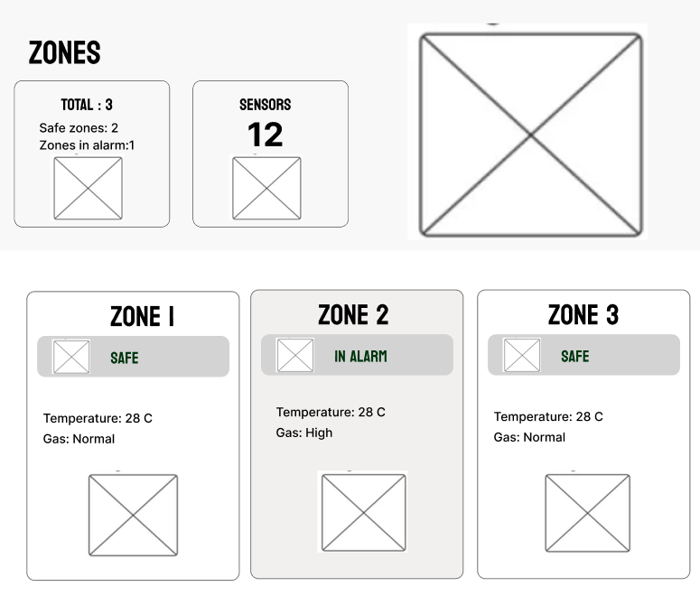
</p>

<p align="center">
  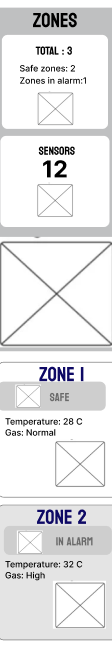
</p>

#### 4. Reports

**Wireframe Desktop:** La vista de reportes incluye un encabezado con el total de incidencias registradas, seguido de dos bloques gráficos para el análisis de tendencias y tipos de eventos. En la parte inferior se ubica una tabla con el historial de alertas, mostrando fecha, zona, evento, severidad y estado. Esta estructura evidencia una organización **cronológica y analítica**, ya que combina resúmenes visuales con un registro detallado de eventos para apoyar la toma de decisiones.

**Wireframe Mobile:** Reestructura los elementos en una sola columna, priorizando primero el total de incidencias y luego las gráficas, con el fin de conservar la claridad visual. La adaptación móvil reduce la complejidad del contenido sin perder la función informativa, permitiendo que el usuario consulte reportes desde un dispositivo pequeño de manera sencilla y ordenada.

<p align="center">
  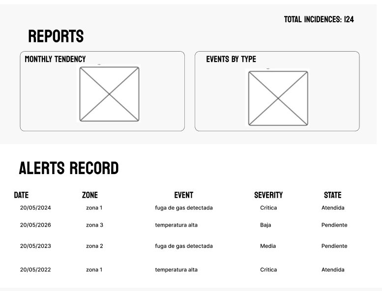
</p>

<p align="center">
  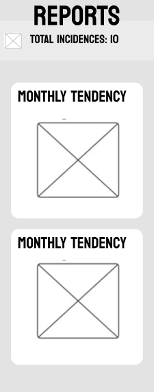
</p>

#### 5. Members

**Wireframe Desktop:** La pantalla de miembros muestra un listado de usuarios mediante tarjetas que incluyen imagen, nombre, rol, correo y zona asignada. En la parte inferior se incorpora un footer con enlaces complementarios, suscripción y elementos institucionales. Esta vista responde a una organización por **audiencia y gestión de usuarios**, ya que facilita la identificación rápida de cada integrante y su relación con una zona o función específica dentro del sistema.

**Wireframe Mobile:** El contenido se presenta en formato vertical, apilando la información de cada miembro para optimizar el espacio disponible. Esta decisión favorece la lectura continua y evita que los datos se compriman en exceso. Además, el uso de etiquetas textuales claras permite que la comprensión de la información no dependa de recursos visuales complejos, reforzando así el diseño inclusivo.

<p align="center">
  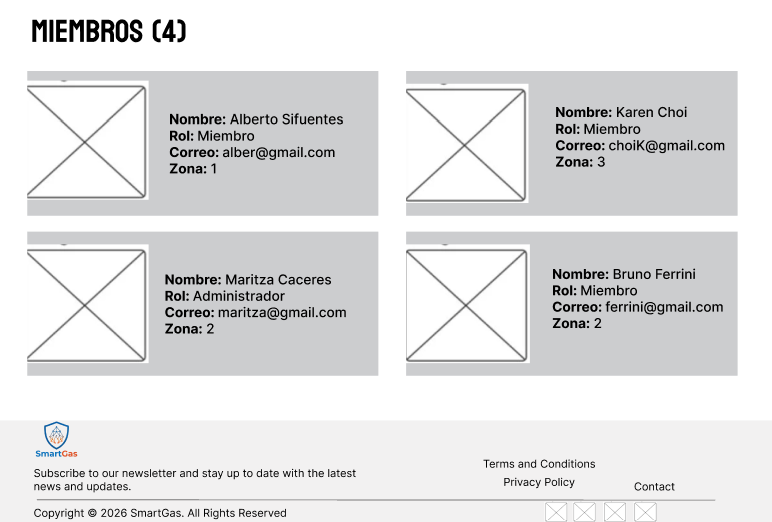
</p>

<p align="center">
  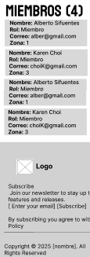
</p>

En conjunto, estos wireframes permiten validar la estructura inicial de la aplicación web de **SmartGas**, asegurando que la información crítica se presente con claridad, que la navegación sea consistente entre pantallas y que la experiencia pueda adaptarse correctamente a entornos **desktop** y **móviles**. De esta manera, la propuesta no solo responde a los objetivos funcionales del sistema, sino que también incorpora principios de usabilidad, accesibilidad y arquitectura de información desde las primeras etapas del diseño.
    
### 4.4.2. Web Applications Wireflow Diagrams.

En esta sección se presentan los **wireflow diagrams** de la aplicación web de **SmartGas**, elaborados a partir de los principales **user goals** identificados para los perfiles de usuario dentro del alcance del sistema. Cada wireflow integra wireframes y rutas de interacción para mostrar cómo evoluciona el estado de la interfaz en función de las acciones del usuario, evidenciando así la relación entre navegación, arquitectura de información y comportamiento esperado del sistema.

Estos diagramas permiten visualizar los pasos típicos que sigue el usuario para completar una tarea, así como los posibles cambios de estado en pantalla, por ejemplo, cuando un inicio de sesión falla, cuando existen alertas activas o cuando una zona se encuentra en estado crítico. De esta manera, los wireflows complementan los wireframes al representar no solo la estructura de las pantallas, sino también la lógica de interacción entre ellas.

#### 1. Wireflow del inicio de sesión a la plataforma

**User goal:** Como usuario, quiero iniciar sesión en la plataforma SmartGas para acceder al sistema de monitoreo.

**Explicación del flujo:**  
El flujo inicia en la **Landing Page**, donde el usuario identifica el acceso principal a la plataforma y selecciona la opción de registro o inicio de sesión. Luego es dirigido a la **pantalla de login**, donde ingresa sus credenciales. A partir de esta interacción, el sistema contempla dos posibles estados: si las credenciales son incorrectas, se muestra una **pantalla de error de login** con la indicación correspondiente; si las credenciales son correctas, el usuario accede al **inicio de la aplicación web**, desde donde puede ingresar al dashboard y al resto de módulos del sistema.

Este wireflow evidencia un flujo de navegación básico y esencial para el uso de la plataforma, así como la representación de un cambio de estado importante dentro de la interfaz: el paso exitoso o fallido de autenticación. Además, se aplican principios de claridad, retroalimentación inmediata y visibilidad del estado del sistema, ya que el usuario recibe una respuesta explícita según el resultado de su acción.

<p align="center">
  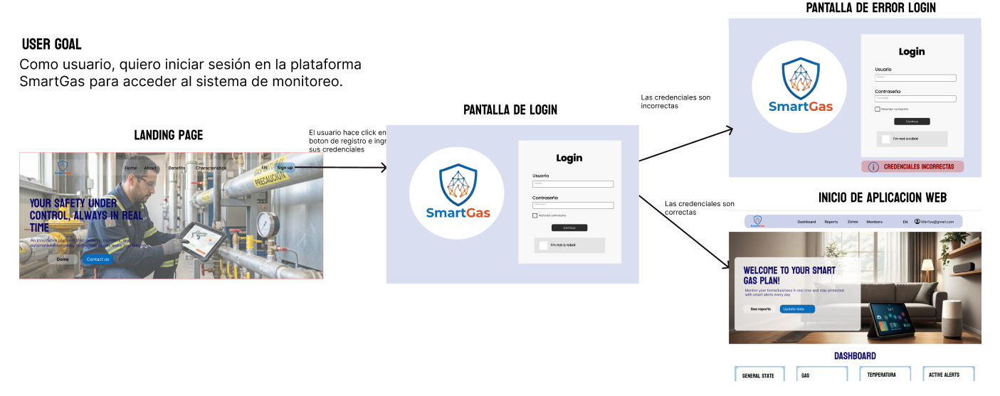
</p>

#### 2. Wireflow para revisar el estado de seguridad y alertas activas

**User goal:** Como usuario, quiero revisar el estado de seguridad para identificar niveles de gas, temperatura y alertas activas.

**Explicación del flujo:**  
El flujo comienza en la **sección Dashboard**, donde el usuario puede visualizar un resumen general del sistema mediante indicadores como estado general, nivel de gas, temperatura y cantidad de alertas activas. Desde esta pantalla, el usuario selecciona la opción para **ver alertas**, lo que lo dirige a la **sección Reports**, donde puede revisar tendencias, tipos de eventos y el historial registrado. Si dentro de esa vista detecta una alerta crítica, puede hacer clic sobre ella para acceder a la **sección Zonas**, donde se presenta el estado detallado de cada ambiente monitoreado.

Este wireflow evidencia una organización jerárquica de la información, ya que el sistema muestra primero una vista general y luego conduce al usuario hacia niveles de mayor detalle. Asimismo, se aprecia una organización espacial en la vista de zonas, donde el usuario puede identificar qué ambiente está comprometido. El flujo también refuerza la usabilidad al permitir una transición natural desde el monitoreo global hasta la localización específica del riesgo.

<p align="center">
  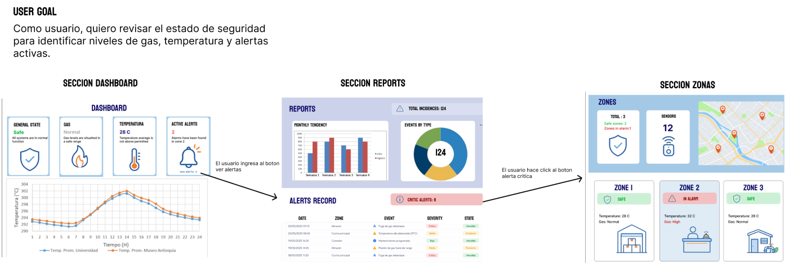
</p>

#### 3. Wireflow para consultar el historial de alertas del hogar

**User goal:** Como padre de familia, quiero consultar el historial de alertas de mi hogar para saber si hubo incidentes mientras no estaba en casa.

**Explicación del flujo:**  
Este flujo parte desde el **inicio de la aplicación web**, donde el usuario accede al sistema ya autenticado. Desde allí, puede ingresar a la sección de alertas y reportes. El diagrama muestra dos posibles estados: uno en el que el usuario entra y **existen nuevas alertas**, y otro en el que ingresa y **no hay nuevas alertas**. En ambos casos se visualiza la **sección Reports**, pero con diferencias en el estado de la interfaz según la presencia o ausencia de incidencias recientes. Finalmente, el usuario accede al **detalle de alertas**, donde puede revisar información más específica sobre fecha, zona, evento, severidad y estado, complementada con una vista resumida de zonas.

Este wireflow es importante porque demuestra cómo el sistema representa cambios de estado a partir de una misma pantalla base, lo cual responde directamente a la consigna de reflejar nuevas condiciones de interacción mediante wireframes adicionales. Además, el flujo se apoya en una organización cronológica de la información, ya que el historial de alertas se presenta como un registro útil para la supervisión del hogar y la toma de decisiones posteriores.

<p align="center">
  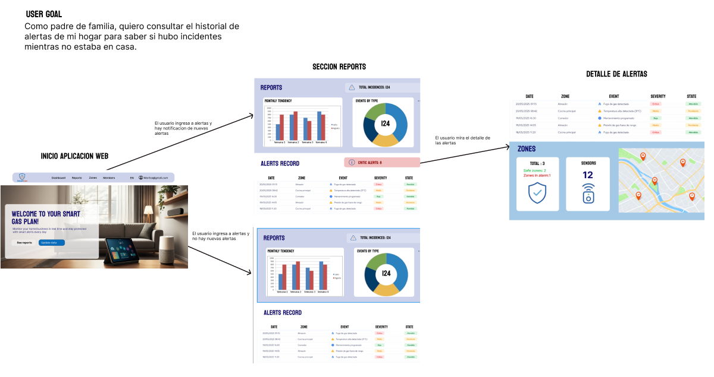
</p>

#### 4. Wireflow para revisar el estado de una zona específica

**User goal:** Como administrador de restaurante, quiero revisar el estado de una zona específica para verificar sus niveles de gas, temperatura y seguridad.

**Explicación del flujo:**  
El flujo inicia en el **inicio de la aplicación web**, desde donde el administrador accede a la **sección Zonas**. En esta parte del recorrido se muestran dos estados posibles: uno en el que **hay zonas en alerta** y otro en el que **no hay zonas en alarma**. Cuando existe una zona comprometida, el usuario continúa hacia el **panel de detalle de zonas**, donde puede visualizar el estado particular de cada ambiente, incluyendo temperatura, gas y condición general de seguridad. De este modo, el administrador identifica con rapidez cuál es la zona afectada y puede tomar acciones oportunas.

Este wireflow pone en evidencia la organización espacial de la información, ya que el sistema distribuye los datos por áreas o zonas monitoreadas. También demuestra el principio de visibilidad del estado del sistema, debido a que el usuario puede diferenciar claramente entre una zona segura y una zona en alarma. La presencia de variantes en el flujo según el estado operativo fortalece además la representación realista del comportamiento del sistema frente a distintos escenarios.

<p align="center">
  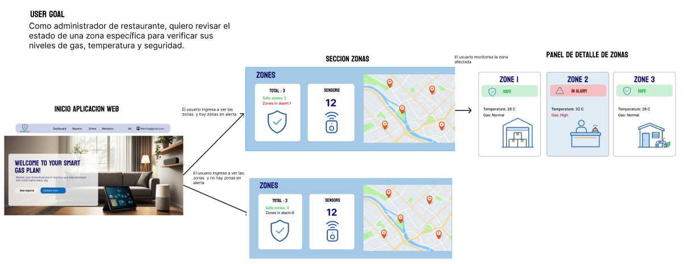
</p>

En conjunto, los wireflows de **SmartGas** permiten comprender cómo los usuarios interactúan con la aplicación web según sus objetivos principales, mostrando tanto las rutas típicas de navegación como los cambios de estado que se producen en la interfaz. Esto facilita validar tempranamente la experiencia de uso, asegurar coherencia con la arquitectura de información y comprobar que cada user goal cuenta con una secuencia lógica, clara y funcional dentro del sistema.
### 4.4.2. Web Applications Mock-ups.

En esta sección se presentan los **mock-ups** de la aplicación web de **SmartGas**, desarrollados a partir de los wireframes previamente definidos. A diferencia de los wireframes, estos mock-ups incorporan con mayor detalle los componentes visuales, la identidad de marca y la aplicación del **Design System** establecido para el producto digital, permitiendo representar de forma más cercana la apariencia final de la solución.

La propuesta evidencia la aplicación de principios de diseño como **jerarquía visual, consistencia, proximidad, alineación, contraste y visibilidad del estado del sistema**, así como criterios de **diseño inclusivo**, mediante el uso de textos legibles, botones con suficiente presencia visual, distribución clara de la información y adaptación responsiva a distintos tamaños de pantalla. Asimismo, se mantiene coherencia con la **arquitectura de información** del sistema, ya que las pantallas conservan una organización jerárquica para la información crítica, una organización espacial en la sección de zonas y una organización cronológica en la visualización de reportes e incidencias.

#### 1. Inicio

**Mock-up Desktop:** La pantalla de inicio presenta una barra de navegación superior con el logo, accesos directos a los módulos principales, selector de idioma y botón de registro. En la sección principal se destaca un título central, un breve texto descriptivo, botones de acción y una imagen representativa del entorno monitoreado. Esta composición refuerza la **jerarquía visual** y permite que el usuario identifique rápidamente la propuesta de valor de la plataforma.

**Mock-up Mobile:** En la versión móvil, la interfaz reorganiza los elementos en una sola columna y reemplaza el menú horizontal por un ícono de navegación. Los botones se mantienen amplios y visibles, facilitando la interacción táctil. Esta adaptación favorece la accesibilidad y la usabilidad, ya que simplifica la exploración del contenido sin perder consistencia respecto a la versión desktop.

<p align="center">
  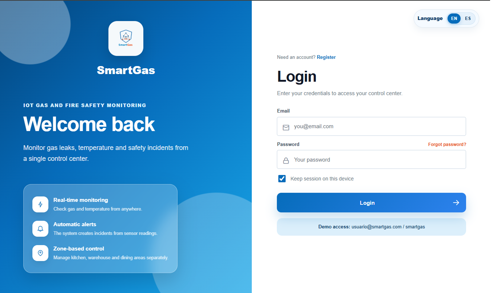
</p>

<p align="center">
  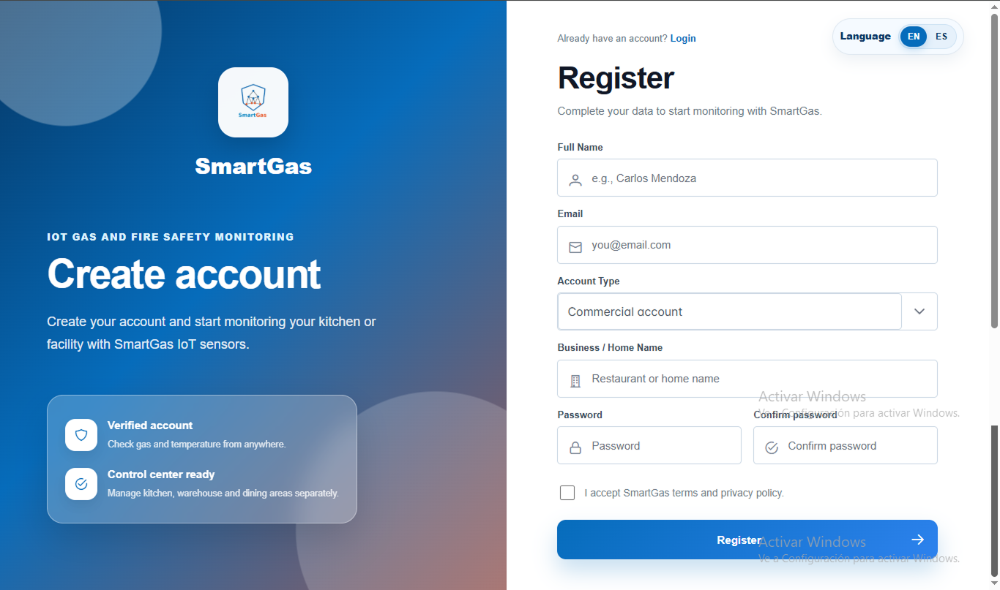
</p>

#### 2. Dashboard

**Mock-up Desktop:** El dashboard muestra tarjetas superiores con indicadores clave como el estado general, nivel de gas, temperatura y alertas activas. Debajo de estos elementos se incorpora una gráfica principal para visualizar el comportamiento de los sensores en el tiempo. Esta pantalla aplica una organización **jerárquica**, ya que prioriza primero la información crítica y luego amplía el detalle mediante visualizaciones complementarias.

**Mock-up Mobile:** En la versión móvil, las tarjetas se presentan en disposición vertical, facilitando una lectura progresiva y ordenada. La estructura mantiene la prioridad informativa del dashboard, permitiendo que el usuario consulte rápidamente los datos esenciales del sistema desde un dispositivo de menor tamaño. Esta adaptación mejora la comprensión del contenido y reduce la sobrecarga visual.

<p align="center">
  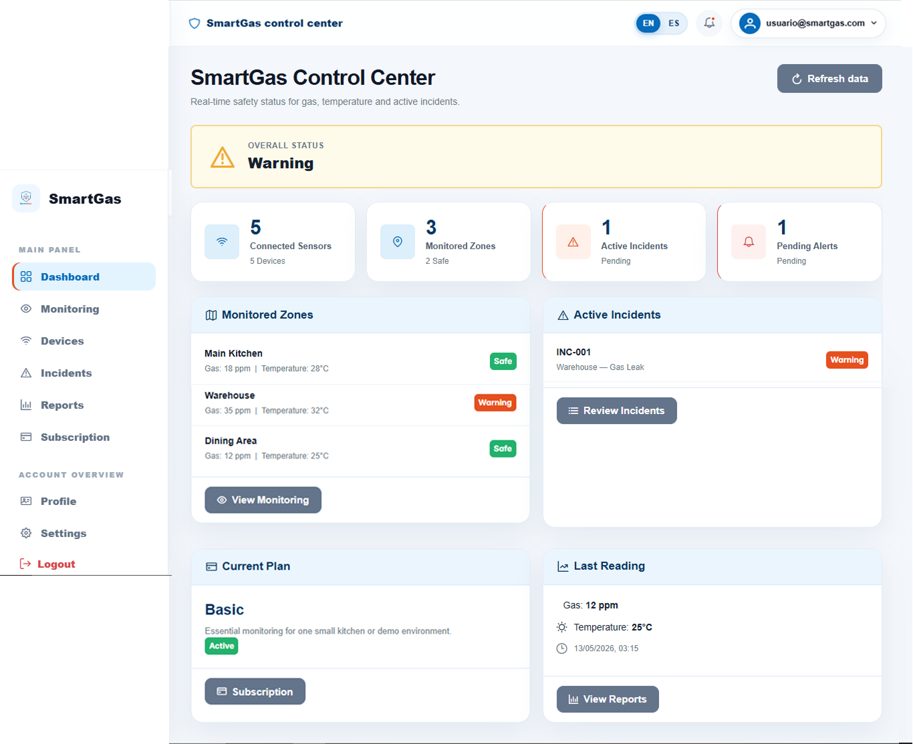
</p>

#### 3. Zones

**Mock-up Desktop:** La sección de zonas presenta un resumen inicial del número total de zonas, zonas seguras y sensores conectados, junto con una representación gráfica del espacio monitoreado. En la parte inferior se muestran tarjetas por cada zona, indicando su estado, temperatura y nivel de gas. Esta vista responde a una organización **espacial**, permitiendo identificar con claridad qué ambiente está comprometido y cuál se encuentra en condiciones seguras.

**Mock-up Mobile:** La versión móvil adapta esta misma lógica en un flujo vertical, donde primero se presentan los indicadores generales y luego las zonas individuales. Esta estructura mejora la exploración del contenido en pantallas pequeñas y facilita que el usuario analice cada ambiente por separado, reforzando la claridad de la información y la experiencia responsiva.

<p align="center">
  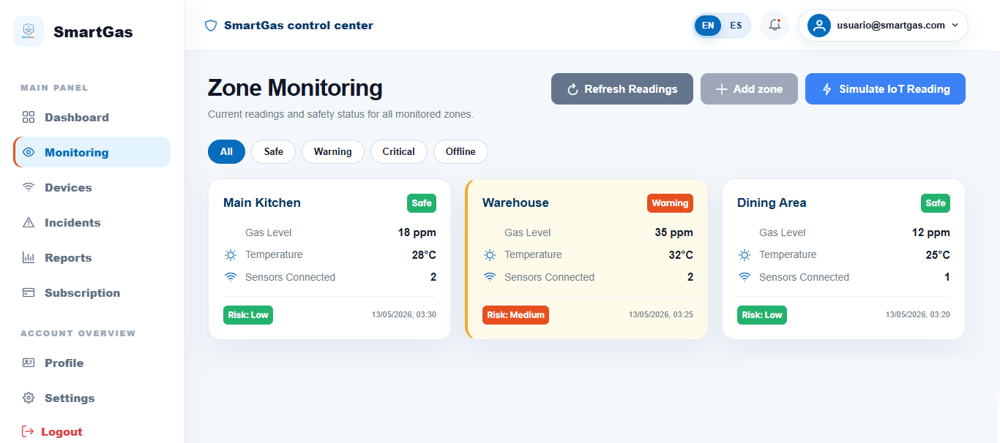
</p>


#### 4. Reports

**Mock-up Desktop:** La sección de reportes presenta un encabezado con el total de incidencias registradas, acompañado por visualizaciones orientadas al análisis de tendencias mensuales y clasificación de eventos. En la parte inferior se incorpora una tabla de historial de alertas con información detallada sobre fecha, zona, tipo de evento, severidad y estado. Esta estructura aplica una organización **cronológica y analítica**, útil para la toma de decisiones y el seguimiento de incidentes.

**Mock-up Mobile:** En la versión móvil, la información se reorganiza en bloques verticales para preservar la legibilidad y mantener la claridad de los datos. Las visualizaciones y resúmenes se presentan de forma simplificada, permitiendo que el usuario consulte indicadores relevantes desde un dispositivo pequeño sin perder coherencia con la estructura general del sistema.

<p align="center">
  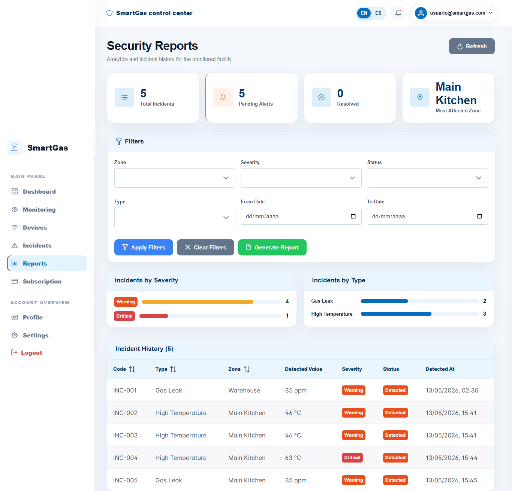
</p>

## 5. Subscription
Mock-up Desktop: El módulo de suscripción ofrece una vista clara de los planes de servicio, el ciclo de facturación y las funcionalidades activas de la cuenta. Mediante una interfaz limpia y estructurada, el usuario puede gestionar sus métodos de pago, visualizar el historial de transacciones y escalar los recursos del sistema según sus necesidades. El enfoque de esta sección es la transparencia y el control administrativo, garantizando una gestión sencilla de la escalabilidad del software.

<p align="center">
  
</p>

## 6. Devices
Mock-up Desktop: Este apartado está diseñado para la gestión integral del ecosistema de hardware. Presenta un inventario organizado mediante tarjetas o listados detallados que muestran el estado de conexión, nivel de batería y ubicación de cada sensor o nodo. La estructura facilita una administración centralizada y técnica, permitiendo realizar configuraciones remotas, diagnósticos preventivos y el registro de nuevos dispositivos de manera intuitiva y eficiente.

<p align="center">
  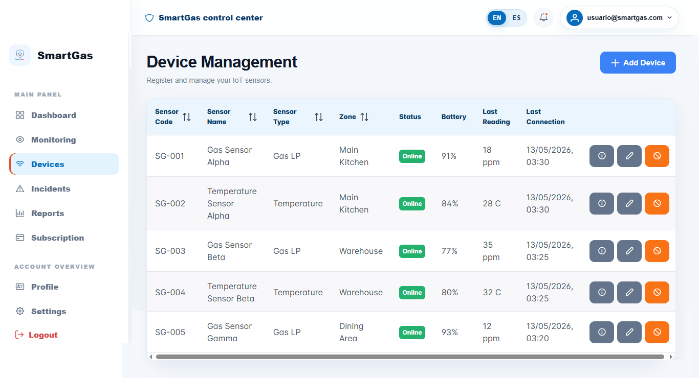
</p>


### 4.4.3. Web Applications User Flow Diagrams.

En esta sección se presentan los **User Flow Diagrams** de la aplicación web de **SmartGas**, elaborados a partir de los **wireflows** definidos previamente. Estos diagramas permiten representar de manera más completa la ruta esperada de interacción del usuario, incorporando tanto el **happy path** como las posibles rutas alternativas o **unhappy paths**, de acuerdo con los principales **user goals** del sistema. Asimismo, los flujos mantienen consistencia con la arquitectura de información propuesta, especialmente con la organización jerárquica de la información crítica, la organización espacial de las zonas monitoreadas y la navegación entre módulos principales como Dashboard, Reports, Zones y Members.

A diferencia de los wireflows, en los user flows se incluyen los **mock-ups de las pantallas**, lo que permite comprender con mayor claridad cómo evoluciona la experiencia del usuario durante la interacción real con la interfaz. De esta manera, no solo se representa la secuencia de pasos, sino también el estado visual de cada vista, favoreciendo la validación temprana de los recorridos principales y alternativos.

#### 1. User Flow del inicio de sesión y acceso al sistema

**User goal:** Como usuario, quiero iniciar sesión en la plataforma SmartGas para acceder al sistema de monitoreo.

**Explicación del flujo:**  
El flujo inicia en la **landing page**, desde donde el usuario selecciona la opción para ingresar o registrarse. Luego es dirigido a la pantalla de **sign up / login**, donde introduce sus credenciales. Si los datos son correctos, accede al **inicio de la aplicación web**, desde el cual puede navegar hacia el dashboard, reportes o zonas. Este recorrido representa el **happy path** del flujo, ya que conduce al acceso exitoso al sistema.

Como ruta alternativa, el sistema contempla el caso en el que el usuario ingresa credenciales incorrectas. En ese escenario, se muestra un mensaje de error y el usuario debe volver a intentar el ingreso. Esto evidencia un **unhappy path**, ya que el objetivo no se completa en el primer intento, pero el sistema ofrece retroalimentación inmediata y una ruta clara para continuar.

<p align="center">
  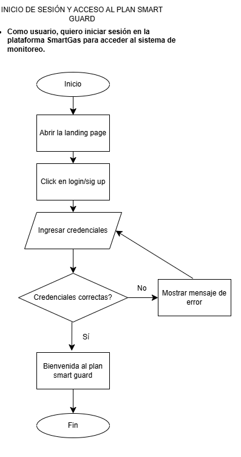
</p>

#### 2. User Flow para revisar el estado de seguridad

**User goal:** Como usuario, quiero revisar el estado de seguridad para identificar niveles de gas, temperatura y alertas activas.

**Explicación del flujo:**  
El flujo comienza en la pantalla de **Inicio**, desde donde el usuario accede al **Dashboard**. En esta vista puede revisar el estado general del sistema, los niveles de gas, la temperatura y la cantidad de alertas activas. Si detecta una incidencia o desea ampliar la información, continúa hacia la sección de **Reports**, donde puede observar tendencias y el registro de alertas. Posteriormente, puede acceder a la sección de **Zones** para ubicar la zona afectada y, finalmente, consultar el detalle de zonas específicas.

Este recorrido representa el **happy path**, ya que el usuario logra pasar de una vista general del sistema a una inspección más específica del entorno monitoreado. Como rutas alternativas, se consideran los casos en los que no se detectan anomalías o no existen alertas activas, situaciones en las que el usuario simplemente continúa con el monitoreo general sin profundizar hacia reportes o zonas críticas. Así, el flujo contempla tanto la supervisión normal como la exploración detallada ante una incidencia.

<p align="center">
  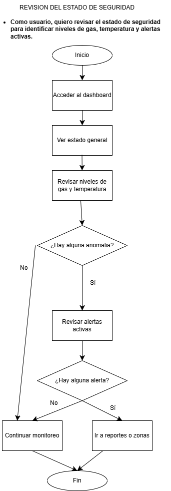
</p>

#### 3. User Flow para consultar el historial de alertas

**User goal:** Como padre de familia, quiero consultar el historial de alertas de mi hogar para saber si hubo incidentes mientras no estaba en casa.

**Explicación del flujo:**  
El flujo parte desde el **inicio de la aplicación**, desde donde el usuario accede a la sección de **alertas o reportes**. Si existe una alerta nueva, el sistema puede mostrar una notificación, luego permitir el acceso al **historial de alertas** y finalmente al **detalle de la alerta**. Esta es la ruta principal, ya que permite al usuario validar si ocurrió algún incidente y revisar información más específica sobre lo sucedido.

Como ruta alternativa, si no existe ninguna alerta nueva, el usuario no recibe una notificación adicional y continúa directamente con el monitoreo general del sistema. Esta bifurcación representa claramente la diferencia entre el **happy path**, donde sí se consulta el historial y el detalle de eventos, y un **unhappy path o camino alternativo**, donde no se presentan incidencias recientes y, por tanto, el recorrido se simplifica.

<p align="center">
  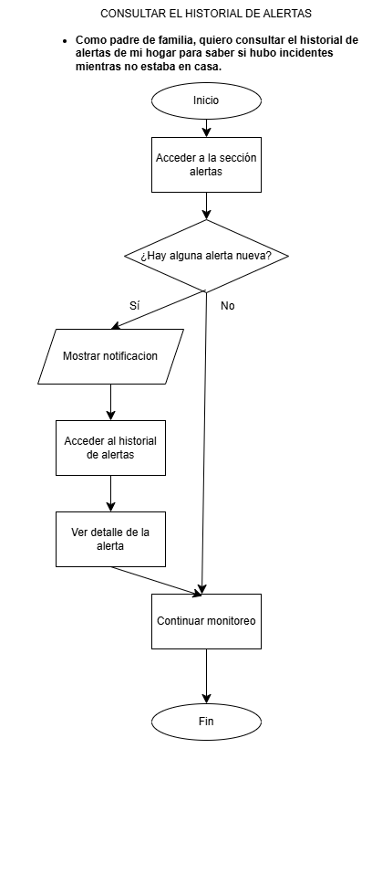
</p>

#### 4. User Flow para revisar el estado de una zona específica

**User goal:** Como administrador de restaurante, quiero revisar el estado de una zona específica para verificar sus niveles de gas, temperatura y seguridad.

**Explicación del flujo:**  
El flujo inicia cuando el usuario accede a la sección de **Zones**. Desde allí revisa el estado general de las zonas registradas y verifica si alguna de ellas presenta una condición de alerta. Cuando existe una zona comprometida, el sistema muestra la cantidad de zonas en alerta y permite ingresar al panel específico para monitorear la zona afectada. Este es el **happy path**, ya que el usuario consigue identificar rápidamente el área crítica y revisar su detalle.

Como ruta alternativa, si no existe ninguna zona en alerta, el sistema no obliga a profundizar en una zona específica y el usuario continúa con el monitoreo general. Esta estructura confirma la consistencia con el wireflow previo, ya que se mantienen tanto la vista general de zonas como la posibilidad de navegar hacia un detalle puntual solo cuando el estado operativo lo requiere.

<p align="center">
  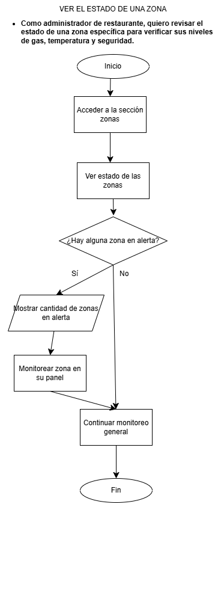
</p>
    
## 4.5. Web Applications Prototyping.

### 4.4.5. Web Applications Prototyping.

En esta sección se presentan los **prototipos de la aplicación web de SmartGas** para **Desktop Web Browser** y **Mobile Web Browser**, desarrollados con simulación de interacción y navegación de acuerdo con los recorridos definidos en los **User Flow Diagrams**. Estos prototipos permiten validar el comportamiento de la interfaz antes de la implementación, comprobando que las decisiones de interacción, navegación y jerarquía de información respondan adecuadamente a los objetivos de los usuarios.

La propuesta de prototipado se fundamenta en varios criterios de interacción. En primer lugar, se priorizó una **navegación clara y persistente**, de modo que el usuario pueda desplazarse entre los módulos principales del sistema sin perder contexto. En desktop, esto se refleja en una barra de navegación superior visible; mientras que, en mobile, se adapta a una estructura más compacta y optimizada para pantallas pequeñas. En segundo lugar, se buscó que las pantallas críticas, como **Dashboard, Reports y Zones**, mantengan una organización jerárquica que permita identificar primero la información más importante y luego acceder al detalle. Finalmente, se incorporaron decisiones de interacción orientadas a la **retroalimentación inmediata**, especialmente en acciones como el inicio de sesión, la revisión de alertas y la navegación hacia zonas específicas en estado de riesgo.

Estas decisiones se relacionan directamente con la **arquitectura de información** planteada en el proyecto. El sistema de navegación conecta las vistas principales de manera consistente, mientras que la organización de contenidos responde a distintos criterios: jerárquico en el dashboard, cronológico en reportes y espacial en la sección de zonas. De este modo, el prototipo no solo representa una interfaz visual, sino también una experiencia de uso coherente con la lógica funcional del sistema.

#### 1. Prototipo Desktop Web Browser

**Explicación del prototipo:**  
El prototipo desktop de **SmartGas** permite simular la navegación entre la landing page, el login, el dashboard, los reportes, las zonas monitoreadas y la gestión de miembros. La interacción está diseñada para que el usuario pueda seguir de forma intuitiva los recorridos principales del sistema, por ejemplo, iniciar sesión, revisar el estado general, consultar reportes y acceder al detalle de zonas críticas.

La versión desktop aprovecha mejor el espacio horizontal para mostrar más información en simultáneo, por lo que se refuerza la visualización comparativa de indicadores, gráficos y tarjetas por módulo. Esto favorece la supervisión rápida del sistema y resulta especialmente útil para usuarios que gestionan múltiples zonas o requieren un monitoreo más completo desde una computadora.

**Screenshot del video del prototipo Desktop:**

<p align="center">
  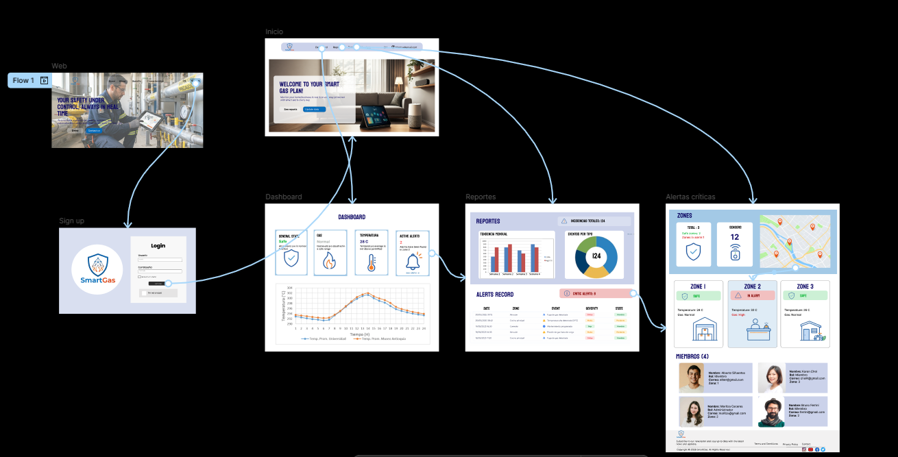
</p>

**Video del prototipo Desktop:**  
[Ver video del prototipo Desktop](https://youtu.be/MvH_wqlIlZI)

#### 2. Prototipo Mobile Web Browser

**Explicación del prototipo:**  
El prototipo mobile adapta los mismos flujos principales a una experiencia de uso táctil y vertical. En esta versión, los contenidos se reorganizan en una sola columna, priorizando la lectura progresiva y la facilidad de interacción en pantallas reducidas. Así, el usuario puede consultar el dashboard, revisar reportes, acceder a zonas y verificar alertas activas desde un dispositivo móvil, sin perder la lógica de navegación definida para la versión desktop.

El diseño mobile pone énfasis en la simplicidad, el tamaño adecuado de los elementos táctiles y la reducción de la carga visual. Esto mejora la accesibilidad y permite que la supervisión del sistema pueda realizarse en contextos de movilidad, manteniendo coherencia con la propuesta responsive del producto digital.

**Screenshot del video del prototipo Mobile:**

<p align="center">
  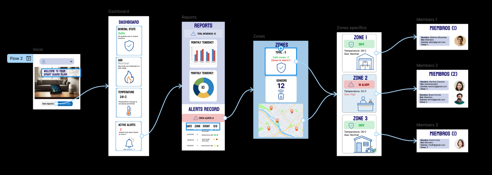
</p>

**Video del prototipo Mobile:**  
[Ver video del prototipo Mobile](https://youtube.com/shorts/6qwLEAbAWd8?feature=share)


## 4.6. Domain-Driven Software Architecture.
    
### 4.6.1. Design-Level EventStorming.

<div align="center">
  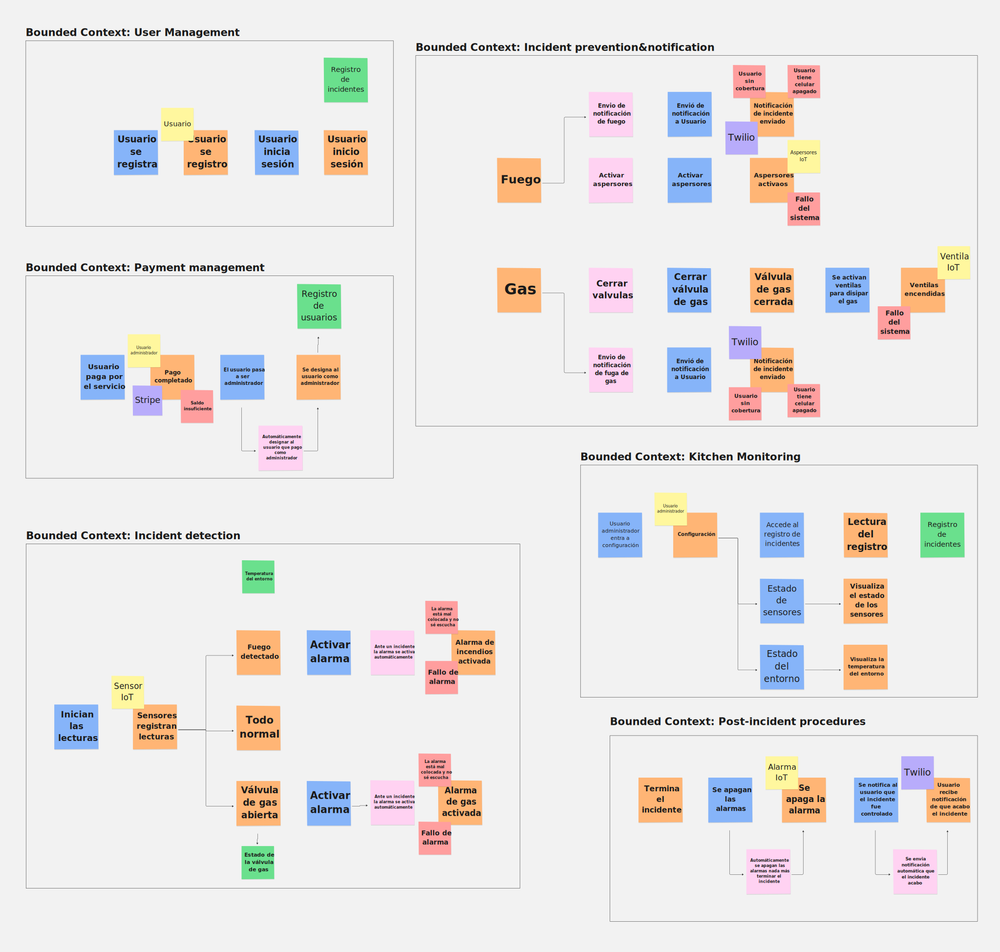
</div>
    
### 4.6.2. Software Architecture Context Diagram.

<div align="center">
  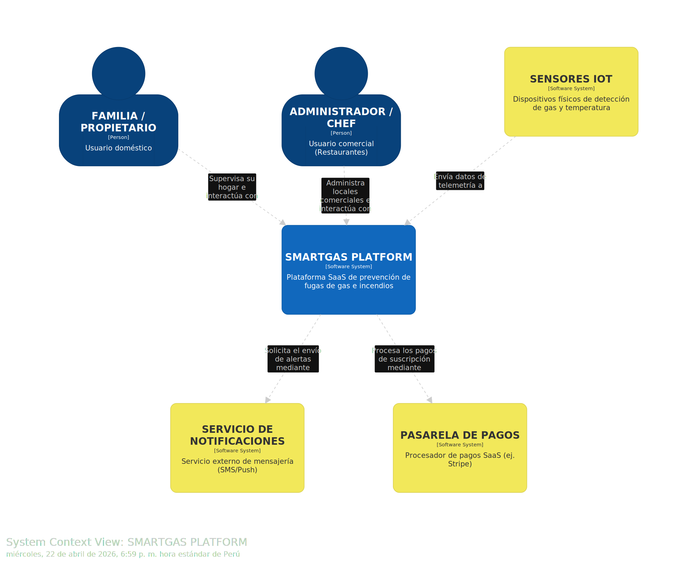
</div>
    
### 4.6.3. Software Architecture Container Diagrams.

<div align="center">
  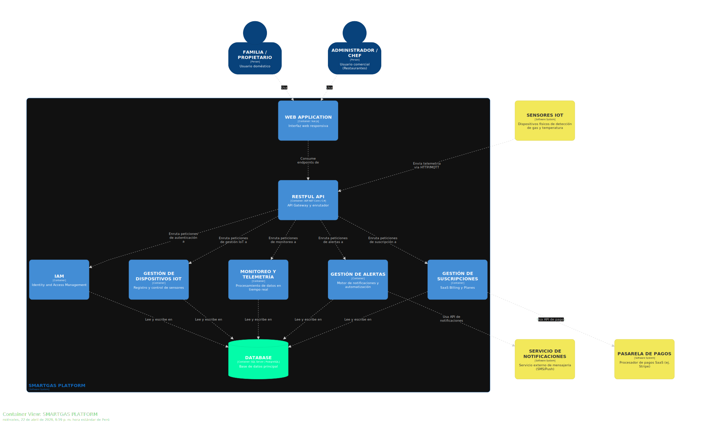
</div>
    
### 4.6.4. Software Architecture Components Diagrams.

<div align="center">
  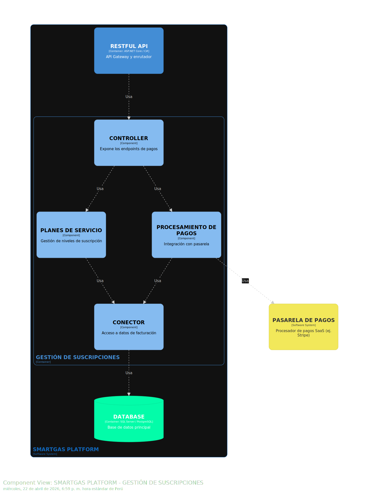
</div>

<div align="center">
  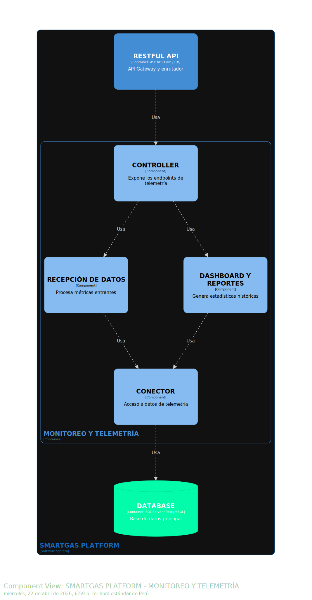
</div>

<div align="center">
  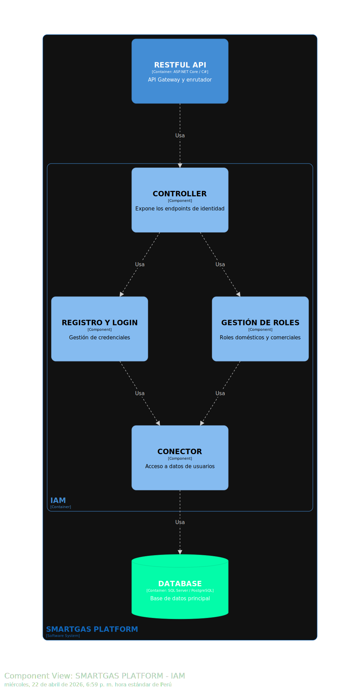
</div>

<div align="center">
  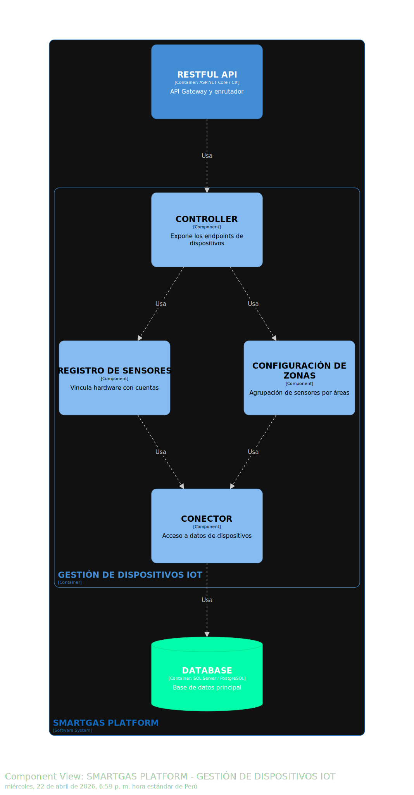
</div>

<div align="center">
  
</div>
    
## 4.7. Software Object-Oriented Design.
    
### 4.7.1. Class Diagrams.

<div align="center">
  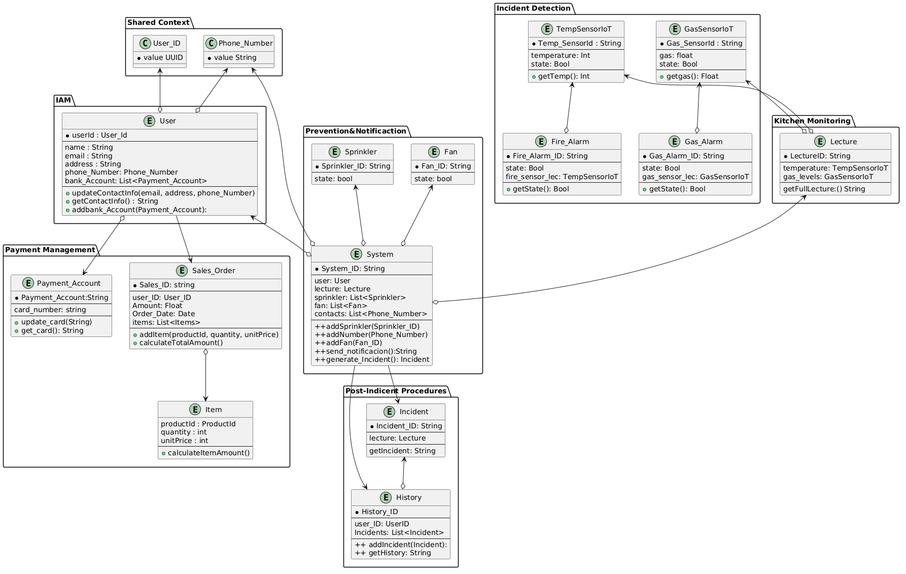
</div>

## 4.8. Database Design.
    
### 4.8.1. Database Diagrams.

<div align="center">
  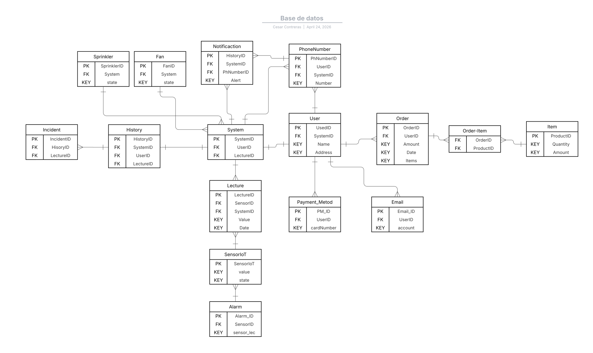
</div>

    
# Capítulo V: Product Implementation, Validation & Deployment
    
## 5.1. Software Configuration Management.
    
### 5.1.1. Software Development Environment Configuration.

En esta sección, se detallan los productos de software y herramientas utilizadas para el diseño, desarrollo y gestión del proyecto SmartGas.

**Producto UX/UI Design:**
* [Figma](https://www.figma.com/): Herramienta de diseño colaborativo utilizada para la creación de wireframes, maquetas de alta fidelidad y el diseño de la interfaz de usuario del dashboard de SmartGas.

* [UXPressia](https://uxpressia.com/): Herramienta empleada para el diseño estratégico, específicamente para la creación del Impact Mapping, Empathy Mapping y User Journey Mapping.

* [Miro](https://miro.com/): Plataforma de pizarra colaborativa usada para sesiones de lluvia de ideas, diagramación inicial y el desarrollo del EventStorming.

* [Lucidchart](https://lucid.app/): Aplicación de diagramación basada en la web utilizada para la creación de diagramas de flujo, procesos de negocio y mapas conceptuales del sistema.

* [Structurizr](https://structurizr.com/): Herramienta de modelado de software basada en el modelo C4, utilizada para documentar la arquitectura orientada a servicios (SOA) del sistema.

**Software Development:**
* [Visual Studio Code](https://code.visualstudio.com/): Editor de código fuente principal, ligero y extensible, utilizado para la programación del frontend y servicios de la plataforma.

* [PlantUML](https://plantuml.com/): Herramienta que permite crear diagramas de UML (casos de uso, clases, secuencias) a partir de lenguaje de texto plano, facilitando la documentación técnica del código.

* [HTML5](https://html.spec.whatwg.org/multipage/): Lenguaje de marcado utilizado para estructurar el contenido de la aplicación web y la landing page.

* [CSS3](https://developer.mozilla.org/es/docs/Web/CSS): Lenguaje de estilos para definir la identidad visual de SmartGas, asegurando un diseño responsivo y moderno.

* [JavaScript](https://developer.mozilla.org/es/docs/Web/JavaScript): Lenguaje de programación dinámico utilizado para añadir interactividad y gestionar la lógica de usuario en el frontend.

* [Jira](https://www.atlassian.com/es/software/jira): Herramienta líder en gestión de proyectos ágiles utilizada para el seguimiento de User Stories, gestión del backlog y control de los Sprints.

**Software Deployment:**
* [GitHub](https://github.com/): Plataforma de alojamiento de código basada en Git, utilizada para el control de versiones y la colaboración del equipo de desarrollo.
 
* [GitHub Pages](https://pages.github.com/): Servicio utilizado para el despliegue y alojamiento de la landing page del proyecto, permitiendo el acceso público a la propuesta de valor.

### 5.1.2. Source Code Management.

Para la gestión del código fuente de SmartGas, se utiliza GitHub como plataforma central. Se ha estructurado una organización que permite separar las responsabilidades del informe y del desarrollo del software.

* **Organización en GitHub:** https://github.com/upc-pre-2610-1ASI0730-12263-G2

* **Repositorio del informe:** https://github.com/upc-pre-2610-1ASI0730-12263-G2/SmartGas-report

* **Repositorio de la Landing Page:**
https://github.com/upc-pre-2610-1ASI0730-12263-G2/SmartGas-website

**Modelo de ramificación: GitFlow**
Se ha adoptado el modelo GitFlow para garantizar un flujo de trabajo ordenado. 

**Ramas del repositorio del informe:**

* **main:** Rama de producción que contiene la versión final y aprobada de cada entrega.

* **develop:** Rama de integración donde se consolidan los avances de cada capítulo antes de ser revisados.

* **feature/chapter-1:** Rama para el desarrollo del Capítulo I: Introducción.

* **feature/chapter-2:** Rama para el Capítulo II: Requirements Elicitation & Analysis.

* **feature/chapter-3:** Rama para el Capítulo III: Requirements Specification.

* **feature/chapter-4:** Rama para el Capítulo IV: Product Design.

* **feature/chapter-5:** Rama para el Capítulo V: Product Implementation, Validation & Deployment.

**Ramas del repositorio de la Landing Page:**

* **main:** Rama que contiene la versión estable y desplegada en GitHub Pages.

* **feature/portada:** Implementación de la sección principal con el mensaje de valor y botones de acción.
 
* **feature/about-us:** Desarrollo de la sección que detalla la misión de FireSecure.
 
* **feature/benefits:** Implementación de los bloques informativos sobre los beneficios del sistema.
 
* **feature/characteristics:** Desarrollo de las especificaciones técnicas y funcionalidades de los sensores.
 
* **feature/pricing:** Creación de las tarjetas de planes y suscripciones.
 
* **feature/members:** Desarrollo de la sección que presenta al equipo del proyecto.
 
* **feature/navigation:** Implementación de la barra de navegación y menús del sitio.
 
* **feature/contact:** Desarrollo del formulario de contacto para clientes potenciales.
 
* **feature/footer:** Implementación del pie de página con enlaces legales y redes sociales.

**Estilo de commits: Conventional Commits**
Para mantener un historial de cambios legible y estandarizado, el equipo aplica la convención de Conventional Commits. Cada commit debe empezar con un prefijo que describa el tipo de cambio:

* **feat:** Una nueva funcionalidad.
 
* **fix:** Corrección de errores o errores ortográficos en el reporte.
 
* **docs:** Cambios únicamente en la documentación o bibliografía.
 
* **style:** Cambios de formato (espaciado, tipografía, negritas) que no afectan el contenido.
 
* **refactor:** Reorganización de párrafos o secciones para mejorar la claridad sin añadir contenido nuevo.
    
### 5.1.3. Source Code Style Guide & Conventions.

**HTML**

Declarar siempre el tipo de documento en la primera línea.
Cerrar todos los elementos y mantener la correcta indentación.
Usar atributos entre comillas y en minúsculas.
Escribir comentarios cortos en una sola línea.
Incluir atributos alt, width y height en las imágenes para mejorar accesibilidad y disponibilidad del contenido.
Mantener un orden lógico en la estructura del documento (head, body, secciones).

**CSS**

Utilizar sangría de 2 espacios (evitar tabulaciones).
Escribir todo el código en minúsculas.
Eliminar espacios en blanco innecesarios.
Usar comentarios descriptivos para secciones importantes.
Definir nombres de clases significativos y consistentes.
Evitar el uso excesivo de !important.
Fuentes
    
**Fuentes**  
- [W3Schools - HTML5 Syntax](https://www.w3schools.com/html/html5_syntax.asp)  
- [Google HTML/CSS Style Guide](https://google.github.io/styleguide/htmlcssguide.html)  
    
### 5.1.4. Software Deployment Configuration.

El despliegue de la landing page se realiza utilizando GitHub Pages, un servicio que permite alojar sitios web estáticos de manera gratuita y accesible para cualquier usuario con una cuenta en GitHub. Este mecanismo resulta ideal para proyectos académicos y profesionales, ya que no requiere infraestructura adicional ni configuraciones complejas de servidores.  

### Landing page deployment  

Para asegurar que el despliegue se lleve a cabo correctamente, es necesario cumplir con ciertos requisitos iniciales: contar con una cuenta personal en GitHub, disponer de un repositorio en línea donde alojar los documentos y mantener una organización coherente de los archivos del proyecto. Una vez cumplidos estos aspectos, el procedimiento seguido es el siguiente:  

1. **Estructuración de archivos**: se organizan todos los elementos principales en la raíz del repositorio. Se respeta la nomenclatura estándar para facilitar la lectura y compatibilidad:  
   - `index.html` como página inicial.  
   - `styles.css` para la hoja de estilos.  
   - `main.js` como archivo de scripts y funciones básicas.  
   - Carpeta `assets/images` para almacenar imágenes y recursos gráficos.  

2. **Carga en el repositorio**: los archivos preparados se versionan mediante Git. A través de un commit se registran los cambios, y con el comando push se sincronizan con el repositorio remoto en GitHub. Esto garantiza control de versiones y permite rastrear cualquier modificación en el tiempo.  

3. **Configuración del despliegue**: en la sección **Settings → Pages** del repositorio se selecciona la rama principal (`main`) como fuente de publicación y se indica la carpeta raíz (root) como directorio base desde donde se servirán los archivos.  

4. **Procesamiento por GitHub Pages**: al guardar la configuración, GitHub inicia automáticamente la generación del sitio. Este proceso puede tardar algunos minutos y concluye con la creación de un enlace público.  

5. **Verificación del sitio**: se accede a la URL generada para comprobar que la landing page carga correctamente. En esta revisión se valida que los estilos de CSS se apliquen de forma adecuada, que los scripts de JavaScript funcionen sin errores y que todas las imágenes se visualicen desde la carpeta correspondiente.  

6. **Disponibilidad pública**: una vez confirmada la publicación, el sitio queda accesible en internet a través del enlace de GitHub Pages. Esto permite que cualquier usuario con el vínculo pueda consultar la landing page, facilitando su difusión y evaluación.  

De esta manera, el despliegue mediante GitHub Pages asegura que la landing page se encuentre publicada de forma sencilla, eficiente y sin necesidad de servidores adicionales, garantizando que el contenido esté disponible públicamente y pueda ser accedido en cualquier momento.  

## 5.2. Landing Page, Services & Applications Implementation.
    
## 5.2.1. Sprint 1
    
### 5.2.1.1. Sprint Planning 1.
| Sprint # | Sprint 1 |
| :--- | :--- |
| **Sprint Planning Background** | |
| **Date** | 2026-04-10 |
| **Time** | 09:00 AM |
| **Location** | Virtual (Discord) |
| **Prepared By** | Cesar Jair Contreras Rojas |
| **Attendees** | Cesar Jair Contreras Rojas / Gabriel Ferran Espinar Martínez / Briguite Eryka Carhuaz Centeno/ Camila Alizée Otiniano Rosales/ Valeria Alexandra Rojas Gomez|
| **Sprint n – 1 Review Summary** | No aplica por ser el primer sprint. |
| **Sprint n – 1 Retrospective Summary** | No aplica por ser el primer sprint.  |
| **Sprint Goal & User Stories** | |
| **Sprint 1 Goal** | **Our focus is on** developing the Landing Page and defining the backend architecture. **We believe it delivers** an official web presence and a technical roadmap **to** potential customers and the development team. **This will be confirmed when** the Landing Page is deployed and the database schema for sensor monitoring is finalized. |
| **Sprint 1 Velocity** | 25 Story Points |
| **Sum of Story Points** | 25 Story Points |
    
### 5.2.1.2. Aspect Leaders and Collaborators.
Para asegurar una comunicación efectiva y una ejecución organizada durante este primer Sprint, el equipo ha definido una matriz de Liderazgo y Colaboración (LACX). Los aspectos principales considerados en este Sprint se dividen en tres áreas críticas: 

1. **Web Presence (Landing Page):** Desarrollo del código frontend y diseño responsivo.
2. **System Architecture:** Definición de esquemas de base de datos y lógica de telemetría.
3. **Infrastructure:** Configuración de servicios y entornos de despliegue.

Cada aspecto cuenta con un líder responsable de la calidad final y colaboradores que apoyan en la implementación de las tareas.

### Leadership and Collaboration Matrix (LACX)

| Team Member (Last Name, First Name) | GitHub Username | Landing Page Development | Database & API Design | Cloud & DevOps Setup |
| :--- | :--- | :---: | :---: | :---: |
| Gabriel Ferran Espinar Martínez | zzZero14 | **L** | **C** | **L** |
| Cesar Jair Contreras Rojas | CesarJrCR | **C** | **L** | **C** |
| Briguite Eryka Carhuaz Centeno | briicarhuaz | **C** | **C** | **C** |
| Camila Alizée Otiniano Rosales | CamilaaAlizee | **C** | **C** | **C** |
| Valeria Alexandra Rojas Gomez | ValeriaAler | **C** | **C** | **C** |

**Leyenda:** **L**: Leader / **C**: Collaborator
    
### 5.2.1.3. Sprint Backlog 1.
El objetivo de este primer Sprint es doble: por un lado, iniciar la presencia digital de **SmartGas** mediante la codificación y despliegue de la Landing Page; y por otro lado, establecer los cimientos técnicos (base de datos y formatos de telemetría) que permitirán el desarrollo de la aplicación web en los siguientes sprints.

**Board del Sprint 1 (Jira):**


### Tabla de Control de Estado para el Sprint 1

| User Story | | Work-Item / Task | | | | | |
| :--- | :--- | :--- | :--- | :--- | :--- | :--- | :--- |
| **Id** | **Title** | **Id** | **Title** | **Description** | **Estimation (Hours)** | **Assigned To** | **Status (To-do / In-Process / To-Review / Done)** |
| US-21 | Visualizar dashboard principal | T-01 | Landing Page Frontend | Codificación de la estructura HTML y estilos CSS de la Landing Page. | 10 | Todos | Done |
| US-21 | Visualizar dashboard principal | T-02 | Responsive Design | Adaptación de la Landing Page para dispositivos móviles (Media Queries). | 6 | Todos | Done |
| US-29 | Registrarse en el sistema | T-03 | Database Schema | Diseño y creación de las tablas de usuarios y perfiles en la base de datos. | 4 | Cesar | Done |
| TS-02 | API Telemetría | T-04 | JSON Data Structure | Definición del formato de intercambio de datos (JSON) para gas y temperatura. | 6 | Briguite | To-do |
| TS-06 | API Usuarios | T-05 | Auth Logic Design | Diseño de la lógica de autenticación y flujo de tokens para el acceso. | 5 | Camila | To-do |
| CG-01 | Constraint General | T-06 | GitHub/Deployment Setup | Configuración del repositorio de la organización y hosting para la Landing Page. | 3 | Gabriel | Done |
    
    
### 5.2.1.4. Development Evidence for Sprint Review.

| Repository                                      | Branch                                          | Commit Id                                   | Commit Message                                           | Commit Message Body                                                                                                                                                 | Committed on (Day) |
|-------------------------------------------------|-------------------------------------------------|---------------------------------------------|----------------------------------------------------------|--------------------------------------------------------------------------------------------------------------------------------------------------------------------|-------------------|
| **Landing Page Repository**                     |                                                 |                                             |                                                          |                                                                                                                                                                    |                    |
| upc-pre-2610-1ASI0730-12263-G2/SmartGas-website                         | main                                 | ea113926521401c4ecd69030da149fe4a96d7154     | assets: add images to images folder                            | Added the images of the landing page.                                                                                                    | 19/04/2026         |
| upc-pre-2610-1ASI0730-12263-G2/SmartGas-website                         | feature/about-us                                 | 9ed196d3e709461b9da437f5355f134da8aee156     | feat: add about us html section    |    Added the html code for about us                                                                          | 19/04/2026     |
| upc-pre-2610-1ASI0730-12263-G2/SmartGas-website                         | feature/about-us                                | ab98052b6cb5c8984fd4ff11e2f08a7d58d5d5d1     | feat: add about us css section                                |  Added the css code for about us                                                                                                        | 19/04/2026       |
| upc-pre-2610-1ASI0730-12263-G2/SmartGas-website                         | feature/benefits                                | 0fe5cdb31d09b9d77d0ef15ec1cdd2e4efbc466a     | feat: add benefits and features html sections        | Added the html code of benefits and features                                                                                                       | 19/04/2026         |
| upc-pre-2610-1ASI0730-12263-G2/SmartGas-website                        | feature/benefits                                  | cd12a9814fb0de32eafd55bb9e160ac6ce0bc3af     | feat: add benefits html sections          | Added html code for benefits section.                                                                                                        | 19/04/2026         |
| upc-pre-2610-1ASI0730-12263-G2/SmartGas-website                       | feature/benefits                                  | 07968355b87f56a676863b23c60def1a51e196e5     | feat: add benefits css sections                  | Added css code of benefit section.                                                   | 19/04/2026         |
| upc-pre-2610-1ASI0730-12263-G2/SmartGas-website                       | feature/characteristics                                  | 774c815e04b8148477dc3cc1792cc558abaa465c     | feat: add characteristics html sections                   | Added html code for characteristics section                                                                                                | 19/04/2026        |
| upc-pre-2610-1ASI0730-12263-G2/SmartGas-website                        | feature/chareacteristics                              | cd857fc325e4fedb22bdae3dedb47fbe69225738     | feat: add characteristics css sections        | Added css code of characteristics section.                                                                        | 19/04/2026         |
| upc-pre-2610-1ASI0730-12263-G2/SmartGas-website                        | feature/contact                              | 966efefee8bffb3144bfa79b9370060479b85db8     | feat: add contacto html sections  | Added html code of contact section.    | 19/04/2026     |
| upc-pre-2610-1ASI0730-12263-G2/SmartGas-website                        | feature/contact                              | 39e96611d010d1023b07c95bbe13f191ecf6ca0b     | feat: add contacto css sections  | Added contact css code.    | 19/04/2026     |
| upc-pre-2610-1ASI0730-12263-G2/SmartGas-website                        | feature/extra                              | ee01c356d7b0098daf287b5cca1c76e684bf1312     | feat: add responsive design css sections  | Added css code for responsive design.    | 19/04/2026     |
| upc-pre-2610-1ASI0730-12263-G2/SmartGas-website                        | feature/footer                              | af612aedc19bdcb6d2d0ed2bf2d9f5b75bcca516     | feat: add footer html sections  | Added html code of footer section.    | 19/04/2026     |
| upc-pre-2610-1ASI0730-12263-G2/SmartGas-website                        | feature/footer                              | f7ed5b948169a9e63b864cdddc14d56d28ee20df     | feat: add footer css sections  | Added css code of footer section.    | 19/04/2026     |
| upc-pre-2610-1ASI0730-12263-G2/SmartGas-website                        | feature/members                              | f53e1584c85f44b56380b9d66fa8958c5edee814     | feat: add team section with member details  | Added html code of team members section.    | 19/04/2026     |
| upc-pre-2610-1ASI0730-12263-G2/SmartGas-website                        | feature/members                              | 1034ce383a9da41fa92758977e68917b032cfa23     | feat: add styles for team section and cards  | Added css code of team members section.    | 19/04/2026     |
| upc-pre-2610-1ASI0730-12263-G2/SmartGas-website                        | feature/navigation                             | 7899a03e414632153689b727b734410a43f67f8b     | feat: add navigation html sections  | Added html code of navigation section.    | 19/04/2026     |
| upc-pre-2610-1ASI0730-12263-G2/SmartGas-website                        | feature/navigation                            | 1034ce383a9da41fa92758977e68917b032cfa23     | feat: add navigation css sections  | Added the css code of navigation section.    | 19/04/2026     |
| upc-pre-2610-1ASI0730-12263-G2/SmartGas-website                        | feature/portada                              | 1034ce383a9da41fa92758977e68917b032cfa23     | feat: add portada html sections  | Added the html code of portada.    | 19/04/2026     |
| upc-pre-2610-1ASI0730-12263-G2/SmartGas-website                        | feature/portada                              | 036ff20f7d1dd207849066ddb0433e7aecda31b5     | feat: add front page css section  | Added front page css section..    | 19/04/2026     |
    
### 5.2.1.5. Execution Evidence for Sprint Review.

Durante este Sprint, el equipo logró implementar la versión inicial del Landing Page funcional, rápido y estático, incluido el sistema de idiomas.

La sección principal de la Landing page nos presenta el titulo, subtitulo, descripción del producto y llamados a la acción (CTA) los cuales guian al visitante hacia el registro o a la sección de más información.


En está sección el usuario puede ver cuales son nuestros valores como empresa, sobre que trata nuestro producto y con que fin lo estamos desarrollando.


En está sección se muestra de forma detallada que es lo que ofrecemos a los usuarios y las caracteristicas importantes de SmartGas.


En está sección se puede apreciar los planes que ofrecemos y cual es el costo de cada uno de ellos. Los precios son presentados mediante tarjetas visuales que indican las caracteristicas de cada plan.


Está sección nos muestra a todos los integrantes del equipo SmartGuard mediante cards visuales las caules contienen una foto de cada uno de los integrantes acompañada de una pequeña descripción.


En está sección el usuario puede colocar sus datos para contactarse con nosotros.


Es el footer de landing page se puede ver nuestro logo, el copyright y un apartado en donde el usuario puede colocar su correo para registrarlo.


    
### 5.2.1.6. Services Documentation Evidence for Sprint Review.

N/A. Durante el Sprint 1 el esfuerzo de desarrollo se enfocó exclusivamente en la creación del sitio web estático promocional (Landing Page), por lo que aún no se han implementado APIs RESTful ni Endpoints que requieran documentación con Swagger/OpenAPI. Esta documentación se generará a partir del Sprint 3.
    
### 5.2.1.7. Software Deployment Evidence for Sprint Review.

Para el despliegue continuo (CI/CD) de este Sprint, se configuró el entorno de GitHub Pages conectado directamente al repositorio de GitHub del Landing Page estático, permitiendo publicaciones automáticas y ultra-rápidas con cada PR fusionado en la rama main.

|Aspecto       |Detalle         |
|--------------|----------------|
|Plataforma de despliegue|GitHub Pages|
|Repositorio|[SmartGuard-Website](https://github.com/upc-pre-2610-1ASI0730-12263-G2/SmartGas-website)|
|URL Landing Page|https://upc-pre-2610-1asi0730-12263-g2.github.io/SmartGas-website/ |
|Rama de despliegue|main|
|Fecha de despliegue|24/04/2026|
|Estado Actual|	Desplegado y Funcional|
|Tipo de Sitio|Sitio Web Estático (HTML, CSS, JavaScript)|
|HTTPS|Habilitado (Certificado SSL automático)|

Proceso de Despliegue Detallado
El proceso de despliegue se realizó siguiendo los siguientes pasos:

#### Paso 1: Preparación del Repositorio

Se configuró el repositorio del Landing Page en GitHub con la estructura completa de archivos
Se organizaron los archivos HTML, CSS, JavaScript y assets en carpetas apropiadas
Se aseguró que todos los archivos estuvieran en la rama main
#### Paso 2: Configuración de GitHub Pages

Se accedió a la configuración del repositorio en GitHub
Se habilitó GitHub Pages en la sección "Pages" de la configuración
Se seleccionó la rama main como fuente del sitio.
#### Paso 3: Generación de la URL

GitHub Pages generó automáticamente la URL del sitio
La URL sigue el formato: "https://[organizacion].github.io/[nombre-repositorio]/"

#### Paso 4: Verificación del Despliegue

Se verificó que el sitio estuviera accesible en la URL proporcionada
Se comprobó que el certificado SSL estuviera activo (HTTPS)
Se validó que todos los recursos se cargaran correctamente
#### Paso 5: Validación de Funcionalidad Se realizaron pruebas exhaustivas para verificar que todas las funcionalidades del Landing Page funcionaran correctamente:

Navegación entre secciones: Todos los enlaces del menú funcionan correctamente
Diseño responsive: El sitio se adapta correctamente a diferentes tamaños de pantalla (mobile, tablet, desktop)
Carga de imágenes y assets: Todas las imágenes y recursos se cargan sin errores
Funcionalidad de enlaces y botones: Todos los botones y enlaces son funcionales
Estilos CSS aplicados: Los estilos se aplican correctamente en todas las secciones
Rendimiento: El sitio carga rápidamente y sin errores en la consola
Compatibilidad de navegadores: Se probó en Chrome, Firefox, Safari y Edge

### 5.2.1.8. Team Collaboration Insights during Sprint.


## 5.2.2. Sprint 2 

### 5.2.2.1. Sprint Planning 2. 

| Sprint # | Sprint 2 |
| :--- | :--- |
| **Sprint Planning Background** | |
| **Date** | 2026-05-13 |
| **Time** | 10:00 AM |
| **Location** | Virtual (Discord) |
| **Prepared By** | Cesar Jair Contreras Rojas |
| **Attendees** | Cesar Jair Contreras Rojas / Gabriel Ferran Espinar Martínez / Briguite Eryka Carhuaz Centeno/ Camila Alizée Otiniano Rosales/ Valeria Alexandra Rojas Gomez|
| **Sprint n – 1 Review Summary** | During Sprint 1, the team successfully delivered the Landing Page and completed the initial setup of the development environment. |
| **Sprint n – 1 Retrospective Summary** |The team agreed that communication and task assignment worked efficiently through Discord. However, they identified the need to improve time estimation for user stories and maintain more consistent documentation updates across all modules.  |
| **Sprint Goal & User Stories** | |
| **Sprint 2 Goal** |Deliver the foundational components of the SmartGas platform by designing and deploying a fully functional and responsive web interface that effectively communicates the IoT safety solution's value proposition and facilitates seamless user authentication and real-time alert monitoring. |
| **Sprint 2 Velocity** | 25 Story Points |
| **Sum of Story Points** | 25 Story Points |

### 5.2.2.2. Aspect Leaders and Collaborators. 

En esta sección se presenta la distribución de roles y responsabilidades del equipo durante el Sprint 2, identificando a los líderes (L) y colaboradores (C) para cada aspecto de trabajo colaborativo. Esta distribución permite una organización efectiva del trabajo y asegura que cada aspecto crítico del proyecto tenga un responsable que guíe y coordine las actividades relacionadas.

La asignación de líderes se realizó considerando las fortalezas y experiencia de cada miembro del equipo, así como sus intereses y disponibilidad. Los colaboradores trabajan de manera coordinada con los líderes para asegurar que todos los aspectos del proyecto reciban la atención necesaria y que el trabajo se desarrolle de manera eficiente y colaborativa.

<table border="1" cellspacing="0" cellpadding="8" style="border-collapse:collapse; width:100%; text-align:center; font-family:Arial; font-size:11px;">
  <tr>
    <th rowspan="2">Team Member</th>
    <th rowspan="2">GitHub Username</th>
    <th colspan="5">Aspect</th>
  </tr>
  <tr>
    <th>Team Coordination and Organization<br>Leader (L) / Collaborator (C)</th>
    <th>Effective Communication<br>Leader (L) / Collaborator (C)</th>
    <th>Problem-Solving and Decision-Making<br>Leader (L) / Collaborator (C)</th>
    <th>Mutual Support and Knowledge Sharing<br>Leader (L) / Collaborator (C)</th>
    <th>Monitoring and Continuous Improvement<br>Leader (L) / Collaborator (C)</th>
  </tr>
  <tr>
    <td>Cesar Jair Contreras Rojas</td>
    <td>CesarJrCR</td>
    <td><strong>L</strong></td>
    <td>C</></td>
    <td>C</td>
    <td>C</td>
    <td>C</td>
  </tr>
  <tr>
    <td> Briguite Eryka Carhuaz Centeno</td>
    <td>briicarhuaz</td>
    <td>C</td>
    <td>C</td>
    <td><strong>L</strong></td>
    <td>C</td>
    <td>C</td>
  </tr>
    <td>Valeria Alexandra Rojas Gomez</td>
    <td>ValeriaAler</td>
    <td>C</td>
    <td>C</td>
    <td>C</td>
    <td><strong>L</strong></td>
    <td>C</td>
  <tr>
    <td>Espinar Martínez Gabriel Ferran</td>
    <td>zzZero14</td>
    <td>C</td>
    <td><strong>L</strong></td>
    <td>C</td>
    <td>C</td>
    <td>C</td>
  </tr>
  <tr>
    <td> Camila Alizée Otiniano Rosales</td>
    <td>CamilaaAlizee </td>
    <td>C</td>
    <td>C</td>
    <td>C</td>
    <td>C</td>
    <td><strong>L</strong></td>
  </tr>
</table>

### 5.2.2.3. Sprint Backlog 2. 

| User Story |                                         | Work-Item / Task |                                |                                                                                          |                        |                 |                                                    |
| :--------- | :-------------------------------------- | :--------------- | :----------------------------- | :--------------------------------------------------------------------------------------- | :--------------------- | :-------------- | :------------------------------------------------- |
| **Id**     | **Title**                               | **Id**           | **Title**                      | **Description**                                                                          | **Estimation (Hours)** | **Assigned To** | **Status (To-do / In-Process / To-Review / Done)** |
| US-21      | Visualizar dashboard principal          | T-01             | Dashboard UI Implementation    | Desarrollo del panel principal con métricas generales de sensores, zonas e incidentes.   | 8                      | Cesar           | Done                                               |
| US-05      | Visualizar estado en tiempo real        | T-03             | Monitoring Screen              | Desarrollo de la pantalla de monitoreo de gas y temperatura en tiempo real.              | 10                     | Gabriel         | Done                                               |
| US-06      | Actualización automática de datos       | T-04             | Real-Time Data Refresh         | Implementación de actualización automática de lecturas simuladas sin recargar la página. | 6                      | Briguite        | Done                                               |
| US-01      | Registrar sensor                        | T-05             | Sensor Registration Form       | Creación del formulario para registrar sensores IoT dentro del sistema.                  | 5                      | Cesar           | Done                                               |
| US-02      | Asociar sensor a ubicación              | T-06             | Sensor-Zone Assignment         | Implementación de la asociación de sensores a zonas monitoreadas.                        | 4                      | Gabriel         | Done                                               |
| US-04      | Visualizar sensores registrados         | T-07             | Sensor Management View         | Desarrollo de la vista de sensores registrados y sus estados.                            | 4                      | Camila          | Done                                               |
| US-03      | Configurar parámetros del sensor        | T-08             | Sensor Threshold Configuration | Configuración de límites de gas y temperatura para sensores.                             | 5                      | Cesar           | Done                                               |
| US-09      | Detectar niveles peligrosos de gas      | T-09             | Gas Anomaly Detection Logic    | Implementación de validación de niveles peligrosos de gas.                               | 8                      | Gabriel         | Done                                               |
| US-10      | Detectar temperaturas anómalas          | T-10             | Temperature Risk Detection     | Desarrollo de lógica para identificar temperaturas críticas.                             | 8                      | Briguite        | Done                                               |
| US-11      | Validar datos del sensor                | T-11             | Sensor Data Validation         | Validación de lecturas simuladas antes del procesamiento de incidentes.                  | 5                      | Camila          | Done                                               |
| US-12      | Generar evento de anomalía              | T-12             | Incident Generation Module     | Creación automática de incidentes a partir de lecturas críticas.                         | 6                      | Cesar           | Done                                               |
| US-13      | Generar alerta automática               | T-13             | Alert Trigger Service          | Generación automática de alertas relacionadas con incidentes detectados.                 | 5                      | Gabriel         | Done                                               |
| US-14      | Clasificar nivel de alerta              | T-14             | Alert Severity Classification  | Clasificación de alertas según nivel de riesgo y severidad.                              | 4                      | Briguite        | Done                                               |
| US-15      | Visualizar alertas activas              | T-15             | Active Alerts Interface        | Desarrollo de interfaz para visualizar alertas activas del sistema.                      | 4                      | Camila          | Done                                               |
| US-17      | Enviar notificación en tiempo real      | T-16             | Notification System            | Implementación de notificaciones inmediatas desde la interfaz web.                       | 8                      | Cesar           | Done                                               |
| US-19      | Visualizar notificaciones               | T-17             | Notification Center            | Creación del centro de notificaciones y alertas recientes.                               | 4                      | Gabriel         | Done                                               |
| US-20      | Confirmar recepción de alerta           | T-18             | Alert Confirmation Feature     | Implementación de confirmación y marcado de alertas como leídas.                         | 3                      | Camila          | Done                                               |
| US-25      | Registrar historial de incidencias      | T-22             | Incident History Storage       | Registro persistente de incidentes dentro de JSON Server.                                | 5                      | Camila          | Done                                               |
| US-26      | Consultar historial de eventos          | T-23             | Incident History Module        | Desarrollo de módulo para revisar eventos e incidentes pasados.                          | 4                      | Briguite        | Done                                               |
| US-27      | Filtrar historial por fecha             | T-24             | Date Range Filtering           | Implementación de filtros de historial por rango de fechas.                              | 3                      | Cesar           | Done                                               |
| US-28      | Generar reporte de seguridad            | T-25             | Security Reports View          | Desarrollo de reportes visuales de incidentes, sensores y zonas.                         | 8                      | Gabriel         | Done                                               |
| US-29      | Registrarse en el sistema               | T-26             | User Registration Module       | Implementación de registro de usuarios y almacenamiento en JSON Server.                  | 5                      | Camila          | Done                                               |
| US-30      | Iniciar sesión                          | T-27             | Authentication Module          | Desarrollo de lógica de autenticación e inicio de sesión.                                | 5                      | Cesar           | Done                                               |
| US-31      | Gestionar perfil de usuario             | T-28             | User Profile Management        | Implementación de edición de perfil y datos del usuario.                                 | 4                      | Briguite        | Done                                               |
| US-32      | Cerrar sesión                           | T-29             | Logout Functionality           | Implementación de cierre de sesión y limpieza de estado.                                 | 2                      | Gabriel         | Done                                               |
| US-33      | Configurar límites de seguridad         | T-30             | Security Preferences Module    | Configuración de límites y preferencias de seguridad del sistema.                        | 5                      | Cesar           | Done                                               |
| US-34      | Configurar preferencias de notificación | T-31             | Notification Preferences       | Desarrollo de preferencias de alertas y configuraciones de contacto.                     | 3                      | Camila          | Done                                               |
| TS-01      | API gestión de sensores                 | T-32             | Sensor CRUD API                | Desarrollo de endpoints CRUD para sensores usando JSON Server.                           | 8                      | Gabriel         | Done                                               |
| TS-02      | API telemetría                          | T-33             | Telemetry API Simulation       | Simulación de recepción y procesamiento de datos IoT.                                    | 8                      | Briguite        | Done                                               |
| TS-03      | API detección de anomalías              | T-34             | Incident Detection API         | Implementación de lógica de detección de anomalías desde lecturas.                       | 8                      | Cesar           | Done                                               |
| TS-04      | API gestión de alertas                  | T-35             | Alerts API                     | Desarrollo de endpoints para alertas e incidentes registrados.                           | 5                      | Camila          | Done                                               |
| TS-05      | API notificaciones                      | T-36             | Notification Service API       | Integración de servicios de notificación simulados para alertas.                         | 6                      | Gabriel         | Done                                               |
| TS-06      | API usuarios                            | T-37             | Users API                      | Desarrollo de endpoints para autenticación y gestión de usuarios.                        | 5                      | Briguite        | Done                                               |
| CG-01      | Constraint General                      | T-38             | Firebase Deployment            | Despliegue del frontend en Firebase Hosting y configuración pública.                     | 4                      | Briguite           | Done                                               |
| CG-01      | Constraint General                      | T-39             | Render Backend Deployment      | Despliegue del JSON Server en Render para acceso remoto.                                 | 4                      | Briguite         | Done                                               |
| CG-01      | Constraint General                      | T-40             | Internationalization Support   | Implementación de soporte EN/ES y selector de idioma.                                    | 5                      | Briguite          | Done                                               |
| CG-01      | Constraint General                      | T-41             | Dark Mode Support              | Implementación y corrección visual del modo oscuro.                                      | 4                      | Briguite        | Done                                               |


### 5.2.2.4. Development Evidence for Sprint Review. 

| Repository                                      | Branch                                          | Commit Id                                   | Commit Message                                           | Commit Message Body                                                                                                                                                 | Committed on (Day) |
|-------------------------------------------------|-------------------------------------------------|---------------------------------------------|----------------------------------------------------------|--------------------------------------------------------------------------------------------------------------------------------------------------------------------|-------------------|
| **Landing Page Repository**                     |                                                 |                                             |                                                          |                                                                                                                                                                    |                    |
| upc-pre-2610-1ASI0730-12263-G2/SmartGas-webapp                         | main                                 | a4accc1e8dcfa4a0c65d83ee111f62a85697a555     | feat: integrate base layout router and translations                            | Merge pull request.                                                                                                    | 13/05/2026         |
| upc-pre-2610-1ASI0730-12263-G2/SmartGas-webapp                         | main                                 | c1344ba1661217894f1302ff790a99224045663f     | feat: integrate base layout router and translations    |   Merge pull request                                                                          | 13/05/2026     |
| upc-pre-2610-1ASI0730-12263-G2/SmartGas-webapp                         | main                               | 065f97c47b422e6b28f97668afaaef657ca7030f     | Develop                                |  Merge pull request                                                                                                        | 13/05/2026       |
| upc-pre-2610-1ASI0730-12263-G2/SmartGas-webapp                         | main                               | 0974507acbfbcb07c67976f8de3e072032273a44     | feat: add iam auth profile and settings        | Merge pull request                                                                                                       | 13/05/2026         |
| upc-pre-2610-1ASI0730-12263-G2/SmartGas-webapp                        | main                                 | bdd3ba571cafa6954e5bdca4a965d78b22115e47     | feat: add kitchen monitoring module          | Merge pull request.                                                                                                        | 13/05/2026         |
| upc-pre-2610-1ASI0730-12263-G2/SmartGas-webapp                       | main                                   | 4dc1a8dcfa3e7e4f39b98d8d6bd5dfa3ebf0529f     | feat: add incidents alerts and notifications modules                 | Merge pull request.                                                   | 13/05/2026         |


### 5.2.2.5. Execution Evidence for Sprint Review. 

En esta sección se presenta un resumen de lo logrado en el Sprint 2 actual, mostrando las principales vistas implementadas y la funcionalidad desarrollada. La sección inicia con una introducción que explica los logros principales del sprint y luego presenta capturas de pantalla de las vistas principales implementadas.

Para una mejor comprensión de la funcionalidad implementada, se ha preparado un video que demuestra la navegación y las principales funcionalidades desarrolladas durante el Sprint 2.

- **URL del video:**  [Video](https://upcedupe-my.sharepoint.com/:v:/g/personal/u202411373_upc_edu_pe/IQAUkAcj096SSLc3sJ-zlna-ARi38JolC3zBGlj_T-jjMhg?e=xiV87p&nav=eyJyZWZlcnJhbEluZm8iOnsicmVmZXJyYWxBcHAiOiJTdHJlYW1XZWJBcHAiLCJyZWZlcnJhbFZpZXciOiJTaGFyZURpYWxvZy1MaW5rIiwicmVmZXJyYWxBcHBQbGF0Zm9ybSI6IldlYiIsInJlZmVycmFsTW9kZSI6InZpZXcifX0%3D)

### 5.2.2.6. Services Documentation Evidence for Sprint Review. 

## Relación de Endpoints y Documentación OpenAPI

En esta sección se incluye la relación de Endpoints documentados con OpenAPI relacionados con el alcance del Sprint 2. La sección inicia con una introducción que resume los logros relacionados con la documentación de Web Services para este Sprint.

Durante el Sprint 2, el equipo se enfocó exclusivamente en el desarrollo del frontend de las aplicaciones web. Este sprint corresponde al TP1 (Stage Review), que tiene como objetivo principal la implementación y despliegue de las Frontend Web Applications. Los Web Services (backend) serán implementados y documentados en el Sprint 3 (TB2), por lo que en este sprint no se realizó trabajo de implementación de servicios web.

---

## Estado de la Documentación en Sprint 2

Los Web Services aún no han sido implementados, ya que el Sprint 2 se enfoca únicamente en el desarrollo del frontend. La documentación de servicios web con OpenAPI/Swagger se realizará en el Sprint 3 cuando se implementen los endpoints del backend.

Por lo tanto, esta sección documenta que los servicios web están planificados pero aún no implementados.

---

## Enfoque del Sprint 2: Frontend Web Applications

El Sprint 2 se centra en el desarrollo del frontend, por lo que no se realizó trabajo de implementación de servicios web. Sin embargo, durante el desarrollo del frontend se utilizaron datos mock que simulan las respuestas de los servicios web que serán implementados en el Sprint 3.

Esto permitió:

- Validar la estructura de datos esperada desde el frontend.
- Definir los contratos de API que se implementarán en el Sprint 3.
- Desarrollar los servicios API del frontend (capa Infrastructure) que se conectarán al backend.

---

## Repositorio de Frontend

- **Repositorio Frontend:** [SmartGas](https://smartgas-app-web-v1.web.app/login)
- **Estado:** Implementado y funcional con datos mock.
- **Framework:** Vue.js 3, Pinia, Vue Router.
- **Arquitectura:** Clean Architecture con capas de Infrastructure que preparan la integración con servicios web.

#### 1. User Management / IAM

| Endpoint | HTTP Verb | Sintaxis de llamada | Parámetros | Estado |
|---|---|---|---|---|
| `/accounts` | GET | `GET /accounts?email={email}&password={password}` | Query: email, password | Implementado |
| `/accounts` | GET | `GET /accounts?email={email}` | Query: email | Implementado |
| `/accounts` | POST | `POST /accounts` | Body: account data `(email, password, role, planId, status)` | Implementado |
| `/accounts/{id}` | PATCH | `PATCH /accounts/{id}` | Path: id, Body: datos de cuenta actualizados | Implementado |
| `/profiles` | GET | `GET /profiles?accountId={accountId}` | Query: accountId | Implementado |
| `/profiles` | POST | `POST /profiles` | Body: profile data `(accountId, fullName, businessName, phone, district, planId)` | Implementado |
| `/profiles/{id}` | PATCH | `PATCH /profiles/{id}` | Path: id, Body: datos de perfil actualizados | Implementado |
| `/settings` | GET | `GET /settings?accountId={accountId}` | Query: accountId | Implementado |
| `/settings` | POST | `POST /settings` | Body: settings data `(language, darkMode, notifications, thresholds)` | Implementado |
| `/settings/{id}` | PATCH | `PATCH /settings/{id}` | Path: id, Body: preferencias actualizadas | Implementado |
| `/emergencyContacts` | GET | `GET /emergencyContacts?accountId={accountId}` | Query: accountId | Implementado |
| `/emergencyContacts` | POST | `POST /emergencyContacts` | Body: emergency contact data | Implementado |
| `/emergencyContacts/{id}` | PATCH | `PATCH /emergencyContacts/{id}` | Path: id, Body: datos del contacto actualizados | Implementado |
| `/accountActivities` | GET | `GET /accountActivities?accountId={accountId}` | Query: accountId | Implementado |
| `/accountActivities` | POST | `POST /accountActivities` | Body: activity data `(accountId, type, description, createdAt)` | Implementado |

---

#### 2. Kitchen Monitoring

| Endpoint | HTTP Verb | Sintaxis de llamada | Parámetros | Estado |
|---|---|---|---|---|
| `/zones` | GET | `GET /zones?accountId={accountId}` | Query: accountId | Implementado |
| `/zones/{id}` | GET | `GET /zones/{id}` | Path: id | Implementado |
| `/zones` | POST | `POST /zones` | Body: zone data `(accountId, name, sensitivity, status, gasLevel, temperature)` | Implementado |
| `/zones/{id}` | PATCH | `PATCH /zones/{id}` | Path: id, Body: datos de zona actualizados | Implementado |
| `/sensors` | GET | `GET /sensors?accountId={accountId}` | Query: accountId | Implementado |
| `/sensors` | GET | `GET /sensors?accountId={accountId}&code={code}` | Query: accountId, code | Implementado |
| `/sensors/{id}` | GET | `GET /sensors/{id}` | Path: id | Implementado |
| `/sensors` | POST | `POST /sensors` | Body: sensor data `(accountId, zoneId, code, name, type, status, battery)` | Implementado |
| `/sensors/{id}` | PATCH | `PATCH /sensors/{id}` | Path: id, Body: datos de sensor actualizados | Implementado |
| `/sensorReadings` | GET | `GET /sensorReadings?accountId={accountId}` | Query: accountId | Implementado |
| `/sensorReadings` | POST | `POST /sensorReadings` | Body: reading data `(accountId, sensorId, zoneId, gasLevel, temperature, createdAt)` | Implementado |
| `/sensorReadings/{id}` | PATCH | `PATCH /sensorReadings/{id}` | Path: id, Body: datos de lectura actualizados | Implementado |

---

#### 3. Incident Detection

| Endpoint | HTTP Verb | Sintaxis de llamada | Parámetros | Estado |
|---|---|---|---|---|
| `/incidents` | GET | `GET /incidents?accountId={accountId}` | Query: accountId | Implementado |
| `/incidents` | GET | `GET /incidents?accountId={accountId}&zoneId={zoneId}` | Query: accountId, zoneId | Implementado |
| `/incidents/{id}` | GET | `GET /incidents/{id}` | Path: id | Implementado |
| `/incidents` | POST | `POST /incidents` | Body: incident data `(accountId, zoneId, sensorId, type, severity, status, detectedAt)` | Implementado |
| `/incidents/{id}` | PATCH | `PATCH /incidents/{id}` | Path: id, Body: estado, nota, reviewedAt o resolvedAt | Implementado |
| `/alerts` | GET | `GET /alerts?accountId={accountId}` | Query: accountId | Implementado |
| `/alerts` | GET | `GET /alerts?incidentId={incidentId}` | Query: incidentId | Implementado |
| `/alerts` | POST | `POST /alerts` | Body: alert data `(accountId, incidentId, message, status, createdAt)` | Implementado |
| `/alerts/{id}` | PATCH | `PATCH /alerts/{id}` | Path: id, Body: status, resolvedAt | Implementado |

---

#### 4. Incident Prevention & Notification

| Endpoint | HTTP Verb | Sintaxis de llamada | Parámetros | Estado |
|---|---|---|---|---|
| `/notifications` | GET | `GET /notifications?accountId={accountId}` | Query: accountId | Implementado |
| `/notifications` | POST | `POST /notifications` | Body: notification data `(accountId, incidentId, message, channel, read, confirmed, createdAt)` | Implementado |
| `/notifications/{id}` | PATCH | `PATCH /notifications/{id}` | Path: id, Body: read, confirmed, confirmedAt | Implementado |

---

#### 5. Post-Incident Procedures / Reports

| Endpoint | HTTP Verb | Sintaxis de llamada | Parámetros | Estado |
|---|---|---|---|---|
| `/incidents` | GET | `GET /incidents?accountId={accountId}` | Query: accountId | Implementado |
| `/alerts` | GET | `GET /alerts?accountId={accountId}` | Query: accountId | Implementado |
| `/zones` | GET | `GET /zones?accountId={accountId}` | Query: accountId | Implementado |
| `/incidents/{id}` | PATCH | `PATCH /incidents/{id}` | Path: id, Body: note, status, reviewedAt, resolvedAt | Implementado |

> Nota: El reporte de seguridad se genera en el frontend usando datos obtenidos desde `/incidents`, `/alerts` y `/zones`.  
> No existe un endpoint físico llamado `/reports`, porque el reporte se construye como vista de análisis dentro de la Web Application.

---

#### 6. Payment Management

| Endpoint | HTTP Verb | Sintaxis de llamada | Parámetros | Estado |
|---|---|---|---|---|
| `/plans` | GET | `GET /plans` | Sin parámetros | Implementado |
| `/plans/{id}` | GET | `GET /plans/{id}` | Path: id | Implementado |
| `/subscriptions` | GET | `GET /subscriptions?accountId={accountId}` | Query: accountId | Implementado |
| `/subscriptions` | POST | `POST /subscriptions` | Body: subscription data `(accountId, planId, status, startDate, renewalDate)` | Implementado |
| `/subscriptions/{id}` | PATCH | `PATCH /subscriptions/{id}` | Path: id, Body: planId, updatedAt | Implementado |
| `/subscriptionRequests` | GET | `GET /subscriptionRequests?accountId={accountId}` | Query: accountId | Implementado |
| `/subscriptionRequests` | GET | `GET /subscriptionRequests?accountId={accountId}&status=Pending` | Query: accountId, status | Implementado |
| `/subscriptionRequests` | POST | `POST /subscriptionRequests` | Body: request data `(accountId, currentPlanId, targetPlanId, status, createdAt)` | Implementado |
| `/subscriptionRequests/{id}` | PATCH | `PATCH /subscriptionRequests/{id}` | Path: id, Body: status, updatedAt | Implementado |

---

#### 7. Dashboard / Panel General

| Endpoint | HTTP Verb | Sintaxis de llamada | Parámetros | Estado |
|---|---|---|---|---|
| `/sensors` | GET | `GET /sensors?accountId={accountId}` | Query: accountId | Implementado |
| `/zones` | GET | `GET /zones?accountId={accountId}` | Query: accountId | Implementado |
| `/incidents` | GET | `GET /incidents?accountId={accountId}` | Query: accountId | Implementado |
| `/alerts` | GET | `GET /alerts?accountId={accountId}` | Query: accountId | Implementado |
| `/sensorReadings` | GET | `GET /sensorReadings?accountId={accountId}` | Query: accountId | Implementado |
| `/subscriptions` | GET | `GET /subscriptions?accountId={accountId}` | Query: accountId | Implementado |
| `/plans` | GET | `GET /plans` | Sin parámetros | Implementado |

> Nota: El dashboard no es un bounded context propio.  
> Es una vista resumen que consume información de Kitchen Monitoring, Incident Detection, Incident Prevention & Notification y Payment Management.

---

#### Resumen de recursos usados en JSON Server

| Recurso | Uso principal |
|---|---|
| `/accounts` | Login, registro y datos principales de cuenta |
| `/profiles` | Información del perfil del usuario |
| `/plans` | Planes disponibles |
| `/subscriptions` | Suscripción activa del usuario |
| `/subscriptionRequests` | Solicitudes de cambio de plan |
| `/zones` | Zonas monitoreadas |
| `/sensors` | Sensores registrados |
| `/sensorReadings` | Lecturas de sensores |
| `/incidents` | Incidentes detectados |
| `/alerts` | Alertas relacionadas con incidentes |
| `/notifications` | Notificaciones al usuario |
| `/settings` | Preferencias de seguridad e interfaz |
| `/emergencyContacts` | Contacto de emergencia |
| `/accountActivities` | Actividad reciente de la cuenta |

---

# Observación técnica

El proyecto utiliza JSON Server como fake API. Por esa razón, los endpoints siguen una estructura REST simple sobre recursos del archivo `db.json`.

En una API real de backend, estos endpoints podrían agruparse bajo el prefijo `/api`, por ejemplo:

```txt
/api/accounts
/api/zones
/api/sensors
/api/incidents
/api/subscriptions
```

### 5.2.2.7. Software Deployment Evidence for Sprint Review. 

# Despliegue de la Web Application

Para el despliegue de la Web Application de SmartGas se utilizó una estrategia separada entre el frontend y la fake API. El frontend, desarrollado con Vue y Vite, fue desplegado en Firebase Hosting, mientras que el servidor JSON, basado en JSON Server y el archivo `db.json`, fue desplegado en Render. Esta separación permitió que la aplicación pudiera funcionar desde una URL pública sin depender del entorno local del desarrollador.

## Preparación del servidor JSON

En primer lugar, se preparó el servidor JSON para que pudiera ejecutarse correctamente en Render. Para ello, se creó un archivo de configuración llamado `server.cjs`, el cual se encarga de iniciar JSON Server tomando como fuente de datos el archivo `db.json`.

Este servidor fue configurado para utilizar el puerto asignado automáticamente por Render y aceptar conexiones externas, lo que permitió que la fake API quedara disponible públicamente en internet.

## Configuración de producción

Luego, en el archivo `package.json` se agregó un comando específico para producción, llamado `api:render`. Este comando permite que Render ejecute únicamente el servidor JSON, sin levantar el frontend de desarrollo.

Esto fue importante porque el comando local del proyecto inicia tanto Vite como JSON Server, pero en Render solo se necesitaba publicar la API.

## Despliegue en Render

Después de preparar el servidor, el proyecto fue subido a GitLab. GitLab se utilizó como repositorio para que Render pudiera acceder al código del proyecto y realizar el despliegue.

Posteriormente, en Render se creó un nuevo Web Service conectado al repositorio de GitLab. En la configuración del servicio se seleccionó Node como entorno de ejecución, se colocó `npm install` como comando de construcción y `npm run api:render` como comando de inicio.

Con esta configuración, Render instaló las dependencias del proyecto y ejecutó el servidor JSON de manera automática.

## Validación de la fake API

Una vez finalizado el despliegue en Render, se generó una URL pública para la API. Desde esta URL se pudieron consultar los recursos principales del sistema, como:

- `accounts`
- `plans`
- `zones`
- `sensors`
- `subscriptions`
- `incidents`
- `notifications`
- `settings`

Esto confirmó que la fake API estaba funcionando correctamente fuera del entorno local.

## Conexión entre frontend y API

Después de desplegar la API, se conectó el frontend con la URL pública de Render. Para ello, se configuró Axios para que pudiera usar una URL local durante el desarrollo y una URL de producción durante el despliegue.

En el entorno local, la aplicación consume los datos desde `localhost`, mientras que en producción utiliza la URL generada por Render.

Para lograr esto, se creó el archivo `.env.production` y se colocó allí la variable:

```env
VITE_API_BASE_URL=https://your-render-url.onrender.com
```

## Build de producción

Luego se generó la versión final del frontend mediante el proceso de build de Vite. Este proceso creó la carpeta `dist`, que contiene los archivos estáticos listos para producción, como HTML, CSS y JavaScript.

Esta carpeta fue la que posteriormente se publicó en Firebase Hosting.

## Configuración de Firebase Hosting

Para el despliegue del frontend, se inició sesión en Firebase desde la terminal y luego se configuró Firebase Hosting dentro del proyecto.

Durante la configuración se indicó que la carpeta pública sería `dist`, ya que ahí se encuentra la versión compilada de la aplicación.

También se configuró el proyecto como una **Single Page Application (SPA)**, lo cual permite que las rutas internas de Vue Router funcionen correctamente aunque el usuario recargue la página o ingrese directamente a una ruta específica.

## Despliegue final

Finalmente, se ejecutó el despliegue en Firebase Hosting. Como resultado, Firebase generó una URL pública para acceder a la Web Application de SmartGas.

Desde esta URL se validó que:

- La aplicación cargara correctamente.
- El login funcionara adecuadamente.
- Se pudieran visualizar y registrar datos.
- Las solicitudes HTTP ya no apuntaran a `localhost`, sino a la API desplegada en Render.

## Resultado final

En conclusión, el despliegue final quedó organizado de la siguiente manera:

- **Firebase Hosting:** aloja el frontend de SmartGas.
- **Render:** aloja la fake API construida con JSON Server y `db.json`.

De esta forma, la aplicación puede ser utilizada desde internet y mantiene una separación clara entre la interfaz web y la fuente de datos simulada.

### 5.2.2.8. Team Collaboration Insights during Sprint.

En esta sección el equipo explica cómo se han desarrollado las actividades de implementación y se presentan capturas en imagen de los analíticos de colaboración y commits en GitHub, realizados por los miembros del equipo. Todos los miembros del equipo deben tener participación en la implementación de cada uno de los productos según corresponda en el Sprint: Landing Page, Web Applications, Web Services.

Durante el Sprint 2, el equipo trabajó de manera colaborativa utilizando diversas herramientas y metodologías para asegurar la entrega exitosa de las aplicaciones web frontend. La colaboración se caracterizó por una comunicación constante, distribución efectiva de tareas y seguimiento continuo del progreso mediante herramientas de gestión de proyectos y control de versiones. Este sprint se enfocó principalmente en el desarrollo del frontend (Web Applications), con mejoras continuas al Landing Page y preparación para la implementación de servicios web en el Sprint 3.

#### Herramientas de Colaboración Utilizadas

El equipo utilizó las siguientes herramientas para facilitar la colaboración y el trabajo en equipo:

- **GitHub**: Control de versiones distribuido, code reviews mediante Pull Requests, seguimiento de issues y gestión de proyectos
  - Repositorios principales: SmartGas-webapp, SmartGas-report, SmartGas-website
  - Uso de GitFlow para gestión de branches
  - Conventional Commits para mensajes de commit consistentes

- **Jira**: Gestión de tareas y seguimiento del Sprint
  - Sprint Backlog con User Stories y tareas
  - Seguimiento de progreso en tiempo real
  - Gestión de bugs y mejoras
  - Reportes de velocidad del equipo

- **Figma**: Colaboración en diseño
  - Revisión de wireframes y mockups
  - Alineación del desarrollo con el diseño
  - Feedback visual sobre implementaciones


## Conclusiones

  - La aplicación de SmartGas seria efectiva para la prevención de accidentes en el hogar
  - La aplicación de SmartGas seria efectiva para la prevención de accidentes en un entorno comercial
  - Los entrevistados estan contentos con las caracteristicas de SmartGas
  - Los Bounded Context realizados nos sirvieron para las divisiones de la app web
  - Los EndPoins fueron claves para la realización de la app web

## Bibliografía

## Anexos

Anexo X: Diagramas de User Flow - (https://www.figma.com/design/jrZJlI8p0wm479vBs69MwC/Sin-t%C3%ADtulo?node-id=0-1&t=qfnHzjxt1msbtS5C-1)
