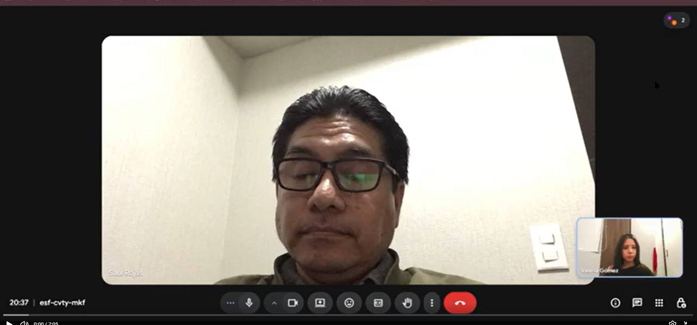
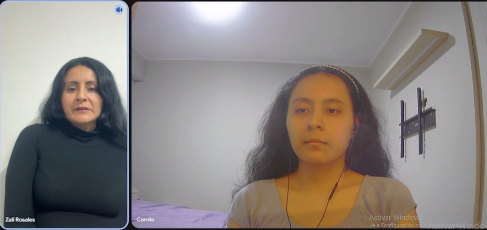
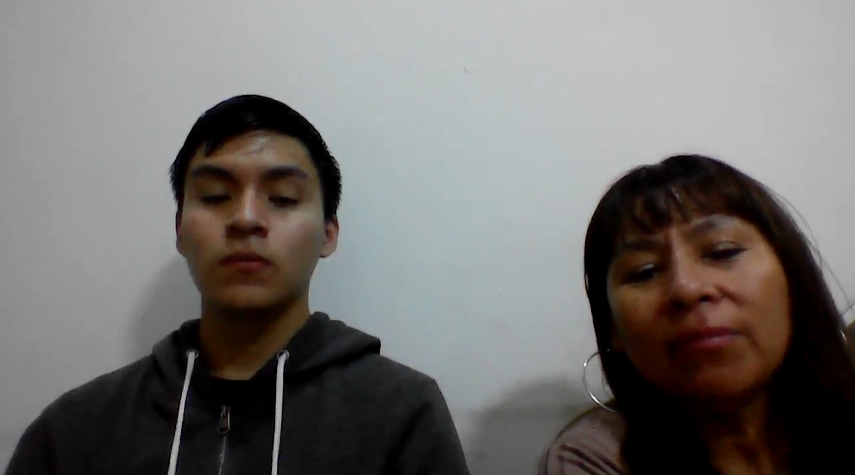
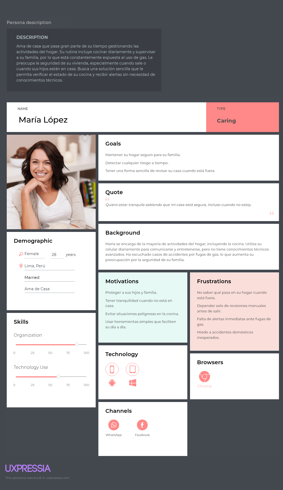
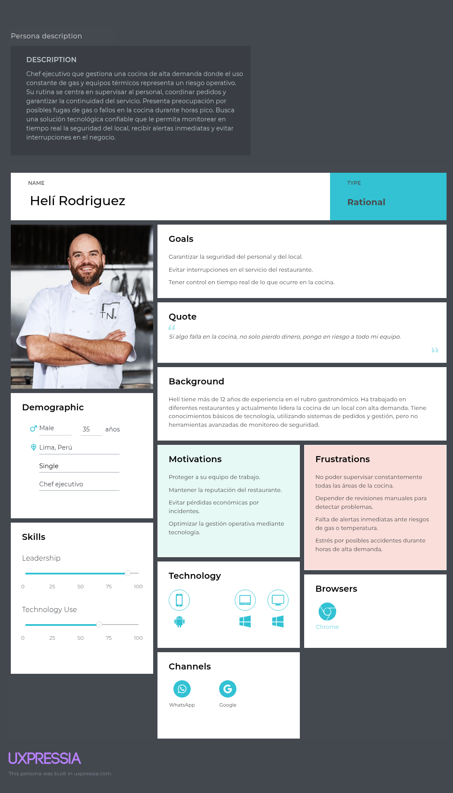
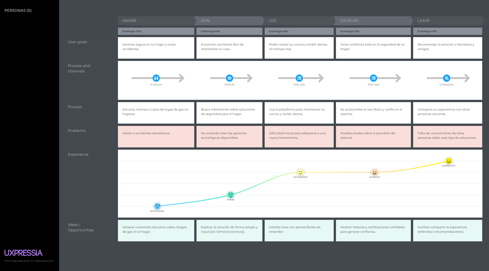
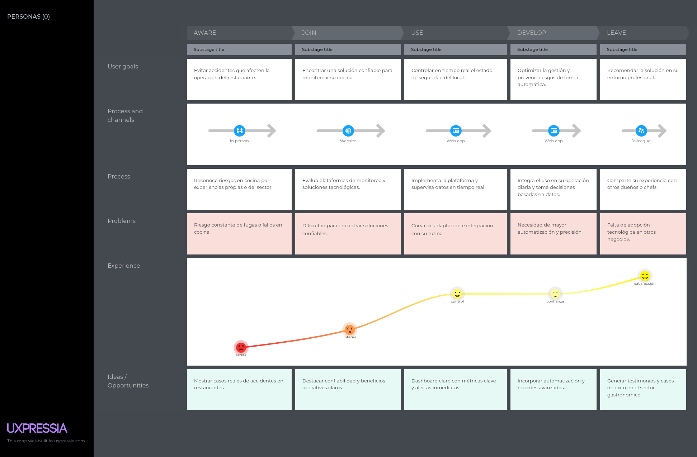
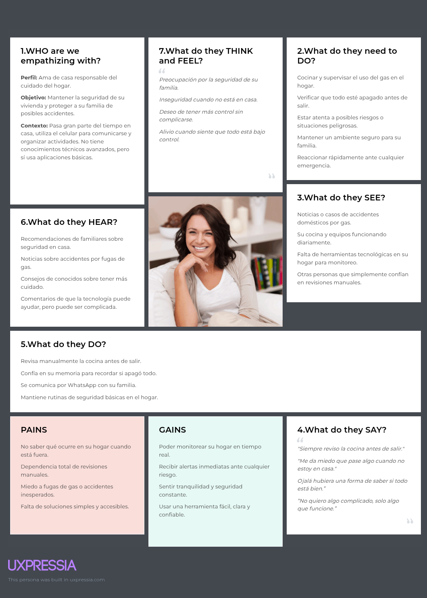
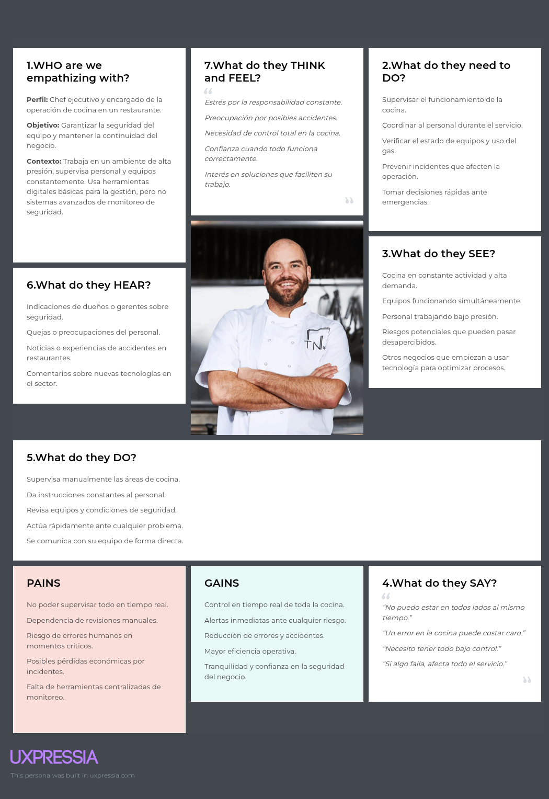
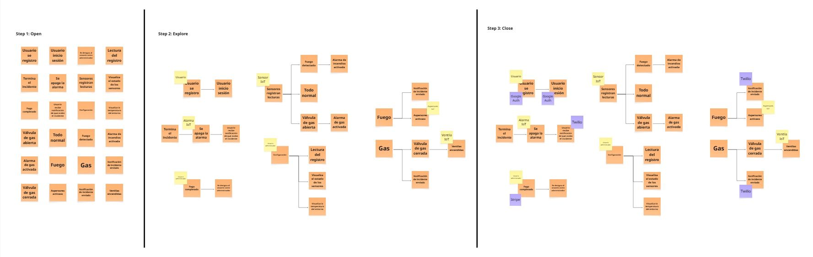

### Universidad Peruana de Ciencias Aplicadas
### Inegeneria de Software
### 2026-1

### NRC: 12263
### Docente: Rafael Oswaldo Castro Veramendi
### Informe de Trabajo Final

###  G2
###  SmartGas

   
|**Code**|**Member**|
|---------------------|--------------------|
|U202310436 |Gabriel Ferran Espinar Martínez|
|U20241D932 |Briguite Eryka Carhuaz Centeno| 
|U20241D995 |Cesar Jair Contreras Rojas| 
|U202419547 |Camila Alizée Otiniano Rosales| 
|U202411373 |Valeria Alexandra Rojas Gomez| 

### Abril 2026

# **Registro de Versiones del Informe**

| Versión | Fecha | Autor | Descripción de modificación |
|-----------|-----------|-----------|-----------|
|-----------|-----------|-----------|-----------|
|-----------|-----------|-----------|-----------|

# **Project Report Collaboration Insights**

**URL del Repositorio**: [https://github.com/1ASI0730-2610-12263-G2/SmartGas-Project-Report](https://github.com/1ASI0730-2610-12263-G2/SmartGas-Project-Report)

# ABET – EAC - Student Outcome 5

**Criterio:** La capacidad de funcionar efectivamente en un equipo cuyos miembros juntos proporcionan liderazgo, crean un entorno de colaboración e inclusivo, establecen objetivos, planifican tareas y cumplen objetivos.

En el siguiente cuadro se describe las acciones realizadas y enunciados de conclusiones por parte del grupo, que permiten sustentar el haber alcanzado el logro del ABET – EAC – Student Outcome 5.

| Criterio específico | Acciones realizadas | Conclusiones |
| :--- | :--- | :--- |
| **Trabaja en equipo para proporcionar liderazgo en forma conjunta** | | |
| **Crea un entorno colaborativo e inclusivo, establece metas, planifica tareas y cumple objetivos.** | | |

## Contenido

- [ Informe Trabajo Final ](#-informe-trabajo-final-)
    - [Universidad Peruana de Ciencias Aplicadas ](#universidad-peruana-de-ciencias-aplicadas-)
    - [Registro de versiones del Informe](#registro-de-versiones-del-informe)
    - [Project Report Collaboration Insights](#project-report-collaboration-insights)
    - [Contenido](#contenido)
    - [Student Outcome](#student-outcome)
- [Capítulo I: Introducción](#capítulo-i-introducción)
    - [1.1. Startup Profile](#11-startup-profile)
    - [1.1.1. Descripción de la Startup](#111-descripción-de-la-startup)
    - [1.1.2 Perfiles de integrantes del equipo](#112-perfiles-de-integrantes-del-equipo)
    - [1.2. Solution Profile](#12-solution-profile)
    - [1.2.1 Antecedentes y problemática](#121-antecedentes-y-problemática)
    - [1.2.2 Lean Ux Process](#122-lean-ux-process)
    - [1.2.2.1. Lean UX Problem Statements](#1221-lean-ux-problem-statements)
    - [1.2.2.2. Lean UX Assumptions](#1222-lean-ux-assumptions)
    - [1.2.2.3. Lean UX Hypothesis Statements](#1223-lean-ux-hypothesis-statements)
    - [1.2.2.4. Lean UX Canvas](#1224-lean-ux-canvas)
    - [Segmentos Objetivos](#segmentos-objetivos)
- [Capítulo II: Requeriments Elicitation \& Analysis](#capítulo-ii-requeriments-elicitation--analysis)
    - [2.1. Competidores](#21-competidores)
    - [2.1.1. Análisis competitivo](#211-análisis-competitivo)
    - [2.1.2. Estrategias y tácticas frente a competidores](#212-estrategias-y-tácticas-frente-a-competidores)
    - [2.2. Entrevistas ](#22-entrevistas-)
    - [2.2.1. Diseño de entrevistas](#221-diseño-de-entrevistas)
    - [2.2.2. Registro de entrevistas](#222-registro-de-entrevistas)
    - [2.2.3. Análisis de entrevistas](#223-análisis-de-entrevistas)
    - [2.3. Needfinding](#23-needfinding)
    - [2.3.1. User Personas](#231-user-personas)
    - [2.3.2. User Task Matrix](#232-user-task-matrix)
    - [2.3.3. User Journey Mapping](#233-user-journey-mapping)
    - [2.3.4. Empathy Mapping](#234-empathy-mapping)
    - [2.4. Big Picture EventStorming](#24-big-picture-evenstorming)
    - [2.5. Ubiquitous Language](#25-ubiquitous-language)
- [Capítulo III: Requeriments Specification](#capítulo-iii-requeriments-specification)
    - [3.1. User Stories](#31-user-stories)
    - [3.2. Impact Mapping](#32-impact-mapping)
    - [3.3. Product Backlog](#33-product-backlog)
- [Capítulo IV: Product Desing](#capítulo-iv-product-desing)
    - [4.1. Style Guidelines](#41-style-guidelines)
    - [4.1.1. General Style Guidelines](#411-general-style-guidelines)
    - [4.1.2. Web Style Guidelines](#412-web-style-guidelines)
    - [4.2. Information Architecture](#42-information-architecture)
    - [4.2.1. Organization Systems](#421-organization-systems)
    - [4.2.2. Labeling Systems](#422-labeling-systems)
    - [4.2.3. SEO Tags and Meta Tags](#423-seo-tags-and-meta-tags)
    - [4.2.4. Searching Systems](#424-searching-systems)
    - [4.2.5. Navigation Systems](#425-navigation-systems)
    - [4.3. Landing Page UI Desing](#43-landing-page-ui-desing)
    - [4.3.1. Landing Page Wireframes](#431-landing-page-wireframes)
    - [4.3.2. Landing Page Mock-Up](#432-landing-page-mock-up)
    - [4.4. Web Applications UX/UI Desing](#44-web-applications-uxui-desing)
    - [4.4.1. Web Applications Wireframes](#441-web-applications-wireframes)
    - [4.4.2. Web Applications Wireflow Diagrams](#442-web-applications-wireflow-diagrams)
    -[4.4.3. Web Applications Mock-ups](#443-web-applications-mock-ups-diagrams)
    - [4.4.4. Web Applications User Flow Diagrams](#444-web-applications-user-flow-diagrams)
    - [4.5. Web Applications Prototyping](#45-web-applications-prototyping)
    - [4.6.1. Design-Level EventStorming](#461-design-level-eventstorming)
    - [4.6.2. Software Architecture Context Diagram](#462-software-architecture-context-diagram)
    - [4.6.3. Software Architecture Container Diagram](#463-software-architecture-container-diagram)
    - [4.6.4. Software Architecture Components Diagram](#464-software-architecture-components-diagram)
    - [4.7. Software Object-Oriented Desing](#47-software-object-oriented-desing)
    - [4.7.1. Class Diagram](#471-class-diagram)
    - [4.8. Database Desing](#48-database-desing)
    - [4.8.1. Database Diagrams](#481-database-diagrams)
- [Capítulo V: Product Implementation, Validation \& Deployment](#capítulo-v-product-implementation-validation--deployment)
    - [5.1. Software Configuration Management](#51-software-configuration-management)
    - [5.1.1. Software Development Environment Configuration](#511-software-development-environment-configuration)
    - [5.1.2. Source Code Management](#512-source-code-management)
    - [5.1.3. Source Code Style Guide \& Conventions](#513-source-code-style-guide--conventions)
    - [5.1.4. Software Deployment Configuration](#514-software-deployment-configuration)
    - [5.2. Landing Page, Service \& Applications Implementation](#52-landing-page-service--applications-implementation)
    - [5.2.1. Sprint](#52x-sprint)
    -  [5.2.1.1. Sprint Planning 1](#5211-Sprint-Planning1)
    -  [5.2.1.2. Aspect Leaders and Collaborators](#5212-Aspect-Leaders-and-Collaborators)
    -  [5.2.1.3. Sprint Backlog 1](#5213-Sprint-Backlog-1)
    -  [5.2.1.4. Development Evidence for Sprint Review](#5214-Development-Evidence-for-Sprint-Review)
    -  [5.2.1.5. Execution Evidence for Sprint Review](#5215-Execution-Evidence-for-Sprint-Review)
    -  [5.2.1.6. Services Documentation Evidence for Sprint Review](#5216-Services-Documentation-Evidence-for-Sprint-Review)
    -  [5.2.1.7. Software Deployment Evidence for Sprint Review](#5217-Software-Deployment-Evidence-for-Sprint-Review)
    -  [5.2.1.8. Team Collaboration Insights during Sprint](#5218-Team-Collaboration-Insights-during-Sprint)
    -  [Conclusiones](#Conclusiones)
    -  [Bibliografía](#Bibliografía)
    -  [Anexos](#Anexos)

# Capítulo 1: Introducción

## 1.1. Startup Profile

### 1.1.1. Descripción de la Startup

### 1.1.2. Perfiles de integrantes del equipo

## 1.2. Solution Profile
    
### 1.2.1 Antecedentes y problemática

    
### 1.2.2 Lean UX Process.
    
### 1.2.2.1. Lean UX Problem Statements.

### 1.2.2.2. Lean UX Assumptions.

### 1.2.2.3. Lean UX Hypothesis Statements.
    
### 1.2.2.4. Lean UX Canvas.
    

## 1.3. Segmentos objetivo.
    
# Capítulo II: Requirements Elicitation & Analysis
    
## 2.1. Competidores.
    
### 2.1.1. Análisis competitivo.
| Características | Google Nest Protect | Kidde | Tyco SimplexGrinnell | SmartGas |
| :--- | :--- | :--- | :--- | :--- |
| **Perfil del Competidor** | Ecosistema inteligente cerrado de alta gama. | Líder en alarmas locales de bajo costo. | Sistema industrial corporativo especializado. | **Plataforma SaaS de monitoreo preventivo con arquitectura orientada a servicios (SOA).** |
| **Mercado Objetivo** | Hogares con alta conectividad y presupuesto. | Familias y pequeños comercios locales. | Grandes corporaciones y sector industrial. | Hogares urbanos y restaurantes en Perú. |
| **Ventaja Competitiva** | Integración total con Google Home y smartphones. | Reconocimiento de marca y bajo costo de adquisición. | Alta robustez y certificaciones de seguridad industrial. | **Monitoreo remoto vía Web App y notificaciones en tiempo real.** |
| **Fortalezas** | Ecosistema digital sólido y actualizaciones constantes. | Disponibilidad masiva y sin pagos de suscripción. | Soluciones integrales para entornos de alta complejidad. | **Arquitectura SOA escalable, Backend en C# y alta usabilidad.** |
| **Debilidades** | Dependencia de hardware propietario y costo elevado. | Carece de conectividad remota y gestión de datos. | Instalaciones complejas e interfaces de usuario cerradas. | Marca nueva en el mercado con necesidad de validación inicial. |
    
### 2.1.2. Estrategias y tácticas frente a competidores.

**Fortalezas: Enfoque especializado en monitoreo preventivo y arquitectura SOA**
La startup FireSecure se diferencia de competidores como Google Nest Protect y Tyco al desarrollar SmartGas, una plataforma SaaS que no depende de ecosistemas cerrados. A diferencia de Kidde, que ofrece hardware analógico, SmartGas utiliza una arquitectura orientada a servicios (SOA) en C# que permite el procesamiento de telemetría en la nube, visualización web responsiva y un sistema de alertas proactivo.

**Táctica:** 
Posicionar a SmartGas en el mercado como la solución que democratiza la seguridad inteligente, permitiendo a los usuarios monitorear sus instalaciones desde cualquier navegador sin la complejidad de sistemas industriales ni el costo de hardware de gama alta.

**Debilidades: Startup en etapa temprana con necesidad de validación**
Al ser una empresa nueva, FireSecure no cuenta aún con la trayectoria de marca de Google ni las certificaciones masivas de Tyco. Esto puede generar dudas en el segmento comercial (restaurantes) respecto a la fiabilidad a largo plazo de la plataforma SmartGas.

**Táctica:** 
Ejecutar programas piloto de SmartGas en restaurantes locales de Lima (como en Jesús María) para recolectar métricas de desempeño y testimonios. Estos casos de éxito servirán como validación técnica para demostrar la robustez del backend frente a situaciones reales.

**Oportunidades: Necesidad de digitalización en el sector residencial y culinario peruano**
Existe un vacío en el mercado local donde los sistemas de seguridad son locales o muy costosos. SmartGas tiene la oportunidad de capturar este nicho ofreciendo una solución que se integra con dispositivos IoT accesibles, algo que los competidores internacionales no han adaptado al contexto económico del Perú.

**Táctica:** 
Enfocar los esfuerzos de marketing de FireSecure en la "Prevención Basada en Datos", ofreciendo no solo la alarma, sino el historial de eventos y reportes estadísticos de SmartGas para que los administradores de restaurantes puedan tomar decisiones informadas sobre sus operaciones.

**Amenazas: Competidores con mayores recursos y capacidad de réplica**
Empresas consolidadas podrían intentar lanzar versiones simplificadas de sus productos si perciben el crecimiento de FireSecure. Además, el ingreso de soluciones genéricas de bajo costo podría presionar los precios de suscripción de SmartGas.

**Táctica:**
Mantener una ventaja competitiva a través de la innovación ágil en el software. FireSecure debe aprovechar su arquitectura SOA para integrar rápidamente nuevas funcionalidades en SmartGas basadas en el feedback de los usuarios locales y ofrecer un soporte técnico en español directo y especializado, algo que Google o Kidde no priorizan en la región.

## 2.2. Entrevistas.
    
### 2.2.1. Diseño de entrevistas.

**Segmento Objetivo 1: Familias y Propietarios de Viviendas**

1. ¿Cuál es su nombre, edad y a qué se dedica actualmente?
2. ¿En qué distrito vive y con cuántas personas comparte su hogar?
3. ¿Qué tipo de dispositivos utiliza con mayor frecuencia (celular, laptop, tablet)?
4. ¿Qué aplicaciones o páginas web usa en su día a día?
5. ¿Qué tan familiarizado está con el uso de aplicaciones web o dispositivos inteligentes en el hogar?
6. En su vivienda, ¿qué tipo de cocina utiliza (gas, eléctrica, mixta)?
7. ¿Ha tenido alguna experiencia o conoce casos cercanos de fugas de gas o incendios domésticos?
8. ¿Qué medidas de seguridad tiene actualmente en su hogar para prevenir estos riesgos?
9. ¿Con qué frecuencia revisa el estado de su cocina o instalaciones de gas?
10. ¿Qué tan seguro se siente respecto a posibles fugas de gas cuando no está en casa?
11. Si ocurriera una fuga de gas mientras usted no está presente, ¿cómo se enteraría?
12. ¿Qué dificultades encuentra al depender solo de revisiones manuales o alarmas tradicionales?
13. ¿Le gustaría poder monitorear el estado de su hogar en tiempo real desde su celular o navegador?
14. ¿Qué funcionalidades le parecerían más útiles en una plataforma web de seguridad doméstica (alertas, historial, visualización en tiempo real, etc.)?
15. ¿Estaría dispuesto a usar una aplicación como SmartGas que le envíe alertas automáticas ante riesgos? ¿Por qué?

**Segmento Objetivo 2: Administradores y Chefs de Restaurantes**

1. ¿Cuál es su nombre, edad y cuál es su rol dentro del restaurante o negocio?
2. ¿En qué distrito se encuentra su local y cuánto tiempo lleva operando?
3. ¿Qué dispositivos utiliza para gestionar su negocio (PC, laptop, celular, tablet)?
4. ¿Qué sistemas o herramientas digitales utiliza actualmente en la gestión del restaurante?
5. ¿Qué tan importante considera la tecnología en la seguridad y operación de su negocio?
6. ¿Qué tipo de equipos de cocina utilizan y qué tan dependientes son del gas?
7. ¿Ha experimentado o conoce incidentes relacionados con fugas de gas o incendios en restaurantes?
8. ¿Qué protocolos de seguridad tiene implementados actualmente en su cocina?
9. ¿Cómo supervisa el estado de las instalaciones de gas y temperatura en su local?
10. ¿Qué dificultades enfrenta al monitorear la seguridad en tiempo real, especialmente en horas de alta demanda?
11. ¿Qué consecuencias tendría para su negocio una fuga de gas o un incendio?
12. ¿Qué tan complicado es llevar un registro o historial de incidentes de seguridad actualmente?
13. ¿Le resultaría útil contar con un sistema centralizado que monitoree múltiples áreas o locales en tiempo real?
14. ¿Qué funciones considera indispensables en una plataforma web de monitoreo (alertas automáticas, reportes, control por zonas, etc.)?
15. ¿Estaría dispuesto a implementar una solución como SmartGas para mejorar la seguridad de su negocio? ¿Por qué?
    
    
### 2.2.2. Registro de entrevistas.

##### Segmento objetivo #1 Familias y Propietarios de Viviendas

#### Entrevista 1:

- **Nombres y apellidos:** Saúl Romani
- **Edad:** 48
- **Distrito:** Jesús María
- **Inicio:** 0:18  
- **Duración:** 7:05  
- **URL:**  [entrevista](https://youtu.be/n1bmq2q0aiQ)
- **Resumen:** Saúl, de 48 años, es ingeniero de sistemas de la información y reside en un departamento con servicio de seguridad en el distrito de Jesús María. A pesar de contar con medidas de protección en su vivienda, menciona que uno de sus mayores gastos está relacionado con el mantenimiento, especialmente en aspectos vinculados a la seguridad y el buen funcionamiento del hogar. Sin embargo, señala que aún no confía completamente en los sistemas tradicionales, ya que considera que no siempre previenen incidentes de manera oportuna. Frente a ello, indica que sí usaría una aplicación como Smart Guard, porque le brindaría mayor tranquilidad y control. Para él, las funcionalidades más útiles serían el monitoreo de los niveles de gas mediante sensores y la detección de movimiento, ya que estas permitirían identificar riesgos a tiempo y actuar rápidamente ante posibles emergencias en la cocina.

#### Entrevista 2:

- **Nombres y apellidos:** Sheila Rosales
- **Edad:** 42 
- **Distrito:** Trujillo
- **Inicio:** 0:00  
- **Duración:** 7:11  
- **URL:**  [entrevista](https://youtu.be/VHuMHrjeVto)
- **Resumen:** Sheila, de 42 años, se dedica al hogar y reside en el distrito de Trujillo junto a su familia en una vivienda de tres personas. Aunque utiliza dispositivos tecnológicos como celular y laptop diariamente, no cuenta con sistemas inteligentes en casa, aunque reconoce su utilidad para prevenir accidentes. Utiliza una cocina a gas y, aunque no ha sufrido incidentes personales, manifiesta una gran preocupación por la posibilidad de fugas o incendios cuando no se encuentra presente, dependiendo actualmente solo de la vigilancia visual de los vecinos para enterarse de una emergencia.   Menciona que su única medida de seguridad actual es la revisión manual, pero admite que no realiza mantenimientos frecuentes. Frente a esta situación, Sheila muestra un alto interés en utilizar SmartGas, destacando que le brindaría la tranquilidad de monitorear su hogar en tiempo real. Para ella, las funcionalidades más valiosas serían las alertas automáticas y la visualización en tiempo real, ya que le permitirían actuar con rapidez o enviar ayuda antes de que ocurra un accidente grave, transformando su actual incertidumbre en un control preventivo directo desde su celular.

#### Entrevista 3:

- **Nombres y apellidos:** Sonia Rojas
- **Edad:** 57
- **Distrito:** Cercado de Lima
- **Inicio:** 0:00  
- **Duración:** 5:41  
- **URL:**  [entrevista](https://upcedupe-my.sharepoint.com/:v:/g/personal/u20241d995_upc_edu_pe/IQBheKhR4PPTRKlTRUd6PQNKAdXT_fgaZvI961KIImPMP3w?e=k0RXJx&nav=eyJyZWZlcnJhbEluZm8iOnsicmVmZXJyYWxBcHAiOiJTdHJlYW1XZWJBcHAiLCJyZWZlcnJhbFZpZXciOiJTaGFyZURpYWxvZy1MaW5rIiwicmVmZXJyYWxBcHBQbGF0Zm9ybSI6IldlYiIsInJlZmVycmFsTW9kZSI6InZpZXcifX0%3D)
- **Resumen:** Sonia, de 57 años, es una ama de casa del distrito de Cercado de Lima la cual vive en su hogar junto con sus 2 hijos. Si bien ella utiliza dispositivos electronicos tales como su celular, ella no está acostumbrada a usar equipos de escritorio como laptops o computadoras, así como tampoco está familiarizada con el uso de sistemas inteligente en su hogar, pese a ello reconoce que estos sistemas pueden ser de gran utilidad para la detección de incidente en el hogar. Utiliza una cocina a gas, no he sufrido ningun accidente relaciona con gas o fuego sin embargo conocidos suyos si han sufrido de está clase de incidentes. Ella muestra preocupación por el bienestar de su familia en caso uno de estos incidente se pueda sucitar. Sonia muestra interes en la aplicación de SmartGuard, resalta que la funcionalidad de las notificaciones y alertas automáticas le parecen las más importantes pues le permitirian saber cuando es que su familia sufre de algún riesgo.

##### Segmento objetivo #2 Administradores y Chefs de Restaurantes

#### Entrevista 1:

- **Nombres y apellidos:** Raí Beizaga
- **Edad:** 20 
- **Distrito:** Jesús María
- **Inicio:** 0:00  
- **Duración:** 4:46  
- **URL:**  [entrevista](https://upcedupe-my.sharepoint.com/:v:/g/personal/u202310436_upc_edu_pe/IQCEZTjEZ0mgTrHjCdh71j0DAS2Z7AX7h5JkZvyN8dp-oaI?nav=eyJyZWZlcnJhbEluZm8iOnsicmVmZXJyYWxBcHAiOiJPbmVEcml2ZUZvckJ1c2luZXNzIiwicmVmZXJyYWxBcHBQbGF0Zm9ybSI6IldlYiIsInJlZmVycmFsTW9kZSI6InZpZXciLCJyZWZlcnJhbFZpZXciOiJNeUZpbGVzTGlua0NvcHkifX0&e=C5xNxe)
- **Resumen:** Raí, de 20 años, se desempeña como ayudante de cocina el restaurante Terminal Pesquero ubicado en Jesús María, el cual lleva trabajando desde hace 5 meses. Debido a la naturaleza de su trabajo, opera constantemente equipos de alto riesgo como freidoras, hornos y cocinas industriales que dependen totalmente del suministro de gas. Actualmente, la seguridad del local se gestiona de forma manual, realizando inspecciones visuales de válvulas y conexiones antes de iniciar la jornada, lo que resulta insuficiente durante las horas de alta demanda donde el control se pierde. Fabrizio señala que una fuga de gas o un incendio no solo representaría una pérdida económica devastadora, sino un daño irreparable a la reputación del negocio. Como trabajador joven, manifiesta una mayor confianza en la precisión de los sensores tecnológicos que en el olfato humano para detectar peligros. Ante este contexto, considera que SmartGas sería una solución indispensable, destacando funciones como las alertas inmediatas al celular, gráficos de temperatura para evitar sobrecalentamientos y un botón de corte de emergencia para aviso rápido a mantenimiento o bomberos

#### Entrevista 2:

- **Nombres y apellidos:** Kevin Arnold Izquiero Pardave
- **Edad:** 31
- **Distrito:** Jesús María
- **Inicio:** 0:00  
- **Duración:** 4:17  
- **URL:**  [entrevista](https://upcedupe-my.sharepoint.com/:v:/g/personal/u20241d995_upc_edu_pe/IQBTiLZJ_3yESbU6W2h2tA0SATm3CL-mSGMoO3EUsrkm_ak?e=ONsG8Y&nav=eyJyZWZlcnJhbEluZm8iOnsicmVmZXJyYWxBcHAiOiJTdHJlYW1XZWJBcHAiLCJyZWZlcnJhbFZpZXciOiJTaGFyZURpYWxvZy1MaW5rIiwicmVmZXJyYWxBcHBQbGF0Zm9ybSI6IldlYiIsInJlZmVycmFsTW9kZSI6InZpZXcifX0%3D)

- **Resumen:** Resumen: Kevin, 31 años, es el dueño de un restaurante y administrador del restaurante Palmar, ubicado en Comas. Este restaurante lleva existiendo por más de 20 años, y él actualmente está a cargo del local, relevando a su padre. Si bien es el administrador, también ayuda en las labores de cocina cuando es necesario, por lo que está en contacto con dispositivos como estufas, freidoras e incluso hornos, los cuales funcionan, por supuesto, a base de gas.

  En la actualidad, los métodos de prevención que poseen en caso de incendio o fuga de gas son completamente manuales, ya que dependen de inspeccionar visualmente que no haya ninguna fuga. Kevin indica que, si bien no ha experimentado de primera mano un accidente como el descrito, sí ha escuchado de locales en los cuales esto ha ocurrido, y reconoce el peligro que significa que uno de estos incidentes escale, ya que implicaría perder toda su inversión, además de poner en riesgo a su personal.

  Como administrador del local, opina que se sentiría más seguro si hubiera un sistema que lo alerte de estos incidentes de forma temprana, para evitar pérdidas tanto monetarias como humanas. Considera que SmartGas sería una solución eficiente para dichos incidentes, al notificar a su personal y contar con medidas preventivas para evitar que el problema escale.

#### Entrevista 3:

- **Nombres y apellidos:** Ruben Isaias Carhuaz Pomachagua
- **Edad:** 49
- **Distrito:** Lince
- **Inicio:** 0:00  
- **Duración:** 4:12  
- **URL:**  [entrevista](https://upcedupe-my.sharepoint.com/:v:/g/personal/u20241d932_upc_edu_pe/IQAtlT93b6nWS5YXY5ZMGrNaAefLFvGOWZS-ZqiV_Y2y53w?nav=eyJyZWZlcnJhbEluZm8iOnsicmVmZXJyYWxBcHAiOiJPbmVEcml2ZUZvckJ1c2luZXNzIiwicmVmZXJyYWxBcHBQbGF0Zm9ybSI6IldlYiIsInJlZmVycmFsTW9kZSI6InZpZXciLCJyZWZlcnJhbFZpZXciOiJNeUZpbGVzTGlua0NvcHkifX0&e=u8AERl)

- **Resumen:** Resumen: Rubén Carhuaz, de 49 años y gerente de un restaurante con dos años de funcionamiento, reconoce que la tecnología es un recurso indispensable para la seguridad, especialmente porque su operación depende totalmente del gas. Actualmente, sus métodos de prevención son rudimentarios y se limitan a la revisión manual de mangueras, lo que representa un riesgo latente, ya que un incendio o fuga significaría "perderlo todo". Ante este panorama, Rubén se muestra dispuesto a implementar una solución tecnológica que centralice el monitoreo y, sobre todo, emita alertas inmediatas para garantizar la protección de sus trabajadores y clientes.
    
### 2.2.3. Análisis de entrevistas.

**Segmento 1: Familias y Propietarios de Viviendas**

* **Perfil y Residencia:** 100% reside en zonas urbanas en hogares con 3 o más personas.
 
* **Equipamiento del Hogar:** 100% utiliza cocinas a gas y cuenta con dispositivos como celulares y laptops.
 
* **Seguridad Actual:** 100% depende exclusivamente de métodos manuales (revisión visual y olfato) o de la vigilancia de terceros (vecinos).
 
* **Problemas y Preocupaciones:**
 
    * 100% manifiesta preocupación o desconfianza ante posibles fugas de gas cuando no están en casa.
 
    * 50% señala que los sistemas tradicionales no previenen incidentes de forma oportuna.
  
    * 50% admite que no realiza mantenimientos preventivos con frecuencia.
 
* **Funciones Valoradas:** 100% prioriza el monitoreo en tiempo real y las alertas automáticas al celular. El 50% también valora la detección de movimiento.
 
* **Adopción de SmartGas:** 100% está dispuesto a utilizar la aplicación porque les brinda tranquilidad, control y una respuesta rápida ante emergencias.

**Segmento 2: Administradores y Chefs de Restaurantes**

* **Rol y Experiencia:** 100% opera directamente equipos de alto riesgo que dependen del gas.
 
* **Gestión de Seguridad:** 100% gestiona la seguridad de forma manual mediante inspecciones visuales de mangueras y válvulas.
 
* **Riesgos Identificados:**
 
    * 100% afirma que una fuga o incendio significaría "perderlo todo" (inversión y activos).
  
    * 66% señala que el factor humano es insuficiente durante horas de alta demanda o para detectar peligros invisibles al olfato.

    * 33% destaca el riesgo irreparable a la reputación del negocio.

* **Tecnología y Confianza:** 100% considera la tecnología como un recurso indispensable y confía más en la precisión de los sensores que en el control manual.
 
* **Funciones Deseadas en SmartGas:** 100% solicita alertas inmediatas al celular. El 66% valora medidas preventivas automáticas y el 33% requiere gráficos de temperatura.
 
* **Adopción de SmartGas:** 100% considera la solución como una herramienta eficiente e indispensable para centralizar el monitoreo y proteger a sus trabajadores y clientes.
    
## 2.3. Needfinding.
    
### 2.3.1. User Personas.

En esta sección se presentan los User Personas que representan a los principales segmentos objetivo del proyecto. Estos perfiles han sido construidos a partir de las características, necesidades y comportamientos identificados durante el análisis previo.

Cada persona refleja un tipo de usuario real, permitiendo comprender mejor sus objetivos, motivaciones y dificultades en relación con la seguridad en entornos donde se utiliza gas

**Segmento Objetivo 1: Familias y Propietarios de Viviendas**

**Segmento Objetivo 2: Administradores y Chefs de Restaurantes**

### 2.3.2. User Task Matrix.

En esta sección se identifican las principales actividades que realizan los usuarios en su día a día para mantener la seguridad en sus entornos, tanto en el hogar como en espacios de trabajo.

Estas tareas reflejan cómo gestionan actualmente los riesgos asociados al uso de gas, sin el apoyo de una solución digital como SmartGas.

| Tareas / User Persona                                | Helí Rodríguez (Frec.) | Helí Rodríguez (Imp.) | María López (Frec.) | María López (Imp.) |
| ---------------------------------------------------- | ---------------------- | --------------------- | ------------------- | ------------------ |
| Supervisar equipos de cocina                         | Alta                   | Alta                  | Media               | Alta               |
| Revisar instalaciones de gas                         | Media                  | Alta                  | Baja                | Alta               |
| Detectar olores o señales de fuga                    | Media                  | Alta                  | Baja                | Alta               |
| Verificar que todo esté apagado                      | Alta                   | Alta                  | Alta                | Alta               |
| Actuar ante emergencias                              | Baja                   | Alta                  | Baja                | Alta               |
| Realizar mantenimiento preventivo                    | Media                  | Alta                  | Baja                | Media              |
| Depender de revisiones manuales                      | Alta                   | Alta                  | Alta                | Alta               |
| Usar el celular para comunicarse                     | Alta                   | Media                 | Alta                | Media              |
| Preocuparse por la seguridad cuando no está presente | Alta                   | Alta                  | Alta                | Alta               |

Se observa que ambos usuarios dependen en gran medida de revisiones manuales para garantizar la seguridad, lo que puede generar descuidos o respuestas tardías ante un problema.

Helí tiene una carga operativa más alta y necesita control constante en un entorno exigente, mientras que María busca principalmente tranquilidad y prevención en su hogar.

Esto refuerza la necesidad de una solución que permita monitoreo remoto y alertas oportunas, adaptándose tanto a un uso profesional como doméstico.

### 2.3.3. User Journey Mapping.

En esta sección se describe el recorrido que siguen los usuarios en su interacción con una posible solución al problema identificado. A través de distintas etapas, se analiza cómo evolucionan sus objetivos, acciones, percepciones y dificultades desde el momento en que toman conciencia del riesgo hasta que adoptan una herramienta que les permita gestionarlo.

El User Journey permite identificar puntos críticos y oportunidades de mejora, facilitando el diseño de una experiencia que responda de manera efectiva a las necesidades de cada segmento.

**Segmento Objetivo 1: Familias y Propietarios de Viviendas**

**Segmento Objetivo 2: Administradores y Chefs de Restaurantes**

### 2.3.4. Empathy Mapping.
    
En esta sección se analizan los pensamientos, emociones, acciones y percepciones de los usuarios con el objetivo de comprender mejor su comportamiento frente al problema planteado.

El Empathy Map permite profundizar en las necesidades reales de cada segmento, identificando sus preocupaciones, motivaciones y frustraciones. Esto contribuye a diseñar una solución más alineada con el usuario, asegurando que la propuesta de valor sea clara, útil y relevante en su contexto.

**Segmento Objetivo 1: Familias y Propietarios de Viviendas**

**Segmento Objetivo 2: Administradores y Chefs de Restaurantes**

## 2.4. Big Picture EventStorming.

  

    
## 2.5. Ubiquitous Language.

En este apartado se definen los términos clave que se utilizarán a lo largo del desarrollo del sistema SmartGas. Este conjunto de conceptos permite que tanto el equipo técnico como los usuarios tengan una misma interpretación de los elementos y procesos del sistema.

El uso de este lenguaje común facilita la comprensión del funcionamiento de la plataforma, reduce confusiones y asegura coherencia en el diseño e implementación de la solución.

A continuación, se presentan los principales términos definidos:
    
* Telemetría de sensores en tiempo real: Datos continuos enviados por sensores de gas y temperatura hacia el sistema para su monitoreo.

* Sensor IoT: Dispositivo físico instalado en cocinas o ambientes que mide niveles de gas y temperatura.

* Anomalía de gas o temperatura: Valor detectado fuera de los rangos seguros establecidos que puede representar un riesgo.

* Detección de fuga de gas: Identificación automática de niveles peligrosos de gas en el ambiente.

* Alerta de seguridad: Notificación generada por el sistema cuando se detecta una anomalía.

* Notificación en tiempo real: Mensaje enviado al usuario a través de la web o servicios externos de forma inmediata.
 
* Dashboard de monitoreo: Interfaz web donde el usuario visualiza el estado de sus sensores y niveles de seguridad.

* Historial de incidencias: Registro almacenado de eventos relacionados con anomalías o alertas detectadas.
 
* Monitoreo remoto: Capacidad de supervisar el estado del entorno desde cualquier dispositivo con acceso a internet.
 
* Gestión de dispositivos: Proceso de registrar, configurar y asociar sensores a usuarios o ubicaciones.

    
# Capítulo III: Requirements Specification
  
## 3.1. User Stories.
   
## 3.2. Impact Mapping.
    
## 3.3. Product Backlog.
    
# Capítulo IV: Product Design
   
## 4.1. Style Guidelines.
   
### 4.1.1. General Style Guidelines.
    
### 4.1.2. Web Style Guidelines.
    
## 4.2. Information Architecture.
    
### 4.2.1. Organization Systems.
    
### 4.2.2. Labeling Systems.
    
### 4.2.3. SEO Tags and Meta Tags
    
### 4.2.4. Searching Systems.
    
### 4.2.5. Navigation Systems.
    
## 4.3. Landing Page UI Design.
    
### 4.3.1. Landing Page Wireframe.
    
### 4.3.2. Landing Page Mock-up.
    
## 4.4. Web Applications UX/UI Design.
    
### 4.4.1. Web Applications Wireframes.
    
### 4.4.2. Web Applications Wireflow Diagrams.
    
### 4.4.2. Web Applications Mock-ups.
    
### 4.4.3. Web Applications User Flow Diagrams.
    
## 4.5. Web Applications Prototyping.
   
## 4.6. Domain-Driven Software Architecture.
    
### 4.6.1. Design-Level EventStorming.
    
### 4.6.2. Software Architecture Context Diagram.
    
### 4.6.3. Software Architecture Container Diagrams.
    
### 4.6.4. Software Architecture Components Diagrams.
    
## 4.7. Software Object-Oriented Design.
    
### 4.7.1. Class Diagrams.
    
## 4.8. Database Design.
    
### 4.8.1. Database Diagrams.
    
# Capítulo V: Product Implementation, Validation & Deployment
    
## 5.1. Software Configuration Management.
    
### 5.1.1. Software Development Environment Configuration.
    
### 5.1.2. Source Code Management.
    
### 5.1.3. Source Code Style Guide & Conventions.
    
### 5.1.4. Software Deployment Configuration.
    
## 5.2. Landing Page, Services & Applications Implementation.
    
## 5.2.1. Sprint n
    
### 5.2.1.1. Sprint Planning n.
    
### 5.2.1.2. Aspect Leaders and Collaborators.
    
### 5.2.1.3. Sprint Backlog n.
    
### 5.2.1.4. Development Evidence for Sprint Review.
    
### 5.2.1.5. Execution Evidence for Sprint Review.
    
### 5.2.1.6. Services Documentation Evidence for Sprint Review.
    
### 5.2.1.7. Software Deployment Evidence for Sprint Review.
    
### 5.2.1.8. Team Collaboration Insights during Sprint.

## Conclusiones

## Bibliografía

## Anexos
