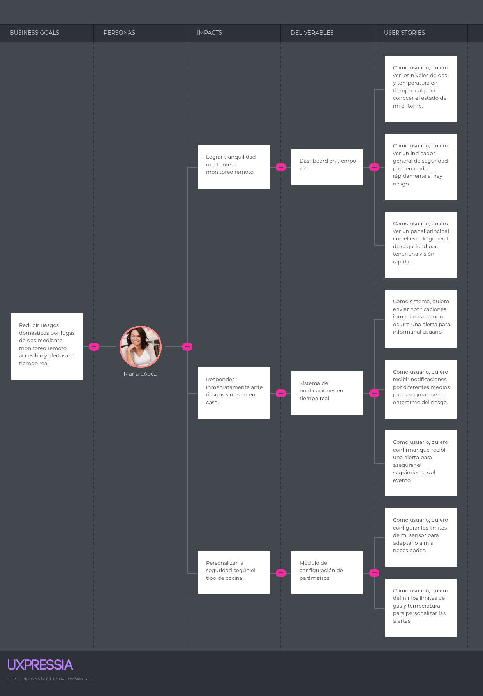
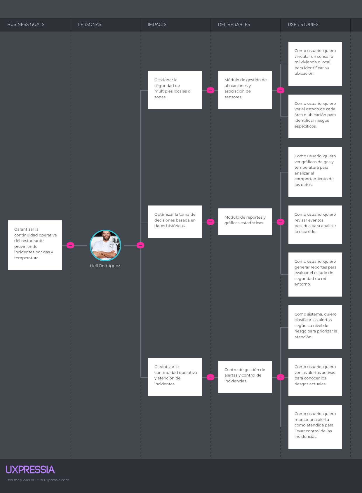

### Universidad Peruana de Ciencias Aplicadas
### Inegeneria de Software
### 2026-1

### NRC: 12263
### Docente: Rafael Oswaldo Castro Veramendi
### Informe de Trabajo Final

###  G2
###  SmartGas

   
|**Code**|**Member**|
|---------------------|--------------------|
|U202310436 |Gabriel Ferran Espinar Martínez|
|U20241D932 |Briguite Eryka Carhuaz Centeno| 
|U20241D995 |Cesar Jair Contreras Rojas| 
|U202419547 |Camila Alizée Otiniano Rosales| 
|U202411373 |Valeria Alexandra Rojas Gomez| 

### Abril 2026

# **Registro de Versiones del Informe**

| Versión | Fecha | Autor | Descripción de modificación |
|-----------|-----------|-----------|-----------|
|-----------|-----------|-----------|-----------|
|-----------|-----------|-----------|-----------|

# **Project Report Collaboration Insights**

**URL del Repositorio**: [https://github.com/1ASI0730-2610-12263-G2/SmartGas-Project-Report](https://github.com/1ASI0730-2610-12263-G2/SmartGas-Project-Report)

# ABET – EAC - Student Outcome 5

**Criterio:** La capacidad de funcionar efectivamente en un equipo cuyos miembros juntos proporcionan liderazgo, crean un entorno de colaboración e inclusivo, establecen objetivos, planifican tareas y cumplen objetivos.

En el siguiente cuadro se describe las acciones realizadas y enunciados de conclusiones por parte del grupo, que permiten sustentar el haber alcanzado el logro del ABET – EAC – Student Outcome 5.

| Criterio específico | Acciones realizadas | Conclusiones |
| :--- | :--- | :--- |
| **Trabaja en equipo para proporcionar liderazgo en forma conjunta** | | |
| **Crea un entorno colaborativo e inclusivo, establece metas, planifica tareas y cumple objetivos.** | | |

## Contenido

- [ Informe Trabajo Final ](#-informe-trabajo-final-)
    - [Universidad Peruana de Ciencias Aplicadas ](#universidad-peruana-de-ciencias-aplicadas-)
    - [Registro de versiones del Informe](#registro-de-versiones-del-informe)
    - [Project Report Collaboration Insights](#project-report-collaboration-insights)
    - [Contenido](#contenido)
    - [Student Outcome](#student-outcome)
- [Capítulo I: Introducción](#capítulo-i-introducción)
    - [1.1. Startup Profile](#11-startup-profile)
    - [1.1.1. Descripción de la Startup](#111-descripción-de-la-startup)
    - [1.1.2 Perfiles de integrantes del equipo](#112-perfiles-de-integrantes-del-equipo)
    - [1.2. Solution Profile](#12-solution-profile)
    - [1.2.1 Antecedentes y problemática](#121-antecedentes-y-problemática)
    - [1.2.2 Lean Ux Process](#122-lean-ux-process)
    - [1.2.2.1. Lean UX Problem Statements](#1221-lean-ux-problem-statements)
    - [1.2.2.2. Lean UX Assumptions](#1222-lean-ux-assumptions)
    - [1.2.2.3. Lean UX Hypothesis Statements](#1223-lean-ux-hypothesis-statements)
    - [1.2.2.4. Lean UX Canvas](#1224-lean-ux-canvas)
    - [Segmentos Objetivos](#segmentos-objetivos)
- [Capítulo II: Requeriments Elicitation \& Analysis](#capítulo-ii-requeriments-elicitation--analysis)
    - [2.1. Competidores](#21-competidores)
    - [2.1.1. Análisis competitivo](#211-análisis-competitivo)
    - [2.1.2. Estrategias y tácticas frente a competidores](#212-estrategias-y-tácticas-frente-a-competidores)
    - [2.2. Entrevistas ](#22-entrevistas-)
    - [2.2.1. Diseño de entrevistas](#221-diseño-de-entrevistas)
    - [2.2.2. Registro de entrevistas](#222-registro-de-entrevistas)
    - [2.2.3. Análisis de entrevistas](#223-análisis-de-entrevistas)
    - [2.3. Needfinding](#23-needfinding)
    - [2.3.1. User Personas](#231-user-personas)
    - [2.3.2. User Task Matrix](#232-user-task-matrix)
    - [2.3.3. User Journey Mapping](#233-user-journey-mapping)
    - [2.3.4. Empathy Mapping](#234-empathy-mapping)
    - [2.4. Big Picture EventStorming](#24-big-picture-evenstorming)
    - [2.5. Ubiquitous Language](#25-ubiquitous-language)
- [Capítulo III: Requeriments Specification](#capítulo-iii-requeriments-specification)
    - [3.1. User Stories](#31-user-stories)
    - [3.2. Impact Mapping](#32-impact-mapping)
    - [3.3. Product Backlog](#33-product-backlog)
- [Capítulo IV: Product Desing](#capítulo-iv-product-desing)
    - [4.1. Style Guidelines](#41-style-guidelines)
    - [4.1.1. General Style Guidelines](#411-general-style-guidelines)
    - [4.1.2. Web Style Guidelines](#412-web-style-guidelines)
    - [4.2. Information Architecture](#42-information-architecture)
    - [4.2.1. Organization Systems](#421-organization-systems)
    - [4.2.2. Labeling Systems](#422-labeling-systems)
    - [4.2.3. SEO Tags and Meta Tags](#423-seo-tags-and-meta-tags)
    - [4.2.4. Searching Systems](#424-searching-systems)
    - [4.2.5. Navigation Systems](#425-navigation-systems)
    - [4.3. Landing Page UI Desing](#43-landing-page-ui-desing)
    - [4.3.1. Landing Page Wireframes](#431-landing-page-wireframes)
    - [4.3.2. Landing Page Mock-Up](#432-landing-page-mock-up)
    - [4.4. Web Applications UX/UI Desing](#44-web-applications-uxui-desing)
    - [4.4.1. Web Applications Wireframes](#441-web-applications-wireframes)
    - [4.4.2. Web Applications Wireflow Diagrams](#442-web-applications-wireflow-diagrams)
    -[4.4.3. Web Applications Mock-ups](#443-web-applications-mock-ups-diagrams)
    - [4.4.4. Web Applications User Flow Diagrams](#444-web-applications-user-flow-diagrams)
    - [4.5. Web Applications Prototyping](#45-web-applications-prototyping)
    - [4.6.1. Design-Level EventStorming](#461-design-level-eventstorming)
    - [4.6.2. Software Architecture Context Diagram](#462-software-architecture-context-diagram)
    - [4.6.3. Software Architecture Container Diagram](#463-software-architecture-container-diagram)
    - [4.6.4. Software Architecture Components Diagram](#464-software-architecture-components-diagram)
    - [4.7. Software Object-Oriented Desing](#47-software-object-oriented-desing)
    - [4.7.1. Class Diagram](#471-class-diagram)
    - [4.8. Database Desing](#48-database-desing)
    - [4.8.1. Database Diagrams](#481-database-diagrams)
- [Capítulo V: Product Implementation, Validation \& Deployment](#capítulo-v-product-implementation-validation--deployment)
    - [5.1. Software Configuration Management](#51-software-configuration-management)
    - [5.1.1. Software Development Environment Configuration](#511-software-development-environment-configuration)
    - [5.1.2. Source Code Management](#512-source-code-management)
    - [5.1.3. Source Code Style Guide \& Conventions](#513-source-code-style-guide--conventions)
    - [5.1.4. Software Deployment Configuration](#514-software-deployment-configuration)
    - [5.2. Landing Page, Service \& Applications Implementation](#52-landing-page-service--applications-implementation)
    - [5.2.1. Sprint](#52x-sprint)
    -  [5.2.1.1. Sprint Planning 1](#5211-Sprint-Planning1)
    -  [5.2.1.2. Aspect Leaders and Collaborators](#5212-Aspect-Leaders-and-Collaborators)
    -  [5.2.1.3. Sprint Backlog 1](#5213-Sprint-Backlog-1)
    -  [5.2.1.4. Development Evidence for Sprint Review](#5214-Development-Evidence-for-Sprint-Review)
    -  [5.2.1.5. Execution Evidence for Sprint Review](#5215-Execution-Evidence-for-Sprint-Review)
    -  [5.2.1.6. Services Documentation Evidence for Sprint Review](#5216-Services-Documentation-Evidence-for-Sprint-Review)
    -  [5.2.1.7. Software Deployment Evidence for Sprint Review](#5217-Software-Deployment-Evidence-for-Sprint-Review)
    -  [5.2.1.8. Team Collaboration Insights during Sprint](#5218-Team-Collaboration-Insights-during-Sprint)
    -  [Conclusiones](#Conclusiones)
    -  [Bibliografía](#Bibliografía)
    -  [Anexos](#Anexos)

# Capítulo 1: Introducción

## 1.1. Startup Profile

### 1.1.1. Descripción de la Startup

### 1.1.2. Perfiles de integrantes del equipo

## 1.2. Solution Profile
    
### 1.2.1 Antecedentes y problemática

    
### 1.2.2 Lean UX Process.
    
### 1.2.2.1. Lean UX Problem Statements.

### 1.2.2.2. Lean UX Assumptions.

### 1.2.2.3. Lean UX Hypothesis Statements.
    
### 1.2.2.4. Lean UX Canvas.
    

## 1.3. Segmentos objetivo.
    
# Capítulo II: Requirements Elicitation & Analysis
    
## 2.1. Competidores.
    
### 2.1.1. Análisis competitivo.
    
### 2.1.2. Estrategias y tácticas frente a competidores.
    
## 2.2. Entrevistas.
    
### 2.2.1. Diseño de entrevistas.
    
### 2.2.2. Registro de entrevistas.
    
### 2.2.3. Análisis de entrevistas.
    
## 2.3. Needfinding.
    
### 2.3.1. User Personas.
    
### 2.3.2. User Task Matrix.

### 2.3.3. User Journey Mapping.

### 2.3.4. Empathy Mapping.
    
## 2.4. Big Picture EventStorming.
    
## 2.5. Ubiquitous Language.
    
# Capítulo III: Requirements Specification
  
## 3.1. User Stories.
   
| Epic / Story ID | Título| Descripción| Criterios de Aceptación| Relacionado con (Epic ID) |
| --------------- | -------------------------------- | ------------------------------------------------------------------------------------------------------- | ---------------------------------------------------------------------------------------------------------------------------------------------------------------------- | ------------------------- |
| EP01 | Gestión de sensores| Como usuario, necesito registrar y administrar mis sensores para monitorear mi entorno de forma segura. |   |   |
| US-01 | Registrar sensor | Como usuario, quiero registrar un sensor en el sistema para comenzar a monitorear mi entorno.   | Escenario 01: Given que el usuario accede al módulo de sensores, When ingresa los datos del sensor, Then el sistema valida y registra el sensor correctamente.| EP01  |
| US-02 | Asociar sensor a ubicación| Como usuario, quiero vincular un sensor a mi vivienda o local para identificar su ubicación. | Escenario 01: Given que el usuario tiene sensores registrados, When selecciona una ubicación, Then el sistema asocia el sensor correctamente.| EP01 |
| US-03 | Configurar parámetros del sensor | Como usuario, quiero configurar los límites de mi sensor para adaptarlo a mis necesidades. | Escenario 01: Given que el sensor está registrado, When el usuario modifica los parámetros, Then el sistema guarda los cambios validando los rangos permitidos. | EP01 |
| US-04  | Visualizar sensores registrados  | Como usuario, quiero ver mis sensores registrados para gestionar su estado.| Escenario 01: Given que el usuario accede al módulo de sensores, When ingresa a la vista principal, Then el sistema muestra la lista de sensores con su estado actual. | EP01  |
| EP02 | Monitoreo en tiempo real | Como usuario, necesito visualizar el estado de mis sensores en tiempo real para detectar posibles riesgos de forma inmediata. | | |
| US-05 | Visualizar estado de sensores en tiempo real | Como usuario, quiero ver los niveles de gas y temperatura en tiempo real para conocer el estado de mi entorno. | Escenario 01: Given que el usuario ha iniciado sesión, When accede al dashboard, Then el sistema muestra los valores actualizados de los sensores en tiempo real.   | EP02 |
| US-06 | Actualización automática de datos | Como usuario, quiero que los datos se actualicen automáticamente para no tener que recargar la página. | Escenario 01: Given que el usuario está visualizando el dashboard, When los sensores envían nuevos datos, Then el sistema actualiza la información automáticamente. | EP02 |
| US-07 | Visualizar estado general de seguridad | Como usuario, quiero ver un indicador general de seguridad para entender rápidamente si hay riesgo.| Escenario 01: Given que existen datos de sensores, When el usuario accede al dashboard, Then el sistema muestra un estado general (seguro, alerta, peligro).| EP02 |
| US-08  | Identificar sensor con anomalía | Como usuario, quiero identificar qué sensor presenta un problema para tomar acción rápida. | Escenario 01: Given que existe una anomalía, When el usuario revisa el dashboard, Then el sistema resalta el sensor afectado. | EP02 |
| EP03 | Detección de anomalías | Como sistema, necesito identificar automáticamente valores fuera de lo normal para prevenir riesgos en el entorno. | | |
| US-09 | Detectar niveles peligrosos de gas | Como sistema, quiero identificar niveles de gas fuera del rango seguro para prevenir fugas. | Escenario 01: Given que el sensor envía datos, When el nivel de gas supera el límite establecido, Then el sistema registra una anomalía.| EP03 |
| US-10 | Detectar temperaturas anómalas | Como sistema, quiero identificar temperaturas fuera de lo normal para evitar riesgos de incendio. | Escenario 01: Given que el sensor envía datos, When la temperatura excede el rango permitido, Then el sistema detecta una anomalía. | EP03  |
| US-11 | Validar datos del sensor | Como sistema, quiero validar los datos recibidos para evitar errores en la detección.  | Escenario 01: Given que se reciben datos del sensor, When los valores son inconsistentes, Then el sistema descarta o marca los datos como inválidos. | EP03 |
| US-12 | Generar evento de anomalía | Como sistema, quiero registrar cada anomalía detectada para su posterior gestión.| Escenario 01: Given que se detecta una anomalía, When se confirma el evento, Then el sistema lo registra en el historial. | EP03 | 
| EP04 | Gestión de alertas | Como sistema, necesito generar y gestionar alertas para notificar situaciones de riesgo de manera oportuna. |  |  |
| US-13  | Generar alerta automática   | Como sistema, quiero generar una alerta cuando se detecta una anomalía para iniciar el proceso de notificación. | Escenario 01: Given que se detecta una anomalía, When se supera el umbral establecido, Then el sistema genera automáticamente una alerta. | EP04 |
| US-14 | Clasificar nivel de alerta  | Como sistema, quiero clasificar las alertas según su nivel de riesgo para priorizar la atención. | Escenario 01: Given que se genera una alerta, When se evalúan los valores detectados, Then el sistema asigna un nivel (bajo, medio, alto). | EP04 |
| US-15| Visualizar alertas activas  | Como usuario, quiero ver las alertas activas para conocer los riesgos actuales. | Escenario 01: Given que existen alertas activas, When el usuario accede al sistema, Then el sistema muestra la lista de alertas con su estado y nivel de riesgo. | EP04 |
| US-16 | Marcar alerta como atendida | Como usuario, quiero marcar una alerta como atendida para llevar control de las incidencias. | Escenario 01: Given que el usuario revisa una alerta, When selecciona la opción de atender, Then el sistema cambia su estado a "resuelta". | EP04 |
| EP05 | Notificaciones | Como sistema, necesito enviar notificaciones al usuario para informarle sobre situaciones de riesgo en tiempo real. |  | |
| US-17 | Enviar notificación en tiempo real  | Como sistema, quiero enviar notificaciones inmediatas cuando ocurre una alerta para informar al usuario. | Escenario 01: Given que se genera una alerta, When el sistema procesa la información, Then se envía una notificación en tiempo real al usuario. | EP05 |
| US-18  | Notificar por múltiples canales | Como usuario, quiero recibir notificaciones por diferentes medios para asegurarme de enterarme del riesgo. | Escenario 01: Given que existe una alerta activa, When se envía la notificación, Then el sistema utiliza canales como web, SMS o push. | EP05 |
| US-19  | Visualizar notificaciones recibidas | Como usuario, quiero ver las notificaciones recibidas para revisar los eventos recientes. | Escenario 01: Given que el usuario accede al sistema, When ingresa a la sección de notificaciones, Then el sistema muestra el historial de notificaciones. | EP05 |
| US-20 | Confirmar recepción de alerta | Como usuario, quiero confirmar que recibí una alerta para asegurar el seguimiento del evento. | Escenario 01: Given que el usuario recibe una notificación, When interactúa con ella, Then el sistema registra la confirmación de lectura.| EP05| 
| EP06 | Dashboard y visualización | Como usuario, necesito visualizar la información de seguridad de forma clara para entender rápidamente el estado de mi entorno. |   |  |
| US-21 | Visualizar dashboard principal  | Como usuario, quiero ver un panel principal con el estado general de seguridad para tener una visión rápida. | Escenario 01: Given que el usuario ha iniciado sesión, When accede al sistema, Then el dashboard muestra el estado general (seguro, alerta, peligro). | EP06 |
| US-22 | Visualizar gráficos de sensores | Como usuario, quiero ver gráficos de gas y temperatura para analizar el comportamiento de los datos. | Escenario 01: Given que existen datos históricos, When el usuario accede a la sección de gráficos, Then el sistema muestra visualizaciones claras de los valores. | EP06 |
| US-23 | Filtrar información por sensor  | Como usuario, quiero filtrar los datos por sensor para analizar información específica. | Escenario 01: Given que el usuario visualiza datos, When aplica un filtro por sensor, Then el sistema muestra únicamente la información seleccionada. | EP06 |
| US-24 | Visualizar estado por ubicación | Como usuario, quiero ver el estado de cada área o ubicación para identificar riesgos específicos. | Escenario 01: Given que el usuario tiene múltiples sensores, When accede al dashboard, Then el sistema muestra el estado por cada ubicación.| EP06 |
| EP07 | Historial y reportes  | Como usuario, necesito acceder al historial de eventos para analizar incidentes y tomar mejores decisiones. |  |   |
| US-25 | Registrar historial de incidencias | Como sistema, quiero guardar cada evento detectado para mantener un registro de seguridad. | Escenario 01: Given que ocurre una anomalía o alerta, When el evento es confirmado, Then el sistema lo almacena en el historial con fecha y hora.  | EP07  |
| US-26  | Consultar historial de eventos | Como usuario, quiero revisar eventos pasados para analizar lo ocurrido. | Escenario 01: Given que el usuario accede al módulo de historial, When solicita la información, Then el sistema muestra la lista de eventos registrados.   | EP07  |
| US-27 | Filtrar historial por fecha | Como usuario, quiero filtrar el historial por rango de fechas para facilitar el análisis. | Escenario 01: Given que existen múltiples registros, When el usuario aplica un filtro de fechas, Then el sistema muestra los eventos correspondientes. | EP07 |
| US-28 | Generar reporte de seguridad | Como usuario, quiero generar reportes para evaluar el estado de seguridad de mi entorno. | Escenario 01: Given que el usuario solicita un reporte, When selecciona un rango de fechas, Then el sistema genera un informe con los eventos registrados. | EP07  |
| EP08 | Gestión de usuarios | Como usuario, necesito gestionar mi cuenta para acceder y controlar mi información dentro del sistema. | |  |
| US-29 | Registrarse en el sistema | Como usuario, quiero crear una cuenta para acceder a la plataforma.   | Escenario 01: Given que el usuario ingresa sus datos, When completa el formulario de registro, Then el sistema crea la cuenta correctamente. | EP08  |
| US-30 | Iniciar sesión | Como usuario, quiero iniciar sesión para acceder a mi información.| Escenario 01: Given que el usuario tiene una cuenta registrada, When ingresa sus credenciales, Then el sistema valida y permite el acceso.| EP08|
| US-31  | Gestionar perfil de usuario | Como usuario, quiero editar mi información personal para mantener mis datos actualizados. | Escenario 01: Given que el usuario accede a su perfil, When modifica sus datos, Then el sistema guarda los cambios correctamente. | EP08 |
| US-32 | Cerrar sesión | Como usuario, quiero cerrar sesión para proteger mi cuenta. | Escenario 01: Given que el usuario está autenticado, When selecciona cerrar sesión, Then el sistema finaliza la sesión correctamente.  | EP08 |
| EP09 | Seguridad y configuración | Como usuario, necesito configurar parámetros de seguridad para adaptar el sistema a mis necesidades y prevenir riesgos. | |  |
| US-33 | Configurar límites de seguridad | Como usuario, quiero definir los límites de gas y temperatura para personalizar las alertas.                            | Escenario 01: Given que el usuario accede a la configuración, When establece valores límite, Then el sistema guarda los parámetros y los aplica en la detección de anomalías. | EP09 |
| US-34 | Configurar preferencias de notificación | Como usuario, quiero elegir cómo recibir notificaciones para adaptarlas a mi disponibilidad. | Escenario 01: Given que el usuario accede a configuración, When selecciona los canales de notificación, Then el sistema guarda y aplica las preferencias. | EP09 |
| EP-API | API RESTful  | Como desarrollador, necesito exponer servicios mediante endpoints para integrar sensores, usuarios y alertas con la plataforma. |  |  |
| TS-01  | API para gestión de sensores | Como desarrollador, quiero endpoints CRUD para sensores para registrar y administrar dispositivos IoT. | Escenario 01 (Crear): Given que se envían datos válidos del sensor, When se realiza POST a /api/sensors, Then la API registra el sensor y devuelve código 201. Escenario 02 (Consultar): Given que se solicita la lista de sensores, When se realiza GET, Then la API devuelve los sensores registrados. | EP-API  |
| TS-02  | API para telemetría  | Como desarrollador, quiero enviar datos de sensores para que el sistema procese la información en tiempo real. | Escenario 01 (Registro): Given que el sensor envía datos, When se realiza POST a /api/telemetry, Then la API guarda los datos y los envía al sistema de procesamiento. Escenario 02 (Validación): Given que los datos son inválidos, When se procesan, Then la API responde con error 400.| EP-API  |
| TS-03 | API para detección de anomalías | Como desarrollador, quiero procesar datos para identificar valores fuera de rango. | Escenario 01: Given que se reciben datos del sensor, When se evalúan los límites, Then el sistema detecta anomalías y genera un evento.    | EP-API |
| TS-04 | API para gestión de alertas | Como desarrollador, quiero endpoints para crear y consultar alertas generadas por el sistema. | Escenario 01 (Crear): Given que existe una anomalía, When se procesa, Then la API crea una alerta. Escenario 02 (Consultar): Given que se solicita la lista de alertas, When se realiza GET, Then la API devuelve las alertas registradas. | EP-API |
| TS-05 | API para notificaciones | Como desarrollador, quiero integrar servicios externos para enviar notificaciones al usuario. | Escenario 01: Given que se genera una alerta, When se activa el servicio de notificación, Then la API envía mensajes mediante servicios externos (SMS/Push).   | EP-API |
| TS-06 | API para usuarios | Como desarrollador, quiero gestionar usuarios mediante endpoints para autenticación y control de acceso.  | Escenario 01 (Registro): Given que se envían datos válidos, When se realiza POST a /api/users, Then la API crea el usuario. Escenario 02 (Login): Given que se envían credenciales, When se valida, Then la API permite acceso y devuelve un token. | EP-API |

   

## 3.2. Impact Mapping.
    
**Segmento Objetivo 1: Familias y Propietarios de Viviendas**

**Segmento Objetivo 2: Administradores y Chefs de Restaurantes**

## 3.3. Product Backlog.
    
| #  | User Story ID | Título                                  | Descripción | Story Points |
| -- | ------------- | --------------------------------------- | ----------- | ------------ |
| 1  | US-05         | Visualizar estado en tiempo real        |     Como usuario, quiero ver los niveles de gas y temperatura en tiempo real para conocer el estado de mi entorno.        | 8            |
| 2  | US-06         | Actualización automática de datos       |   Como usuario, quiero que los datos se actualicen automáticamente para no tener que recargar la página.          | 8            |
| 3  | US-09         | Detectar niveles peligrosos de gas      |   Como sistema, quiero identificar niveles de gas fuera del rango seguro para prevenir fugas.          | 8            |
| 4  | US-10         | Detectar temperaturas anómalas          |       Como sistema, quiero identificar temperaturas fuera de lo normal para evitar riesgos de incendio.      | 8            |
| 5  | US-17         | Enviar notificación en tiempo real      |       Como sistema, quiero enviar notificaciones inmediatas cuando ocurre una alerta para informar al usuario.      | 8            |
| 6  | US-18         | Notificar por múltiples canales         |      Como usuario, quiero recibir notificaciones por diferentes medios para asegurarme de enterarme del riesgo.       | 8            |
| 7  | US-22         | Visualizar gráficos de sensores         |       Como usuario, quiero ver gráficos de gas y temperatura para analizar el comportamiento de los datos.      | 8            |
| 8  | US-28         | Generar reporte de seguridad            |       Como usuario, quiero generar reportes para evaluar el estado de seguridad de mi entorno.      | 8            |
| 9  | US-01         | Registrar sensor                        |       Como usuario, quiero registrar un sensor en el sistema para comenzar a monitorear mi entorno.      | 5            |
| 10 | US-03         | Configurar parámetros del sensor        |     Como usuario, quiero configurar los límites de mi sensor para adaptarlo a mis necesidades.        | 5            |
| 11 | US-08         | Identificar sensor con anomalía         |      Como usuario, quiero identificar qué sensor presenta un problema para tomar acción rápida.       | 5            |
| 12 | US-11         | Validar datos del sensor                |      Como sistema, quiero validar los datos recibidos para evitar errores en la detección.       | 5            |
| 13 | US-12         | Generar evento de anomalía              |       Como sistema, quiero registrar cada anomalía detectada para su posterior gestión.      | 5            |
| 14 | US-13         | Generar alerta automática               |       Como sistema, quiero generar una alerta cuando se detecta una anomalía para iniciar el proceso de notificación.      | 5            |
| 15 | US-21         | Visualizar dashboard principal          |       Como usuario, quiero ver un panel principal con el estado general de seguridad para tener una visión rápida.      | 5            |
| 16 | US-23         | Filtrar información por sensor          |       Como usuario, quiero filtrar los datos por sensor para analizar información específica.      | 5            |
| 17 | US-24         | Visualizar estado por ubicación         |      Como usuario, quiero ver el estado de cada área o ubicación para identificar riesgos específicos.       | 5            |
| 18 | US-25         | Registrar historial de incidencias      |       Como sistema, quiero guardar cada evento detectado para mantener un registro de seguridad.      | 5            |
| 19 | US-29         | Registrarse en el sistema               |      Como usuario, quiero crear una cuenta para acceder a la plataforma.       | 5            |
| 20 | US-30         | Iniciar sesión                          |       Como usuario, quiero iniciar sesión para acceder a mi información.      | 5            |
| 21 | US-33         | Configurar límites de seguridad         |      Como usuario, necesito configurar parámetros de seguridad para adaptar el sistema a mis necesidades y prevenir riesgos.       | 5            |
| 22 | US-02         | Asociar sensor a ubicación              |       Como usuario, quiero vincular un sensor a mi vivienda o local para identificar su ubicación.      | 3            |
| 23 | US-04         | Visualizar sensores registrados         |     Como usuario, quiero ver mis sensores registrados para gestionar su estado.        | 3            |
| 24 | US-07         | Visualizar estado general de seguridad  |       Como usuario, quiero ver un indicador general de seguridad para entender rápidamente si hay riesgo.      | 3            |
| 25 | US-14         | Clasificar nivel de alerta              |        Como sistema, quiero clasificar las alertas según su nivel de riesgo para priorizar la atención.     | 3            |
| 26 | US-15         | Visualizar alertas activas              |       Como usuario, quiero ver las alertas activas para conocer los riesgos actuales.      | 3            |
| 27 | US-19         | Visualizar notificaciones               |       Como usuario, quiero ver las notificaciones recibidas para revisar los eventos recientes.      | 3            |
| 28 | US-26         | Consultar historial de eventos          |      Como usuario, quiero revisar eventos pasados para analizar lo ocurrido.       | 3            |
| 29 | US-27         | Filtrar historial por fecha             |       Como usuario, quiero filtrar el historial por rango de fechas para facilitar el análisis.      | 3            |
| 30 | US-31         | Gestionar perfil de usuario             |        Como usuario, quiero editar mi información personal para mantener mis datos actualizados.     | 3            |
| 31 | US-34         | Configurar preferencias de notificación |      Como usuario, quiero elegir cómo recibir notificaciones para adaptarlas a mi disponibilidad.       | 3            |
| 32 | US-16         | Marcar alerta como atendida             |      Como usuario, quiero marcar una alerta como atendida para llevar control de las incidencias.       | 2            |
| 33 | US-20         | Confirmar recepción de alerta           |       Como usuario, quiero confirmar que recibí una alerta para asegurar el seguimiento del evento.      | 2            |
| 34 | US-32         | Cerrar sesión                           |       Como usuario, quiero cerrar sesión para proteger mi cuenta.      | 1          |
| 1 | TS-01         | API gestión de sensores    |       Como desarrollador, quiero endpoints CRUD para sensores para registrar y administrar dispositivos IoT.      | 8            |
| 2 | TS-02         | API telemetría             |      Como desarrollador, quiero enviar datos de sensores para que el sistema procese la información en tiempo real.       | 8            |
| 3 | TS-03         | API detección de anomalías |      Como desarrollador, quiero procesar datos para identificar valores fuera de rango.       | 8            |
| 4 | TS-05         | API notificaciones         |    Como desarrollador, quiero integrar servicios externos para enviar notificaciones al usuario.         | 8            |
| 5 | TS-04         | API gestión de alertas     |    Como desarrollador, quiero endpoints para crear y consultar alertas generadas por el sistema.         | 5            |
| 6 | TS-06         | API usuarios               |  Como desarrollador, quiero gestionar usuarios mediante endpoints para autenticación y control de acceso.           | 5            |

# Capítulo IV: Product Design
   
## 4.1. Style Guidelines.
   
### 4.1.1. General Style Guidelines.
    
### 4.1.2. Web Style Guidelines.
    
## 4.2. Information Architecture.
    
### 4.2.1. Organization Systems.
    
### 4.2.2. Labeling Systems.
    
### 4.2.3. SEO Tags and Meta Tags
    
### 4.2.4. Searching Systems.
    
### 4.2.5. Navigation Systems.
    
## 4.3. Landing Page UI Design.
    
### 4.3.1. Landing Page Wireframe.
    
### 4.3.2. Landing Page Mock-up.
    
## 4.4. Web Applications UX/UI Design.
    
### 4.4.1. Web Applications Wireframes.
    
### 4.4.2. Web Applications Wireflow Diagrams.
    
### 4.4.2. Web Applications Mock-ups.
    
### 4.4.3. Web Applications User Flow Diagrams.
    
## 4.5. Web Applications Prototyping.
   
## 4.6. Domain-Driven Software Architecture.
    
### 4.6.1. Design-Level EventStorming.
    
### 4.6.2. Software Architecture Context Diagram.
    
### 4.6.3. Software Architecture Container Diagrams.
    
### 4.6.4. Software Architecture Components Diagrams.
    
## 4.7. Software Object-Oriented Design.
    
### 4.7.1. Class Diagrams.
    
## 4.8. Database Design.
    
### 4.8.1. Database Diagrams.
    
# Capítulo V: Product Implementation, Validation & Deployment
    
## 5.1. Software Configuration Management.
    
### 5.1.1. Software Development Environment Configuration.
    
### 5.1.2. Source Code Management.
    
### 5.1.3. Source Code Style Guide & Conventions.
    
### 5.1.4. Software Deployment Configuration.
    
## 5.2. Landing Page, Services & Applications Implementation.
    
## 5.2.1. Sprint n
    
### 5.2.1.1. Sprint Planning n.
    
### 5.2.1.2. Aspect Leaders and Collaborators.
    
### 5.2.1.3. Sprint Backlog n.
    
### 5.2.1.4. Development Evidence for Sprint Review.
    
### 5.2.1.5. Execution Evidence for Sprint Review.
    
### 5.2.1.6. Services Documentation Evidence for Sprint Review.
    
### 5.2.1.7. Software Deployment Evidence for Sprint Review.
    
### 5.2.1.8. Team Collaboration Insights during Sprint.

## Conclusiones

## Bibliografía

## Anexos
