<div align ="center">


### Universidad Peruana de Ciencias Aplicadas
### Inegeneria de Software
### 2026-1

### NRC: 12263
### Docente: Rafael Oswaldo Castro Veramendi
### Informe de Trabajo Final

###  G2
###  SmartGas


<div align = "center">
   
|**Code**|**Member**|
|---------------------|--------------------|
|U202310436 |Gabriel Ferran Espinar Martínez|
|U20241D932 |Briguite Eryka Carhuaz Centeno| 
|U20241D995 |Cesar Jair Contreras Rojas| 
|U202419547 |Camila Alizée Otiniano Rosales| 
|U202411373 |Valeria Alexandra Rojas Gomez| 

</div>

### Abril 2026

<div style="page-break-after: always;"></div>

<div align = "left">

# **Registro de Versiones del Informe**

| Versión | Fecha | Autor | Descripción de modificación |
|AV1|24/04/2025|FireSecure|Primer avance del proyecto|
|-----------|-----------|-----------|-----------|
|-----------|-----------|-----------|-----------|


# **Project Report Collaboration Insights**

**URL del Repositorio**: [https://github.com/1ASI0730-2610-12263-G2/SmartGas-Project-Report](https://github.com/1ASI0730-2610-12263-G2/SmartGas-Project-Report)

<div align = "left">

# ABET – EAC - Student Outcome 5

**Criterio:** La capacidad de funcionar efectivamente en un equipo cuyos miembros juntos proporcionan liderazgo, crean un entorno de colaboración e inclusivo, establecen objetivos, planifican tareas y cumplen objetivos.

En el siguiente cuadro se describe las acciones realizadas y enunciados de conclusiones por parte del grupo, que permiten sustentar el haber alcanzado el logro del ABET – EAC – Student Outcome 5.

| Criterio específico | Acciones realizadas | Conclusiones |
| :--- | :--- | :--- |
| **Trabaja en equipo para proporcionar liderazgo en forma conjunta** | Participamos activamente en reuniones grupales, escuchamos nuestras ideas mutuamente, propuse soluciones y asumí roles de liderazgo cuando fue necesario para organizar el trabajo. | El trabajo en equipo permitió obtener mejores resultados, ya que se integraron distintas perspectivas y se fortaleció el liderazgo compartido |
| **Crea un entorno colaborativo e inclusivo, establece metas, planifica tareas y cumple objetivos.** | Fomenté la participación de todos los integrantes, establecí metas claras, distribuí tareas de manera equitativa y realicé seguimiento al cumplimiento de los objetivos. | Un entorno colaborativo e inclusivo mejora la comunicación, facilita el logro de metas y asegura el cumplimiento eficiente de los objetivos planteados. |


## Contenido

- [ Informe Trabajo Final ](#-informe-trabajo-final-)
    - [Universidad Peruana de Ciencias Aplicadas ](#universidad-peruana-de-ciencias-aplicadas-)
    - [Registro de versiones del Informe](#registro-de-versiones-del-informe)
    - [Project Report Collaboration Insights](#project-report-collaboration-insights)
    - [Contenido](#contenido)
    - [Student Outcome](#student-outcome)
- [Capítulo I: Introducción](#capítulo-i-introducción)
    - [1.1. Startup Profile](#11-startup-profile)
    - [1.1.1. Descripción de la Startup](#111-descripción-de-la-startup)
    - [1.1.2 Perfiles de integrantes del equipo](#112-perfiles-de-integrantes-del-equipo)
    - [1.2. Solution Profile](#12-solution-profile)
    - [1.2.1 Antecedentes y problemática](#121-antecedentes-y-problemática)
    - [1.2.2 Lean Ux Process](#122-lean-ux-process)
    - [1.2.2.1. Lean UX Problem Statements](#1221-lean-ux-problem-statements)
    - [1.2.2.2. Lean UX Assumptions](#1222-lean-ux-assumptions)
    - [1.2.2.3. Lean UX Hypothesis Statements](#1223-lean-ux-hypothesis-statements)
    - [1.2.2.4. Lean UX Canvas](#1224-lean-ux-canvas)
    - [Segmentos Objetivos](#segmentos-objetivos)
- [Capítulo II: Requeriments Elicitation \& Analysis](#capítulo-ii-requeriments-elicitation--analysis)
    - [2.1. Competidores](#21-competidores)
    - [2.1.1. Análisis competitivo](#211-análisis-competitivo)
    - [2.1.2. Estrategias y tácticas frente a competidores](#212-estrategias-y-tácticas-frente-a-competidores)
    - [2.2. Entrevistas ](#22-entrevistas-)
    - [2.2.1. Diseño de entrevistas](#221-diseño-de-entrevistas)
    - [2.2.2. Registro de entrevistas](#222-registro-de-entrevistas)
    - [2.2.3. Análisis de entrevistas](#223-análisis-de-entrevistas)
    - [2.3. Needfinding](#23-needfinding)
    - [2.3.1. User Personas](#231-user-personas)
    - [2.3.2. User Task Matrix](#232-user-task-matrix)
    - [2.3.3. User Journey Mapping](#233-user-journey-mapping)
    - [2.3.4. Empathy Mapping](#234-empathy-mapping)
    - [2.4. Big Picture EventStorming](#24-big-picture-evenstorming)
    - [2.5. Ubiquitous Language](#25-ubiquitous-language)
- [Capítulo III: Requeriments Specification](#capítulo-iii-requeriments-specification)
    - [3.1. User Stories](#31-user-stories)
    - [3.2. Impact Mapping](#32-impact-mapping)
    - [3.3. Product Backlog](#33-product-backlog)
- [Capítulo IV: Product Desing](#capítulo-iv-product-desing)
    - [4.1. Style Guidelines](#41-style-guidelines)
    - [4.1.1. General Style Guidelines](#411-general-style-guidelines)
    - [4.1.2. Web Style Guidelines](#412-web-style-guidelines)
    - [4.2. Information Architecture](#42-information-architecture)
    - [4.2.1. Organization Systems](#421-organization-systems)
    - [4.2.2. Labeling Systems](#422-labeling-systems)
    - [4.2.3. SEO Tags and Meta Tags](#423-seo-tags-and-meta-tags)
    - [4.2.4. Searching Systems](#424-searching-systems)
    - [4.2.5. Navigation Systems](#425-navigation-systems)
    - [4.3. Landing Page UI Desing](#43-landing-page-ui-desing)
    - [4.3.1. Landing Page Wireframes](#431-landing-page-wireframes)
    - [4.3.2. Landing Page Mock-Up](#432-landing-page-mock-up)
    - [4.4. Web Applications UX/UI Desing](#44-web-applications-uxui-desing)
    - [4.4.1. Web Applications Wireframes](#441-web-applications-wireframes)
    - [4.4.2. Web Applications Wireflow Diagrams](#442-web-applications-wireflow-diagrams)
    -[4.4.3. Web Applications Mock-ups](#443-web-applications-mock-ups-diagrams)
    - [4.4.4. Web Applications User Flow Diagrams](#444-web-applications-user-flow-diagrams)
    - [4.5. Web Applications Prototyping](#45-web-applications-prototyping)
    - [4.6.1. Design-Level EventStorming](#461-design-level-eventstorming)
    - [4.6.2. Software Architecture Context Diagram](#462-software-architecture-context-diagram)
    - [4.6.3. Software Architecture Container Diagram](#463-software-architecture-container-diagram)
    - [4.6.4. Software Architecture Components Diagram](#464-software-architecture-components-diagram)
    - [4.7. Software Object-Oriented Desing](#47-software-object-oriented-desing)
    - [4.7.1. Class Diagram](#471-class-diagram)
    - [4.8. Database Desing](#48-database-desing)
    - [4.8.1. Database Diagrams](#481-database-diagrams)
- [Capítulo V: Product Implementation, Validation \& Deployment](#capítulo-v-product-implementation-validation--deployment)
    - [5.1. Software Configuration Management](#51-software-configuration-management)
    - [5.1.1. Software Development Environment Configuration](#511-software-development-environment-configuration)
    - [5.1.2. Source Code Management](#512-source-code-management)
    - [5.1.3. Source Code Style Guide \& Conventions](#513-source-code-style-guide--conventions)
    - [5.1.4. Software Deployment Configuration](#514-software-deployment-configuration)
    - [5.2. Landing Page, Service \& Applications Implementation](#52-landing-page-service--applications-implementation)
    - [5.2.1. Sprint](#52x-sprint)
    -  [5.2.1.1. Sprint Planning 1](#5211-Sprint-Planning1)
    -  [5.2.1.2. Aspect Leaders and Collaborators](#5212-Aspect-Leaders-and-Collaborators)
    -  [5.2.1.3. Sprint Backlog 1](#5213-Sprint-Backlog-1)
    -  [5.2.1.4. Development Evidence for Sprint Review](#5214-Development-Evidence-for-Sprint-Review)
    -  [5.2.1.5. Execution Evidence for Sprint Review](#5215-Execution-Evidence-for-Sprint-Review)
    -  [5.2.1.6. Services Documentation Evidence for Sprint Review](#5216-Services-Documentation-Evidence-for-Sprint-Review)
    -  [5.2.1.7. Software Deployment Evidence for Sprint Review](#5217-Software-Deployment-Evidence-for-Sprint-Review)
    -  [5.2.1.8. Team Collaboration Insights during Sprint](#5218-Team-Collaboration-Insights-during-Sprint)
    - [5.2.2. Sprint 2](#522-sprint-2)
    -  [5.2.2.1. Sprint Planning 2](#5221-sprint-planning-2)
    -  [5.2.2.2. Aspect Leaders and Collaborators](#5222-aspect-leaders-and-collaborators)
    -  [5.2.2.3. Sprint Backlog 2](#5223-sprint-backlog-2)
    -  [5.2.2.4. Development Evidence for Sprint Review](#5224-development-evidence-for-sprint-review)
    -  [5.2.2.5. Execution Evidence for Sprint Review](#5225-execution-evidence-for-sprint-review)
    -  [5.2.2.6. Services Documentation Evidence for Sprint Review](#5226-services-documentation-evidence-for-sprint-review)
    -  [5.2.2.7. Software Deployment Evidence for Sprint Review](#5227-software-deployment-evidence-for-sprint-review)
    -  [5.2.2.8. Team Collaboration Insights during Sprint](#5228-team-collaboration-insights-during-sprint)
    -  [Conclusiones](#Conclusiones)
    -  [Bibliografía](#Bibliografía)
    -  [Anexos](#Anexos)


# Capítulo 1: Introducción

## 1.1. Startup Profile


### 1.1.1. Descripción de la Startup


### 1.1.2. Perfiles de integrantes del equipo


## 1.2. Solution Profile
    
### 1.2.1 Antecedentes y problemática


    
### 1.2.2 Lean UX Process.
    
### 1.2.2.1. Lean UX Problem Statements.


### 1.2.2.2. Lean UX Assumptions.


### 1.2.2.3. Lean UX Hypothesis Statements.
    
### 1.2.2.4. Lean UX Canvas.
    

## 1.3. Segmentos objetivo.
    
# Capítulo II: Requirements Elicitation & Analysis
    
## 2.1. Competidores.
    
### 2.1.1. Análisis competitivo.
    
### 2.1.2. Estrategias y tácticas frente a competidores.
    
## 2.2. Entrevistas.
    
### 2.2.1. Diseño de entrevistas.
    
### 2.2.2. Registro de entrevistas.
    
### 2.2.3. Análisis de entrevistas.
    
## 2.3. Needfinding.
    
### 2.3.1. User Personas.
    
### 2.3.2. User Task Matrix.

### 2.3.3. User Journey Mapping.

### 2.3.4. Empathy Mapping.
    
## 2.4. Big Picture EventStorming.
    
## 2.5. Ubiquitous Language.
    
# Capítulo III: Requirements Specification
  
## 3.1. User Stories.
   
## 3.2. Impact Mapping.
    
## 3.3. Product Backlog.
    
# Capítulo IV: Product Design
   
## 4.1. Style Guidelines.
   
### 4.1.1. General Style Guidelines.
    
### 4.1.2. Web Style Guidelines.
    
## 4.2. Information Architecture.
    
### 4.2.1. Organization Systems.
    
### 4.2.2. Labeling Systems.
    
### 4.2.3. SEO Tags and Meta Tags
    
### 4.2.4. Searching Systems.
    
### 4.2.5. Navigation Systems.
    
## 4.3. Landing Page UI Design.
    
### 4.3.1. Landing Page Wireframe.
    
### 4.3.2. Landing Page Mock-up.
    
## 4.4. Web Applications UX/UI Design.
    
### 4.4.1. Web Applications Wireframes.
    
### 4.4.2. Web Applications Wireflow Diagrams.
    
### 4.4.2. Web Applications Mock-ups.
    
### 4.4.3. Web Applications User Flow Diagrams.
    
## 4.5. Web Applications Prototyping.
   
## 4.6. Domain-Driven Software Architecture.
    
### 4.6.1. Design-Level EventStorming.
    
### 4.6.2. Software Architecture Context Diagram.
    
### 4.6.3. Software Architecture Container Diagrams.
    
### 4.6.4. Software Architecture Components Diagrams.
    
## 4.7. Software Object-Oriented Design.
    
### 4.7.1. Class Diagrams.
    
## 4.8. Database Design.
    
### 4.8.1. Database Diagrams.
    
# Capítulo V: Product Implementation, Validation & Deployment
    
## 5.1. Software Configuration Management.
    
### 5.1.1. Software Development Environment Configuration.

En esta sección, se detallan los productos de software y herramientas utilizadas para el diseño, desarrollo y gestión del proyecto SmartGas.

**Producto UX/UI Design:**
* [Figma](https://www.figma.com/): Herramienta de diseño colaborativo utilizada para la creación de wireframes, maquetas de alta fidelidad y el diseño de la interfaz de usuario del dashboard de SmartGas.

* [UXPressia](https://uxpressia.com/): Herramienta empleada para el diseño estratégico, específicamente para la creación del Impact Mapping, Empathy Mapping y User Journey Mapping.

* [Miro](https://miro.com/): Plataforma de pizarra colaborativa usada para sesiones de lluvia de ideas, diagramación inicial y el desarrollo del EventStorming.

* [Lucidchart](https://lucid.app/): Aplicación de diagramación basada en la web utilizada para la creación de diagramas de flujo, procesos de negocio y mapas conceptuales del sistema.

* [Structurizr](https://structurizr.com/): Herramienta de modelado de software basada en el modelo C4, utilizada para documentar la arquitectura orientada a servicios (SOA) del sistema.

**Software Development:**
* [Visual Studio Code](https://code.visualstudio.com/): Editor de código fuente principal, ligero y extensible, utilizado para la programación del frontend y servicios de la plataforma.

* [PlantUML](https://plantuml.com/): Herramienta que permite crear diagramas de UML (casos de uso, clases, secuencias) a partir de lenguaje de texto plano, facilitando la documentación técnica del código.

* [HTML5](https://html.spec.whatwg.org/multipage/): Lenguaje de marcado utilizado para estructurar el contenido de la aplicación web y la landing page.

* [CSS3](https://developer.mozilla.org/es/docs/Web/CSS): Lenguaje de estilos para definir la identidad visual de SmartGas, asegurando un diseño responsivo y moderno.

* [JavaScript](https://developer.mozilla.org/es/docs/Web/JavaScript): Lenguaje de programación dinámico utilizado para añadir interactividad y gestionar la lógica de usuario en el frontend.

* [Jira](https://www.atlassian.com/es/software/jira): Herramienta líder en gestión de proyectos ágiles utilizada para el seguimiento de User Stories, gestión del backlog y control de los Sprints.

**Software Deployment:**
* [GitHub](https://github.com/): Plataforma de alojamiento de código basada en Git, utilizada para el control de versiones y la colaboración del equipo de desarrollo.
 
* [GitHub Pages](https://pages.github.com/): Servicio utilizado para el despliegue y alojamiento de la landing page del proyecto, permitiendo el acceso público a la propuesta de valor.

### 5.1.2. Source Code Management.

Para la gestión del código fuente de SmartGas, se utiliza GitHub como plataforma central. Se ha estructurado una organización que permite separar las responsabilidades del informe y del desarrollo del software.

* **Organización en GitHub:** https://github.com/upc-pre-2610-1ASI0730-12263-G2

* **Repositorio del informe:** https://github.com/upc-pre-2610-1ASI0730-12263-G2/SmartGas-report

* **Repositorio de la Landing Page:**
https://github.com/upc-pre-2610-1ASI0730-12263-G2/SmartGas-website

**Modelo de ramificación: GitFlow**
Se ha adoptado el modelo GitFlow para garantizar un flujo de trabajo ordenado. 

**Ramas del repositorio del informe:**

* **main:** Rama de producción que contiene la versión final y aprobada de cada entrega.

* **develop:** Rama de integración donde se consolidan los avances de cada capítulo antes de ser revisados.

* **feature/chapter-1:** Rama para el desarrollo del Capítulo I: Introducción.

* **feature/chapter-2:** Rama para el Capítulo II: Requirements Elicitation & Analysis.

* **feature/chapter-3:** Rama para el Capítulo III: Requirements Specification.

* **feature/chapter-4:** Rama para el Capítulo IV: Product Design.

* **feature/chapter-5:** Rama para el Capítulo V: Product Implementation, Validation & Deployment.

**Ramas del repositorio de la Landing Page:**

* **main:** Rama que contiene la versión estable y desplegada en GitHub Pages.

* **feature/portada:** Implementación de la sección principal con el mensaje de valor y botones de acción.
 
* **feature/about-us:** Desarrollo de la sección que detalla la misión de FireSecure.
 
* **feature/benefits:** Implementación de los bloques informativos sobre los beneficios del sistema.
 
* **feature/characteristics:** Desarrollo de las especificaciones técnicas y funcionalidades de los sensores.
 
* **feature/pricing:** Creación de las tarjetas de planes y suscripciones.
 
* **feature/members:** Desarrollo de la sección que presenta al equipo del proyecto.
 
* **feature/navigation:** Implementación de la barra de navegación y menús del sitio.
 
* **feature/contact:** Desarrollo del formulario de contacto para clientes potenciales.
 
* **feature/footer:** Implementación del pie de página con enlaces legales y redes sociales.

**Estilo de commits: Conventional Commits**
Para mantener un historial de cambios legible y estandarizado, el equipo aplica la convención de Conventional Commits. Cada commit debe empezar con un prefijo que describa el tipo de cambio:

* **feat:** Una nueva funcionalidad.
 
* **fix:** Corrección de errores o errores ortográficos en el reporte.
 
* **docs:** Cambios únicamente en la documentación o bibliografía.
 
* **style:** Cambios de formato (espaciado, tipografía, negritas) que no afectan el contenido.
 
* **refactor:** Reorganización de párrafos o secciones para mejorar la claridad sin añadir contenido nuevo.
    
### 5.1.3. Source Code Style Guide & Conventions.

**HTML**

Declarar siempre el tipo de documento en la primera línea.
Cerrar todos los elementos y mantener la correcta indentación.
Usar atributos entre comillas y en minúsculas.
Escribir comentarios cortos en una sola línea.
Incluir atributos alt, width y height en las imágenes para mejorar accesibilidad y disponibilidad del contenido.
Mantener un orden lógico en la estructura del documento (head, body, secciones).

**CSS**

Utilizar sangría de 2 espacios (evitar tabulaciones).
Escribir todo el código en minúsculas.
Eliminar espacios en blanco innecesarios.
Usar comentarios descriptivos para secciones importantes.
Definir nombres de clases significativos y consistentes.
Evitar el uso excesivo de !important.
Fuentes
    
**Fuentes**  
- [W3Schools - HTML5 Syntax](https://www.w3schools.com/html/html5_syntax.asp)  
- [Google HTML/CSS Style Guide](https://google.github.io/styleguide/htmlcssguide.html)  
    
### 5.1.4. Software Deployment Configuration.

El despliegue de la landing page se realiza utilizando GitHub Pages, un servicio que permite alojar sitios web estáticos de manera gratuita y accesible para cualquier usuario con una cuenta en GitHub. Este mecanismo resulta ideal para proyectos académicos y profesionales, ya que no requiere infraestructura adicional ni configuraciones complejas de servidores.  

### Landing page deployment  

Para asegurar que el despliegue se lleve a cabo correctamente, es necesario cumplir con ciertos requisitos iniciales: contar con una cuenta personal en GitHub, disponer de un repositorio en línea donde alojar los documentos y mantener una organización coherente de los archivos del proyecto. Una vez cumplidos estos aspectos, el procedimiento seguido es el siguiente:  

1. **Estructuración de archivos**: se organizan todos los elementos principales en la raíz del repositorio. Se respeta la nomenclatura estándar para facilitar la lectura y compatibilidad:  
   - `index.html` como página inicial.  
   - `styles.css` para la hoja de estilos.  
   - `main.js` como archivo de scripts y funciones básicas.  
   - Carpeta `assets/images` para almacenar imágenes y recursos gráficos.  

2. **Carga en el repositorio**: los archivos preparados se versionan mediante Git. A través de un commit se registran los cambios, y con el comando push se sincronizan con el repositorio remoto en GitHub. Esto garantiza control de versiones y permite rastrear cualquier modificación en el tiempo.  

3. **Configuración del despliegue**: en la sección **Settings → Pages** del repositorio se selecciona la rama principal (`main`) como fuente de publicación y se indica la carpeta raíz (root) como directorio base desde donde se servirán los archivos.  

4. **Procesamiento por GitHub Pages**: al guardar la configuración, GitHub inicia automáticamente la generación del sitio. Este proceso puede tardar algunos minutos y concluye con la creación de un enlace público.  

5. **Verificación del sitio**: se accede a la URL generada para comprobar que la landing page carga correctamente. En esta revisión se valida que los estilos de CSS se apliquen de forma adecuada, que los scripts de JavaScript funcionen sin errores y que todas las imágenes se visualicen desde la carpeta correspondiente.  

6. **Disponibilidad pública**: una vez confirmada la publicación, el sitio queda accesible en internet a través del enlace de GitHub Pages. Esto permite que cualquier usuario con el vínculo pueda consultar la landing page, facilitando su difusión y evaluación.  

De esta manera, el despliegue mediante GitHub Pages asegura que la landing page se encuentre publicada de forma sencilla, eficiente y sin necesidad de servidores adicionales, garantizando que el contenido esté disponible públicamente y pueda ser accedido en cualquier momento.  

## 5.2. Landing Page, Services & Applications Implementation.
    
## 5.2.1. Sprint 1
    
### 5.2.1.1. Sprint Planning 1.
| Sprint # | Sprint 1 |
| :--- | :--- |
| **Sprint Planning Background** | |
| **Date** | 2026-04-10 |
| **Time** | 09:00 AM |
| **Location** | Virtual (Discord) |
| **Prepared By** | Cesar Jair Contreras Rojas |
| **Attendees** | Cesar Jair Contreras Rojas / Gabriel Ferran Espinar Martínez / Briguite Eryka Carhuaz Centeno/ Camila Alizée Otiniano Rosales/ Valeria Alexandra Rojas Gomez|
| **Sprint n – 1 Review Summary** | No aplica por ser el primer sprint. |
| **Sprint n – 1 Retrospective Summary** | No aplica por ser el primer sprint.  |
| **Sprint Goal & User Stories** | |
| **Sprint 1 Goal** | **Our focus is on** developing the Landing Page and defining the backend architecture. **We believe it delivers** an official web presence and a technical roadmap **to** potential customers and the development team. **This will be confirmed when** the Landing Page is deployed and the database schema for sensor monitoring is finalized. |
| **Sprint 1 Velocity** | 25 Story Points |
| **Sum of Story Points** | 25 Story Points |
    
### 5.2.1.2. Aspect Leaders and Collaborators.
Para asegurar una comunicación efectiva y una ejecución organizada durante este primer Sprint, el equipo ha definido una matriz de Liderazgo y Colaboración (LACX). Los aspectos principales considerados en este Sprint se dividen en tres áreas críticas: 

1. **Web Presence (Landing Page):** Desarrollo del código frontend y diseño responsivo.
2. **System Architecture:** Definición de esquemas de base de datos y lógica de telemetría.
3. **Infrastructure:** Configuración de servicios y entornos de despliegue.

Cada aspecto cuenta con un líder responsable de la calidad final y colaboradores que apoyan en la implementación de las tareas.

### Leadership and Collaboration Matrix (LACX)

| Team Member (Last Name, First Name) | GitHub Username | Landing Page Development | Database & API Design | Cloud & DevOps Setup |
| :--- | :--- | :---: | :---: | :---: |
| Gabriel Ferran Espinar Martínez | zzZero14 | **L** | **C** | **L** |
| Cesar Jair Contreras Rojas | CesarJrCR | **C** | **L** | **C** |
| Briguite Eryka Carhuaz Centeno | briicarhuaz | **C** | **C** | **C** |
| Camila Alizée Otiniano Rosales | CamilaaAlizee | **C** | **C** | **C** |
| Valeria Alexandra Rojas Gomez | ValeriaAler | **C** | **C** | **C** |

**Leyenda:** **L**: Leader / **C**: Collaborator
    
### 5.2.1.3. Sprint Backlog 1.
El objetivo de este primer Sprint es doble: por un lado, iniciar la presencia digital de **SmartGas** mediante la codificación y despliegue de la Landing Page; y por otro lado, establecer los cimientos técnicos (base de datos y formatos de telemetría) que permitirán el desarrollo de la aplicación web en los siguientes sprints.

**Board del Sprint 1 (Jira):**

*Figura 73 (JIRA)*
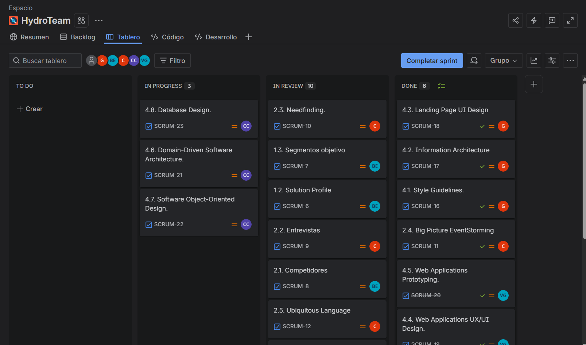

### Tabla de Control de Estado para el Sprint 1

| User Story | | Work-Item / Task | | | | | |
| :--- | :--- | :--- | :--- | :--- | :--- | :--- | :--- |
| **Id** | **Title** | **Id** | **Title** | **Description** | **Estimation (Hours)** | **Assigned To** | **Status (To-do / In-Process / To-Review / Done)** |
| US-21 | Visualizar dashboard principal | T-01 | Landing Page Frontend | Codificación de la estructura HTML y estilos CSS de la Landing Page. | 10 | Todos | Done |
| US-21 | Visualizar dashboard principal | T-02 | Responsive Design | Adaptación de la Landing Page para dispositivos móviles (Media Queries). | 6 | Todos | Done |
| US-29 | Registrarse en el sistema | T-03 | Database Schema | Diseño y creación de las tablas de usuarios y perfiles en la base de datos. | 4 | Cesar | Done |
| TS-02 | API Telemetría | T-04 | JSON Data Structure | Definición del formato de intercambio de datos (JSON) para gas y temperatura. | 6 | Briguite | To-do |
| TS-06 | API Usuarios | T-05 | Auth Logic Design | Diseño de la lógica de autenticación y flujo de tokens para el acceso. | 5 | Camila | To-do |
| CG-01 | Constraint General | T-06 | GitHub/Deployment Setup | Configuración del repositorio de la organización y hosting para la Landing Page. | 3 | Gabriel | Done |
    
    
### 5.2.1.4. Development Evidence for Sprint Review.

| Repository                                      | Branch                                          | Commit Id                                   | Commit Message                                           | Commit Message Body                                                                                                                                                 | Committed on (Day) |
|-------------------------------------------------|-------------------------------------------------|---------------------------------------------|----------------------------------------------------------|--------------------------------------------------------------------------------------------------------------------------------------------------------------------|-------------------|
| **Landing Page Repository**                     |                                                 |                                             |                                                          |                                                                                                                                                                    |                    |
| upc-pre-2610-1ASI0730-12263-G2/SmartGas-website                         | main                                 | ea113926521401c4ecd69030da149fe4a96d7154     | assets: add images to images folder                            | Added the images of the landing page.                                                                                                    | 19/04/2026         |
| upc-pre-2610-1ASI0730-12263-G2/SmartGas-website                         | feature/about-us                                 | 9ed196d3e709461b9da437f5355f134da8aee156     | feat: add about us html section    |    Added the html code for about us                                                                          | 19/04/2026     |
| upc-pre-2610-1ASI0730-12263-G2/SmartGas-website                         | feature/about-us                                | ab98052b6cb5c8984fd4ff11e2f08a7d58d5d5d1     | feat: add about us css section                                |  Added the css code for about us                                                                                                        | 19/04/2026       |
| upc-pre-2610-1ASI0730-12263-G2/SmartGas-website                         | feature/benefits                                | 0fe5cdb31d09b9d77d0ef15ec1cdd2e4efbc466a     | feat: add benefits and features html sections        | Added the html code of benefits and features                                                                                                       | 19/04/2026         |
| upc-pre-2610-1ASI0730-12263-G2/SmartGas-website                        | feature/benefits                                  | cd12a9814fb0de32eafd55bb9e160ac6ce0bc3af     | feat: add benefits html sections          | Added html code for benefits section.                                                                                                        | 19/04/2026         |
| upc-pre-2610-1ASI0730-12263-G2/SmartGas-website                       | feature/benefits                                  | 07968355b87f56a676863b23c60def1a51e196e5     | feat: add benefits css sections                  | Added css code of benefit section.                                                   | 19/04/2026         |
| upc-pre-2610-1ASI0730-12263-G2/SmartGas-website                       | feature/characteristics                                  | 774c815e04b8148477dc3cc1792cc558abaa465c     | feat: add characteristics html sections                   | Added html code for characteristics section                                                                                                | 19/04/2026        |
| upc-pre-2610-1ASI0730-12263-G2/SmartGas-website                        | feature/chareacteristics                              | cd857fc325e4fedb22bdae3dedb47fbe69225738     | feat: add characteristics css sections        | Added css code of characteristics section.                                                                        | 19/04/2026         |
| upc-pre-2610-1ASI0730-12263-G2/SmartGas-website                        | feature/contact                              | 966efefee8bffb3144bfa79b9370060479b85db8     | feat: add contacto html sections  | Added html code of contact section.    | 19/04/2026     |
| upc-pre-2610-1ASI0730-12263-G2/SmartGas-website                        | feature/contact                              | 39e96611d010d1023b07c95bbe13f191ecf6ca0b     | feat: add contacto css sections  | Added contact css code.    | 19/04/2026     |
| upc-pre-2610-1ASI0730-12263-G2/SmartGas-website                        | feature/extra                              | ee01c356d7b0098daf287b5cca1c76e684bf1312     | feat: add responsive design css sections  | Added css code for responsive design.    | 19/04/2026     |
| upc-pre-2610-1ASI0730-12263-G2/SmartGas-website                        | feature/footer                              | af612aedc19bdcb6d2d0ed2bf2d9f5b75bcca516     | feat: add footer html sections  | Added html code of footer section.    | 19/04/2026     |
| upc-pre-2610-1ASI0730-12263-G2/SmartGas-website                        | feature/footer                              | f7ed5b948169a9e63b864cdddc14d56d28ee20df     | feat: add footer css sections  | Added css code of footer section.    | 19/04/2026     |
| upc-pre-2610-1ASI0730-12263-G2/SmartGas-website                        | feature/members                              | f53e1584c85f44b56380b9d66fa8958c5edee814     | feat: add team section with member details  | Added html code of team members section.    | 19/04/2026     |
| upc-pre-2610-1ASI0730-12263-G2/SmartGas-website                        | feature/members                              | 1034ce383a9da41fa92758977e68917b032cfa23     | feat: add styles for team section and cards  | Added css code of team members section.    | 19/04/2026     |
| upc-pre-2610-1ASI0730-12263-G2/SmartGas-website                        | feature/navigation                             | 7899a03e414632153689b727b734410a43f67f8b     | feat: add navigation html sections  | Added html code of navigation section.    | 19/04/2026     |
| upc-pre-2610-1ASI0730-12263-G2/SmartGas-website                        | feature/navigation                            | 1034ce383a9da41fa92758977e68917b032cfa23     | feat: add navigation css sections  | Added the css code of navigation section.    | 19/04/2026     |
| upc-pre-2610-1ASI0730-12263-G2/SmartGas-website                        | feature/portada                              | 1034ce383a9da41fa92758977e68917b032cfa23     | feat: add portada html sections  | Added the html code of portada.    | 19/04/2026     |
| upc-pre-2610-1ASI0730-12263-G2/SmartGas-website                        | feature/portada                              | 036ff20f7d1dd207849066ddb0433e7aecda31b5     | feat: add front page css section  | Added front page css section..    | 19/04/2026     |
    
### 5.2.1.5. Execution Evidence for Sprint Review.

Durante este Sprint, el equipo logró implementar la versión inicial del Landing Page funcional, rápido y estático, incluido el sistema de idiomas.

La sección principal de la Landing page nos presenta el titulo, subtitulo, descripción del producto y llamados a la acción (CTA) los cuales guian al visitante hacia el registro o a la sección de más información.

*Figura 74 (Execution Evidence for Sprint Review 1)*
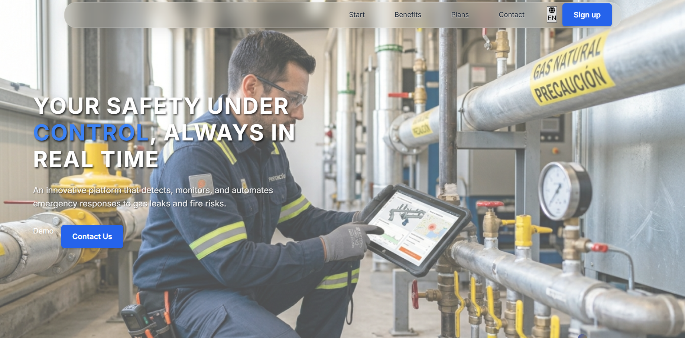

En está sección el usuario puede ver cuales son nuestros valores como empresa, sobre que trata nuestro producto y con que fin lo estamos desarrollando.

*Figura 75 (Execution Evidence for Sprint Review 2)*
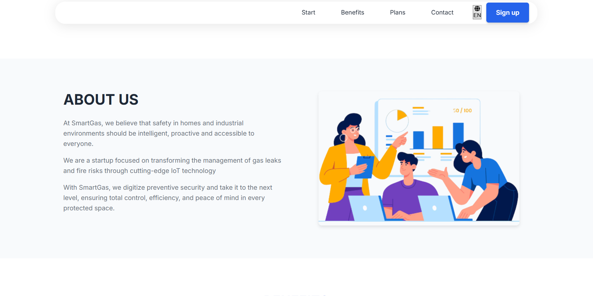

En está sección se muestra de forma detallada que es lo que ofrecemos a los usuarios y las caracteristicas importantes de SmartGas.

*Figura 76 (Execution Evidence for Sprint Review 3)*
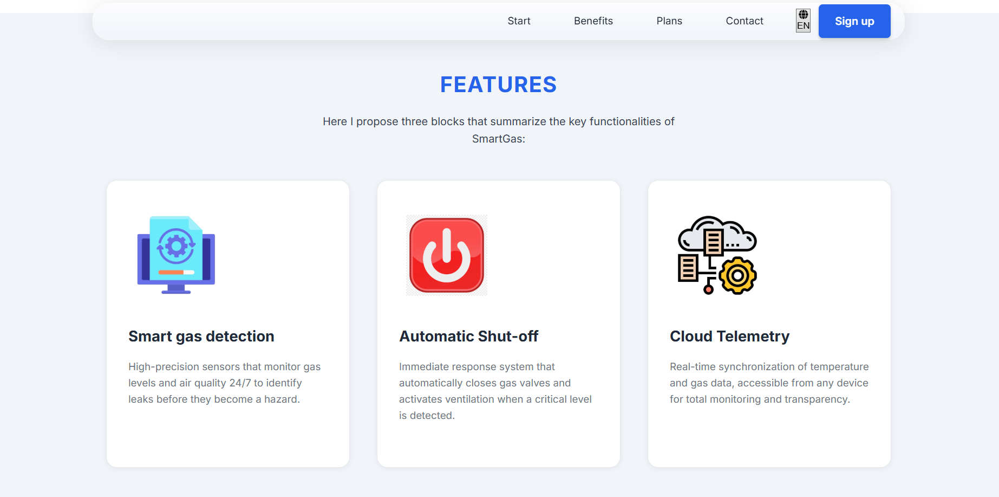

En está sección se puede apreciar los planes que ofrecemos y cual es el costo de cada uno de ellos. Los precios son presentados mediante tarjetas visuales que indican las caracteristicas de cada plan.

*Figura 77 (Execution Evidence for Sprint Review 4)*
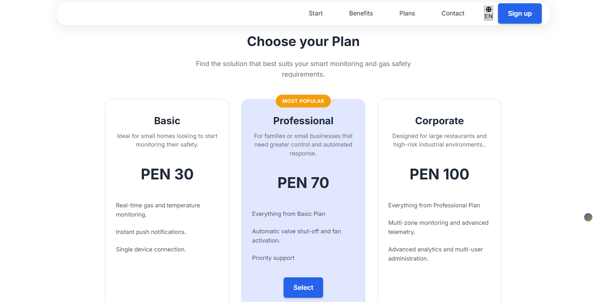

Está sección nos muestra a todos los integrantes del equipo SmartGuard mediante cards visuales las caules contienen una foto de cada uno de los integrantes acompañada de una pequeña descripción.

*Figura 78 (Execution Evidence for Sprint Review 5)*


En está sección el usuario puede colocar sus datos para contactarse con nosotros.

*Figura 79 (Execution Evidence for Sprint Review 6)*


Es el footer de landing page se puede ver nuestro logo, el copyright y un apartado en donde el usuario puede colocar su correo para registrarlo.

*Figura 80 (Execution Evidence for Sprint Review 7)*

    
### 5.2.1.6. Services Documentation Evidence for Sprint Review.

N/A. Durante el Sprint 1 el esfuerzo de desarrollo se enfocó exclusivamente en la creación del sitio web estático promocional (Landing Page), por lo que aún no se han implementado APIs RESTful ni Endpoints que requieran documentación con Swagger/OpenAPI. Esta documentación se generará a partir del Sprint 3.
    
### 5.2.1.7. Software Deployment Evidence for Sprint Review.

Para el despliegue continuo (CI/CD) de este Sprint, se configuró el entorno de GitHub Pages conectado directamente al repositorio de GitHub del Landing Page estático, permitiendo publicaciones automáticas y ultra-rápidas con cada PR fusionado en la rama main.

|Aspecto       |Detalle         |
|--------------|----------------|
|Plataforma de despliegue|GitHub Pages|
|Repositorio|[SmartGuard-Website](https://github.com/upc-pre-2610-1ASI0730-12263-G2/SmartGas-website)|
|URL Landing Page|https://upc-pre-2610-1asi0730-12263-g2.github.io/SmartGas-website/ |
|Rama de despliegue|main|
|Fecha de despliegue|24/04/2026|
|Estado Actual|	Desplegado y Funcional|
|Tipo de Sitio|Sitio Web Estático (HTML, CSS, JavaScript)|
|HTTPS|Habilitado (Certificado SSL automático)|

Proceso de Despliegue Detallado
El proceso de despliegue se realizó siguiendo los siguientes pasos:

#### Paso 1: Preparación del Repositorio

Se configuró el repositorio del Landing Page en GitHub con la estructura completa de archivos
Se organizaron los archivos HTML, CSS, JavaScript y assets en carpetas apropiadas
Se aseguró que todos los archivos estuvieran en la rama main
#### Paso 2: Configuración de GitHub Pages

Se accedió a la configuración del repositorio en GitHub
Se habilitó GitHub Pages en la sección "Pages" de la configuración
Se seleccionó la rama main como fuente del sitio.
#### Paso 3: Generación de la URL

GitHub Pages generó automáticamente la URL del sitio
La URL sigue el formato: "https://[organizacion].github.io/[nombre-repositorio]/"

#### Paso 4: Verificación del Despliegue

Se verificó que el sitio estuviera accesible en la URL proporcionada
Se comprobó que el certificado SSL estuviera activo (HTTPS)
Se validó que todos los recursos se cargaran correctamente
#### Paso 5: Validación de Funcionalidad Se realizaron pruebas exhaustivas para verificar que todas las funcionalidades del Landing Page funcionaran correctamente:

Navegación entre secciones: Todos los enlaces del menú funcionan correctamente
Diseño responsive: El sitio se adapta correctamente a diferentes tamaños de pantalla (mobile, tablet, desktop)
Carga de imágenes y assets: Todas las imágenes y recursos se cargan sin errores
Funcionalidad de enlaces y botones: Todos los botones y enlaces son funcionales
Estilos CSS aplicados: Los estilos se aplican correctamente en todas las secciones
Rendimiento: El sitio carga rápidamente y sin errores en la consola
Compatibilidad de navegadores: Se probó en Chrome, Firefox, Safari y Edge

### 5.2.1.8. Team Collaboration Insights during Sprint.

*Figura 81 (Team Collaboration Insights during Sprint Portada)*
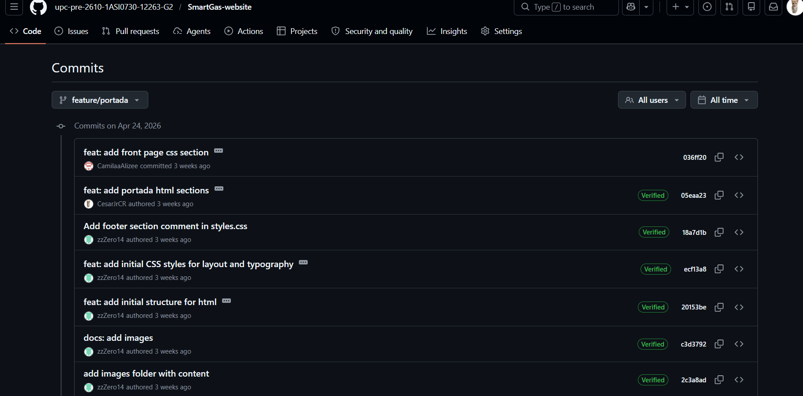

*Figura 82 (Team Collaboration Insights during Sprint Navigation)*
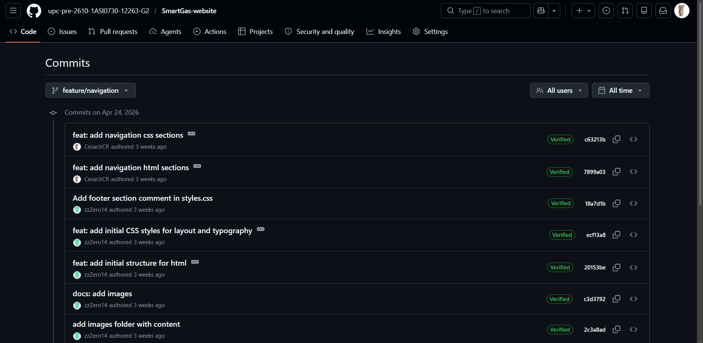

*Figura 83 (Team Collaboration Insights during Sprint Pricing)*
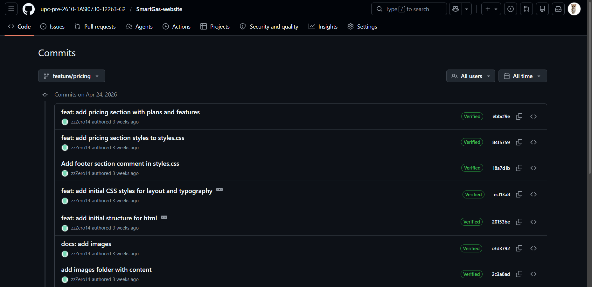

*Figura 84 (Team Collaboration Insights during Sprint Members)*
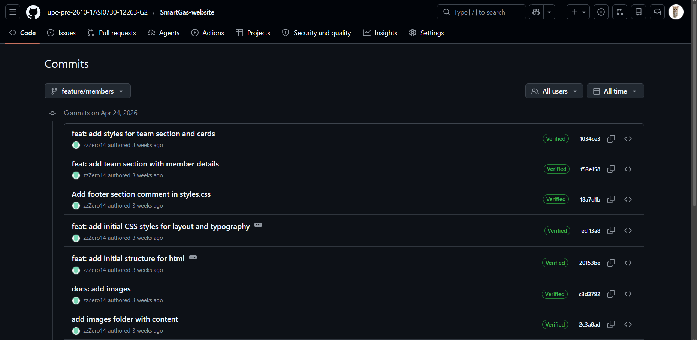

*Figura 85 (Team Collaboration Insights during Sprint Footer)*


*Figura 86 (Team Collaboration Insights during Sprint Extra)*


*Figura 87 (Team Collaboration Insights during Sprint Contact)*


*Figura 88 (Team Collaboration Insights during Sprint Characteristics)*


*Figura 89 (Team Collaboration Insights during Sprint Benefits)*


*Figura 90 (Team Collaboration Insights during Sprint About-us)*


## 5.2.2. Sprint 2 

### 5.2.2.1. Sprint Planning 2. 

| Sprint # | Sprint 2 |
| :--- | :--- |
| **Sprint Planning Background** | |
| **Date** | 2026-05-13 |
| **Time** | 10:00 AM |
| **Location** | Virtual (Discord) |
| **Prepared By** | Cesar Jair Contreras Rojas |
| **Attendees** | Cesar Jair Contreras Rojas / Gabriel Ferran Espinar Martínez / Briguite Eryka Carhuaz Centeno/ Camila Alizée Otiniano Rosales/ Valeria Alexandra Rojas Gomez|
| **Sprint n – 1 Review Summary** | During Sprint 1, the team successfully delivered the Landing Page and completed the initial setup of the development environment. |
| **Sprint n – 1 Retrospective Summary** |The team agreed that communication and task assignment worked efficiently through Discord. However, they identified the need to improve time estimation for user stories and maintain more consistent documentation updates across all modules.  |
| **Sprint Goal & User Stories** | |
| **Sprint 2 Goal** |Deliver the foundational components of the SmartGas platform by designing and deploying a fully functional and responsive web interface that effectively communicates the IoT safety solution's value proposition and facilitates seamless user authentication and real-time alert monitoring. |
| **Sprint 2 Velocity** | 25 Story Points |
| **Sum of Story Points** | 25 Story Points |

### 5.2.2.2. Aspect Leaders and Collaborators. 

En esta sección se presenta la distribución de roles y responsabilidades del equipo durante el Sprint 2, identificando a los líderes (L) y colaboradores (C) para cada aspecto de trabajo colaborativo. Esta distribución permite una organización efectiva del trabajo y asegura que cada aspecto crítico del proyecto tenga un responsable que guíe y coordine las actividades relacionadas.

La asignación de líderes se realizó considerando las fortalezas y experiencia de cada miembro del equipo, así como sus intereses y disponibilidad. Los colaboradores trabajan de manera coordinada con los líderes para asegurar que todos los aspectos del proyecto reciban la atención necesaria y que el trabajo se desarrolle de manera eficiente y colaborativa.

<table border="1" cellspacing="0" cellpadding="8" style="border-collapse:collapse; width:100%; text-align:center; font-family:Arial; font-size:11px;">
  <tr>
    <th rowspan="2">Team Member</th>
    <th rowspan="2">GitHub Username</th>
    <th colspan="5">Aspect</th>
  </tr>
  <tr>
    <th>Team Coordination and Organization<br>Leader (L) / Collaborator (C)</th>
    <th>Effective Communication<br>Leader (L) / Collaborator (C)</th>
    <th>Problem-Solving and Decision-Making<br>Leader (L) / Collaborator (C)</th>
    <th>Mutual Support and Knowledge Sharing<br>Leader (L) / Collaborator (C)</th>
    <th>Monitoring and Continuous Improvement<br>Leader (L) / Collaborator (C)</th>
  </tr>
  <tr>
    <td>Cesar Jair Contreras Rojas</td>
    <td>CesarJrCR</td>
    <td><strong>L</strong></td>
    <td>C</></td>
    <td>C</td>
    <td>C</td>
    <td>C</td>
  </tr>
  <tr>
    <td> Briguite Eryka Carhuaz Centeno</td>
    <td>briicarhuaz</td>
    <td>C</td>
    <td>C</td>
    <td><strong>L</strong></td>
    <td>C</td>
    <td>C</td>
  </tr>
    <td>Valeria Alexandra Rojas Gomez</td>
    <td>ValeriaAler</td>
    <td>C</td>
    <td>C</td>
    <td>C</td>
    <td><strong>L</strong></td>
    <td>C</td>
  <tr>
    <td>Espinar Martínez Gabriel Ferran</td>
    <td>zzZero14</td>
    <td>C</td>
    <td><strong>L</strong></td>
    <td>C</td>
    <td>C</td>
    <td>C</td>
  </tr>
  <tr>
    <td> Camila Alizée Otiniano Rosales</td>
    <td>CamilaaAlizee </td>
    <td>C</td>
    <td>C</td>
    <td>C</td>
    <td>C</td>
    <td><strong>L</strong></td>
  </tr>
</table>

### 5.2.2.3. Sprint Backlog 2. 

| User Story |                                         | Work-Item / Task |                                |                                                                                          |                        |                 |                                                    |
| :--------- | :-------------------------------------- | :--------------- | :----------------------------- | :--------------------------------------------------------------------------------------- | :--------------------- | :-------------- | :------------------------------------------------- |
| **Id**     | **Title**                               | **Id**           | **Title**                      | **Description**                                                                          | **Estimation (Hours)** | **Assigned To** | **Status (To-do / In-Process / To-Review / Done)** |
| US-21      | Visualizar dashboard principal          | T-01             | Dashboard UI Implementation    | Desarrollo del panel principal con métricas generales de sensores, zonas e incidentes.   | 8                      | Cesar           | Done                                               |
| US-05      | Visualizar estado en tiempo real        | T-03             | Monitoring Screen              | Desarrollo de la pantalla de monitoreo de gas y temperatura en tiempo real.              | 10                     | Gabriel         | Done                                               |
| US-06      | Actualización automática de datos       | T-04             | Real-Time Data Refresh         | Implementación de actualización automática de lecturas simuladas sin recargar la página. | 6                      | Briguite        | Done                                               |
| US-01      | Registrar sensor                        | T-05             | Sensor Registration Form       | Creación del formulario para registrar sensores IoT dentro del sistema.                  | 5                      | Cesar           | Done                                               |
| US-02      | Asociar sensor a ubicación              | T-06             | Sensor-Zone Assignment         | Implementación de la asociación de sensores a zonas monitoreadas.                        | 4                      | Gabriel         | Done                                               |
| US-04      | Visualizar sensores registrados         | T-07             | Sensor Management View         | Desarrollo de la vista de sensores registrados y sus estados.                            | 4                      | Camila          | Done                                               |
| US-03      | Configurar parámetros del sensor        | T-08             | Sensor Threshold Configuration | Configuración de límites de gas y temperatura para sensores.                             | 5                      | Cesar           | Done                                               |
| US-09      | Detectar niveles peligrosos de gas      | T-09             | Gas Anomaly Detection Logic    | Implementación de validación de niveles peligrosos de gas.                               | 8                      | Gabriel         | Done                                               |
| US-10      | Detectar temperaturas anómalas          | T-10             | Temperature Risk Detection     | Desarrollo de lógica para identificar temperaturas críticas.                             | 8                      | Briguite        | Done                                               |
| US-11      | Validar datos del sensor                | T-11             | Sensor Data Validation         | Validación de lecturas simuladas antes del procesamiento de incidentes.                  | 5                      | Camila          | Done                                               |
| US-12      | Generar evento de anomalía              | T-12             | Incident Generation Module     | Creación automática de incidentes a partir de lecturas críticas.                         | 6                      | Cesar           | Done                                               |
| US-13      | Generar alerta automática               | T-13             | Alert Trigger Service          | Generación automática de alertas relacionadas con incidentes detectados.                 | 5                      | Gabriel         | Done                                               |
| US-14      | Clasificar nivel de alerta              | T-14             | Alert Severity Classification  | Clasificación de alertas según nivel de riesgo y severidad.                              | 4                      | Briguite        | Done                                               |
| US-15      | Visualizar alertas activas              | T-15             | Active Alerts Interface        | Desarrollo de interfaz para visualizar alertas activas del sistema.                      | 4                      | Camila          | Done                                               |
| US-17      | Enviar notificación en tiempo real      | T-16             | Notification System            | Implementación de notificaciones inmediatas desde la interfaz web.                       | 8                      | Cesar           | Done                                               |
| US-19      | Visualizar notificaciones               | T-17             | Notification Center            | Creación del centro de notificaciones y alertas recientes.                               | 4                      | Gabriel         | Done                                               |
| US-20      | Confirmar recepción de alerta           | T-18             | Alert Confirmation Feature     | Implementación de confirmación y marcado de alertas como leídas.                         | 3                      | Camila          | Done                                               |
| US-25      | Registrar historial de incidencias      | T-22             | Incident History Storage       | Registro persistente de incidentes dentro de JSON Server.                                | 5                      | Camila          | Done                                               |
| US-26      | Consultar historial de eventos          | T-23             | Incident History Module        | Desarrollo de módulo para revisar eventos e incidentes pasados.                          | 4                      | Briguite        | Done                                               |
| US-27      | Filtrar historial por fecha             | T-24             | Date Range Filtering           | Implementación de filtros de historial por rango de fechas.                              | 3                      | Cesar           | Done                                               |
| US-28      | Generar reporte de seguridad            | T-25             | Security Reports View          | Desarrollo de reportes visuales de incidentes, sensores y zonas.                         | 8                      | Gabriel         | Done                                               |
| US-29      | Registrarse en el sistema               | T-26             | User Registration Module       | Implementación de registro de usuarios y almacenamiento en JSON Server.                  | 5                      | Camila          | Done                                               |
| US-30      | Iniciar sesión                          | T-27             | Authentication Module          | Desarrollo de lógica de autenticación e inicio de sesión.                                | 5                      | Cesar           | Done                                               |
| US-31      | Gestionar perfil de usuario             | T-28             | User Profile Management        | Implementación de edición de perfil y datos del usuario.                                 | 4                      | Briguite        | Done                                               |
| US-32      | Cerrar sesión                           | T-29             | Logout Functionality           | Implementación de cierre de sesión y limpieza de estado.                                 | 2                      | Gabriel         | Done                                               |
| US-33      | Configurar límites de seguridad         | T-30             | Security Preferences Module    | Configuración de límites y preferencias de seguridad del sistema.                        | 5                      | Cesar           | Done                                               |
| US-34      | Configurar preferencias de notificación | T-31             | Notification Preferences       | Desarrollo de preferencias de alertas y configuraciones de contacto.                     | 3                      | Camila          | Done                                               |
| TS-01      | API gestión de sensores                 | T-32             | Sensor CRUD API                | Desarrollo de endpoints CRUD para sensores usando JSON Server.                           | 8                      | Gabriel         | Done                                               |
| TS-02      | API telemetría                          | T-33             | Telemetry API Simulation       | Simulación de recepción y procesamiento de datos IoT.                                    | 8                      | Briguite        | Done                                               |
| TS-03      | API detección de anomalías              | T-34             | Incident Detection API         | Implementación de lógica de detección de anomalías desde lecturas.                       | 8                      | Cesar           | Done                                               |
| TS-04      | API gestión de alertas                  | T-35             | Alerts API                     | Desarrollo de endpoints para alertas e incidentes registrados.                           | 5                      | Camila          | Done                                               |
| TS-05      | API notificaciones                      | T-36             | Notification Service API       | Integración de servicios de notificación simulados para alertas.                         | 6                      | Gabriel         | Done                                               |
| TS-06      | API usuarios                            | T-37             | Users API                      | Desarrollo de endpoints para autenticación y gestión de usuarios.                        | 5                      | Briguite        | Done                                               |
| CG-01      | Constraint General                      | T-38             | Firebase Deployment            | Despliegue del frontend en Firebase Hosting y configuración pública.                     | 4                      | Briguite           | Done                                               |
| CG-01      | Constraint General                      | T-39             | Render Backend Deployment      | Despliegue del JSON Server en Render para acceso remoto.                                 | 4                      | Briguite         | Done                                               |
| CG-01      | Constraint General                      | T-40             | Internationalization Support   | Implementación de soporte EN/ES y selector de idioma.                                    | 5                      | Briguite          | Done                                               |
| CG-01      | Constraint General                      | T-41             | Dark Mode Support              | Implementación y corrección visual del modo oscuro.                                      | 4                      | Briguite        | Done                                               |


### 5.2.2.4. Development Evidence for Sprint Review. 

| Repository                                      | Branch                                          | Commit Id                                   | Commit Message                                           | Commit Message Body                                                                                                                                                 | Committed on (Day) |
|-------------------------------------------------|-------------------------------------------------|---------------------------------------------|----------------------------------------------------------|--------------------------------------------------------------------------------------------------------------------------------------------------------------------|-------------------|
| **Landing Page Repository**                     |                                                 |                                             |                                                          |                                                                                                                                                                    |                    |
| upc-pre-2610-1ASI0730-12263-G2/SmartGas-webapp                         | main                                 | a4accc1e8dcfa4a0c65d83ee111f62a85697a555     | feat: integrate base layout router and translations                            | Merge pull request.                                                                                                    | 13/05/2026         |
| upc-pre-2610-1ASI0730-12263-G2/SmartGas-webapp                         | main                                 | c1344ba1661217894f1302ff790a99224045663f     | feat: integrate base layout router and translations    |   Merge pull request                                                                          | 13/05/2026     |
| upc-pre-2610-1ASI0730-12263-G2/SmartGas-webapp                         | main                               | 065f97c47b422e6b28f97668afaaef657ca7030f     | Develop                                |  Merge pull request                                                                                                        | 13/05/2026       |
| upc-pre-2610-1ASI0730-12263-G2/SmartGas-webapp                         | main                               | 0974507acbfbcb07c67976f8de3e072032273a44     | feat: add iam auth profile and settings        | Merge pull request                                                                                                       | 13/05/2026         |
| upc-pre-2610-1ASI0730-12263-G2/SmartGas-webapp                        | main                                 | bdd3ba571cafa6954e5bdca4a965d78b22115e47     | feat: add kitchen monitoring module          | Merge pull request.                                                                                                        | 13/05/2026         |
| upc-pre-2610-1ASI0730-12263-G2/SmartGas-webapp                       | main                                   | 4dc1a8dcfa3e7e4f39b98d8d6bd5dfa3ebf0529f     | feat: add incidents alerts and notifications modules                 | Merge pull request.                                                   | 13/05/2026         |


### 5.2.2.5. Execution Evidence for Sprint Review. 

En esta sección se presenta un resumen de lo logrado en el Sprint 2 actual, mostrando las principales vistas implementadas y la funcionalidad desarrollada. La sección inicia con una introducción que explica los logros principales del sprint y luego presenta capturas de pantalla de las vistas principales implementadas.

Para una mejor comprensión de la funcionalidad implementada, se ha preparado un video que demuestra la navegación y las principales funcionalidades desarrolladas durante el Sprint 2.

- **URL del video:**  [Video](https://upcedupe-my.sharepoint.com/:v:/g/personal/u202411373_upc_edu_pe/IQAUkAcj096SSLc3sJ-zlna-ARi38JolC3zBGlj_T-jjMhg?e=xiV87p&nav=eyJyZWZlcnJhbEluZm8iOnsicmVmZXJyYWxBcHAiOiJTdHJlYW1XZWJBcHAiLCJyZWZlcnJhbFZpZXciOiJTaGFyZURpYWxvZy1MaW5rIiwicmVmZXJyYWxBcHBQbGF0Zm9ybSI6IldlYiIsInJlZmVycmFsTW9kZSI6InZpZXcifX0%3D)

### 5.2.2.6. Services Documentation Evidence for Sprint Review. 

## Relación de Endpoints y Documentación OpenAPI

En esta sección se incluye la relación de Endpoints documentados con OpenAPI relacionados con el alcance del Sprint 2. La sección inicia con una introducción que resume los logros relacionados con la documentación de Web Services para este Sprint.

Durante el Sprint 2, el equipo se enfocó exclusivamente en el desarrollo del frontend de las aplicaciones web. Este sprint corresponde al TP1 (Stage Review), que tiene como objetivo principal la implementación y despliegue de las Frontend Web Applications. Los Web Services (backend) serán implementados y documentados en el Sprint 3 (TB2), por lo que en este sprint no se realizó trabajo de implementación de servicios web.

---

## Estado de la Documentación en Sprint 2

Los Web Services aún no han sido implementados, ya que el Sprint 2 se enfoca únicamente en el desarrollo del frontend. La documentación de servicios web con OpenAPI/Swagger se realizará en el Sprint 3 cuando se implementen los endpoints del backend.

Por lo tanto, esta sección documenta que los servicios web están planificados pero aún no implementados.

---

## Enfoque del Sprint 2: Frontend Web Applications

El Sprint 2 se centra en el desarrollo del frontend, por lo que no se realizó trabajo de implementación de servicios web. Sin embargo, durante el desarrollo del frontend se utilizaron datos mock que simulan las respuestas de los servicios web que serán implementados en el Sprint 3.

Esto permitió:

- Validar la estructura de datos esperada desde el frontend.
- Definir los contratos de API que se implementarán en el Sprint 3.
- Desarrollar los servicios API del frontend (capa Infrastructure) que se conectarán al backend.

---

## Repositorio de Frontend

- **Repositorio Frontend:** [SmartGas](https://smartgas-app-web-v1.web.app/login)
- **Estado:** Implementado y funcional con datos mock.
- **Framework:** Vue.js 3, Pinia, Vue Router.
- **Arquitectura:** Clean Architecture con capas de Infrastructure que preparan la integración con servicios web.

#### 1. User Management / IAM

| Endpoint | HTTP Verb | Sintaxis de llamada | Parámetros | Estado |
|---|---|---|---|---|
| `/accounts` | GET | `GET /accounts?email={email}&password={password}` | Query: email, password | Implementado |
| `/accounts` | GET | `GET /accounts?email={email}` | Query: email | Implementado |
| `/accounts` | POST | `POST /accounts` | Body: account data `(email, password, role, planId, status)` | Implementado |
| `/accounts/{id}` | PATCH | `PATCH /accounts/{id}` | Path: id, Body: datos de cuenta actualizados | Implementado |
| `/profiles` | GET | `GET /profiles?accountId={accountId}` | Query: accountId | Implementado |
| `/profiles` | POST | `POST /profiles` | Body: profile data `(accountId, fullName, businessName, phone, district, planId)` | Implementado |
| `/profiles/{id}` | PATCH | `PATCH /profiles/{id}` | Path: id, Body: datos de perfil actualizados | Implementado |
| `/settings` | GET | `GET /settings?accountId={accountId}` | Query: accountId | Implementado |
| `/settings` | POST | `POST /settings` | Body: settings data `(language, darkMode, notifications, thresholds)` | Implementado |
| `/settings/{id}` | PATCH | `PATCH /settings/{id}` | Path: id, Body: preferencias actualizadas | Implementado |
| `/emergencyContacts` | GET | `GET /emergencyContacts?accountId={accountId}` | Query: accountId | Implementado |
| `/emergencyContacts` | POST | `POST /emergencyContacts` | Body: emergency contact data | Implementado |
| `/emergencyContacts/{id}` | PATCH | `PATCH /emergencyContacts/{id}` | Path: id, Body: datos del contacto actualizados | Implementado |
| `/accountActivities` | GET | `GET /accountActivities?accountId={accountId}` | Query: accountId | Implementado |
| `/accountActivities` | POST | `POST /accountActivities` | Body: activity data `(accountId, type, description, createdAt)` | Implementado |

---

#### 2. Kitchen Monitoring

| Endpoint | HTTP Verb | Sintaxis de llamada | Parámetros | Estado |
|---|---|---|---|---|
| `/zones` | GET | `GET /zones?accountId={accountId}` | Query: accountId | Implementado |
| `/zones/{id}` | GET | `GET /zones/{id}` | Path: id | Implementado |
| `/zones` | POST | `POST /zones` | Body: zone data `(accountId, name, sensitivity, status, gasLevel, temperature)` | Implementado |
| `/zones/{id}` | PATCH | `PATCH /zones/{id}` | Path: id, Body: datos de zona actualizados | Implementado |
| `/sensors` | GET | `GET /sensors?accountId={accountId}` | Query: accountId | Implementado |
| `/sensors` | GET | `GET /sensors?accountId={accountId}&code={code}` | Query: accountId, code | Implementado |
| `/sensors/{id}` | GET | `GET /sensors/{id}` | Path: id | Implementado |
| `/sensors` | POST | `POST /sensors` | Body: sensor data `(accountId, zoneId, code, name, type, status, battery)` | Implementado |
| `/sensors/{id}` | PATCH | `PATCH /sensors/{id}` | Path: id, Body: datos de sensor actualizados | Implementado |
| `/sensorReadings` | GET | `GET /sensorReadings?accountId={accountId}` | Query: accountId | Implementado |
| `/sensorReadings` | POST | `POST /sensorReadings` | Body: reading data `(accountId, sensorId, zoneId, gasLevel, temperature, createdAt)` | Implementado |
| `/sensorReadings/{id}` | PATCH | `PATCH /sensorReadings/{id}` | Path: id, Body: datos de lectura actualizados | Implementado |

---

#### 3. Incident Detection

| Endpoint | HTTP Verb | Sintaxis de llamada | Parámetros | Estado |
|---|---|---|---|---|
| `/incidents` | GET | `GET /incidents?accountId={accountId}` | Query: accountId | Implementado |
| `/incidents` | GET | `GET /incidents?accountId={accountId}&zoneId={zoneId}` | Query: accountId, zoneId | Implementado |
| `/incidents/{id}` | GET | `GET /incidents/{id}` | Path: id | Implementado |
| `/incidents` | POST | `POST /incidents` | Body: incident data `(accountId, zoneId, sensorId, type, severity, status, detectedAt)` | Implementado |
| `/incidents/{id}` | PATCH | `PATCH /incidents/{id}` | Path: id, Body: estado, nota, reviewedAt o resolvedAt | Implementado |
| `/alerts` | GET | `GET /alerts?accountId={accountId}` | Query: accountId | Implementado |
| `/alerts` | GET | `GET /alerts?incidentId={incidentId}` | Query: incidentId | Implementado |
| `/alerts` | POST | `POST /alerts` | Body: alert data `(accountId, incidentId, message, status, createdAt)` | Implementado |
| `/alerts/{id}` | PATCH | `PATCH /alerts/{id}` | Path: id, Body: status, resolvedAt | Implementado |

---

#### 4. Incident Prevention & Notification

| Endpoint | HTTP Verb | Sintaxis de llamada | Parámetros | Estado |
|---|---|---|---|---|
| `/notifications` | GET | `GET /notifications?accountId={accountId}` | Query: accountId | Implementado |
| `/notifications` | POST | `POST /notifications` | Body: notification data `(accountId, incidentId, message, channel, read, confirmed, createdAt)` | Implementado |
| `/notifications/{id}` | PATCH | `PATCH /notifications/{id}` | Path: id, Body: read, confirmed, confirmedAt | Implementado |

---

#### 5. Post-Incident Procedures / Reports

| Endpoint | HTTP Verb | Sintaxis de llamada | Parámetros | Estado |
|---|---|---|---|---|
| `/incidents` | GET | `GET /incidents?accountId={accountId}` | Query: accountId | Implementado |
| `/alerts` | GET | `GET /alerts?accountId={accountId}` | Query: accountId | Implementado |
| `/zones` | GET | `GET /zones?accountId={accountId}` | Query: accountId | Implementado |
| `/incidents/{id}` | PATCH | `PATCH /incidents/{id}` | Path: id, Body: note, status, reviewedAt, resolvedAt | Implementado |

> Nota: El reporte de seguridad se genera en el frontend usando datos obtenidos desde `/incidents`, `/alerts` y `/zones`.  
> No existe un endpoint físico llamado `/reports`, porque el reporte se construye como vista de análisis dentro de la Web Application.

---

#### 6. Payment Management

| Endpoint | HTTP Verb | Sintaxis de llamada | Parámetros | Estado |
|---|---|---|---|---|
| `/plans` | GET | `GET /plans` | Sin parámetros | Implementado |
| `/plans/{id}` | GET | `GET /plans/{id}` | Path: id | Implementado |
| `/subscriptions` | GET | `GET /subscriptions?accountId={accountId}` | Query: accountId | Implementado |
| `/subscriptions` | POST | `POST /subscriptions` | Body: subscription data `(accountId, planId, status, startDate, renewalDate)` | Implementado |
| `/subscriptions/{id}` | PATCH | `PATCH /subscriptions/{id}` | Path: id, Body: planId, updatedAt | Implementado |
| `/subscriptionRequests` | GET | `GET /subscriptionRequests?accountId={accountId}` | Query: accountId | Implementado |
| `/subscriptionRequests` | GET | `GET /subscriptionRequests?accountId={accountId}&status=Pending` | Query: accountId, status | Implementado |
| `/subscriptionRequests` | POST | `POST /subscriptionRequests` | Body: request data `(accountId, currentPlanId, targetPlanId, status, createdAt)` | Implementado |
| `/subscriptionRequests/{id}` | PATCH | `PATCH /subscriptionRequests/{id}` | Path: id, Body: status, updatedAt | Implementado |

---

#### 7. Dashboard / Panel General

| Endpoint | HTTP Verb | Sintaxis de llamada | Parámetros | Estado |
|---|---|---|---|---|
| `/sensors` | GET | `GET /sensors?accountId={accountId}` | Query: accountId | Implementado |
| `/zones` | GET | `GET /zones?accountId={accountId}` | Query: accountId | Implementado |
| `/incidents` | GET | `GET /incidents?accountId={accountId}` | Query: accountId | Implementado |
| `/alerts` | GET | `GET /alerts?accountId={accountId}` | Query: accountId | Implementado |
| `/sensorReadings` | GET | `GET /sensorReadings?accountId={accountId}` | Query: accountId | Implementado |
| `/subscriptions` | GET | `GET /subscriptions?accountId={accountId}` | Query: accountId | Implementado |
| `/plans` | GET | `GET /plans` | Sin parámetros | Implementado |

> Nota: El dashboard no es un bounded context propio.  
> Es una vista resumen que consume información de Kitchen Monitoring, Incident Detection, Incident Prevention & Notification y Payment Management.

---

#### Resumen de recursos usados en JSON Server

| Recurso | Uso principal |
|---|---|
| `/accounts` | Login, registro y datos principales de cuenta |
| `/profiles` | Información del perfil del usuario |
| `/plans` | Planes disponibles |
| `/subscriptions` | Suscripción activa del usuario |
| `/subscriptionRequests` | Solicitudes de cambio de plan |
| `/zones` | Zonas monitoreadas |
| `/sensors` | Sensores registrados |
| `/sensorReadings` | Lecturas de sensores |
| `/incidents` | Incidentes detectados |
| `/alerts` | Alertas relacionadas con incidentes |
| `/notifications` | Notificaciones al usuario |
| `/settings` | Preferencias de seguridad e interfaz |
| `/emergencyContacts` | Contacto de emergencia |
| `/accountActivities` | Actividad reciente de la cuenta |

---

# Observación técnica

El proyecto utiliza JSON Server como fake API. Por esa razón, los endpoints siguen una estructura REST simple sobre recursos del archivo `db.json`.

En una API real de backend, estos endpoints podrían agruparse bajo el prefijo `/api`, por ejemplo:

```txt
/api/accounts
/api/zones
/api/sensors
/api/incidents
/api/subscriptions
```

### 5.2.2.7. Software Deployment Evidence for Sprint Review. 

# Despliegue de la Web Application

Para el despliegue de la Web Application de SmartGas se utilizó una estrategia separada entre el frontend y la fake API. El frontend, desarrollado con Vue y Vite, fue desplegado en Firebase Hosting, mientras que el servidor JSON, basado en JSON Server y el archivo `db.json`, fue desplegado en Render. Esta separación permitió que la aplicación pudiera funcionar desde una URL pública sin depender del entorno local del desarrollador.

## Preparación del servidor JSON

En primer lugar, se preparó el servidor JSON para que pudiera ejecutarse correctamente en Render. Para ello, se creó un archivo de configuración llamado `server.cjs`, el cual se encarga de iniciar JSON Server tomando como fuente de datos el archivo `db.json`.

Este servidor fue configurado para utilizar el puerto asignado automáticamente por Render y aceptar conexiones externas, lo que permitió que la fake API quedara disponible públicamente en internet.

## Configuración de producción

Luego, en el archivo `package.json` se agregó un comando específico para producción, llamado `api:render`. Este comando permite que Render ejecute únicamente el servidor JSON, sin levantar el frontend de desarrollo.

Esto fue importante porque el comando local del proyecto inicia tanto Vite como JSON Server, pero en Render solo se necesitaba publicar la API.

## Despliegue en Render

Después de preparar el servidor, el proyecto fue subido a GitLab. GitLab se utilizó como repositorio para que Render pudiera acceder al código del proyecto y realizar el despliegue.

Posteriormente, en Render se creó un nuevo Web Service conectado al repositorio de GitLab. En la configuración del servicio se seleccionó Node como entorno de ejecución, se colocó `npm install` como comando de construcción y `npm run api:render` como comando de inicio.

Con esta configuración, Render instaló las dependencias del proyecto y ejecutó el servidor JSON de manera automática.

## Validación de la fake API

Una vez finalizado el despliegue en Render, se generó una URL pública para la API. Desde esta URL se pudieron consultar los recursos principales del sistema, como:

- `accounts`
- `plans`
- `zones`
- `sensors`
- `subscriptions`
- `incidents`
- `notifications`
- `settings`

Esto confirmó que la fake API estaba funcionando correctamente fuera del entorno local.

## Conexión entre frontend y API

Después de desplegar la API, se conectó el frontend con la URL pública de Render. Para ello, se configuró Axios para que pudiera usar una URL local durante el desarrollo y una URL de producción durante el despliegue.

En el entorno local, la aplicación consume los datos desde `localhost`, mientras que en producción utiliza la URL generada por Render.

Para lograr esto, se creó el archivo `.env.production` y se colocó allí la variable:

```env
VITE_API_BASE_URL=https://your-render-url.onrender.com
```

## Build de producción

Luego se generó la versión final del frontend mediante el proceso de build de Vite. Este proceso creó la carpeta `dist`, que contiene los archivos estáticos listos para producción, como HTML, CSS y JavaScript.

Esta carpeta fue la que posteriormente se publicó en Firebase Hosting.

## Configuración de Firebase Hosting

Para el despliegue del frontend, se inició sesión en Firebase desde la terminal y luego se configuró Firebase Hosting dentro del proyecto.

Durante la configuración se indicó que la carpeta pública sería `dist`, ya que ahí se encuentra la versión compilada de la aplicación.

También se configuró el proyecto como una **Single Page Application (SPA)**, lo cual permite que las rutas internas de Vue Router funcionen correctamente aunque el usuario recargue la página o ingrese directamente a una ruta específica.

## Despliegue final

Finalmente, se ejecutó el despliegue en Firebase Hosting. Como resultado, Firebase generó una URL pública para acceder a la Web Application de SmartGas.

Desde esta URL se validó que:

- La aplicación cargara correctamente.
- El login funcionara adecuadamente.
- Se pudieran visualizar y registrar datos.
- Las solicitudes HTTP ya no apuntaran a `localhost`, sino a la API desplegada en Render.

## Resultado final

En conclusión, el despliegue final quedó organizado de la siguiente manera:

- **Firebase Hosting:** aloja el frontend de SmartGas.
- **Render:** aloja la fake API construida con JSON Server y `db.json`.

De esta forma, la aplicación puede ser utilizada desde internet y mantiene una separación clara entre la interfaz web y la fuente de datos simulada.

### 5.2.2.8. Team Collaboration Insights during Sprint.

En esta sección el equipo explica cómo se han desarrollado las actividades de implementación y se presentan capturas en imagen de los analíticos de colaboración y commits en GitHub, realizados por los miembros del equipo. Todos los miembros del equipo deben tener participación en la implementación de cada uno de los productos según corresponda en el Sprint: Landing Page, Web Applications, Web Services.

Durante el Sprint 2, el equipo trabajó de manera colaborativa utilizando diversas herramientas y metodologías para asegurar la entrega exitosa de las aplicaciones web frontend. La colaboración se caracterizó por una comunicación constante, distribución efectiva de tareas y seguimiento continuo del progreso mediante herramientas de gestión de proyectos y control de versiones. Este sprint se enfocó principalmente en el desarrollo del frontend (Web Applications), con mejoras continuas al Landing Page y preparación para la implementación de servicios web en el Sprint 3.

#### Herramientas de Colaboración Utilizadas

El equipo utilizó las siguientes herramientas para facilitar la colaboración y el trabajo en equipo:

- **GitHub**: Control de versiones distribuido, code reviews mediante Pull Requests, seguimiento de issues y gestión de proyectos
  - Repositorios principales: SmartGas-webapp, SmartGas-report, SmartGas-website
  - Uso de GitFlow para gestión de branches
  - Conventional Commits para mensajes de commit consistentes

- **Jira**: Gestión de tareas y seguimiento del Sprint
  - Sprint Backlog con User Stories y tareas
  - Seguimiento de progreso en tiempo real
  - Gestión de bugs y mejoras
  - Reportes de velocidad del equipo

- **Figma**: Colaboración en diseño
  - Revisión de wireframes y mockups
  - Alineación del desarrollo con el diseño
  - Feedback visual sobre implementaciones


## 5.2.3. Sprint 3

### 5.2.3.1. Sprint Planning 3. 

| Sprint # | Sprint 3 |
| :--- | :--- |
| **Sprint Planning Background** | |
| **Date** | 2026-06-18 |
| **Time** | 10:00 AM |
| **Location** | Virtual (Discord) |
| **Prepared By** | Cesar Jair Contreras Rojas |
| **Attendees** | Cesar Jair Contreras Rojas / Gabriel Ferran Espinar Martínez / Briguite Eryka Carhuaz Centeno/ Camila Alizée Otiniano Rosales/ Valeria Alexandra Rojas Gomez|
| **Sprint n – 3 Review Summary** | The team successfully delivered the Landing Page with a functional deployment. The initial environment connection to the backend database is validated and minor adjustments to the registration process user experience (UX) to be more intuitive, which should be addressed in this Sprint. |
| **Sprint n – 3 Retrospective Summary**| The primary opportunity for improvement identified was the overestimation of time in the user stories . It was agreed to be more conservative in the estimation for Sprint 3. Communication remains fluid via Discord, and internal documentation improved as planned.|
| **Sprint Goal & User Stories** | |
| **Sprint 3 Goal** |Deliver the foundational components of the SmartGas platform by designing and deploying a fully functional and responsive web interface that effectively communicates the IoT safety solution's value proposition and facilitates seamless user authentication and real-time alert monitoring. |
| **Sprint 3 Velocity** | 25 Story Points |
| **Sum of Story Points** | 25 Story Points |

### 5.2.3.2. Aspect Leaders and Collaborators. 

En esta sección se presenta la distribución de roles y responsabilidades del equipo durante el Sprint 2, identificando a los líderes (L) y colaboradores (C) para cada aspecto de trabajo colaborativo. Esta distribución permite una organización efectiva del trabajo y asegura que cada aspecto crítico del proyecto tenga un responsable que guíe y coordine las actividades relacionadas.

La asignación de líderes se realizó considerando las fortalezas y experiencia de cada miembro del equipo, así como sus intereses y disponibilidad. Los colaboradores trabajan de manera coordinada con los líderes para asegurar que todos los aspectos del proyecto reciban la atención necesaria y que el trabajo se desarrolle de manera eficiente y colaborativa.

<table border="1" cellspacing="0" cellpadding="8" style="border-collapse:collapse; width:100%; text-align:center; font-family:Arial; font-size:11px;">
  <tr>
    <th rowspan="2">Team Member</th>
    <th rowspan="2">GitHub Username</th>
    <th colspan="5">Aspect</th>
  </tr>
  <tr>
    <th>Team Coordination and Organization<br>Leader (L) / Collaborator (C)</th>
    <th>Effective Communication<br>Leader (L) / Collaborator (C)</th>
    <th>Problem-Solving and Decision-Making<br>Leader (L) / Collaborator (C)</th>
    <th>Mutual Support and Knowledge Sharing<br>Leader (L) / Collaborator (C)</th>
    <th>Monitoring and Continuous Improvement<br>Leader (L) / Collaborator (C)</th>
  </tr>
  <tr>
    <td>Cesar Jair Contreras Rojas</td>
    <td>CesarJrCR</td>
    <td><strong>L</strong></td>
    <td>C</></td>
    <td>C</td>
    <td>C</td>
    <td>C</td>
  </tr>
  <tr>
    <td> Briguite Eryka Carhuaz Centeno</td>
    <td>briicarhuaz</td>
    <td>C</td>
    <td>C</td>
    <td><strong>L</strong></td>
    <td>C</td>
    <td>C</td>
  </tr>
    <td>Valeria Alexandra Rojas Gomez</td>
    <td>ValeriaAler</td>
    <td>C</td>
    <td>C</td>
    <td>C</td>
    <td><strong>L</strong></td>
    <td>C</td>
  <tr>
    <td>Espinar Martínez Gabriel Ferran</td>
    <td>zzZero14</td>
    <td>C</td>
    <td><strong>L</strong></td>
    <td>C</td>
    <td>C</td>
    <td>C</td>
  </tr>
  <tr>
    <td> Camila Alizée Otiniano Rosales</td>
    <td>CamilaaAlizee </td>
    <td>C</td>
    <td>C</td>
    <td>C</td>
    <td>C</td>
    <td><strong>L</strong></td>
  </tr>
</table>

### 5.2.3.3. Sprint Backlog 3. 

## Sprint Goal
Implementar el backend real de SmartGas API con endpoints RESTful, integración de servicios externos,
y conexión del frontend al nuevo backend desplegado en producción.

---

| User Story | | Work-Item / Task | | | | | |
|:---|:---|:---|:---|:---|:---|:---|:---|
| **Id** | **Title** | **Id** | **Title** | **Description** | **Estimation (Hours)** | **Assigned To** | **Status** |
| TS-06 | API para usuarios | T-01 | Backend Infrastructure Setup | Inicialización del repositorio backend, configuración del proyecto y estructura base. | 3 | Briguite | Done |
| TS-06 | API para usuarios | T-02 | Database Context & Seed Data | Configuración del contexto de base de datos y datos semilla iniciales. | 4 | Briguite | Done |
| TS-06 | API para usuarios | T-03 | Authentication Endpoints | Implementación de endpoints de registro, login y autenticación con tokens. | 6 | Cesar | Done |
| US-31 | Gestionar perfil de usuario | T-04 | Profiles & Settings Management | Implementación de endpoints para gestión de perfiles y configuraciones de usuario. | 5 | Cesar | Done |
| US-34 | Configurar preferencias de notificación | T-05 | Emergency Contact Management | Implementación de endpoints para gestión de contactos de emergencia. | 4 | Cesar | Done |
| TS-01 | API gestión de sensores | T-06 | Zone Management Endpoints | Desarrollo de endpoints CRUD para zonas monitoreadas. | 5 | Gabriel | Done |
| TS-01 | API gestión de sensores | T-07 | Sensor Management Endpoints | Desarrollo de endpoints CRUD para sensores IoT. | 6 | Gabriel | Done |
| TS-02 | API telemetría | T-08 | IoT Sensor Reading Flow | Implementación del flujo de recepción y procesamiento de lecturas de sensores IoT. | 8 | Gabriel | Done |
| EP-API | API RESTful | T-09 | Subscription Plans Endpoints | Desarrollo de endpoints para gestión de planes de suscripción. | 5 | Camila | Done |
| EP-API | API RESTful | T-10 | Subscription Plan Changes | Implementación de lógica para cambios y actualizaciones de plan. | 4 | Camila | Done |
| EP-API | API RESTful | T-11 | External Weather Service Integration | Integración con servicio externo de clima para datos ambientales. | 6 | Camila | Done |
| TS-03 | API detección de anomalías | T-12 | Incident Management Endpoints | Desarrollo de endpoints para creación y consulta de incidentes detectados. | 6 | Valeria | Done |
| TS-04 | API gestión de alertas | T-13 | Alerts & Notifications Endpoints | Implementación de endpoints para alertas y notificaciones generadas por el sistema. | 6 | Valeria | Done |
| US-21 | Visualizar dashboard principal | T-14 | Dashboard Summary Endpoints | Implementación de endpoints de resumen para el panel principal. | 5 | Valeria | Done |
| CG-01 | Constraint General | T-15 | Docker Configuration for Render | Configuración de Docker y despliegue del backend en Render. | 4 | Briguite | Done |
| CG-01 | Constraint General | T-16 | CORS Configuration for Firebase | Configuración de CORS para permitir conexión desde el frontend en Firebase Hosting. | 2 | Briguite | Done |
| CG-01 | Constraint General | T-17 | External Weather Service Fixes | Correcciones en parsing de humedad y fallback para el servicio externo de clima. | 3 | Briguite | Done |

### 5.2.3.4.Development Evidence for Sprint Review.

| Repository | Branch | Commit Id | Commit Message | Commit Message Body | Committed on (Day) |
|------------|--------|-----------|----------------|---------------------|-------------------|
|SmartGas-api |feature/backend-insfraestructure-deployment |20327de6c38f8523d675a2d9f9160f5a48d677ea |feat: configure database context and seed data |Blank |12/07/2026 |
|SmartGas-api |feature/backend-insfraestructure-deployment |5bef7b5d297ee4d07a626272281e84fad93d1f7d |chore: initialize backend repository |Blank |12/07/2026 |
|SmartGas-api |feature/backend-insfraestructure-deployment |67e407bc2b8dd69d2247b15548512636a0e88a76 |chore: configure backend project infrastructure |Blank |12/07/2026 |
|SmartGas-api |feature/backend-insfraestructure-deployment |17a7a480b0a082f15faac5ff0ff0d935e43f80fd |chore: configure docker deployment for render |Blank |12/07/2026 |
|SmartGas-api |feature/iam-profiles-settings |b713e10d4ab4c2e7d2dcedf043658f31ebeb1a49 |feat: implement authentication endpoints |Blank |12/07/2026 |
|SmartGas-api |feature/iam-profiles-settings  |25a2ff0fdc0c770cafd4086884df6f70ab498478 |feat: implement profiles and settings management |Blank |12/07/2026 |
|SmartGas-api |feature/iam-profiles-settings  |0ae3f33a936c2475d30b07d815c51a3c5bf033af |feat: implement emergency contact management |Blank |12/07/2026 |
|SmartGas-api |feature/monitoring-sensors-readings |291cd83ffabfd4ec037b485c2cb50c6eae6efa47 |feat: implement zone management endpoints |Blank |12/07/2026 |
|SmartGas-api |feature/monitoring-sensors-readings   |b14c8b3185349e88ad9a569efd634138e1a02cd8 |feat: implement sensor management endpoints|Blank|12/07/2026 |
|SmartGas-api |feature/monitoring-sensors-readings  |0284a31b242d7f082775b9fc54e9fa901345c3ef |feat: implement iot sensor reading flow |Blank |12/07/2026 |
|SmartGas-api |feature/subscriptions-plans-weather |13ce106f34ff01d552fe53c04241ca0379937ce0 |feat: implement plans endpoints |Blank |12/07/2026 |
|SmartGas-api |feature/subscriptions-plans-weather  |78c4ab546b7e2c9db4716085b5f78c0870659c78 |feat: implement subscription plan changes |Blank |12/07/2026 |
|SmartGas-api |feature/subscriptions-plans-weather  |dc6923664ac35f6d63b6c5f9d5ba9ce81e59e573 |feat: integrate external weather service |Blank |12/07/2026 |
|SmartGas-api |feature/incidents-alerts-dashboard |27d66dafd0f38605144643331e7ea922fb26c7fc |feat: implement incident management endpoints |Blank |13/07/2026 |
|SmartGas-api |feature/incidents-alerts-dashboard  |c7410469db57b08d581df60e336fb1d07c77b7e4 |feat: implement alerts and notifications |Blank |13/07/2026 |
|SmartGas-api |feature/incidents-alerts-dashboard  |3bc5e1fbd1dc2164ca6b5b60084ddc6e20a4b920 |feat: implement dashboard summary endpoints |Blank |13/07/2026 |

### 5.2.3.5.Execution Evidence for Sprint Review.

En esta sección se presenta un resumen de lo logrado en el Sprint 3 actual, mostrando las principales vistas implementadas y la funcionalidad desarrollada. La sección inicia con una introducción que explica los logros principales del sprint y luego presenta capturas de pantalla de las vistas principales implementadas.

*Figura 91 (SmartGas Swagger)*

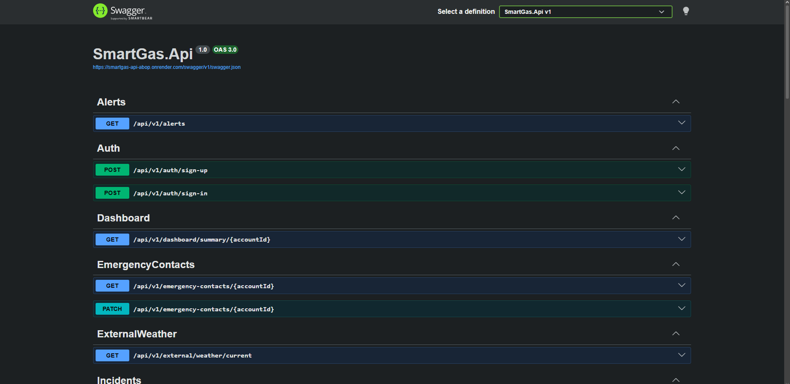

*Figura 92 (SmartGas Swagger)*

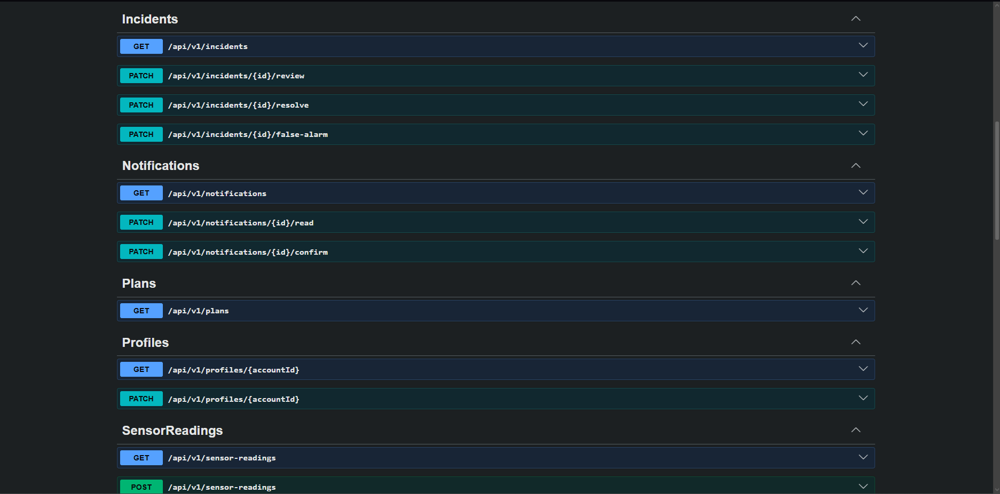

*Figura 93 (SmartGas Swagger)*


*Figura 94 (SmartGas Swagger)*

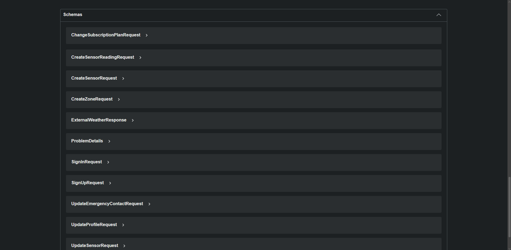

### 5.2.3.6. Services Documentation Evidence for Sprint Review

## Relación de Endpoints y Documentación OpenAPI
En esta sección se incluye la relación de Endpoints reales implementados y documentados de manera dinámica con OpenAPI/Swagger relacionados con el alcance del Sprint 3. La sección inicia con una introducción que resume los logros consolidados en cuanto a la puesta en marcha de los Web Services funcionales del backend.

Durante el Sprint 3, el equipo de ingeniería se enfocó exclusivamente en la implementación física y documentación técnica de los Web Services (backend) utilizando el entorno de ASP.NET Core. Este sprint corresponde al hito TB2 (Sprint Review), cuyo objetivo principal es la transición de las simulaciones previas hacia servicios web RESTful reales y conectados a la persistencia definitiva de datos en producción.

## Estado de la Documentación en Sprint 3
A diferencia del ciclo anterior, los Web Services se encuentran 100% implementados, completamente desplegados y en estado accesible. La documentación basada en la especificación OpenAPI es dinámica y provee al equipo de desarrollo una guía exacta para el consumo de datos de la plataforma SmartGas en producción. 

* **URL de Documentación Swagger (Entorno Cloud):** https://smartgas-api-abop.onrender.com/swagger/index.html
* **Punto de Enlace Base (Base URL):** https://smartgas-api-abop.onrender.com

**Hitos alcanzados en el aseguramiento y documentación de la API (Sprint 3):**

* **Mapeo del modelo de negocio:** Cobertura de documentación sobre los controladores esenciales de la arquitectura (módulos de gestión de usuarios, telemetría de sensores, emisión de alertas y almacenamiento de contactos de emergencia).
* **Consola de pruebas interactiva:** Despliegue de una interfaz gráfica de usuario (Swagger UI) operativa en la nube, lo que facilita el consumo de endpoints y pruebas de integración inmediatas para el equipo de frontend.
* **Contratos de datos transparentes:** Definición explícita de esquemas de respuesta y solicitudes con objetos JSON de ejemplo estructurados con datos realistas del negocio.
* **Estandarización de respuestas HTTP:** Catalogación de los comportamientos del servidor mediante respuestas estandarizadas, incluyendo flujos exitosos y control de excepciones (como solicitudes incorrectas o recursos no encontrados).
* **Visibilidad pública:** Disponibilidad de la documentación técnica en servidores de producción a través de la plataforma Render, facilitando la transparencia del avance frente a los stakeholders del proyecto.

**Conclusión del estado de la entrega:** Los servicios del backend se encuentran en un estado cerrado, completamente desplegados y accesibles. La documentación basada en OpenAPI es dinámica y provee al equipo de desarrollo una guía exacta para el consumo de datos de la plataforma.

**Catálogo de Endpoints bajo la Especificación OpenAPI**
A continuación, se detalla analíticamente cada uno de los recursos del sistema expuestos en la API. Para cada operación se define su método de acceso HTTP, la ruta exacta de consumo, las variables esperadas en los segmentos de la URL o en el cuerpo de la petición (Payload), y el estado actual de la documentación.

## Catálogo de Endpoints (Especificación OpenAPI)

#### 1. User Management / IAM & Configuration (Auth, Profiles, Settings, EmergencyContacts)

| Endpoint | HTTP Verb | Sintaxis de llamada | Parámetros | Estado |
| :--- | :---: | :--- | :--- | :---: |
| `/api/v1/auth/sign-up` | POST | `POST /api/v1/auth/sign-up` | Body: auth data |  Operativo |
| `/api/v1/auth/sign-in` | POST | `POST /api/v1/auth/sign-in` | Body: login credentials |  Operativo |
| `/api/v1/profiles/{accountId}` | GET | `GET /api/v1/profiles/{accountId}` | Path: accountId |  Operativo |
| `/api/v1/profiles/{accountId}` | PATCH | `PATCH /api/v1/profiles/{accountId}` | Path: accountId, Body: profile data |  Operativo |
| `/api/v1/settings/{accountId}` | GET | `GET /api/v1/settings/{accountId}` | Path: accountId | Operativo |
| `/api/v1/settings/{accountId}` | PATCH | `PATCH /api/v1/settings/{accountId}` | Path: accountId, Body: preferences data |  Operativo |
| `/api/v1/emergency-contacts/{accountId}` | GET | `GET /api/v1/emergency-contacts/{accountId}` | Path: accountId | Operativo |
| `/api/v1/emergency-contacts/{accountId}` | PATCH | `PATCH /api/v1/emergency-contacts/{accountId}` | Path: accountId, Body: contact data | Operativo |

#### 2. Kitchen Monitoring & Telemetry (Zones, Sensors, SensorReadings, External)

| Endpoint | HTTP Verb | Sintaxis de llamada | Parámetros | Estado |
| :--- | :---: | :--- | :--- | :---: |
| `/api/v1/zones` | GET | `GET /api/v1/zones` | Sin parámetros | Operativo |
| `/api/v1/zones` | POST | `POST /api/v1/zones` | Body: zone data | Operativo |
| `/api/v1/sensors` | GET | `GET /api/v1/sensors` | Sin parámetros | Operativo |
| `/api/v1/sensors` | POST | `POST /api/v1/sensors` | Body: sensor data |  Operativo |
| `/api/v1/sensors/{id}` | PATCH | `PATCH /api/v1/sensors/{id}` | Path: id, Body: sensor status data |  Operativo |
| `/api/v1/sensor-readings` | GET | `GET /api/v1/sensor-readings` | Sin parámetros |  Operativo |
| `/api/v1/sensor-readings` | POST | `POST /api/v1/sensor-readings` | Body: reading telemetry data |  Operativo |
| `/api/v1/external/weather/current` | GET | `GET /api/v1/external/weather/current` | Sin parámetros |  Operativo |

#### 3. Incident Detection & Prevention (Incidents, Alerts)

| Endpoint | HTTP Verb | Sintaxis de llamada | Parámetros | Estado |
| :--- | :---: | :--- | :--- | :---: |
| `/api/v1/incidents` | GET | `GET /api/v1/incidents` | Sin parámetros | Operativo |
| `/api/v1/incidents/{id}/review` | PATCH | `PATCH /api/v1/incidents/{id}/review` | Path: id |  Operativo |
| `/api/v1/incidents/{id}/resolve` | PATCH | `PATCH /api/v1/incidents/{id}/resolve` | Path: id |  Operativo |
| `/api/v1/incidents/{id}/false-alarm` | PATCH | `PATCH /api/v1/incidents/{id}/false-alarm` | Path: id | Operativo |
| `/api/v1/alerts` | GET | `GET /api/v1/alerts` | Sin parámetros |  Operativo |

#### 4. Notification Subsystem (Notifications)

| Endpoint | HTTP Verb | Sintaxis de llamada | Parámetros | Estado |
| :--- | :---: | :--- | :--- | :---: |
| `/api/v1/notifications` | GET | `GET /api/v1/notifications` | Sin parámetros | Operativo |
| `/api/v1/notifications/{id}/read` | PATCH | `PATCH /api/v1/notifications/{id}/read` | Path: id | Operativo |
| `/api/v1/notifications/{id}/confirm` | PATCH | `PATCH /api/v1/notifications/{id}/confirm` | Path: id | Operativo |

#### 5. Payment & Monetization Management (Plans, Subscriptions)

| Endpoint | HTTP Verb | Sintaxis de llamada | Parámetros | Estado |
| :--- | :---: | :--- | :--- | :---: |
| `/api/v1/plans` | GET | `GET /api/v1/plans` | Sin parámetros | Operativo |
| `/api/v1/subscriptions/current/{accountId}` | GET | `GET /api/v1/subscriptions/current/{accountId}` | Path: accountId |  Operativo |
| `/api/v1/subscriptions/current/{accountId}/change-plan` | PATCH | `PATCH /api/v1/subscriptions/current/{accountId}/change-plan` | Path: accountId, Body: target plan data | Operativo |

#### 6. Dashboard / Panel General & System Base (Dashboard, Root)

| Endpoint | HTTP Verb | Sintaxis de llamada | Parámetros | Estado |
| :--- | :---: | :--- | :--- | :---: |
| `/api/v1/dashboard/summary/{accountId}` | GET | `GET /api/v1/dashboard/summary/{accountId}` | Path: accountId |  Operativo |
| `/` | GET | `GET /` | Sin parámetros | Operativo |


#### Resumen de recursos y controladores en producción (ASP.NET Core)

| Controlador / Recurso | Propósito y Uso Principal |
| :--- | :--- |
| `Auth` / `Profiles` | Orquestación de seguridad, autenticación basada en tokens y perfiles organizacionales. |
| `Zones` / `Sensors` | Administración e inventario físico de las áreas de la cocina y el hardware IoT. |
| `SensorReadings` / `External` | Captura continua de telemetría en tiempo real sincronizada con factores climáticos. |
| `Incidents` / `Alerts` | Monitoreo crítico de anomalías, auditorías de fugas y transiciones de estados de seguridad. |
| `Notifications` | Despacho y confirmación del historial de avisos críticos y preventivos enviados a los usuarios. |
| `Plans` / `Subscriptions` | Control de modelos comerciales, niveles de acceso a la plataforma y facturación. |
| `Dashboard` / `SmartGas.Api` | Centralización de métricas analíticas e instrumentación de pruebas de vida (*Health Check*). |

## Observación técnica del Sprint 3
Se completó con éxito la migración desde la arquitectura basada en JSON Server de la entrega anterior hacia Web Services RESTful nativos estructurados en C#. La implementación sigue los estándares formales de enrutamiento a través del prefijo jerárquico unificado `/api/v1/`, asegurando aislamiento de versiones, contratos de datos estructurados, tipado fuerte y persistencia de base de datos cloud robusta.

### 5.2.3.7. Software Deployment Evidence for Sprint Review

## Despliegue de los Web Services (Backend)

Para el despliegue de la API productiva de SmartGas se utilizó una estrategia basada en la contenedorización, migrando la arquitectura de simulación previa hacia un entorno de producción real y definitivo. El backend, desarrollado con ASP.NET Core, fue desplegado en la plataforma cloud **Render** utilizando contenedores Docker. El frontend se mantuvo alojado en **Firebase Hosting**, actualizando su flujo de conexión para apuntar hacia este nuevo servidor en producción. Esta transición permitió sustituir la antigua fake API por servicios web RESTful reales y conectados a la persistencia de datos definitiva del proyecto.

## Preparación del entorno y Dockerfile

En primer lugar, se preparó el proyecto backend en .NET para que pudiera empaquetarse y ejecutarse correctamente en la nube sin depender de configuraciones específicas del host. Para ello, se diseñó un archivo `Dockerfile` de construcción multi-etapa (*multi-stage build*). Este archivo se encarga de restaurar las dependencias de NuGet, compilar el código fuente en modo optimizado de producción (`Release`) y empaquetar únicamente el resultado ejecutable en una imagen ligera basada en Linux (ASP.NET Runtime). 
El servidor fue configurado para escuchar las peticiones de forma dinámica, adaptándose al puerto que la infraestructura de Render le asigna automáticamente en tiempo de ejecución.

## Configuración del Entorno de Hosting en Render

La arquitectura del hosting del servicio web y de la persistencia de datos fue estructurada bajo los siguientes parámetros técnicos de configuración dentro de la infraestructura cloud de Render:

| Parámetro de Configuración | Valor Asignado (Backend API) | Valor Asignado (Base de Datos) |
| :--- | :--- | :--- |
| **Nombre del Servicio** | `smartgas-api` | `smartgas-postgres` |
| **Proveedor / Servicio** | Render (Web Service) | Render PostgreSQL |
| **Environment / Runtime** | Docker (Linux Container) | PostgreSQL 16+ |
| **Branch de Despliegue** | `main` | N/A (Instancia de base de datos) |
| **Región de Hospedaje** | Oregon / US West | Oregon / US West |
| **Plan de Infraestructura** | Free Plan | Free Plan |
| **Nombre de Base de Datos** | N/A | `smartgas_db` |
| **Usuario Administrador** | N/A | `smartgas_user` |

## Configuración de producción y variables de entorno

Luego, se procedió a aislar todas las credenciales sensibles del código fuente para cumplir con los estándares de seguridad informática exigidos. En el panel de administración de Render, se configuraron las variables de entorno críticas dentro de la sección *Environment Variables*. 

| Variable de Env (Render) | Propósito Técnico | Estado en Producción |
| :--- | :--- | :---: |
| `ASPNETCORE_ENVIRONMENT` | Define el modo de ejecución del framework en el entorno productivo (`Production`). | Configurada |
| `ASPNETCORE_URLS` | Determina las direcciones y puertos dinámicos donde escucha el servidor web. | Configurada automáticamente |
| `ConnectionStrings__DefaultConnection` | Cadena de conexión cifrada hacia la base de datos `smartgas_db` en Render PostgreSQL. | Configurada (Oculta) |
| `FRONTEND_URL` | Define el origen permitido del cliente web para las políticas CORS de seguridad. | Configurada |

De esta forma, el sistema opera con un aislamiento total de secretos, inyectando estos valores directamente en el contenedor en tiempo de ejecución para evitar fugas accidentales en el repositorio público.

## Despliegue en Render

Después de validar la configuración del contenedor localmente, el código definitivo fue integrado en el repositorio de la organización en GitHub. Render se vinculó de manera directa al repositorio institucional `upc-pre-2610-1ASI0730-12263-G2/SmartGas-api` mediante webhooks automatizados.
Posteriormente, en Render se configuró un nuevo *Web Service* bajo el runtime de Docker. Al detecter el archivo `Dockerfile` en la raíz, Render inició automáticamente el pipeline de Integración y Despliegue Continuo (CI/CD): descargó el código, construyó la imagen del contenedor y ejecutó la API de manera automática y aislada, asignándole de inmediato certificados SSL/TLS para habilitar comunicación segura mediante el protocolo HTTPS.

## Validación de la API real y endpoints

Una vez finalizado el pipeline de despliegue en Render, se generó la URL pública definitiva para el entorno de producción: `https://smartgas-api-abop.onrender.com`. Desde este punto de enlace, se accedió públicamente a la interfaz de documentación interactiva de Swagger UI, lo que permitió verificar y auditar en tiempo real la disponibilidad operativa de los recursos reales del sistema, tales como:
* `api/v1/auth` (Módulo de autenticación y registro de cuentas)
* `api/v1/sensors` y `api/v1/sensor-readings` (Flujos de telemetría e ingesta de datos IoT)
* `api/v1/zones` (Segmentación física de áreas de monitoreo)
* `api/v1/incidents` y `api/v1/alerts` (Gestión de seguridad y alertas por fugas)
* `api/v1/subscriptions` y `api/v1/plans` (Administración comercial de clientes)

Esto confirmó que los servicios web RESTful estaban respondiendo correctamente con estados HTTP estables (200 OK) fuera del entorno local de desarrollo.

Después de verificar la estabilidad del backend, se procedió a realizar la integración con la interfaz web. En el repositorio del frontend, se modificó el archivo de variables de entorno de producción `.env.production`, sustituyendo la antigua URL del JSON Server por el nuevo subdominio de producción provisto por Render:

```VITE_API_BASE_URL=[https://smartgas-api-abop.onrender.com](https://smartgas-api-abop.onrender.com)```

Posteriormente, se ejecutó un nuevo proceso de build con Vite para empaquetar el frontend con la nueva ruta de la API y se realizó el despliegue final hacia Firebase Hosting. Desde la URL pública del cliente web, se validá que las solicitudes HTTP (como las credenciales de inicio de sesión o las consultas del dashboard) ya no apuntaran a la base de datos simulada del sprint anterior, sino que interactuaran directamente y en tiempo real con el backend definitivo en .NET.

## Resultado final

En conclusión, la infraestructura de despliegue final del ecosistema SmartGas quedó consolidada de la siguiente manera:

**Firebase Hosting:** Aloja el frontend estático y la interfaz de usuario web desarrollada en Vue.

**Render (Docker Containers):** Aloja el backend productivo y los Web Services reales programados en ASP.NET Core bajo el servicio smartgas-api.

**Render PostgreSQL:** Aloja el servicio de base de datos relacional relacional centralizado (smartgas-postgres) y la base de datos smartgas_db, actuando como el motor de persistencia definitivo del negocio.

De esta forma, la solución de software se encuentra completamente desplegada en la nube, operando bajo un entorno distribuido, seguro y de alta disponibilidad para las revisiones del Sprint.

### 5.2.3.8.Team Collaboration Insights during Sprint.

En esta sección se detalla el trabajo colaborativo del equipo y el flujo de ramas en GitHub para el desarrollo de los Web Services y su integración con los componentes ya desplegados. 

Durante el Sprint 3, el equipo trabajó de forma distribuida para construir el backend en ASP.NET Core y asegurar el entorno de producción. Nos enfocamos principalmente en la definición de los contratos de datos, la persistencia en la nube y la automatización del despliegue, logrando conectar con éxito las interfaces frontend con la lógica de negocio y la telemetría real de SmartGas.

## Herramientas de Colaboración Utilizadas

El equipo optimizó y expandió el uso de las siguientes herramientas de ingeniería de software para facilitar la colaboración e integración continua durante este ciclo:

* **GitHub:** Eje central para el control de versiones y la automatización del pipeline de despliegue a producción.
  * **Repositorio principal:** `SmartGas-api` (Backend central en .NET).
  * **Estrategia de Ramas:** Uso estructurado de ramas de características aisladas para evitar conflictos de código antes de converger en `develop` y `main`. El flujo de desarrollo estuvo integrado por:
    * `main` (Producción por defecto)
    * `develop` (Integración)
    * `feature/backend-infrastructure-deployment`
    * `feature/iam-profiles-settings`
    * `feature/incidents-alerts-dashboard`
    * `feature/monitoring-sensors-readings`
    * `feature/subscriptions-plans-weather`
* **Jira:** Gestión simplificada del Sprint Backlog mediante un tablero ágil. Se utilizó para el seguimiento y asignación de los *User Stories* asociados a los controladores de la API, control de tareas de desarrollo de endpoints y monitoreo de bloqueos técnicos del equipo.


## Evidencias de Colaboración y Analíticos de GitHub

*Figura 95 (Team Collaboration Insights during Jun 12, 2026)*

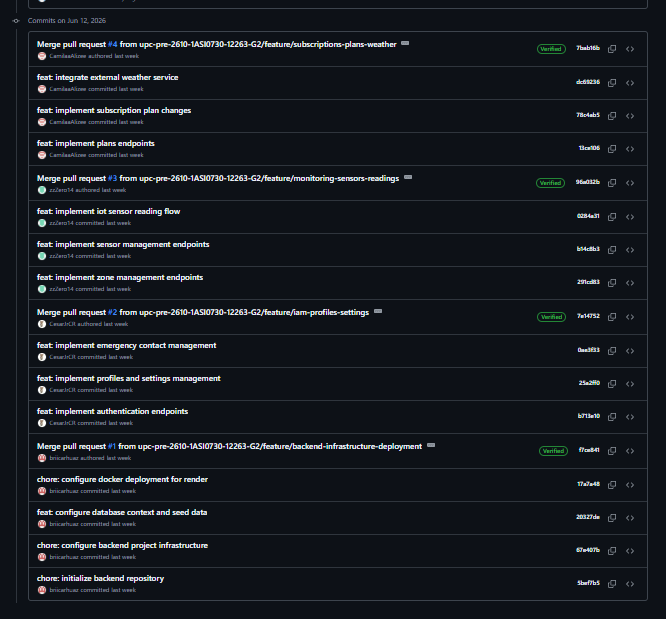

*Figura 96 (Team Collaboration Insights during Jun 13, 2026)*

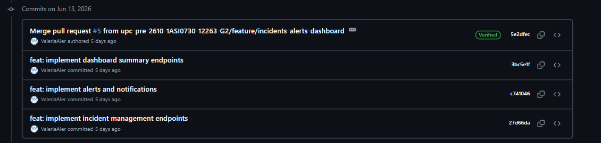

*Figura 97 (Team Collaboration Insights during Jun 14, 2026)*

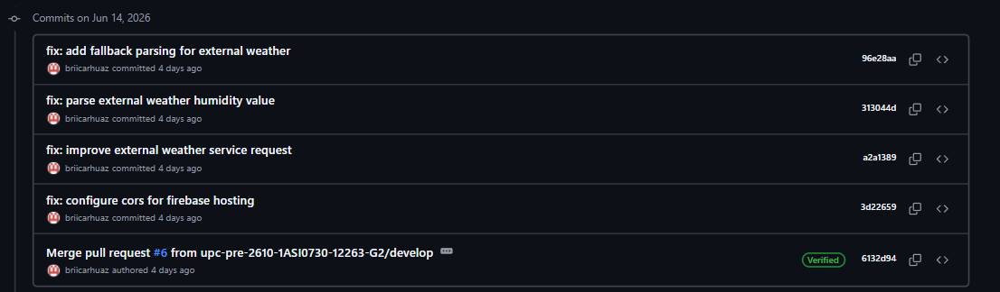


## 5.3. Validation Interviews.

## 5.3.1. Diseño de entrevistas

### Segmento Objetivo 1: Familias y Propietarios de Viviendas

*Landing page*

1. Al ver por primera vez la página de inicio, ¿qué es lo que más le llama la atención de la Landing Page? ¿La propuesta de valor le queda clara de inmediato?
2. ¿Los beneficios mostrados (Prevención automatizada, Monitoreo en tiempo real, Notificaciones instantáneas) responden a algo que usted realmente necesitaría en su hogar? ¿Hay algo que eche de menos?
3. Revisando la sección de planes (Básico PEN 30, Profesional PEN 70, Corporativo PEN 100), ¿cuál elegiría para su casa y por qué? ¿Considera que el precio es razonable para lo que ofrece?
4. ¿Qué tan fácil le resultó navegar entre las secciones de la landing (Inicio, Beneficios, Planes, Contacto)? ¿Encontró la información que esperaba en cada sección?
5. Después de explorar la página, ¿Le ha llamado la atención nuestro producto? ¿Le daría click al botón de “Sign up”? ¿Qué información adicional necesitaría ver antes de hacerlo?
6. ¿Las características descritas (detección inteligente de gas, cierre automático, telemetría en la nube) le generan la sensación de que el sistema actuaría sin que usted tenga que hacer nada? ¿Le transmite seguridad esa promesa?

*FrontEnd*

7. Al ingresar al panel principal, ¿entiende de un vistazo el estado de seguridad de su cocina? ¿Qué información le parece más importante y cuál le sobra o confunde?
8. En la sección de Monitoreo, ¿la tarjeta de la zona "Cocina" con los datos de Gas (ppm) y Temperatura le resulta comprensible
9. Al explorar la sección de Dispositivos, ¿le queda claro cómo registrar un nuevo sensor en su hogar? ¿No tendría dificultad en manejar este segmento?
10. Si el sistema detectara una fuga de gas, ¿sabe a dónde cree que debería ir para ver los detalles del incidente? ¿La sección de Incidentes es fácil de encontrar?
11. En la sección de Configuración, ¿le resulta claro cómo ajustar los umbrales de alerta de gas y temperatura? ¿Modificaría esos valores o dejaría los predeterminados?
12. ¿El menú de navegación lateral (Panel, Monitoreo, Dispositivos, Incidentes, Reportes, Suscripción, Perfil) le parece intuitivo? ¿Alguna sección le costó encontrar o tiene un nombre que no entiende?
13. Usando la aplicación, ¿siente que podría monitorear su cocina de forma autónoma sin necesitar ayuda técnica? ¿Qué cambiaría, agregaría o eliminaría para que le resulte más útil?

*Final*

14. Comparando la promesa que vio en la landing page con lo que encontró en la aplicación, ¿siente que el producto cumple con lo que ofrece? ¿Hubo algo que esperaba ver y no encontró?
15. En una escala del 1 al 10, ¿qué tan probable es que recomiende SmartGas a un familiar o vecino? ¿Qué debería mejorar el equipo para que esa puntuación suba?

### Segmento Objetivo 2: Administradores y Chefs de Restaurantes

*Landing page*

1. Al entrar a la landing page por primera vez, ¿siente que SmartGas está pensado también para restaurantes, o lo percibe como un producto solo para uso doméstico? ¿Qué elementos lo llevan a esa conclusión?
2. ¿Los beneficios destacados (prevención automatizada, monitoreo en tiempo real, notificaciones instantáneas) son relevantes para el ritmo de trabajo de su cocina? ¿Hay algún beneficio crítico para su negocio que no ve mencionado?
3. Al revisar los planes de suscripción, ¿cuál consideraría para su restaurante y por qué? ¿El plan Corporativo (PEN 100/mes) justifica su precio frente a lo que ofrece para operaciones de alta demanda?
4. ¿La sección "About Us" y la presentación del equipo le generan confianza suficiente para considerar SmartGas como un proveedor serio para su negocio? ¿Qué le falta para aumentar esa confianza?
5. ¿El formulario de contacto y el call-to-action "Sign up" le resultan suficientes para dar el siguiente paso, o esperaría ver antes un caso de éxito, certificaciones o demos en video del producto?
6. ¿La característica de "cierre automático de válvulas" (Automatic Shut-off) le genera tranquilidad operativa o le genera dudas sobre el control manual en situaciones de emergencia real?

*FrontEnd*

7. Desde el panel principal, ¿puede usted identificar de un vistazo si alguna zona de su local presenta riesgo? ¿El indicador "Estado General: Seguro" le resulta suficiente o necesitaría más detalle inmediato?
8. En la sección de Monitoreo, ¿la capacidad de filtrar zonas por estado (Seguro, Advertencia, Crítico, Sin conexión) le parece útil para gestionar múltiples áreas de su cocina comercial simultáneamente?
9. Al revisar la sección de Dispositivos, ¿considera que la información mostrada (código, nombre, tipo, zona, estado, batería, última lectura) es suficiente para gestionar los sensores de un restaurante con varias cocinas?
10. En la sección de Reportes, ¿el historial de incidentes con filtros por zona, severidad, tipo y fecha le daría la información necesaria para tomar decisiones o para presentar evidencia ante una auditoría de seguridad?
11. Al revisar el módulo de Incidentes, usted tiene la opción de gestionar y documentar los incidentes de su local ¿Le resulta útil la función de archivar estos incidentes?
12. En Configuración de Seguridad, ¿los umbrales de advertencia de gas (50 ppm) y temperatura (45 °C) se ajustan a la realidad de una cocina comercial activa, o necesitaría valores diferentes según el tipo de zona?
13. ¿La plataforma le parece escalable para gestionar múltiples locales o zonas desde una sola cuenta? ¿Qué funcionalidades adicionales (gestión de roles, reportes exportables, integración con otros sistemas) considera indispensables para su operación?

*Final*

14. ¿SmartGas reemplazaría o complementaría los protocolos de seguridad que ya tiene en su negocio? ¿Ve algún riesgo o limitación en depender de una plataforma digital para la seguridad crítica de su cocina?
15. En una escala del 1 al 10, ¿qué tan dispuesto estaría a implementar SmartGas en su negocio en los próximos 3 meses? ¿Cuál es el principal obstáculo que lo frena y qué debería cambiar el equipo para removerlo?

## 5.3.2. Registro de entrevistas

### Segmento Objetivo 1: Familias y Propietarios de Viviendas

#### Entrevista 1
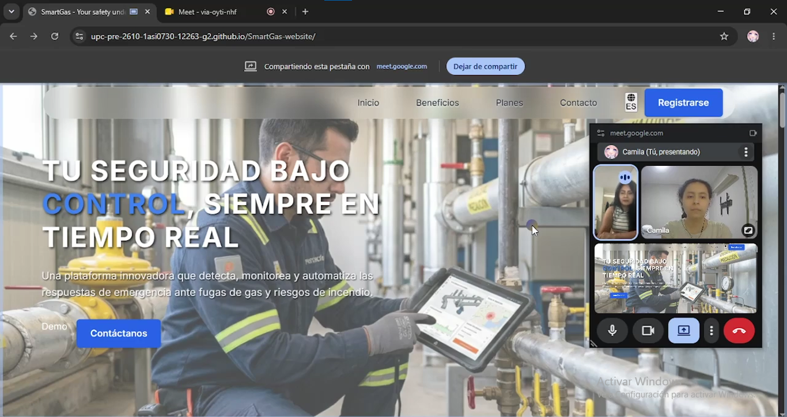

- **Nombres y apellidos:** Sheila Calderón
- **Edad:** 42 
- **Distrito:** Trujillo
- **Inicio:** 0:00  
- **Duración:** 25:17  
- **URL:**  [entrevista](https://youtu.be/l9lnfLF2V6A)
- **Resumen:** 
La entrevistada dio una calificación de 10/10 a SmartGas, destacando que la propuesta es novedosa, intuitiva y muy amigable para personas que no saben de tecnología. Validó funciones como el monitoreo y el apagado automático por una necesidad personal de olvidos en la cocina, y eligió el plan básico por vivir en un departamento pequeño. Además, elogió enormemente la opción de modo oscuro en la app web porque le ayuda a descansar la vista. Como sugerencias de mejora, recomendó lanzar un precio promocional por ser una plataforma nueva y solicitó que se aclare contractualmente si la tarifa mensual de 30 soles es fija o variable. Finalmente, en la sección de configuración, señaló que prefiere dejar los umbrales de alerta de gas y temperatura predeterminados por el equipo, ya que no sabría cómo medirlos y optaría por recibir asesoría directa.

#### Entrevista 2


- **Nombres y apellidos:** Saúl Romani
- **Edad:** 48 
- **Distrito:** Jesús Maria
- **Inicio:** 0:00  
- **Duración:** 10:17  
- **URL:**  [entrevista](https://www.youtube.com/watch?v=redd8kHGVC0)
- **Resumen:** 
El entrevistado Saúl Romani dio una calificación de 8/10 a SmartGas, destacando que la propuesta le parece útil, clara y enfocada en una necesidad real de seguridad dentro del hogar. Valoró especialmente el monitoreo en tiempo real, las notificaciones instantáneas y la detección inteligente de gas, ya que transmiten la idea de que el sistema puede prevenir una emergencia antes de que el usuario tenga que actuar manualmente. Además, eligió el plan Profesional de PEN 70 porque considera que ofrece un buen equilibrio entre precio y funcionalidades para una vivienda. Como sugerencias de mejora, recomendó explicar con mayor detalle el proceso de instalación, la compatibilidad con los sensores y qué sucede si se pierde la conexión a internet. También indicó que sería importante mostrar de forma más visual cómo funciona el cierre automático ante una fuga de gas. Finalmente, en la aplicación web señaló que el panel es entendible y permite monitorear la cocina de forma autónoma, aunque sugirió agregar etiquetas visuales como “Normal”, “Riesgo” o “Crítico” para interpretar más rápido los niveles de gas y temperatura.

#### Entrevista 3
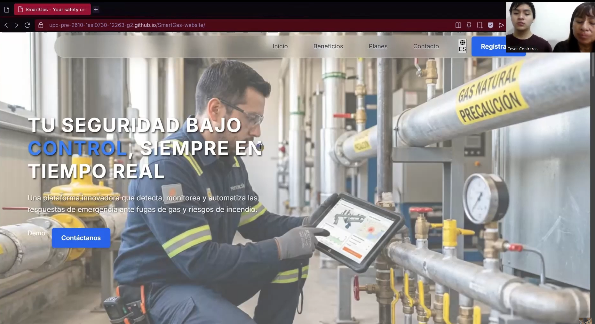

- **Nombres y apellidos:** Sonia Rojas
- **Edad:** 57
- **Distrito:** Cercado de Lima
- **Inicio:** 0:00  
- **Duración:** 7:30
- **URL:**  [entrevista](https://youtu.be/WLt1XLsdJFg)
- **Resumen:** 
La entrevistada Sonia Rojas dio una calificación de 10/10 a Smartgas, el motivo es que para ella la propuesta de SmartGas le parece útil y necesaria para la seguridad de su familia. Ella menciona la sensación de tranquilidad que le propiciaria tener un servicio como el de SmartGas ya el sistema al funcionar automaticamente se encargaria de lidiar por su cuenta con los incidentes que puedan ocurrir. Los precios que ofrece SmartGas le parecen justos. Señalo que el panel de información se le hace entendible y que no tuvo ni un problema entiendo la información presente en cada una de las vistas de la aplicación.

### Segmento Objetivo 2: Administradores y Chefs de Restaurantes

#### Entrevista 1

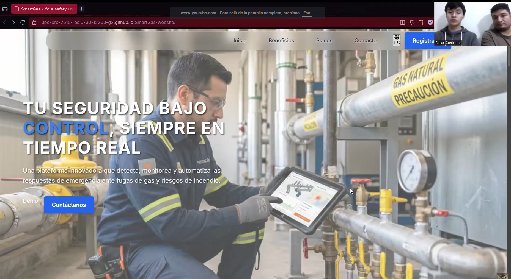

- **Nombres y apellidos:** Kevin Izquierdo
- **Edad:** 31
- **Distrito:** Cercado de Lima
- **Inicio:** 0:00  
- **Duración:** 08:27
- **URL:**  [entrevista](https://youtu.be/ILTzgInzBZY)
- **Resumen:** 
El entrevistado Kevin Izquier le dio una calificación de 10/10 a Smartgas, para el Smartgas es un sistema que seria muy útil en su restaurant. El menciona que los precios que ofrecemos le parecen justos y que el eligiria el plan profesional debido a la infraestructura de su local. El nos dice que la información presente en el panel de información y en las distintas vistas se le hace entendible y no tuvo problema navegando a lo largo de las distintas vistas. Para el Smartgas es un sistema útil por sus funciones automaticas las cuales serian buenas en caso se presente en un incidente, ya que así no dependerian de una persona y que el incidente posiblemente escale.
#### Entrevista 2

#### Entrevista 3

## 5.3.3. Evaluaciones según Heuristicas

## Conclusiones

  - La aplicación de SmartGas seria efectiva para la prevención de accidentes en el hogar
  - La aplicación de SmartGas seria efectiva para la prevención de accidentes en un entorno comercial
  - Los entrevistados estan contentos con las caracteristicas de SmartGas
  - Los Bounded Context realizados nos sirvieron para las divisiones de la app web
  - Los EndPoins fueron claves para la realización de la app web

## Bibliografía

## Anexos
