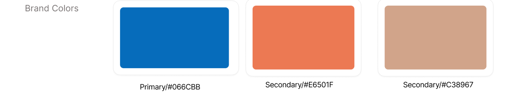
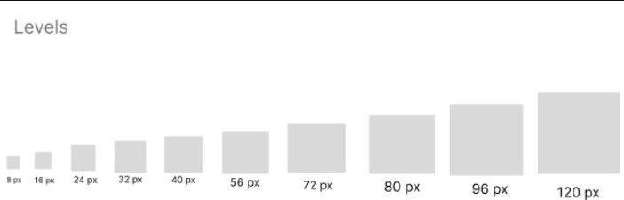
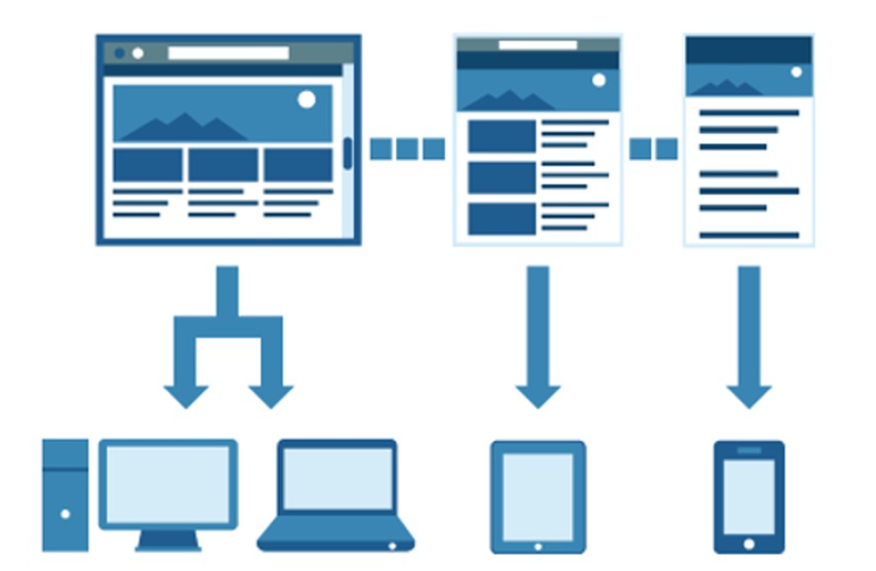
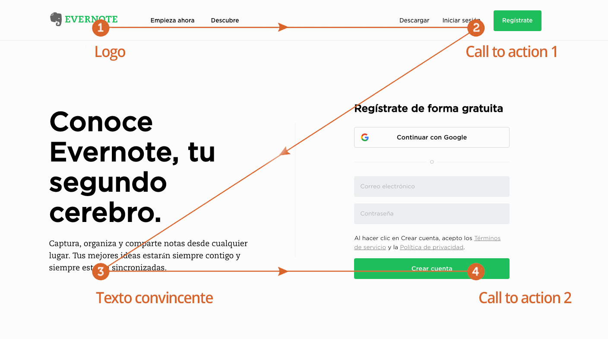

### Universidad Peruana de Ciencias Aplicadas
### Inegeneria de Software
### 2026-1

### NRC: 12263
### Docente: Rafael Oswaldo Castro Veramendi
### Informe de Trabajo Final

###  G2
###  SmartGas

   
|**Code**|**Member**|
|---------------------|--------------------|
|U202310436 |Gabriel Ferran Espinar Martínez|
|U20241D932 |Briguite Eryka Carhuaz Centeno| 
|U20241D995 |Cesar Jair Contreras Rojas| 
|U202419547 |Camila Alizée Otiniano Rosales| 
|U202411373 |Valeria Alexandra Rojas Gomez| 

### Abril 2026

# **Registro de Versiones del Informe**

| Versión | Fecha | Autor | Descripción de modificación |
|-----------|-----------|-----------|-----------|
|-----------|-----------|-----------|-----------|
|-----------|-----------|-----------|-----------|

# **Project Report Collaboration Insights**

**URL del Repositorio**: [https://github.com/1ASI0730-2610-12263-G2/SmartGas-Project-Report](https://github.com/1ASI0730-2610-12263-G2/SmartGas-Project-Report)

# ABET – EAC - Student Outcome 5

**Criterio:** La capacidad de funcionar efectivamente en un equipo cuyos miembros juntos proporcionan liderazgo, crean un entorno de colaboración e inclusivo, establecen objetivos, planifican tareas y cumplen objetivos.

En el siguiente cuadro se describe las acciones realizadas y enunciados de conclusiones por parte del grupo, que permiten sustentar el haber alcanzado el logro del ABET – EAC – Student Outcome 5.

| Criterio específico | Acciones realizadas | Conclusiones |
| :--- | :--- | :--- |
| **Trabaja en equipo para proporcionar liderazgo en forma conjunta** | | |
| **Crea un entorno colaborativo e inclusivo, establece metas, planifica tareas y cumple objetivos.** | | |

## Contenido

- [ Informe Trabajo Final ](#-informe-trabajo-final-)
    - [Universidad Peruana de Ciencias Aplicadas ](#universidad-peruana-de-ciencias-aplicadas-)
    - [Registro de versiones del Informe](#registro-de-versiones-del-informe)
    - [Project Report Collaboration Insights](#project-report-collaboration-insights)
    - [Contenido](#contenido)
    - [Student Outcome](#student-outcome)
- [Capítulo I: Introducción](#capítulo-i-introducción)
    - [1.1. Startup Profile](#11-startup-profile)
    - [1.1.1. Descripción de la Startup](#111-descripción-de-la-startup)
    - [1.1.2 Perfiles de integrantes del equipo](#112-perfiles-de-integrantes-del-equipo)
    - [1.2. Solution Profile](#12-solution-profile)
    - [1.2.1 Antecedentes y problemática](#121-antecedentes-y-problemática)
    - [1.2.2 Lean Ux Process](#122-lean-ux-process)
    - [1.2.2.1. Lean UX Problem Statements](#1221-lean-ux-problem-statements)
    - [1.2.2.2. Lean UX Assumptions](#1222-lean-ux-assumptions)
    - [1.2.2.3. Lean UX Hypothesis Statements](#1223-lean-ux-hypothesis-statements)
    - [1.2.2.4. Lean UX Canvas](#1224-lean-ux-canvas)
    - [Segmentos Objetivos](#segmentos-objetivos)
- [Capítulo II: Requeriments Elicitation \& Analysis](#capítulo-ii-requeriments-elicitation--analysis)
    - [2.1. Competidores](#21-competidores)
    - [2.1.1. Análisis competitivo](#211-análisis-competitivo)
    - [2.1.2. Estrategias y tácticas frente a competidores](#212-estrategias-y-tácticas-frente-a-competidores)
    - [2.2. Entrevistas ](#22-entrevistas-)
    - [2.2.1. Diseño de entrevistas](#221-diseño-de-entrevistas)
    - [2.2.2. Registro de entrevistas](#222-registro-de-entrevistas)
    - [2.2.3. Análisis de entrevistas](#223-análisis-de-entrevistas)
    - [2.3. Needfinding](#23-needfinding)
    - [2.3.1. User Personas](#231-user-personas)
    - [2.3.2. User Task Matrix](#232-user-task-matrix)
    - [2.3.3. User Journey Mapping](#233-user-journey-mapping)
    - [2.3.4. Empathy Mapping](#234-empathy-mapping)
    - [2.4. Big Picture EventStorming](#24-big-picture-evenstorming)
    - [2.5. Ubiquitous Language](#25-ubiquitous-language)
- [Capítulo III: Requeriments Specification](#capítulo-iii-requeriments-specification)
    - [3.1. User Stories](#31-user-stories)
    - [3.2. Impact Mapping](#32-impact-mapping)
    - [3.3. Product Backlog](#33-product-backlog)
- [Capítulo IV: Product Desing](#capítulo-iv-product-desing)
    - [4.1. Style Guidelines](#41-style-guidelines)
    - [4.1.1. General Style Guidelines](#411-general-style-guidelines)
    - [4.1.2. Web Style Guidelines](#412-web-style-guidelines)
    - [4.2. Information Architecture](#42-information-architecture)
    - [4.2.1. Organization Systems](#421-organization-systems)
    - [4.2.2. Labeling Systems](#422-labeling-systems)
    - [4.2.3. SEO Tags and Meta Tags](#423-seo-tags-and-meta-tags)
    - [4.2.4. Searching Systems](#424-searching-systems)
    - [4.2.5. Navigation Systems](#425-navigation-systems)
    - [4.3. Landing Page UI Desing](#43-landing-page-ui-desing)
    - [4.3.1. Landing Page Wireframes](#431-landing-page-wireframes)
    - [4.3.2. Landing Page Mock-Up](#432-landing-page-mock-up)
    - [4.4. Web Applications UX/UI Desing](#44-web-applications-uxui-desing)
    - [4.4.1. Web Applications Wireframes](#441-web-applications-wireframes)
    - [4.4.2. Web Applications Wireflow Diagrams](#442-web-applications-wireflow-diagrams)
    -[4.4.3. Web Applications Mock-ups](#443-web-applications-mock-ups-diagrams)
    - [4.4.4. Web Applications User Flow Diagrams](#444-web-applications-user-flow-diagrams)
    - [4.5. Web Applications Prototyping](#45-web-applications-prototyping)
    - [4.6.1. Design-Level EventStorming](#461-design-level-eventstorming)
    - [4.6.2. Software Architecture Context Diagram](#462-software-architecture-context-diagram)
    - [4.6.3. Software Architecture Container Diagram](#463-software-architecture-container-diagram)
    - [4.6.4. Software Architecture Components Diagram](#464-software-architecture-components-diagram)
    - [4.7. Software Object-Oriented Desing](#47-software-object-oriented-desing)
    - [4.7.1. Class Diagram](#471-class-diagram)
    - [4.8. Database Desing](#48-database-desing)
    - [4.8.1. Database Diagrams](#481-database-diagrams)
- [Capítulo V: Product Implementation, Validation \& Deployment](#capítulo-v-product-implementation-validation--deployment)
    - [5.1. Software Configuration Management](#51-software-configuration-management)
    - [5.1.1. Software Development Environment Configuration](#511-software-development-environment-configuration)
    - [5.1.2. Source Code Management](#512-source-code-management)
    - [5.1.3. Source Code Style Guide \& Conventions](#513-source-code-style-guide--conventions)
    - [5.1.4. Software Deployment Configuration](#514-software-deployment-configuration)
    - [5.2. Landing Page, Service \& Applications Implementation](#52-landing-page-service--applications-implementation)
    - [5.2.1. Sprint](#52x-sprint)
    -  [5.2.1.1. Sprint Planning 1](#5211-Sprint-Planning1)
    -  [5.2.1.2. Aspect Leaders and Collaborators](#5212-Aspect-Leaders-and-Collaborators)
    -  [5.2.1.3. Sprint Backlog 1](#5213-Sprint-Backlog-1)
    -  [5.2.1.4. Development Evidence for Sprint Review](#5214-Development-Evidence-for-Sprint-Review)
    -  [5.2.1.5. Execution Evidence for Sprint Review](#5215-Execution-Evidence-for-Sprint-Review)
    -  [5.2.1.6. Services Documentation Evidence for Sprint Review](#5216-Services-Documentation-Evidence-for-Sprint-Review)
    -  [5.2.1.7. Software Deployment Evidence for Sprint Review](#5217-Software-Deployment-Evidence-for-Sprint-Review)
    -  [5.2.1.8. Team Collaboration Insights during Sprint](#5218-Team-Collaboration-Insights-during-Sprint)
    -  [Conclusiones](#Conclusiones)
    -  [Bibliografía](#Bibliografía)
    -  [Anexos](#Anexos)

# Capítulo 1: Introducción

## 1.1. Startup Profile

### 1.1.1. Descripción de la Startup

### 1.1.2. Perfiles de integrantes del equipo

## 1.2. Solution Profile
    
### 1.2.1 Antecedentes y problemática

    
### 1.2.2 Lean UX Process.
    
### 1.2.2.1. Lean UX Problem Statements.

### 1.2.2.2. Lean UX Assumptions.

### 1.2.2.3. Lean UX Hypothesis Statements.
    
### 1.2.2.4. Lean UX Canvas.
    

## 1.3. Segmentos objetivo.
    
# Capítulo II: Requirements Elicitation & Analysis
    
## 2.1. Competidores.
    
### 2.1.1. Análisis competitivo.
    
### 2.1.2. Estrategias y tácticas frente a competidores.
    
## 2.2. Entrevistas.
    
### 2.2.1. Diseño de entrevistas.
    
### 2.2.2. Registro de entrevistas.
    
### 2.2.3. Análisis de entrevistas.
    
## 2.3. Needfinding.
    
### 2.3.1. User Personas.
    
### 2.3.2. User Task Matrix.

### 2.3.3. User Journey Mapping.

### 2.3.4. Empathy Mapping.
    
## 2.4. Big Picture EventStorming.
    
## 2.5. Ubiquitous Language.
    
# Capítulo III: Requirements Specification
  
## 3.1. User Stories.
   
## 3.2. Impact Mapping.
    
## 3.3. Product Backlog.
    
# Capítulo IV: Product Design
   
## 4.1. Style Guidelines.
   
### 4.1.1. General Style Guidelines.

**Branding** 

El nombre **SmartGas** surge de la combinación de “Smart” (inteligencia aplicada al IoT y la automatización) y “Gas” (el recurso crítico que buscamos asegurar), una fusión que refleja nuestra misión de integrar la seguridad preventiva con la tecnología en la nube mediante una plataforma SaaS robusta

El diseño del logotipo refuerza esta identidad: una red de nodos y líneas que dibujan la silueta de una llama, simbolizando la telemetría y los datos en tiempo real. El degradado, que transiciona de un naranja cálido a un azul tecnológico, representa la transformación del peligro latente en un entorno controlado y seguro mediante el software. Elegir una identidad con este significado refuerza nuestra propuesta de valor y nos diferencia de las alarmas locales, permitiendo que el usuario identifique a SmartGas como el núcleo inteligente para la protección de sus entornos.  

  

**Tipografía**

Para **SmartGas** se eligió la tipografía **Koulen** por su estilo moderno, audaz y con gran presencia visual, lo que refuerza la identidad innovadora y tecnológica de la plataforma de seguridad. Su diseño de formas anchas y fuertes transmite solidez y robustez, valores fundamentales al tratar con sistemas de prevención de riesgos y monitoreo de infraestructuras críticas.

A pesar de su estilo distintivo, esta fuente mantiene una excelente legibilidad en titulares y paneles de control, facilitando la jerarquización de alertas y datos de telemetría en la interfaz web. Esta elección tipográfica genera un impacto visual inmediato que diferencia a **SmartGas** de las soluciones de seguridad tradicionales, asegurando una estética coherente y profesional en entornos digitales basados en arquitecturas en la nube.

  

**Colores**  

Colores Se usará una paleta que refuerce la identidad de SmartGas, transmitiendo tecnología, prevención y seguridad. El azul **(#066CBB)** actúa como el tono principal, representando profesionalismo, confianza y la estabilidad de una arquitectura orientada a servicios. El naranja **(#E6501F)** se integra como un color de acento estratégico, simbolizando la energía, el calor bajo control y la inmediatez de las alertas críticas que procesa el sistema. Como tono de transición, se incorpora un color canela cobrizo **(#C38967)**, el cual actúa como el punto intermedio en el degradado de la marca; este color suaviza la composición y refuerza visualmente la idea de una telemetría fluida y un monitoreo constante de la temperatura. En conjunto, esta paleta construye una experiencia visual coherente y moderna, proyectando a SmartGas como una plataforma innovadora, segura y enfocada en la protección inteligente de entornos culinarios.

**Spacing**  

En la **Landing Page** y en la aplicación de **SmartGas** se utiliza un espaciado limpio y equilibrado que mejora la legibilidad, evita la sobrecarga visual y facilita la navegación. El uso estratégico de los espacios en blanco organiza el contenido, proporciona descanso visual y guía la atención del usuario hacia la información más relevante, logrando una experiencia clara, ordenada y agradable.  

**Tono de Comunicación y Lenguaje Aplicado**

El color primario de **SmartGas (#066CBB)** representa la identidad visual de la seguridad digital y la arquitectura en la nube, transmitiendo confianza, estabilidad y profesionalismo; al interactuar con la plataforma, el usuario percibirá este tono como un respaldo sólido y confiable, reflejando el soporte técnico de un sistema que opera continuamente. El color secundario **(#E6501F)** despierta una sensación de alerta y respuesta inmediata, inspirando energía, prevención y un compromiso absoluto con la seguridad, lo que refuerza la visión de la marca como una solución que utiliza la tecnología para anticiparse a riesgos críticos. El tono intermedio de transición **(#C38967)** refleja el flujo de datos y la precisión de la telemetría, aportando equilibrio visual y una estética moderna que conecta la calidez del entorno culinario con la frialdad del procesamiento de datos. 

En cuanto al lenguaje, **SmartGas** adopta un tono profesional, técnico y directo, acompañado de un enfoque preventivo y resolutivo; los mensajes, alertas y reportes históricos dentro de la plataforma buscan empoderar al usuario para tomar decisiones críticas basadas en datos, reforzando la confiabilidad del ecosistema SaaS y la seguridad operativa tanto en hogares como en restaurantes.

### 4.1.2. Web Style Guidelines.

Para **SmartGas**, desarrollaremos una aplicación web distribuida bajo un enfoque *mobile-first* y adaptable a cualquier dispositivo tecnológico, garantizando que el dashboard de monitoreo y las alertas en tiempo real mantengan su integridad visual y funcional sin distorsiones. Para lograrlo, se considerarán las particularidades de hardware de diversos dispositivos, desde smartphones hasta terminales de escritorio en cocinas industriales, asegurando que la telemetría de gas y temperatura esté siempre estructurada de manera jerárquica. Esto ofrece una experiencia consistente, accesible y optimizada, permitiendo que tanto familias como administradores de restaurantes tomen decisiones críticas desde cualquier navegador con una latencia visual mínima.

**Patrón Z**

El diseño de la aplicación web y la landing page de **SmartGas** seguirá el **Patrón Z**, un esquema de lectura optimizado para interfaces con poca densidad de texto inicial que guía la vista del usuario de forma intuitiva. El recorrido inicia en la esquina superior izquierda con el logotipo para reforzar la identidad de marca, se desplaza horizontalmente hacia las opciones de estado de conexión, desciende en diagonal hacia los indicadores visuales de los sensores (la "llama digital") y finaliza en la base con los botones de acción inmediata o historial de incidencias. 

Este enfoque asegura que el usuario identifique primero el estado de seguridad global y luego sea conducido naturalmente hacia los controles de automatización, facilitando una navegación eficiente en situaciones de emergencia y mejorando la tasa de respuesta ante alertas preventivas.

    
## 4.2. Information Architecture.
    
### 4.2.1. Organization Systems.

La organización del contenido en **SmartGas** se basa en la aplicación de distintos sistemas de organización según el perfil del usuario (familias y administradores de restaurantes). El objetivo es que la información sea crítica, accionable y responda a la prevención de desastres en tiempo real.

* **Landing Page (Usuarios visitantes / potenciales clientes):**
    * **Organización jerárquica (visual hierarchy):** Estructura en bloques descendentes: Propuesta de valor (prevención inteligente) → Sensores de gas/fuego → Funcionamiento de la nube → Planes SaaS → Contacto.
    * **Categorización por tópicos:** Se agrupan los contenidos según el entorno de protección (Hogar seguro vs. Restaurante protegido).

* **Web App (Administradores de Restaurantes / Jefes de Cocina):**
    * **Organización jerárquica:** Dashboard principal que prioriza **Alertas Activas** y niveles de telemetría en tiempo real (Gas y Temperatura) por sobre los datos estáticos.
    * **Organización por ubicación (Geográfica/Espacial):** Segmentación de dispositivos por zonas críticas (Cocina, Almacén, Área de Comensales) para identificar el origen exacto de una fuga.
    * **Categorización cronológica:** Historial de incidencias y registros de sensores (Logs) ordenados por fecha y hora para auditorías de seguridad y cumplimiento de normativas.
    * **Categorización por audiencia:** Diferenciación entre vistas para personal operativo (monitoreo de sensores) y dueños de negocio (gestión de suscripción y reportes de eficiencia).

* **App Móvil (Familias / Usuarios Domésticos):**
    * **Organización secuencial (Flujo de Incidente):** Basado en los pasos del sistema: Notificación de fuga/fuego → Visualización de nivel de sensor → Ejecución de comandos (Cerrar válvula/Encender ventilas) → Confirmación de fin de incidente.
    * **Organización jerárquica:** Menú de acceso rápido con estados críticos en primer nivel (Estado del Hogar, Comandos de Emergencia, Gestión de Usuarios).
    * **Categorización cronológica:** Listado de eventos de seguridad y notificaciones de Twilio ordenados por estado (Alerta resuelta, Falsa alarma, Incidente en curso).

**Principios aplicados:**
* **Jerárquico para prevención:** Priorizando los datos de sensores que superan los umbrales de peligro en los paneles de control centrales.
* **Secuencial para protocolos de emergencia:** Guiando al usuario paso a paso desde que se detecta un evento de dominio (fuga/fuego) hasta que se notifican los servicios y se estabiliza el entorno.
* **Cronológico para históricos:** Permitiendo analizar patrones de temperatura o pequeñas fluctuaciones de gas recurrentes a través del tiempo.
* **Por audiencia:** Separando la experiencia técnica de un administrador de restaurante (múltiples dispositivos y actuadores) de la experiencia simplificada y directa de un usuario doméstico.
    
### 4.2.2. Labeling Systems.
    
### 4.2.3. SEO Tags and Meta Tags
    
### 4.2.4. Searching Systems.
    
### 4.2.5. Navigation Systems.
    
## 4.3. Landing Page UI Design.
    
### 4.3.1. Landing Page Wireframe.
    
### 4.3.2. Landing Page Mock-up.
    
## 4.4. Web Applications UX/UI Design.
    
### 4.4.1. Web Applications Wireframes.
    
### 4.4.2. Web Applications Wireflow Diagrams.
    
### 4.4.2. Web Applications Mock-ups.
    
### 4.4.3. Web Applications User Flow Diagrams.
    
## 4.5. Web Applications Prototyping.
   
## 4.6. Domain-Driven Software Architecture.
    
### 4.6.1. Design-Level EventStorming.
    
### 4.6.2. Software Architecture Context Diagram.
    
### 4.6.3. Software Architecture Container Diagrams.
    
### 4.6.4. Software Architecture Components Diagrams.
    
## 4.7. Software Object-Oriented Design.
    
### 4.7.1. Class Diagrams.
    
## 4.8. Database Design.
    
### 4.8.1. Database Diagrams.
    
# Capítulo V: Product Implementation, Validation & Deployment
    
## 5.1. Software Configuration Management.
    
### 5.1.1. Software Development Environment Configuration.
    
### 5.1.2. Source Code Management.
    
### 5.1.3. Source Code Style Guide & Conventions.
    
### 5.1.4. Software Deployment Configuration.
    
## 5.2. Landing Page, Services & Applications Implementation.
    
## 5.2.1. Sprint n
    
### 5.2.1.1. Sprint Planning n.
    
### 5.2.1.2. Aspect Leaders and Collaborators.
    
### 5.2.1.3. Sprint Backlog n.
    
### 5.2.1.4. Development Evidence for Sprint Review.
    
### 5.2.1.5. Execution Evidence for Sprint Review.
    
### 5.2.1.6. Services Documentation Evidence for Sprint Review.
    
### 5.2.1.7. Software Deployment Evidence for Sprint Review.
    
### 5.2.1.8. Team Collaboration Insights during Sprint.

## Conclusiones

## Bibliografía

## Anexos
