

### Universidad Peruana de Ciencias Aplicadas
### Inegeneria de Software
### 2026-1

### NRC: 12263
### Docente: Rafael Oswaldo Castro Veramendi
### Informe de Trabajo Final

###  G2
###  SmartGas

   
|**Code**|**Member**|
|---------------------|--------------------|
|U202310436 |Gabriel Ferran Espinar Martínez|
|U20241D932 |Briguite Eryka Carhuaz Centeno| 
|U20241D995 |Cesar Jair Contreras Rojas| 
|U202419547 |Camila Alizée Otiniano Rosales| 
|U202411373 |Valeria Alexandra Rojas Gomez| 

### Abril 2026

# **Registro de Versiones del Informe**

| Versión | Fecha | Autor | Descripción de modificación |
|-----------|-----------|-----------|-----------|
|-----------|-----------|-----------|-----------|
|-----------|-----------|-----------|-----------|

# **Project Report Collaboration Insights**

**URL del Repositorio**: [https://github.com/1ASI0730-2610-12263-G2/SmartGas-Project-Report](https://github.com/1ASI0730-2610-12263-G2/SmartGas-Project-Report)

# ABET – EAC - Student Outcome 5

**Criterio:** La capacidad de funcionar efectivamente en un equipo cuyos miembros juntos proporcionan liderazgo, crean un entorno de colaboración e inclusivo, establecen objetivos, planifican tareas y cumplen objetivos.

En el siguiente cuadro se describe las acciones realizadas y enunciados de conclusiones por parte del grupo, que permiten sustentar el haber alcanzado el logro del ABET – EAC – Student Outcome 5.

| Criterio específico | Acciones realizadas | Conclusiones |
| :--- | :--- | :--- |
| **Trabaja en equipo para proporcionar liderazgo en forma conjunta** | | |
| **Crea un entorno colaborativo e inclusivo, establece metas, planifica tareas y cumple objetivos.** | | |

## Contenido

- [ Informe Trabajo Final ](#-informe-trabajo-final-)
    - [Universidad Peruana de Ciencias Aplicadas ](#universidad-peruana-de-ciencias-aplicadas-)
    - [Registro de versiones del Informe](#registro-de-versiones-del-informe)
    - [Project Report Collaboration Insights](#project-report-collaboration-insights)
    - [Contenido](#contenido)
    - [Student Outcome](#student-outcome)
- [Capítulo I: Introducción](#capítulo-i-introducción)
    - [1.1. Startup Profile](#11-startup-profile)
    - [1.1.1. Descripción de la Startup](#111-descripción-de-la-startup)
    - [1.1.2 Perfiles de integrantes del equipo](#112-perfiles-de-integrantes-del-equipo)
    - [1.2. Solution Profile](#12-solution-profile)
    - [1.2.1 Antecedentes y problemática](#121-antecedentes-y-problemática)
    - [1.2.2 Lean Ux Process](#122-lean-ux-process)
    - [1.2.2.1. Lean UX Problem Statements](#1221-lean-ux-problem-statements)
    - [1.2.2.2. Lean UX Assumptions](#1222-lean-ux-assumptions)
    - [1.2.2.3. Lean UX Hypothesis Statements](#1223-lean-ux-hypothesis-statements)
    - [1.2.2.4. Lean UX Canvas](#1224-lean-ux-canvas)
    - [Segmentos Objetivos](#segmentos-objetivos)
- [Capítulo II: Requeriments Elicitation \& Analysis](#capítulo-ii-requeriments-elicitation--analysis)
    - [2.1. Competidores](#21-competidores)
    - [2.1.1. Análisis competitivo](#211-análisis-competitivo)
    - [2.1.2. Estrategias y tácticas frente a competidores](#212-estrategias-y-tácticas-frente-a-competidores)
    - [2.2. Entrevistas ](#22-entrevistas-)
    - [2.2.1. Diseño de entrevistas](#221-diseño-de-entrevistas)
    - [2.2.2. Registro de entrevistas](#222-registro-de-entrevistas)
    - [2.2.3. Análisis de entrevistas](#223-análisis-de-entrevistas)
    - [2.3. Needfinding](#23-needfinding)
    - [2.3.1. User Personas](#231-user-personas)
    - [2.3.2. User Task Matrix](#232-user-task-matrix)
    - [2.3.3. User Journey Mapping](#233-user-journey-mapping)
    - [2.3.4. Empathy Mapping](#234-empathy-mapping)
    - [2.4. Big Picture EventStorming](#24-big-picture-evenstorming)
    - [2.5. Ubiquitous Language](#25-ubiquitous-language)
- [Capítulo III: Requeriments Specification](#capítulo-iii-requeriments-specification)
    - [3.1. User Stories](#31-user-stories)
    - [3.2. Impact Mapping](#32-impact-mapping)
    - [3.3. Product Backlog](#33-product-backlog)
- [Capítulo IV: Product Desing](#capítulo-iv-product-desing)
    - [4.1. Style Guidelines](#41-style-guidelines)
    - [4.1.1. General Style Guidelines](#411-general-style-guidelines)
    - [4.1.2. Web Style Guidelines](#412-web-style-guidelines)
    - [4.2. Information Architecture](#42-information-architecture)
    - [4.2.1. Organization Systems](#421-organization-systems)
    - [4.2.2. Labeling Systems](#422-labeling-systems)
    - [4.2.3. SEO Tags and Meta Tags](#423-seo-tags-and-meta-tags)
    - [4.2.4. Searching Systems](#424-searching-systems)
    - [4.2.5. Navigation Systems](#425-navigation-systems)
    - [4.3. Landing Page UI Desing](#43-landing-page-ui-desing)
    - [4.3.1. Landing Page Wireframes](#431-landing-page-wireframes)
    - [4.3.2. Landing Page Mock-Up](#432-landing-page-mock-up)
    - [4.4. Web Applications UX/UI Desing](#44-web-applications-uxui-desing)
    - [4.4.1. Web Applications Wireframes](#441-web-applications-wireframes)
    - [4.4.2. Web Applications Wireflow Diagrams](#442-web-applications-wireflow-diagrams)
    -[4.4.3. Web Applications Mock-ups](#443-web-applications-mock-ups-diagrams)
    - [4.4.4. Web Applications User Flow Diagrams](#444-web-applications-user-flow-diagrams)
    - [4.5. Web Applications Prototyping](#45-web-applications-prototyping)
    - [4.6.1. Design-Level EventStorming](#461-design-level-eventstorming)
    - [4.6.2. Software Architecture Context Diagram](#462-software-architecture-context-diagram)
    - [4.6.3. Software Architecture Container Diagram](#463-software-architecture-container-diagram)
    - [4.6.4. Software Architecture Components Diagram](#464-software-architecture-components-diagram)
    - [4.7. Software Object-Oriented Desing](#47-software-object-oriented-desing)
    - [4.7.1. Class Diagram](#471-class-diagram)
    - [4.8. Database Desing](#48-database-desing)
    - [4.8.1. Database Diagrams](#481-database-diagrams)
- [Capítulo V: Product Implementation, Validation \& Deployment](#capítulo-v-product-implementation-validation--deployment)
    - [5.1. Software Configuration Management](#51-software-configuration-management)
    - [5.1.1. Software Development Environment Configuration](#511-software-development-environment-configuration)
    - [5.1.2. Source Code Management](#512-source-code-management)
    - [5.1.3. Source Code Style Guide \& Conventions](#513-source-code-style-guide--conventions)
    - [5.1.4. Software Deployment Configuration](#514-software-deployment-configuration)
    - [5.2. Landing Page, Service \& Applications Implementation](#52-landing-page-service--applications-implementation)
    - [5.2.1. Sprint](#52x-sprint)
    -  [5.2.1.1. Sprint Planning 1](#5211-Sprint-Planning1)
    -  [5.2.1.2. Aspect Leaders and Collaborators](#5212-Aspect-Leaders-and-Collaborators)
    -  [5.2.1.3. Sprint Backlog 1](#5213-Sprint-Backlog-1)
    -  [5.2.1.4. Development Evidence for Sprint Review](#5214-Development-Evidence-for-Sprint-Review)
    -  [5.2.1.5. Execution Evidence for Sprint Review](#5215-Execution-Evidence-for-Sprint-Review)
    -  [5.2.1.6. Services Documentation Evidence for Sprint Review](#5216-Services-Documentation-Evidence-for-Sprint-Review)
    -  [5.2.1.7. Software Deployment Evidence for Sprint Review](#5217-Software-Deployment-Evidence-for-Sprint-Review)
    -  [5.2.1.8. Team Collaboration Insights during Sprint](#5218-Team-Collaboration-Insights-during-Sprint)
    -  [Conclusiones](#Conclusiones)
    -  [Bibliografía](#Bibliografía)
    -  [Anexos](#Anexos)

# Capítulo 1: Introducción

## 1.1. Startup Profile

### 1.1.1. Descripción de la Startup

### 1.1.2. Perfiles de integrantes del equipo

## 1.2. Solution Profile
    
### 1.2.1 Antecedentes y problemática

    
### 1.2.2 Lean UX Process.
    
### 1.2.2.1. Lean UX Problem Statements.

### 1.2.2.2. Lean UX Assumptions.

### 1.2.2.3. Lean UX Hypothesis Statements.
    
### 1.2.2.4. Lean UX Canvas.
    

## 1.3. Segmentos objetivo.
    
# Capítulo II: Requirements Elicitation & Analysis
    
## 2.1. Competidores.
    
### 2.1.1. Análisis competitivo.
    
### 2.1.2. Estrategias y tácticas frente a competidores.
    
## 2.2. Entrevistas.
    
### 2.2.1. Diseño de entrevistas.
    
### 2.2.2. Registro de entrevistas.
    
### 2.2.3. Análisis de entrevistas.
    
## 2.3. Needfinding.
    
### 2.3.1. User Personas.
    
### 2.3.2. User Task Matrix.

### 2.3.3. User Journey Mapping.

### 2.3.4. Empathy Mapping.
    
## 2.4. Big Picture EventStorming.
    
## 2.5. Ubiquitous Language.
    
# Capítulo III: Requirements Specification
  
## 3.1. User Stories.
   
## 3.2. Impact Mapping.
    
## 3.3. Product Backlog.
    
# Capítulo IV: Product Design
   
## 4.1. Style Guidelines.
   
### 4.1.1. General Style Guidelines.

**Branding** 

El nombre **SmartGas** surge de la combinación de “Smart” (inteligencia aplicada al IoT y la automatización) y “Gas” (el recurso crítico que buscamos asegurar), una fusión que refleja nuestra misión de integrar la seguridad preventiva con la tecnología en la nube mediante una plataforma SaaS robusta

El diseño del logotipo refuerza esta identidad: una red de nodos y líneas que dibujan la silueta de una llama, simbolizando la telemetría y los datos en tiempo real. El degradado, que transiciona de un naranja cálido a un azul tecnológico, representa la transformación del peligro latente en un entorno controlado y seguro mediante el software. Elegir una identidad con este significado refuerza nuestra propuesta de valor y nos diferencia de las alarmas locales, permitiendo que el usuario identifique a SmartGas como el núcleo inteligente para la protección de sus entornos.  

  

**Tipografía**

Para **SmartGas** se eligió la tipografía **Koulen** por su estilo moderno, audaz y con gran presencia visual, lo que refuerza la identidad innovadora y tecnológica de la plataforma de seguridad. Su diseño de formas anchas y fuertes transmite solidez y robustez, valores fundamentales al tratar con sistemas de prevención de riesgos y monitoreo de infraestructuras críticas.

A pesar de su estilo distintivo, esta fuente mantiene una excelente legibilidad en titulares y paneles de control, facilitando la jerarquización de alertas y datos de telemetría en la interfaz web. Esta elección tipográfica genera un impacto visual inmediato que diferencia a **SmartGas** de las soluciones de seguridad tradicionales, asegurando una estética coherente y profesional en entornos digitales basados en arquitecturas en la nube.

  

**Colores**  

Colores Se usará una paleta que refuerce la identidad de SmartGas, transmitiendo tecnología, prevención y seguridad. El azul **(#066CBB)** actúa como el tono principal, representando profesionalismo, confianza y la estabilidad de una arquitectura orientada a servicios. El naranja **(#E6501F)** se integra como un color de acento estratégico, simbolizando la energía, el calor bajo control y la inmediatez de las alertas críticas que procesa el sistema. Como tono de transición, se incorpora un color canela cobrizo **(#C38967)**, el cual actúa como el punto intermedio en el degradado de la marca; este color suaviza la composición y refuerza visualmente la idea de una telemetría fluida y un monitoreo constante de la temperatura. En conjunto, esta paleta construye una experiencia visual coherente y moderna, proyectando a SmartGas como una plataforma innovadora, segura y enfocada en la protección inteligente de entornos culinarios.

**Spacing**  

En la **Landing Page** y en la aplicación de **SmartGas** se utiliza un espaciado limpio y equilibrado que mejora la legibilidad, evita la sobrecarga visual y facilita la navegación. El uso estratégico de los espacios en blanco organiza el contenido, proporciona descanso visual y guía la atención del usuario hacia la información más relevante, logrando una experiencia clara, ordenada y agradable.  

**Tono de Comunicación y Lenguaje Aplicado**

El color primario de **SmartGas (#066CBB)** representa la identidad visual de la seguridad digital y la arquitectura en la nube, transmitiendo confianza, estabilidad y profesionalismo; al interactuar con la plataforma, el usuario percibirá este tono como un respaldo sólido y confiable, reflejando el soporte técnico de un sistema que opera continuamente. El color secundario **(#E6501F)** despierta una sensación de alerta y respuesta inmediata, inspirando energía, prevención y un compromiso absoluto con la seguridad, lo que refuerza la visión de la marca como una solución que utiliza la tecnología para anticiparse a riesgos críticos. El tono intermedio de transición **(#C38967)** refleja el flujo de datos y la precisión de la telemetría, aportando equilibrio visual y una estética moderna que conecta la calidez del entorno culinario con la frialdad del procesamiento de datos. 

En cuanto al lenguaje, **SmartGas** adopta un tono profesional, técnico y directo, acompañado de un enfoque preventivo y resolutivo; los mensajes, alertas y reportes históricos dentro de la plataforma buscan empoderar al usuario para tomar decisiones críticas basadas en datos, reforzando la confiabilidad del ecosistema SaaS y la seguridad operativa tanto en hogares como en restaurantes.

### 4.1.2. Web Style Guidelines.

Para **SmartGas**, desarrollaremos una aplicación web distribuida bajo un enfoque *mobile-first* y adaptable a cualquier dispositivo tecnológico, garantizando que el dashboard de monitoreo y las alertas en tiempo real mantengan su integridad visual y funcional sin distorsiones. Para lograrlo, se considerarán las particularidades de hardware de diversos dispositivos, desde smartphones hasta terminales de escritorio en cocinas industriales, asegurando que la telemetría de gas y temperatura esté siempre estructurada de manera jerárquica. Esto ofrece una experiencia consistente, accesible y optimizada, permitiendo que tanto familias como administradores de restaurantes tomen decisiones críticas desde cualquier navegador con una latencia visual mínima.

**Patrón Z**

El diseño de la aplicación web y la landing page de **SmartGas** seguirá el **Patrón Z**, un esquema de lectura optimizado para interfaces con poca densidad de texto inicial que guía la vista del usuario de forma intuitiva. El recorrido inicia en la esquina superior izquierda con el logotipo para reforzar la identidad de marca, se desplaza horizontalmente hacia las opciones de estado de conexión, desciende en diagonal hacia los indicadores visuales de los sensores (la "llama digital") y finaliza en la base con los botones de acción inmediata o historial de incidencias. 

Este enfoque asegura que el usuario identifique primero el estado de seguridad global y luego sea conducido naturalmente hacia los controles de automatización, facilitando una navegación eficiente en situaciones de emergencia y mejorando la tasa de respuesta ante alertas preventivas.

    
## 4.2. Information Architecture.
    
### 4.2.1. Organization Systems.

La organización del contenido en **SmartGas** se basa en la aplicación de distintos sistemas de organización según el perfil del usuario (familias y administradores de restaurantes). El objetivo es que la información sea crítica, accionable y responda a la prevención de desastres en tiempo real.

* **Landing Page (Usuarios visitantes / potenciales clientes):**
    * **Organización jerárquica (visual hierarchy):** Estructura en bloques descendentes: Propuesta de valor (prevención inteligente) → Sensores de gas/fuego → Funcionamiento de la nube → Planes SaaS → Contacto.
    * **Categorización por tópicos:** Se agrupan los contenidos según el entorno de protección (Hogar seguro vs. Restaurante protegido).

* **Web App (Administradores de Restaurantes / Jefes de Cocina):**
    * **Organización jerárquica:** Dashboard principal que prioriza **Alertas Activas** y niveles de telemetría en tiempo real (Gas y Temperatura) por sobre los datos estáticos.
    * **Organización por ubicación (Geográfica/Espacial):** Segmentación de dispositivos por zonas críticas (Cocina, Almacén, Área de Comensales) para identificar el origen exacto de una fuga.
    * **Categorización cronológica:** Historial de incidencias y registros de sensores (Logs) ordenados por fecha y hora para auditorías de seguridad y cumplimiento de normativas.
    * **Categorización por audiencia:** Diferenciación entre vistas para personal operativo (monitoreo de sensores) y dueños de negocio (gestión de suscripción y reportes de eficiencia).

* **App Móvil (Familias / Usuarios Domésticos):**
    * **Organización secuencial (Flujo de Incidente):** Basado en los pasos del sistema: Notificación de fuga/fuego → Visualización de nivel de sensor → Ejecución de comandos (Cerrar válvula/Encender ventilas) → Confirmación de fin de incidente.
    * **Organización jerárquica:** Menú de acceso rápido con estados críticos en primer nivel (Estado del Hogar, Comandos de Emergencia, Gestión de Usuarios).
    * **Categorización cronológica:** Listado de eventos de seguridad y notificaciones de Twilio ordenados por estado (Alerta resuelta, Falsa alarma, Incidente en curso).

**Principios aplicados:**
* **Jerárquico para prevención:** Priorizando los datos de sensores que superan los umbrales de peligro en los paneles de control centrales.
* **Secuencial para protocolos de emergencia:** Guiando al usuario paso a paso desde que se detecta un evento de dominio (fuga/fuego) hasta que se notifican los servicios y se estabiliza el entorno.
* **Cronológico para históricos:** Permitiendo analizar patrones de temperatura o pequeñas fluctuaciones de gas recurrentes a través del tiempo.
* **Por audiencia:** Separando la experiencia técnica de un administrador de restaurante (múltiples dispositivos y actuadores) de la experiencia simplificada y directa de un usuario doméstico.
    
### 4.2.2. Labeling Systems.

El sistema de etiquetado de **SmartGas** se diseña con un enfoque en **claridad y simplicidad**, fundamental para una plataforma de seguridad donde la rapidez de comprensión es vital. Las etiquetas se adaptan a la Landing Page, la Web App y la App Móvil , asegurando una navegación intuitiva y una asociación directa con los protocolos de emergencia.

- **Landing Page:** - **Start:** Acceso a la propuesta de valor y visión general.  
  - **Service:** Detalle del funcionamiento de los sensores y la arquitectura en la nube.  
  - **Benefits:** Ventajas competitivas en seguridad y prevención.  
  - **Characteristics:** Especificaciones técnicas de los dispositivos de detección.  
  - **Pricing Plan:** Opciones de suscripción SaaS por equipo.  
  - **Sign up:** Acceso al registro mediante Google Auth.  

- **Web App (Administradores de Restaurantes / Jefes de Cocina):** - **Dashboard:** Resumen del estado global de seguridad y sensores activos.  
  - **Zonas de Monitoreo:** Visualización de telemetría de gas y temperatura por áreas específicas.  
  - **Actuadores:** Control remoto de válvulas de gas y sistemas de ventilación.  
  - **Historial de Incidentes:** Registro cronológico de alertas resueltas y reportes de seguridad.  
  - **Configuración de Alertas:** Gestión de umbrales críticos y números de contacto para notificaciones Twilio.  

- **App Móvil (Familias / Usuarios Domésticos):** - **Estado del Hogar:** Indicador visual inmediato del nivel de riesgo.  
  - **Notificaciones:** Registro de alertas push y mensajes enviados.  
  - **Comandos de Emergencia:** Botones directos para "Cerrar Válvula" o "Apagar Alarma".  
  - **Perfil:** Configuración de cuenta y gestión de permisos de usuario.  

**Principios aplicados:** - **Uso de palabras de acción:** Etiquetas como "Cerrar" o "Activar" para comandos críticos que requieren ejecución inmediata.  
- **Consistencia semántica:** El término "Incidente" se vincula estrictamente a detecciones de fuga o fuego, mientras que "Telemetría" se refiere a la lectura constante de datos.  

- **Diferenciación por contexto:** En la Landing Page, las etiquetas son de exploración (Learn More); en la App son de reacción operativa (Comandos Rápidos).
    
### 4.2.3. SEO Tags and Meta Tags

Para mejorar la visibilidad en buscadores y garantizar un correcto posicionamiento de la experiencia digital, se definen los siguientes metadatos principales:

* **Landing Page:**
    * **Title:** "SmartGas – Prevención Inteligente de Fugas de Gas e Incendios"
    * **Meta Description:** "Protege tu hogar o negocio con SmartGas. Sistema de monitoreo remoto en tiempo real, detección de incendios y control automático de válvulas mediante tecnología IoT."
    * **Keywords:** seguridad gas, prevención incendios, sensor de gas inteligente, monitoreo IoT, domótica seguridad, control de fugas de gas
    * **Author:** Equipo SmartGas

* **Web App (Administradores / Restaurantes):**
    * **Title:** "SmartGas Web – Gestión de Seguridad y Telemetría"
    * **Description:** "Panel de control para administradores: monitoreo centralizado de sensores de temperatura y gas, gestión de incidentes y protocolos de actuación automática."
    * **Keywords:** gestión de seguridad, telemetría industrial, reporte de incidentes, control de sensores remoto, seguridad restaurantes
    * **Author:** Equipo SmartGas

* **App Móvil (Usuarios Finales):**
    * **Title:** "SmartGas Móvil – Control de Seguridad en tu Mano"
    * **Description:** "Recibe alertas críticas de seguridad en tiempo real. Controla tus válvulas de gas y monitorea el estado de tu hogar desde cualquier lugar con notificaciones inmediatas."
    * **Keywords:** app seguridad hogar, alertas de gas, monitoreo remoto, prevención de accidentes, notificaciones de emergencia
    * **Author:** Equipo SmartGas
    
### 4.2.4. Searching Systems.

El sistema de búsqueda en **SmartGas** ha sido diseñado para que los usuarios localicen de forma inmediata dispositivos, registros de telemetría e incidentes críticos, garantizando una respuesta eficiente ante situaciones de riesgo. La búsqueda se implementa con capacidades de filtrado dinámico adaptadas tanto para la gestión administrativa como para el monitoreo doméstico.

**Landing Page**
* **Barra de búsqueda en la sección de Soporte/FAQ:** Permite a los visitantes resolver dudas sobre la instalación de sensores, compatibilidad de válvulas y configuración de la cuenta.
* **Sugerencias inteligentes:** A medida que se escribe, el sistema muestra coincidencias con artículos o secciones de la página.

* **Resultados directos:** Enlaces rápidos a guías técnicas o secciones específicas de la página para agilizar la conversión del cliente.

**Web Application (Administradores / Restaurantes)**
* **Barra de búsqueda global:** Ubicada en el header del dashboard para encontrar rápidamente sensores específicos por nombre (ej. "Sensor Cocina Norte"), ID de dispositivo o ubicación.
* **Filtros avanzados de telemetría:**
    * **Por Estado del Dispositivo:** (En línea, Fuera de línea, En Alarma, Batería Baja).
    * **Por Tipo de Sensor:** (Gas LP, Monóxido de Carbono, Temperatura).
    * **Por Zona:** (Almacén, Cocina principal, Salón de comensales).
    * **Por Gravedad de Incidente:** (Alerta preventiva, Emergencia crítica).

**Mobile Application (Usuarios Finales / Familias)**
* **Filtros rápidos de dispositivos:**
    * **Por Estado:** (Activos/Inactivos).
    * **Por Acción:** (Válvulas cerradas vs. Válvulas abiertas).
* **Resultados en tarjetas:** Listados con iconos representativos del sensor, la hora exacta de la lectura y el estado de la notificación enviada.

**En conclusión**, los sistemas de búsqueda de **SmartGas** priorizan la **visibilidad de datos críticos**, combinando filtros de estado y tiempo para asegurar que el usuario mantenga el control total sobre la seguridad de su entorno sin fricciones.
    
### 4.2.5. Navigation Systems.

El sistema de navegación de **SmartGas** se ha diseñado con el objetivo de guiar de manera intuitiva a los distintos perfiles de usuario —visitantes en la Landing Page, administradores en la Web App y familias en la App Móvil— asegurando que la respuesta ante incidentes sea inmediata y sin fricciones.

**Landing Page** * **Menú principal fijo (Header):** Incluye accesos directos a *Start, Service, Benefits, Characteristics, Pricing Plan* y *Contact Us*. Al ser persistente, permite que el usuario navegue por la propuesta de valor sin perder de vista el botón de conversión "Sign Up".
* **Navegación secuencial (Scrolling):** El diseño utiliza bloques verticales que conducen al visitante desde la concientización del riesgo (Hero Section) hasta la solución técnica y comercial, facilitando una comprensión progresiva del ecosistema SaaS.
* **Botones de acción (CTA):** Estratégicamente ubicados como "Learn More" y "Sign Up", utilizando el color primario para destacar las rutas de registro y soporte.
* **Footer con accesos rápidos:** Repite la estructura del menú y añade enlaces a términos de servicio, redes sociales y contacto técnico, optimizando el cierre de la experiencia de navegación.

**Web Application (Administradores / Restaurantes)** * **Menú lateral persistente (Sidebar):** Proporciona acceso constante a las secciones de *Dashboard, Zonas de Monitoreo, Actuadores, Historial y Configuración*, manteniendo la jerarquía operativa siempre visible.
* **Dashboard de estado crítico:** Incluye *widgets* con accesos rápidos a sensores que reportan niveles inusuales de gas o temperatura, funcionando como atajos de navegación hacia zonas en riesgo.
* **Breadcrumbs:** Cruciales para la gestión de múltiples locales, permitiendo al administrador saber exactamente en qué sucursal y zona se encuentra al revisar reportes detallados.
* **Alertas visuales dinámicas:** En caso de fuga, el sistema utiliza capas de navegación prioritarias (Modals) que bloquean otras funciones para obligar al usuario a interactuar con el protocolo de emergencia.

**Mobile Application (Usuarios Finales / Familias)** * **Bottom Navigation:** Barra inferior optimizada para el pulgar con accesos a *Inicio (Estado), Alarmas, Dispositivos y Perfil*, facilitando el uso en situaciones de movilidad o estrés.
* **Flujo secuencial de emergencia:** Basado en el flujo lógico del sistema: *Recibir Alerta → Ver Telemetría → Ejecutar Comando (Cerrar Válvula) → Confirmar Seguridad*.
* **Botones de acción de gran formato:** Diseñados con alto contraste y tamaño para evitar errores táctiles al ejecutar acciones críticas como "Silenciar Alarma" o "Activar Ventilación".
* **Notificaciones inteligentes:** Funcionan como puntos de entrada profundos que llevan al usuario directamente a la pantalla del sensor que disparó la alerta, ahorrando segundos vitales.

**En resumen**, las técnicas de navegación en **SmartGas** combinan menús persistentes para la gestión diaria y flujos secuenciales estrictos para situaciones de emergencia, garantizando que cada usuario mantenga el control total del sistema de forma eficiente y segura.
    
## 4.3. Landing Page UI Design.
    
### 4.3.1. Landing Page Wireframe.

 1.  Portada  
**Wireframe:** Muestra una imagen principal de fondo, un título grande en la parte superior, un subtítulo explicativo debajo y dos botones de acción colocados en la parte baja de la sección.  

  

2. Sobre nosotros (About Us)  
**Wireframe:** Presenta un bloque con un título en la parte superior, un párrafo descriptivo al lado izquierdo y una ilustración colocada al lado derecho.  

  

 3. Beneficios  
**Wireframe:** Se organiza en tres columnas, cada una con un icono en la parte superior, un título en el medio y una breve explicación en la parte inferior.  

  

 4. Características  
**Wireframe:** Contiene tres bloques horizontales alineados, cada uno con un icono en la parte superior, seguido de un título y una descripción corta debajo.  

  

 5. Planes / Pricing  
**Wireframe:** Muestra tres tarjetas verticales organizadas en columnas, cada tarjeta incluye el nombre del plan, el precio en la parte superior, una lista breve de beneficios y un botón de selección al final.  

  

 

 6. Equipo  
**Wireframe:** Se presenta en una cuadrícula de fotografías, debajo de cada foto se incluye el nombre y el rol de cada integrante del equipo.  

  

7. Formulario de contacto  
**Wireframe:** Incluye un bloque con un texto llamativo en la parte superior, un campo para ingresar el correo electrónico en el centro y un botón de envío al lado o debajo.  

  

8. Footer  
**Wireframe:** Está dividido en tres partes: el logo de la marca, una lista de enlaces rápidos y los íconos de redes sociales.  

  

    
### 4.3.2. Landing Page Mock-up.

 1. Portada  
**Mockup:** Utiliza una foto de un técnico especializado inspeccionando tuberías de gas industriales con una tablet. El texto principal dice “Your safety under control, always in real time” y debajo el subheader: "An innovative platform that detects, monitors, and automates emergency responses to gas leaks and fire risks". Incluye dos botones: Demo y Contact us. 

  

  

 2. Sobre nosotros (About Us)  
**Mockup:** Presenta un párrafo que explica la misión de la empresa acompañado de una ilustración de personas trabajando frente a gráficos en el lado derecho.  

  

  

3. Beneficios  
**Mockup:** Se destacan tres bloques con iconos tecnológicos y los textos: Automated Prevention, Real-time Monitoring e Instant Notifications. Cada bloque explica cómo la plataforma reduce el riesgo humano mediante el uso de IoT y alertas.

  

  

 4. Características  
**Mockup:** Presenta tres bloques con los títulos: Smart Gas Detection (sensores de precisión), Automatic Shut-off (actuadores de válvulas) y Cloud Telemetry (sincronización en la nube). Cada uno con iconos descriptivos (sensores, engranajes/candados y nubes de datos).

  

  

5. Pricing  
**Mockup:** Se muestran tres tarjetas con diseño diferenciado. Los planes son *Basic (PEN 30)*, *Professional (PEN 70)* y *Corporate (PEN 100)*. Cada tarjeta incluye beneficios y un botón *Select*.  

  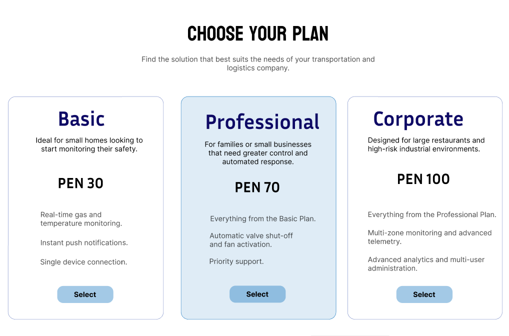

  

 6. Equipo  
**Mockup:** Presenta cinco fotos de personas con sus nombres y roles: Desarrollador, Programador, Encargado, Analista y Diseñador.  

  

  

7. Formulario de contacto  
**Mockup:** Utiliza un fondo suave con el texto “CONNECT WITH US AND DISCOVER HOW TO ENHANCE YOUR SAFETY PROTOCOLS.”. Incluye un campo para ingresar el correo electrónico y un botón *Send*.  

  

  

 8. Footer  
**Mockup:** Muestra el logo oficial de SmartGas, enlaces como *Prices, Support, Terms and Conditions, Privacy Policy*, íconos de redes sociales (Facebook, Twitter, Instagram, YouTube) y la leyenda de copyright 2026.  

  

  

    
## 4.4. Web Applications UX/UI Design.
    
### 4.4.1. Web Applications Wireframes.

Para la aplicación web de **SmartGas** se desarrollaron wireframes en versión **desktop** y **responsive móvil**, con el objetivo de representar la estructura base de cada pantalla, la jerarquía de la información y la adaptación del sistema a distintos tamaños de dispositivo. Estas propuestas evidencian la aplicación de principios de diseño como **jerarquía visual, alineación, proximidad, consistencia y visibilidad del estado del sistema**, así como criterios de **diseño inclusivo**, mediante textos claros, botones reconocibles, distribución ordenada de los elementos y navegación simplificada en pantallas pequeñas.

Asimismo, los wireframes mantienen coherencia con la **arquitectura de información** definida previamente. En las pantallas de monitoreo se prioriza una organización **jerárquica** para destacar alertas y estados críticos; en la vista de zonas se aplica una organización **espacial**, al agrupar la información por ambientes o sectores; en reportes se utiliza una estructura **cronológica** para el historial de incidencias; y en miembros se presenta una organización orientada a la **audiencia y gestión de usuarios**, facilitando el reconocimiento de roles y zonas asignadas.

#### 1. Inicio

**Wireframe Desktop:** Presenta una barra de navegación superior con accesos directos a los módulos principales de la plataforma, junto con el logo, selector de idioma y botón de registro. En la sección principal se ubican el título, una breve descripción, dos botones de acción y una imagen referencial. Esta distribución responde a una **jerarquía visual clara** y permite que el usuario identifique rápidamente la propuesta principal del sistema y sus rutas de navegación.

**Wireframe Mobile:** Reorganiza el contenido en una sola columna para facilitar la lectura vertical, reemplazando el menú horizontal por un ícono de hamburguesa. Los botones de acción se mantienen en tamaño visible y táctil, favoreciendo la interacción en dispositivos móviles. Esta adaptación demuestra un enfoque **responsive** y mejora la accesibilidad al reducir la sobrecarga visual y simplificar la navegación.

  

  

#### 2. Dashboard

**Wireframe Desktop:** El dashboard organiza la información crítica en tarjetas superiores que resumen el estado general del sistema, el nivel de gas, la temperatura y las alertas activas. Debajo, se incorpora una gráfica principal que permite visualizar el comportamiento de los sensores y sus límites de referencia. Esta pantalla aplica una organización **jerárquica**, ya que muestra primero los indicadores más importantes y luego amplía el detalle mediante visualizaciones.

**Wireframe Mobile:** Conserva la misma lógica informativa, pero apila las tarjetas en una sola columna para asegurar legibilidad y continuidad en la lectura. Esta solución refuerza el diseño inclusivo, ya que facilita la comprensión de los estados del sistema en pantallas pequeñas y permite identificar alertas sin depender únicamente de gráficos complejos o elementos decorativos.

  

  

#### 3. Zones

**Wireframe Desktop:** La pantalla de zonas presenta primero un resumen general del número total de zonas, zonas seguras y sensores conectados, seguido de una representación visual del espacio monitoreado y tarjetas individuales para cada zona. En cada tarjeta se muestra el estado, la temperatura, el nivel de gas y un recurso visual complementario. Esta pantalla responde a una organización **espacial o geográfica**, ya que permite al usuario identificar rápidamente en qué zona ocurre una incidencia.

**Wireframe Mobile:** Mantiene la misma estructura conceptual, pero adapta los bloques a un flujo vertical. Las tarjetas resumen se muestran primero, seguidas del mapa o representación visual y luego las zonas individuales. Esta disposición facilita la exploración progresiva del contenido y mejora la accesibilidad móvil, ya que cada zona se analiza de forma separada sin saturar la interfaz.

  

  

#### 4. Reports

**Wireframe Desktop:** La vista de reportes incluye un encabezado con el total de incidencias registradas, seguido de dos bloques gráficos para el análisis de tendencias y tipos de eventos. En la parte inferior se ubica una tabla con el historial de alertas, mostrando fecha, zona, evento, severidad y estado. Esta estructura evidencia una organización **cronológica y analítica**, ya que combina resúmenes visuales con un registro detallado de eventos para apoyar la toma de decisiones.

**Wireframe Mobile:** Reestructura los elementos en una sola columna, priorizando primero el total de incidencias y luego las gráficas, con el fin de conservar la claridad visual. La adaptación móvil reduce la complejidad del contenido sin perder la función informativa, permitiendo que el usuario consulte reportes desde un dispositivo pequeño de manera sencilla y ordenada.

  

  

#### 5. Members

**Wireframe Desktop:** La pantalla de miembros muestra un listado de usuarios mediante tarjetas que incluyen imagen, nombre, rol, correo y zona asignada. En la parte inferior se incorpora un footer con enlaces complementarios, suscripción y elementos institucionales. Esta vista responde a una organización por **audiencia y gestión de usuarios**, ya que facilita la identificación rápida de cada integrante y su relación con una zona o función específica dentro del sistema.

**Wireframe Mobile:** El contenido se presenta en formato vertical, apilando la información de cada miembro para optimizar el espacio disponible. Esta decisión favorece la lectura continua y evita que los datos se compriman en exceso. Además, el uso de etiquetas textuales claras permite que la comprensión de la información no dependa de recursos visuales complejos, reforzando así el diseño inclusivo.

  

  

En conjunto, estos wireframes permiten validar la estructura inicial de la aplicación web de **SmartGas**, asegurando que la información crítica se presente con claridad, que la navegación sea consistente entre pantallas y que la experiencia pueda adaptarse correctamente a entornos **desktop** y **móviles**. De esta manera, la propuesta no solo responde a los objetivos funcionales del sistema, sino que también incorpora principios de usabilidad, accesibilidad y arquitectura de información desde las primeras etapas del diseño.
    
### 4.4.2. Web Applications Wireflow Diagrams.

En esta sección se presentan los **wireflow diagrams** de la aplicación web de **SmartGas**, elaborados a partir de los principales **user goals** identificados para los perfiles de usuario dentro del alcance del sistema. Cada wireflow integra wireframes y rutas de interacción para mostrar cómo evoluciona el estado de la interfaz en función de las acciones del usuario, evidenciando así la relación entre navegación, arquitectura de información y comportamiento esperado del sistema.

Estos diagramas permiten visualizar los pasos típicos que sigue el usuario para completar una tarea, así como los posibles cambios de estado en pantalla, por ejemplo, cuando un inicio de sesión falla, cuando existen alertas activas o cuando una zona se encuentra en estado crítico. De esta manera, los wireflows complementan los wireframes al representar no solo la estructura de las pantallas, sino también la lógica de interacción entre ellas.

#### 1. Wireflow del inicio de sesión a la plataforma

**User goal:** Como usuario, quiero iniciar sesión en la plataforma SmartGas para acceder al sistema de monitoreo.

**Explicación del flujo:**  
El flujo inicia en la **Landing Page**, donde el usuario identifica el acceso principal a la plataforma y selecciona la opción de registro o inicio de sesión. Luego es dirigido a la **pantalla de login**, donde ingresa sus credenciales. A partir de esta interacción, el sistema contempla dos posibles estados: si las credenciales son incorrectas, se muestra una **pantalla de error de login** con la indicación correspondiente; si las credenciales son correctas, el usuario accede al **inicio de la aplicación web**, desde donde puede ingresar al dashboard y al resto de módulos del sistema.

Este wireflow evidencia un flujo de navegación básico y esencial para el uso de la plataforma, así como la representación de un cambio de estado importante dentro de la interfaz: el paso exitoso o fallido de autenticación. Además, se aplican principios de claridad, retroalimentación inmediata y visibilidad del estado del sistema, ya que el usuario recibe una respuesta explícita según el resultado de su acción.

  

#### 2. Wireflow para revisar el estado de seguridad y alertas activas

**User goal:** Como usuario, quiero revisar el estado de seguridad para identificar niveles de gas, temperatura y alertas activas.

**Explicación del flujo:**  
El flujo comienza en la **sección Dashboard**, donde el usuario puede visualizar un resumen general del sistema mediante indicadores como estado general, nivel de gas, temperatura y cantidad de alertas activas. Desde esta pantalla, el usuario selecciona la opción para **ver alertas**, lo que lo dirige a la **sección Reports**, donde puede revisar tendencias, tipos de eventos y el historial registrado. Si dentro de esa vista detecta una alerta crítica, puede hacer clic sobre ella para acceder a la **sección Zonas**, donde se presenta el estado detallado de cada ambiente monitoreado.

Este wireflow evidencia una organización jerárquica de la información, ya que el sistema muestra primero una vista general y luego conduce al usuario hacia niveles de mayor detalle. Asimismo, se aprecia una organización espacial en la vista de zonas, donde el usuario puede identificar qué ambiente está comprometido. El flujo también refuerza la usabilidad al permitir una transición natural desde el monitoreo global hasta la localización específica del riesgo.

  

#### 3. Wireflow para consultar el historial de alertas del hogar

**User goal:** Como padre de familia, quiero consultar el historial de alertas de mi hogar para saber si hubo incidentes mientras no estaba en casa.

**Explicación del flujo:**  
Este flujo parte desde el **inicio de la aplicación web**, donde el usuario accede al sistema ya autenticado. Desde allí, puede ingresar a la sección de alertas y reportes. El diagrama muestra dos posibles estados: uno en el que el usuario entra y **existen nuevas alertas**, y otro en el que ingresa y **no hay nuevas alertas**. En ambos casos se visualiza la **sección Reports**, pero con diferencias en el estado de la interfaz según la presencia o ausencia de incidencias recientes. Finalmente, el usuario accede al **detalle de alertas**, donde puede revisar información más específica sobre fecha, zona, evento, severidad y estado, complementada con una vista resumida de zonas.

Este wireflow es importante porque demuestra cómo el sistema representa cambios de estado a partir de una misma pantalla base, lo cual responde directamente a la consigna de reflejar nuevas condiciones de interacción mediante wireframes adicionales. Además, el flujo se apoya en una organización cronológica de la información, ya que el historial de alertas se presenta como un registro útil para la supervisión del hogar y la toma de decisiones posteriores.

  

#### 4. Wireflow para revisar el estado de una zona específica

**User goal:** Como administrador de restaurante, quiero revisar el estado de una zona específica para verificar sus niveles de gas, temperatura y seguridad.

**Explicación del flujo:**  
El flujo inicia en el **inicio de la aplicación web**, desde donde el administrador accede a la **sección Zonas**. En esta parte del recorrido se muestran dos estados posibles: uno en el que **hay zonas en alerta** y otro en el que **no hay zonas en alarma**. Cuando existe una zona comprometida, el usuario continúa hacia el **panel de detalle de zonas**, donde puede visualizar el estado particular de cada ambiente, incluyendo temperatura, gas y condición general de seguridad. De este modo, el administrador identifica con rapidez cuál es la zona afectada y puede tomar acciones oportunas.

Este wireflow pone en evidencia la organización espacial de la información, ya que el sistema distribuye los datos por áreas o zonas monitoreadas. También demuestra el principio de visibilidad del estado del sistema, debido a que el usuario puede diferenciar claramente entre una zona segura y una zona en alarma. La presencia de variantes en el flujo según el estado operativo fortalece además la representación realista del comportamiento del sistema frente a distintos escenarios.

  

En conjunto, los wireflows de **SmartGas** permiten comprender cómo los usuarios interactúan con la aplicación web según sus objetivos principales, mostrando tanto las rutas típicas de navegación como los cambios de estado que se producen en la interfaz. Esto facilita validar tempranamente la experiencia de uso, asegurar coherencia con la arquitectura de información y comprobar que cada user goal cuenta con una secuencia lógica, clara y funcional dentro del sistema.
### 4.4.2. Web Applications Mock-ups.

En esta sección se presentan los **mock-ups** de la aplicación web de **SmartGas**, desarrollados a partir de los wireframes previamente definidos. A diferencia de los wireframes, estos mock-ups incorporan con mayor detalle los componentes visuales, la identidad de marca y la aplicación del **Design System** establecido para el producto digital, permitiendo representar de forma más cercana la apariencia final de la solución.

La propuesta evidencia la aplicación de principios de diseño como **jerarquía visual, consistencia, proximidad, alineación, contraste y visibilidad del estado del sistema**, así como criterios de **diseño inclusivo**, mediante el uso de textos legibles, botones con suficiente presencia visual, distribución clara de la información y adaptación responsiva a distintos tamaños de pantalla. Asimismo, se mantiene coherencia con la **arquitectura de información** del sistema, ya que las pantallas conservan una organización jerárquica para la información crítica, una organización espacial en la sección de zonas y una organización cronológica en la visualización de reportes e incidencias.

#### 1. Inicio

**Mock-up Desktop:** La pantalla de inicio presenta una barra de navegación superior con el logo, accesos directos a los módulos principales, selector de idioma y botón de registro. En la sección principal se destaca un título central, un breve texto descriptivo, botones de acción y una imagen representativa del entorno monitoreado. Esta composición refuerza la **jerarquía visual** y permite que el usuario identifique rápidamente la propuesta de valor de la plataforma.

**Mock-up Mobile:** En la versión móvil, la interfaz reorganiza los elementos en una sola columna y reemplaza el menú horizontal por un ícono de navegación. Los botones se mantienen amplios y visibles, facilitando la interacción táctil. Esta adaptación favorece la accesibilidad y la usabilidad, ya que simplifica la exploración del contenido sin perder consistencia respecto a la versión desktop.

  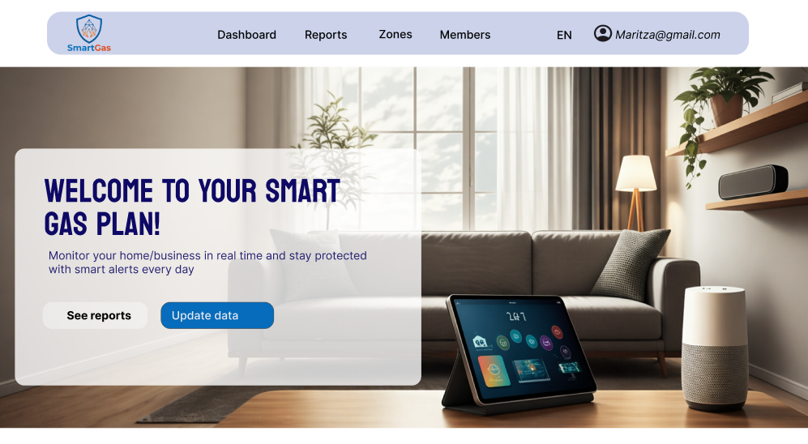

  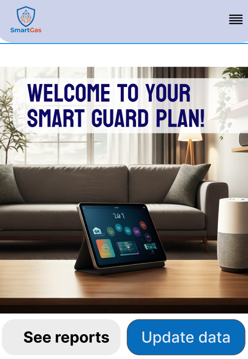

#### 2. Dashboard

**Mock-up Desktop:** El dashboard muestra tarjetas superiores con indicadores clave como el estado general, nivel de gas, temperatura y alertas activas. Debajo de estos elementos se incorpora una gráfica principal para visualizar el comportamiento de los sensores en el tiempo. Esta pantalla aplica una organización **jerárquica**, ya que prioriza primero la información crítica y luego amplía el detalle mediante visualizaciones complementarias.

**Mock-up Mobile:** En la versión móvil, las tarjetas se presentan en disposición vertical, facilitando una lectura progresiva y ordenada. La estructura mantiene la prioridad informativa del dashboard, permitiendo que el usuario consulte rápidamente los datos esenciales del sistema desde un dispositivo de menor tamaño. Esta adaptación mejora la comprensión del contenido y reduce la sobrecarga visual.

  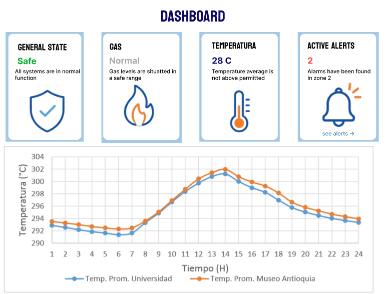

  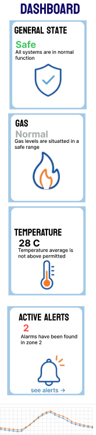

#### 3. Zones

**Mock-up Desktop:** La sección de zonas presenta un resumen inicial del número total de zonas, zonas seguras y sensores conectados, junto con una representación gráfica del espacio monitoreado. En la parte inferior se muestran tarjetas por cada zona, indicando su estado, temperatura y nivel de gas. Esta vista responde a una organización **espacial**, permitiendo identificar con claridad qué ambiente está comprometido y cuál se encuentra en condiciones seguras.

**Mock-up Mobile:** La versión móvil adapta esta misma lógica en un flujo vertical, donde primero se presentan los indicadores generales y luego las zonas individuales. Esta estructura mejora la exploración del contenido en pantallas pequeñas y facilita que el usuario analice cada ambiente por separado, reforzando la claridad de la información y la experiencia responsiva.

  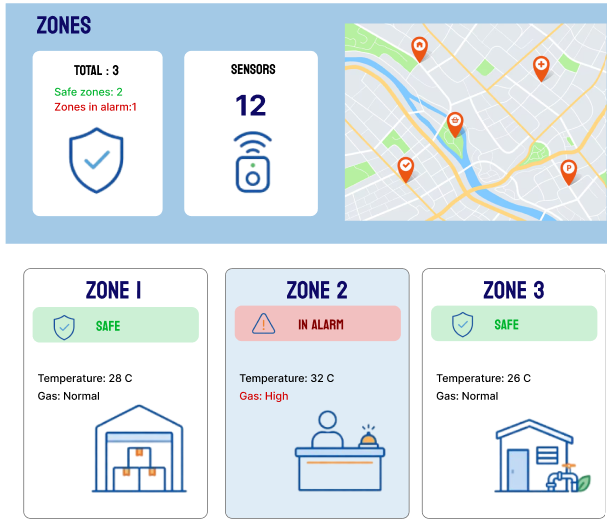

  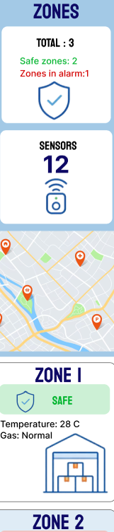

#### 4. Reports

**Mock-up Desktop:** La sección de reportes presenta un encabezado con el total de incidencias registradas, acompañado por visualizaciones orientadas al análisis de tendencias mensuales y clasificación de eventos. En la parte inferior se incorpora una tabla de historial de alertas con información detallada sobre fecha, zona, tipo de evento, severidad y estado. Esta estructura aplica una organización **cronológica y analítica**, útil para la toma de decisiones y el seguimiento de incidentes.

**Mock-up Mobile:** En la versión móvil, la información se reorganiza en bloques verticales para preservar la legibilidad y mantener la claridad de los datos. Las visualizaciones y resúmenes se presentan de forma simplificada, permitiendo que el usuario consulte indicadores relevantes desde un dispositivo pequeño sin perder coherencia con la estructura general del sistema.

  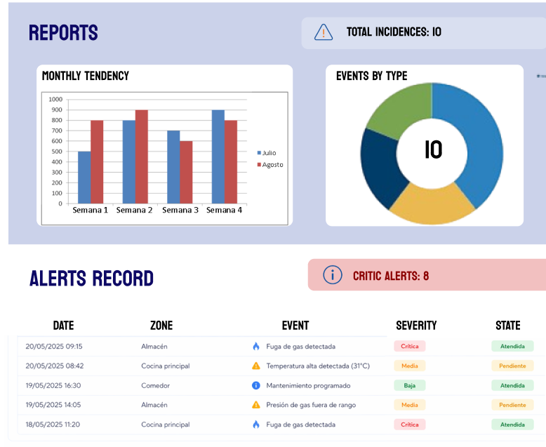

  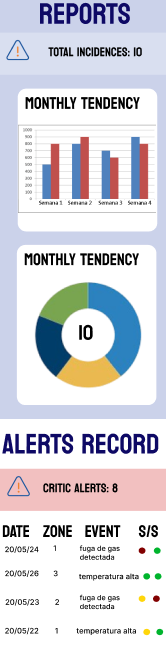

#### 5. Members

**Mock-up Desktop:** La pantalla de miembros organiza la información en tarjetas que muestran datos clave de cada usuario, como nombre, rol, correo y zona asignada. Además, incorpora un footer con enlaces institucionales y elementos complementarios. Esta pantalla responde a una organización por **audiencia y gestión de usuarios**, ya que facilita la identificación rápida de cada integrante dentro del sistema y su función correspondiente.

**Mock-up Mobile:** En la adaptación móvil, los datos de los miembros se apilan verticalmente para asegurar una lectura continua y ordenada. La interfaz reduce la densidad de información por bloque, manteniendo etiquetas claras y una disposición simple que favorece la comprensión. Esto fortalece el diseño inclusivo, ya que evita saturar la pantalla y mejora la accesibilidad visual.

  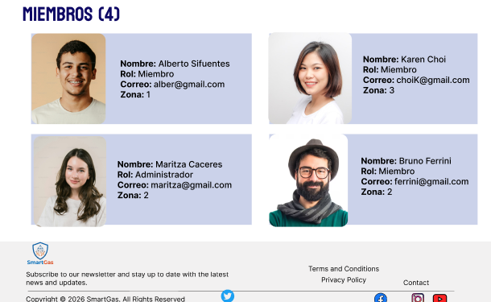

  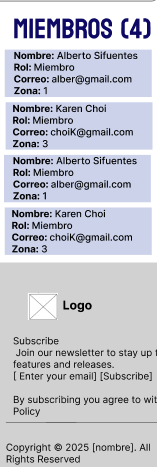

En conjunto, los mock-ups de **SmartGas** permiten visualizar con mayor precisión la propuesta visual de la aplicación web, integrando la identidad de marca, la estructura funcional y los lineamientos del sistema de diseño definidos para el producto. De este modo, se valida no solo la organización de la información y la navegación entre pantallas, sino también la forma en que los elementos visuales, el diseño responsivo y los criterios de accesibilidad se articulan para construir una experiencia clara, consistente y orientada a la seguridad del usuario.

### 4.4.3. Web Applications User Flow Diagrams.

En esta sección se presentan los **User Flow Diagrams** de la aplicación web de **SmartGas**, elaborados a partir de los **wireflows** definidos previamente. Estos diagramas permiten representar de manera más completa la ruta esperada de interacción del usuario, incorporando tanto el **happy path** como las posibles rutas alternativas o **unhappy paths**, de acuerdo con los principales **user goals** del sistema. Asimismo, los flujos mantienen consistencia con la arquitectura de información propuesta, especialmente con la organización jerárquica de la información crítica, la organización espacial de las zonas monitoreadas y la navegación entre módulos principales como Dashboard, Reports, Zones y Members.

A diferencia de los wireflows, en los user flows se incluyen los **mock-ups de las pantallas**, lo que permite comprender con mayor claridad cómo evoluciona la experiencia del usuario durante la interacción real con la interfaz. De esta manera, no solo se representa la secuencia de pasos, sino también el estado visual de cada vista, favoreciendo la validación temprana de los recorridos principales y alternativos.

#### 1. User Flow del inicio de sesión y acceso al sistema

**User goal:** Como usuario, quiero iniciar sesión en la plataforma SmartGas para acceder al sistema de monitoreo.

**Explicación del flujo:**  
El flujo inicia en la **landing page**, desde donde el usuario selecciona la opción para ingresar o registrarse. Luego es dirigido a la pantalla de **sign up / login**, donde introduce sus credenciales. Si los datos son correctos, accede al **inicio de la aplicación web**, desde el cual puede navegar hacia el dashboard, reportes o zonas. Este recorrido representa el **happy path** del flujo, ya que conduce al acceso exitoso al sistema.

Como ruta alternativa, el sistema contempla el caso en el que el usuario ingresa credenciales incorrectas. En ese escenario, se muestra un mensaje de error y el usuario debe volver a intentar el ingreso. Esto evidencia un **unhappy path**, ya que el objetivo no se completa en el primer intento, pero el sistema ofrece retroalimentación inmediata y una ruta clara para continuar.

  

#### 2. User Flow para revisar el estado de seguridad

**User goal:** Como usuario, quiero revisar el estado de seguridad para identificar niveles de gas, temperatura y alertas activas.

**Explicación del flujo:**  
El flujo comienza en la pantalla de **Inicio**, desde donde el usuario accede al **Dashboard**. En esta vista puede revisar el estado general del sistema, los niveles de gas, la temperatura y la cantidad de alertas activas. Si detecta una incidencia o desea ampliar la información, continúa hacia la sección de **Reports**, donde puede observar tendencias y el registro de alertas. Posteriormente, puede acceder a la sección de **Zones** para ubicar la zona afectada y, finalmente, consultar el detalle de zonas específicas.

Este recorrido representa el **happy path**, ya que el usuario logra pasar de una vista general del sistema a una inspección más específica del entorno monitoreado. Como rutas alternativas, se consideran los casos en los que no se detectan anomalías o no existen alertas activas, situaciones en las que el usuario simplemente continúa con el monitoreo general sin profundizar hacia reportes o zonas críticas. Así, el flujo contempla tanto la supervisión normal como la exploración detallada ante una incidencia.

  

#### 3. User Flow para consultar el historial de alertas

**User goal:** Como padre de familia, quiero consultar el historial de alertas de mi hogar para saber si hubo incidentes mientras no estaba en casa.

**Explicación del flujo:**  
El flujo parte desde el **inicio de la aplicación**, desde donde el usuario accede a la sección de **alertas o reportes**. Si existe una alerta nueva, el sistema puede mostrar una notificación, luego permitir el acceso al **historial de alertas** y finalmente al **detalle de la alerta**. Esta es la ruta principal, ya que permite al usuario validar si ocurrió algún incidente y revisar información más específica sobre lo sucedido.

Como ruta alternativa, si no existe ninguna alerta nueva, el usuario no recibe una notificación adicional y continúa directamente con el monitoreo general del sistema. Esta bifurcación representa claramente la diferencia entre el **happy path**, donde sí se consulta el historial y el detalle de eventos, y un **unhappy path o camino alternativo**, donde no se presentan incidencias recientes y, por tanto, el recorrido se simplifica.

  

#### 4. User Flow para revisar el estado de una zona específica

**User goal:** Como administrador de restaurante, quiero revisar el estado de una zona específica para verificar sus niveles de gas, temperatura y seguridad.

**Explicación del flujo:**  
El flujo inicia cuando el usuario accede a la sección de **Zones**. Desde allí revisa el estado general de las zonas registradas y verifica si alguna de ellas presenta una condición de alerta. Cuando existe una zona comprometida, el sistema muestra la cantidad de zonas en alerta y permite ingresar al panel específico para monitorear la zona afectada. Este es el **happy path**, ya que el usuario consigue identificar rápidamente el área crítica y revisar su detalle.

Como ruta alternativa, si no existe ninguna zona en alerta, el sistema no obliga a profundizar en una zona específica y el usuario continúa con el monitoreo general. Esta estructura confirma la consistencia con el wireflow previo, ya que se mantienen tanto la vista general de zonas como la posibilidad de navegar hacia un detalle puntual solo cuando el estado operativo lo requiere.

  

    
## 4.5. Web Applications Prototyping.

### 4.4.5. Web Applications Prototyping.

En esta sección se presentan los **prototipos de la aplicación web de SmartGas** para **Desktop Web Browser** y **Mobile Web Browser**, desarrollados con simulación de interacción y navegación de acuerdo con los recorridos definidos en los **User Flow Diagrams**. Estos prototipos permiten validar el comportamiento de la interfaz antes de la implementación, comprobando que las decisiones de interacción, navegación y jerarquía de información respondan adecuadamente a los objetivos de los usuarios.

La propuesta de prototipado se fundamenta en varios criterios de interacción. En primer lugar, se priorizó una **navegación clara y persistente**, de modo que el usuario pueda desplazarse entre los módulos principales del sistema sin perder contexto. En desktop, esto se refleja en una barra de navegación superior visible; mientras que, en mobile, se adapta a una estructura más compacta y optimizada para pantallas pequeñas. En segundo lugar, se buscó que las pantallas críticas, como **Dashboard, Reports y Zones**, mantengan una organización jerárquica que permita identificar primero la información más importante y luego acceder al detalle. Finalmente, se incorporaron decisiones de interacción orientadas a la **retroalimentación inmediata**, especialmente en acciones como el inicio de sesión, la revisión de alertas y la navegación hacia zonas específicas en estado de riesgo.

Estas decisiones se relacionan directamente con la **arquitectura de información** planteada en el proyecto. El sistema de navegación conecta las vistas principales de manera consistente, mientras que la organización de contenidos responde a distintos criterios: jerárquico en el dashboard, cronológico en reportes y espacial en la sección de zonas. De este modo, el prototipo no solo representa una interfaz visual, sino también una experiencia de uso coherente con la lógica funcional del sistema.

#### 1. Prototipo Desktop Web Browser

**Explicación del prototipo:**  
El prototipo desktop de **SmartGas** permite simular la navegación entre la landing page, el login, el dashboard, los reportes, las zonas monitoreadas y la gestión de miembros. La interacción está diseñada para que el usuario pueda seguir de forma intuitiva los recorridos principales del sistema, por ejemplo, iniciar sesión, revisar el estado general, consultar reportes y acceder al detalle de zonas críticas.

La versión desktop aprovecha mejor el espacio horizontal para mostrar más información en simultáneo, por lo que se refuerza la visualización comparativa de indicadores, gráficos y tarjetas por módulo. Esto favorece la supervisión rápida del sistema y resulta especialmente útil para usuarios que gestionan múltiples zonas o requieren un monitoreo más completo desde una computadora.

**Screenshot del video del prototipo Desktop:**

  

**Video del prototipo Desktop:**  
[Ver video del prototipo Desktop](https://youtu.be/MvH_wqlIlZI)

#### 2. Prototipo Mobile Web Browser

**Explicación del prototipo:**  
El prototipo mobile adapta los mismos flujos principales a una experiencia de uso táctil y vertical. En esta versión, los contenidos se reorganizan en una sola columna, priorizando la lectura progresiva y la facilidad de interacción en pantallas reducidas. Así, el usuario puede consultar el dashboard, revisar reportes, acceder a zonas y verificar alertas activas desde un dispositivo móvil, sin perder la lógica de navegación definida para la versión desktop.

El diseño mobile pone énfasis en la simplicidad, el tamaño adecuado de los elementos táctiles y la reducción de la carga visual. Esto mejora la accesibilidad y permite que la supervisión del sistema pueda realizarse en contextos de movilidad, manteniendo coherencia con la propuesta responsive del producto digital.

**Screenshot del video del prototipo Mobile:**

  

**Video del prototipo Mobile:**  
[Ver video del prototipo Mobile](https://youtube.com/shorts/6qwLEAbAWd8?feature=share)

## 4.6. Domain-Driven Software Architecture.
    
### 4.6.1. Design-Level EventStorming.
    
### 4.6.2. Software Architecture Context Diagram.
    
### 4.6.3. Software Architecture Container Diagrams.
    
### 4.6.4. Software Architecture Components Diagrams.
    
## 4.7. Software Object-Oriented Design.
    
### 4.7.1. Class Diagrams.
    
## 4.8. Database Design.
    
### 4.8.1. Database Diagrams.
    
# Capítulo V: Product Implementation, Validation & Deployment
    
## 5.1. Software Configuration Management.
    
### 5.1.1. Software Development Environment Configuration.
    
### 5.1.2. Source Code Management.
    
### 5.1.3. Source Code Style Guide & Conventions.
    
### 5.1.4. Software Deployment Configuration.
    
## 5.2. Landing Page, Services & Applications Implementation.
    
## 5.2.1. Sprint n
    
### 5.2.1.1. Sprint Planning n.
    
### 5.2.1.2. Aspect Leaders and Collaborators.
    
### 5.2.1.3. Sprint Backlog n.
    
### 5.2.1.4. Development Evidence for Sprint Review.
    
### 5.2.1.5. Execution Evidence for Sprint Review.
    
### 5.2.1.6. Services Documentation Evidence for Sprint Review.
    
### 5.2.1.7. Software Deployment Evidence for Sprint Review.
    
### 5.2.1.8. Team Collaboration Insights during Sprint.

## Conclusiones

## Bibliografía

## Anexos
